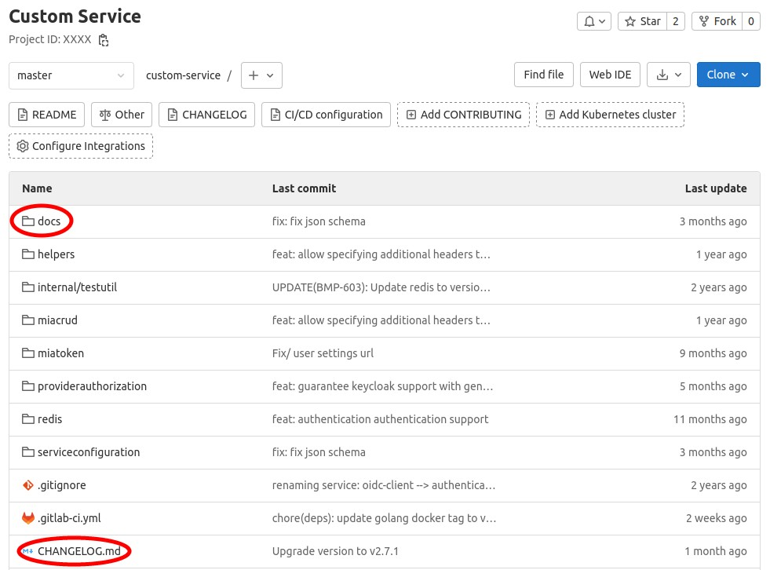
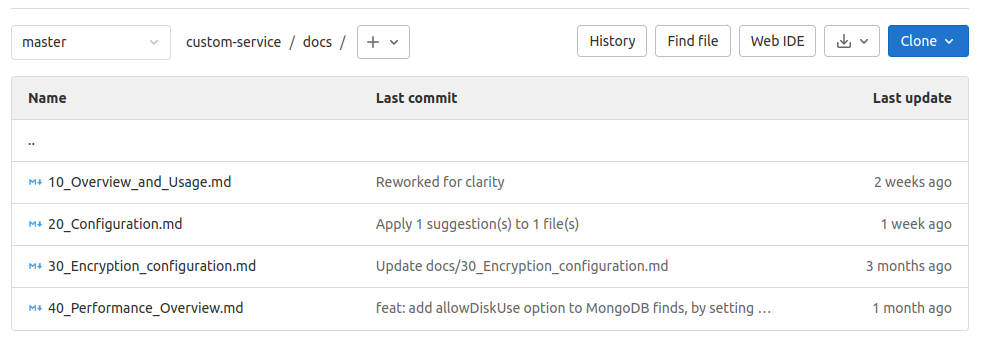
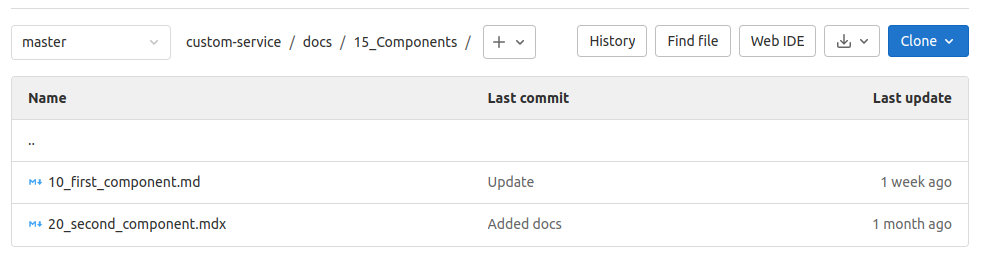
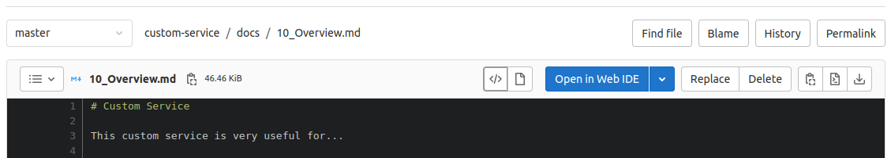
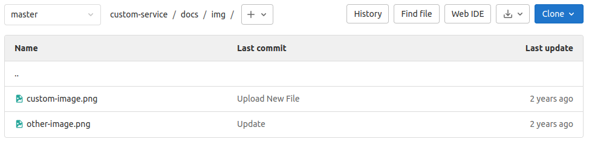
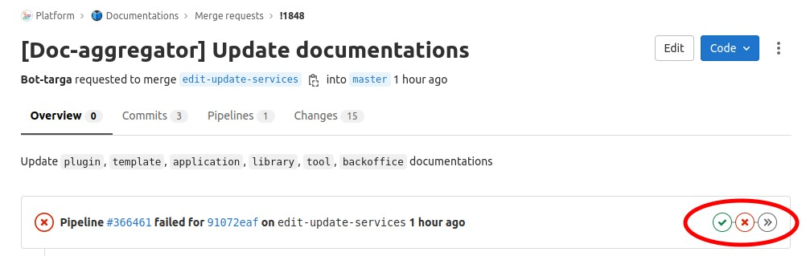

# Contributing to Documentation with Docs Aggregator

## Table of Contents

- [Introduction](#introduction)
- [Contribute to documentation with Docs Aggregator](#contribute-to-documentation-with-docs-aggregator)
  - [Docs Aggregator](#docs-aggregator)
    - [What is it?](#what-is-it)
    - [Why is it useful?](#why-is-it-useful)
    - [What does it do?](#what-does-it-do)
    - [Which sections of Documentations project are influenced by Docs Aggregator?](#which-sections-of-documentations-project-are-influenced-by-docs-aggregator)
  - [Docs Aggregator processes](#docs-aggregator-processes)
    - [What to add inside my service repo to allow the Docs Aggregator to correctly open a PR on Documentations?](#what-to-add-inside-my-service-repo-to-allow-the-docs-aggregator-to-correctly-open-a-pr-on-documentations)
      - [Basic `docs` folder process](#basic-docs-folder-process)
      - [Files mandatory content](#files-mandatory-content)
      - [Links inside documentation files](#links-inside-documentation-files)
        - [Link in same `docs` folder](#link-in-same-docs-folder)
        - [Link outside `docs` folder](#link-outside-docs-folder)
      - [Special sub-folders in docs folder](#special-sub-folders-in-docs-folder)
        - [Folder `img`](#folder-img)
        - [Folder `docs_files_to_download`](#folder-docs_files_to_download)
    - [How to tell the Docs Aggregator that my service documentation should be aggregated to Mia Platform documentation](#how-to-tell-the-docs-aggregator-that-my-service-documentation-should-be-aggregated-to-mia-platform-documentation)
      - [Console Production CMS](#console-production-cms)
      - [Platform Documentation Project API Portal](#platform-documentation-project-api-portal)
    - [How to tell the Docs Aggregator to not alter in any way the file that I have added to any of the folders that it owns](#how-to-tell-the-docs-aggregator-to-not-alter-in-any-way-the-file-that-i-have-added-to-any-of-the-folders-that-it-owns)
    - [How to manually trigger the Docs Aggregator in order to open a new PR on the Platform Documentation Project](#how-to-manually-trigger-the-docs-aggregator-in-order-to-open-a-new-pr-on-the-platform-documentation-project)
  - [Check that what you have done is flawless](#check-that-what-you-have-done-is-flawless)

## Introduction

The purpose of this document is to gather all processes and precautions necessary to correctly contribute to documentation.

The first important distinction is what kind of contribution to documentation you are going to make, there are two main activities:

1. Edit/delete an existing page or add a new one that is **not** handled by the Docs Aggregator. For example, any contribution to the Release Note.

2. Add/edit/delete any service documentation owned by your team **using** the Docs Aggregator.

Since the second procedure requires more attention and it consists in a more elaborate process, we will focus on that.

## Contribute to documentation with Docs Aggregator

### Docs Aggregator

#### What is it?

It is a service developed by Mia Platform that (if you have access to it) can be found [here](https://git.tools.mia-platform.eu/clients/mia-platform/platform-documentation/services/doc-aggregator).  
Its purpose is to gather the documentation from different repositories and aggregate it in this repository.  
Documentations project gathers all Mia Platform documentation, which is [publicly accessible](https://docs.mia-platform.eu/).

#### Why is it useful?

It allows all Mia Platform teams to write documentation directly inside the services projects they develop (in this way service implementation and dcumentation are in a single repository and the ownership of both will remain to the same team, granting more precision and quality) and then see it already aggregated in the Documentations project, visible to anyone!

#### What does it do?

It is important to know that the Docs Aggregator gathers the documentations of all services that are subscribed to this functionality and opens autonomously a PR on the Documentation project every day at 9:00 a.m. (skipping Saturdays and Sundays).

ℹ️ It is also possible, in any moment, to [use the Docs Aggregator manually to open a new PR](#how-to-manually-trigger-the-docs-aggregator-in-order-to-open-a-new-pr-on-the-platform-documentation-project), in case it is necessary.

This PR will be later merged on the master branch of Documentations project by someone who has permission to do so (ask your Tech Leader if you do not know who has those permissions).  
This means that on the next Mia Platform Console Release (which includes the release of its new documentation) it will be visible on the Mia Platform official documentation!

ℹ️ If instead, you want to see the documentation of your service as soon as your PR gets merged to master (and its related pipeline is already successfully concluded) you can find it in the, master aligned, documentation, visible to anyone [here](https://next.docs.mia-platform.eu/) (notice the `next.` in the url).

#### Which sections of Documentations project are influenced by Docs Aggregator?

Docs Aggregator will open PRs that alter a specific subset of folders of Documentations project.
Here is the list of this Docs Aggregator managed folders:

- `runtime_suite` for services with `typeId` equal to `plugin` or `application`.

- `runtime_suite_examples` for services with `typeId` equal to `example`.

- `runtime_suite_templates` for services with `typeId` equal to `template`.

- `runtime_suite_libraries` for services with `typeId` equal to `library`.

- `runtime_suite_tools` for services with `typeId` equal to `tool`.

- `business_suite` for services with `typeId` equal to `backoffice`.

❌ If you try to modify any file inside one of those folders in the Documentations project the Docs Aggregator will open a merge request the day after **that will undo any edit that you have done**.  
If you want to correctly edit any file in one of those folders, you should edit the file in the `docs` folder of the service repository that owns that documentation instead.  
There is only one process to add a file in one of those folders without having the Docs Aggregator delete or alter them in any way, it will be [explained later](#how-to-tell-the-docs-aggregator-to-not-alter-in-any-way-the-file-that-i-have-added-to-any-of-the-folders-that-it-owns) in this document.

### Docs Aggregator processes

#### What to add inside my service repo to allow the Docs Aggregator to correctly open a PR on Documentations?

The Docs Aggregator searches for, respectively, a directory and a file inside the root of the service repositories subscribed to it:

- `docs` folder (mandatory): The directory that will contain all files (and also other directories, if necessary) that document the service.

- The `CHANGELOG.md` file (optional): The file that contains a chronologically ordered list of all changes made on the service.



After that, it will open a new PR with all the files contained in the `docs` folder and (if present) with the content of the `CHANGELOG.md` file.

##### Basic `docs` folder process

`docs` folder content should have a specific structure and follow some specific conventions in order to correctly use the Docs Aggregator (and avoid to cause some errors that could break it).

Inside the `docs` folder it is possible to add as many files and folders as needed. It is important to notice that both files and directories should follow a specific naming convention:

Files: `<order>_<file_name>.<extension>`

Directories: `<order>_<file_name>`

- order: order of the file. Must be greater than 0. The lower the number, the higher the priority of the file. Files with higher priority will be placed before other files in Mia Platform documentation sidebar.

- file_name: name of the file that will be shown in Mia Platform documentation sidebar. It is case-sensitive. If you want to have a space between words use the character `_` (underscore). It is suggested to avoid using special characters for the file name.

- extension: file extension, currently only `md` and `mdx` are supported.

Here are some examples of files (and directories) that follow this convention correctly:

Files:



Directories:


ℹ️ Inside of a directory it is possible to repeat the same naming convention for its content. It is also possible to use orders already present in files outside the current directory.



Example of a correct structure with subdirectories:

```
10_overview.md
15_Components
|----->10_first_component.md
|----->20_second_component.mdx
20_usage.md
```

##### Files mandatory content

All documentation files in the `docs` folder must start with a title with the following structure:

```markdown
# <Document Title>

<Any content you want>
```

Here is an example of a correct documentation file content:



“Custom Service is the title that will appear as the main heading of the page in Mia Platform documentation.

##### Links inside documentation files

It is often necessary to link from one documentation page to another, in order to help the reader to find easily what he is searching for.   To do so, it is necessary to add links with the correct structure inside the documentation files (the ones in the `docs` folder) that will be later aggregated by the Docs Aggregator.  
The link structure depends on where the page to be linked is located.  
There are two alternatives:

1. Link to another file in the same `docs` folder of the service.

2. Link to another file outside of the service `docs` folder.

###### Link in same `docs` folder

The correct link structure for a link to another file **in the same** `docs` **folder of the service** is the following:

```markdown
[<link text>](./<relative/path/of/the/file/to/link.extension>#<optional-anchor>)
```

Here are some examples of correct links to another file inside the docs folder:

```mardown
More info ([here](./10_Overview_and_Usage.md)) to better understand...
```

or

```markdown
More info ([here](./10_Overview_and_Usage.md#service-usage)) to better understand...
```

⚠️ As you may have noticed, the links in this section are relative. Therefore, the rules provided above just give you a rule of thumb to follow, but take into account that special cases may arise.  
For example, if you nest a file into a subfolder in your service repository, you should take that into account and type an additional `../` in the link path (or replace `./`, if present, with `../`).

###### Link outside `docs` folder

The correct link structure for a link to another file **outside the service** `docs` **folder** is the following:

```markdown
[<link text>](<url/of/the/file/to/link>#<optional-anchor>)
```

Here is an example of correct links to another file outside the service `docs` folder:

```markdown
[MongoDB CRUD](https://docs.mia-platform.eu/docs/runtime_suite/crud-service/overview_and_usage)
```

##### Special sub-folders in docs folder

There are two additional folders that can be added to your service repository (inside the docs folder) to enable additional functionalities through Docs Aggregator:

1. `img` folder

2. `docs_files_to_download` folder


###### Folder `img`

In this folder you can add all images needed for the service documentation.  



To show them, it is necessary to add the following string in the documentation file you want the image to be:

``

For example, a correct image string in the documentation of a file directly in the docs folder would be the following:

``

###### Folder `docs_files_to_download`

In this folder you can add all files that should be downloadable when clicking on a specific link in any documentation file of your service. Files with any extension can be added in this folder, for example `.json`, `.js` and so on.


To add a link to download any file in the `docs_files_to_download` folder, it is necessary to add the following string in the documentation file you want the link to be:

`<a download target="_blank" href="<path/to/the/file/to/download.extension>"><link text></a>`

For example a correct download link in the documentation of a file directly in the `docs` folder would be the following:

`Click <a download target="_blank" href="docs_files_to_download/saga-collection.json">here</a> to download the json file.`

#### How to tell the Docs Aggregator that my service documentation should be aggregated to Mia Platform documentation

To add your service among the services that the Docs Aggregator visits to gather their documentation files there are essentially two main ways:

Using the [Console Production CMS](https://cms.console.gcp.mia-platform.eu/).

Using the [API Portal of Platform Documentation Project](http://api.docs.mia-platform.eu/documentations/api-portal/).

⚠️ Both ways require that the user [Bot-targa](https://git.tools.mia-platform.eu/bot-targa) to have Maintainer role in your service project.

##### Console Production CMS

⚠️ This way only works for projects that should be shown in the marketplace and whose repository is inside Mia Platform Gitlab.

Inside of the Console Production CMS, in the Marketplace section, there is the list of all services that will be added to Mia Platform marketplace. Here, you should search for your service.

If it is not present, you should add it (ask your Tech Leader if you do not know how).  
If it is already present, you should check (set to true) the “Publish On Mia Documentation“ property and set the “Repository URL“ property with the correct repository URL of your service.


Here is an example of the repository URL of one of the services that are visited by the Docs Aggregator:

`https://git.tools.mia-platform.eu/platform/core/crud-service`

##### Platform Documentation Project API Portal

⚠️ This way can be followed only if you know the API Key to make calls inside the Platform Documentation Project API Portal. You can find it on 1Password [here](https://start.1password.com/open/i?a=3I3ZK2I7DBGRZLFH24BKYVILGA&h=my.1password.eu&i=47l7bp26zgyjnyekrri6wswwte&v=vzjv5vfq5f4hvs2miljuvp2ygu).  
Search for "Sidebar Management API Key".

Inside the Platform Documentation Project API Portal search for the route **/v2/documentations-collection/** with **POST** method.

Set in the request body the following three required properties:

- name: name of the service that will be shown in Mia Platform documentation sidebar.

- repositoryUrl: the url where the repository is located.

- typeId: depending on the type of service you are working on, you should select a specific typeId. Here is the list of the currently accepted types:

  - `example`

  - `template`

  - `plugin`

  - `library`

  - `tool`

  - `backoffice`

  - `application`

Press the “Try it“ button and insert the correct API Key (username: “Sidebar Management API Key”).  


Optionally, go to the same route with the GET method and check if your service has been correctly added.

#### How to tell the Docs Aggregator to not alter in any way the file that I have added to any of the folders that it owns

⚠️ This procedure can be followed only if you know the API Key to make calls inside the Platform Documentation Project API Portal. You can find it on 1Password [here](https://start.1password.com/open/i?a=3I3ZK2I7DBGRZLFH24BKYVILGA&h=my.1password.eu&i=47l7bp26zgyjnyekrri6wswwte&v=vzjv5vfq5f4hvs2miljuvp2ygu).  
Search for "Sidebar Management API Key".

As previously mentioned, Docs Aggregator affects only a [subset of folders](#which-sections-of-documentations-project-are-influenced-by-docs-aggregator) in the Documentations project. Generally, any file in one of those folders can only be modified by the Docs Aggregator only.  
In rare occasions, it may be necessary to add a file to one of those folders that must not be managed by the Docs Aggregator.  
To do so, add the new file in the Documentations project in the Docs Aggregator managed folder as you normally would for any new file.  
After that, you should go to the [Platform Documentation Project API Portal](http://api.docs.mia-platform.eu/documentations/api-portal/).  
Search for the route **/v2/types-collection/** with **GET** method.  
Press the “Try it“ button and insert the correct API Key (username: “Sidebar Management API Key”). You will see a list of documentation types, copy the `_id` property of the type that corresponds to the file you want to add.  
Search for the route **/v2/types-collection/{id}** with **PATCH** method.  
Set the `id` path param with the `_id` you previously copied and add to the `keepSideBarEntries` array property the name of the sidebar label that you want the Docs Aggregator to skip.  
Press the “Try it“ button and insert the correct API Key (username: “Sidebar Management API Key”).


❌ Remember to add already present items in the `keepSideBarEntries` array before calling the API, otherwise you will add yours but remove the others!

#### How to manually trigger the Docs Aggregator in order to open a new PR on the Platform Documentation Project

⚠️ This procedure can be followed only if you know the API Key to make calls inside the Platform Documentation Project API Portal. You can find it on 1Password [here](https://start.1password.com/open/i?a=3I3ZK2I7DBGRZLFH24BKYVILGA&h=my.1password.eu&i=47l7bp26zgyjnyekrri6wswwte&v=vzjv5vfq5f4hvs2miljuvp2ygu).  
Search for "Aggregator Trigger API Key".

As [previously mentioned](#what-does-it-do), the Docs Aggregator will open a new PR every day (skipping Saturdays and Sundays).  
It is also possible to trigger it manually, in order to open a new PR on the Platform Documentation Project. This process is extremely useful if you want to **check if the service addition process or any edit to your service documentation is correct**.  
Inside the [Platform Documentation Project API Portal](http://api.docs.mia-platform.eu/documentations/api-portal/) search for the route **/doc-aggregator/generate** with **POST** method.  
Set the `createMergeRequest` property to `true` and the `targetBranchName` to any name you want (keep in mind that it must start with `edit-`).  
Press the “Try it“ button and insert the correct API Key (username: “Aggregator Trigger API Key”).  


Wait a couples of minutes and go to the [Documentations project opened merge requests](https://git.tools.mia-platform.eu/platform/documentations/-/merge_requests).  
If everything has gone correctly, the most recently MR opened by the user Bot-targa (whose title should something like `[Doc-aggregator] Update documentations`) should be the one with yours (and possibly others) contribuition to documentation!

### Check that what you have done is flawless

Once you have triggered the Docs Aggregator and generated a new PR in the Documentations project (or once you have waited the Docs Aggregator to trigger automatically at 9:00 a.m. of the day after), you can check if your contributions to the Documentations project are correct.  
The gitlab pipeline of the newly created PR will run several jobs to ensure the correctness of your contribution and will fail if something is incorrect.  
If it fails, you can check the failed pipeline step that will show you what mistake has been made.  



In this way, you can correct the mistakes inside the service repository documentation and, then, trigger again the Docs Aggregator manually, in order to generate a new PR with a flawless contribution!

Here is the list of the most common mistakes made when contributing to Documentations project through Docs Aggregator:

- CSpell spellchecker: the pipeline has failed in the `test` job, there is at least one typo or an unknown word in your contribuition. If it is a typo, you can go back to your service repo and fix it. If it is an unknown word that you think should be added you can do so directly in the PR of the Docs Aggregator by adding it in the `.cspell.json` file.

✅ An excellent idea to avoid this kind of errors could be to add `cspell` (CSpell docs [here](https://cspell.org/)) in the dependencies of your project repository and let it check the `docs` folder every time a new PR is opened. In this way, you will know if there is any typo **before** triggering the Docs Aggregator.

- Broken link: the pipeline has failed in the `build-site` job, there is at least a broken link that links to a not existing page. In this case, you should go to your service repository documentation and fix it. Check again [the links guideline section](#links-inside-documentation-files) to better understand how to write a link correctly for the service repository documentation.

If all pipeline steps pass correctly, then your contribuition to Mia Platform Documentation is flawless and it will be merged before the next Mia Platform Console release! Congratulations! 🥳


❌ Please remember that the ownership of your contributions to Mia Platform documentation is yours until it gets merged to master branch in Documentations project. Therefore, it is **strongly recommended to check that your contribution passes all pipeline steps**. **Otherwise, it will be discarded the day before the next Mia Platform Console release** in order to not block the release process.
