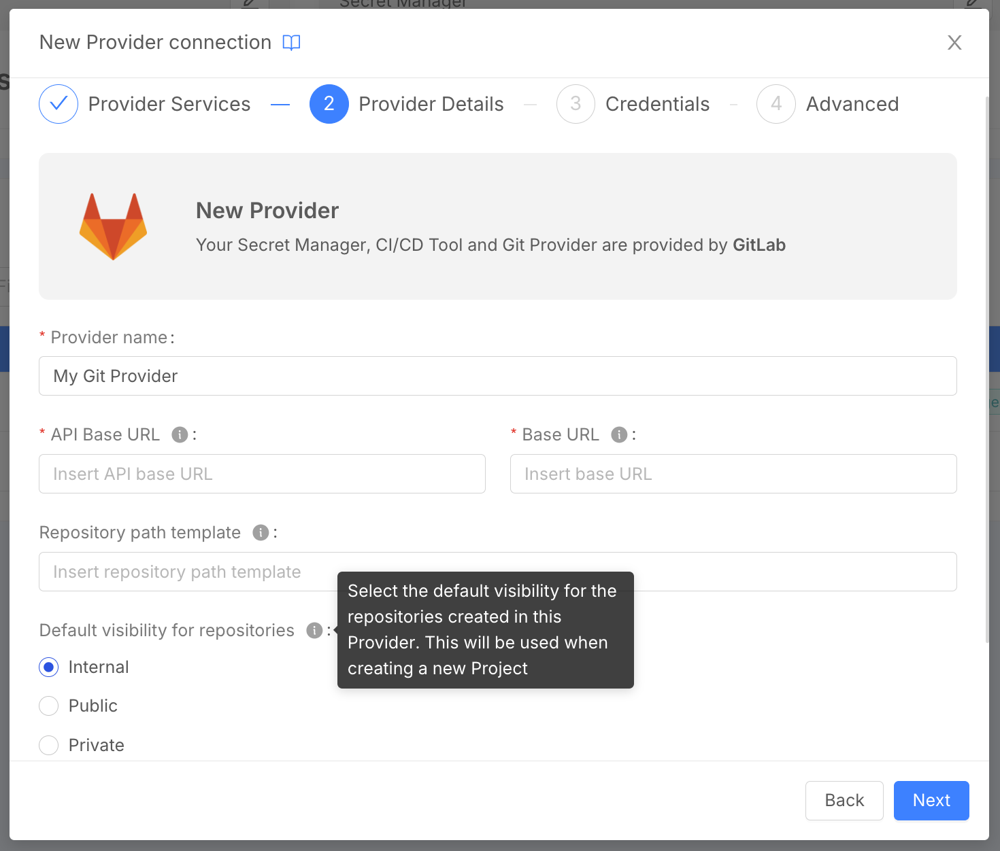

_July 24th, 2025_

## Specify default Git Provider visibility for Project creation

For a Git Provider, you can now select the default visibility for the repositories created in such Provider. This will be inherited when creating a new Project.

## Fast Data

### Introducing Mongezium: MongoDB to Kafka CDC Connector

**Mongezium** is a CDC (Change Data Capture) connector that captures changes in MongoDB collections and push them to Kafka topics.  
Mongezium uses MongoDB change streams to listen for changes in the collections and maps MongoDB events into schemaless [Debezium-like messages](https://debezium.io/documentation/reference/stable/connectors/mongodb.html#mongodb-events).  
Mongezium can be configured with different startup behaviors, such as performing always an initial snapshot on startup, or resuming the change stream from the last known resume token.  
To know more about how to configure Mongezium CDC, visit the [official documentation](/runtime_suite/mongezium-cdc/10_overview.md).

## Microfrontend Composer

### Back-Lit Library

The new version `v1.5.19` of the back-kit library is available!

Refer to back-kit [changelog](/microfrontend-composer/back-kit/changelog.md) for finer-grained details of new versions.

#### Bug Fix

- `bk-form-wizard` now sends correct data when field is an array of strings

## How to update your Console

For self-hosted installations, please head to the [self hosted upgrade guide](/infrastructure/self-hosted/installation-chart/100_how-to-upgrade.md) or contact your Mia-Platform referent and upgrade to _Console Helm Chart_ `v14.2.4`.
