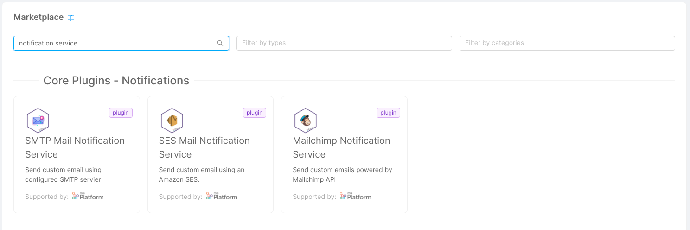
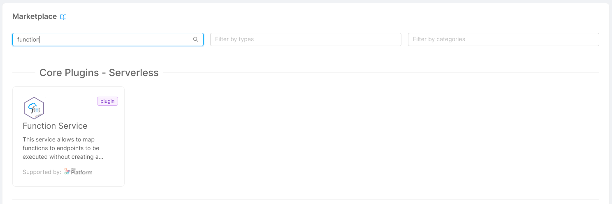
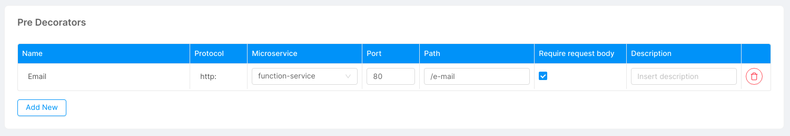
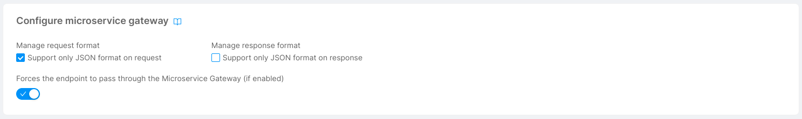
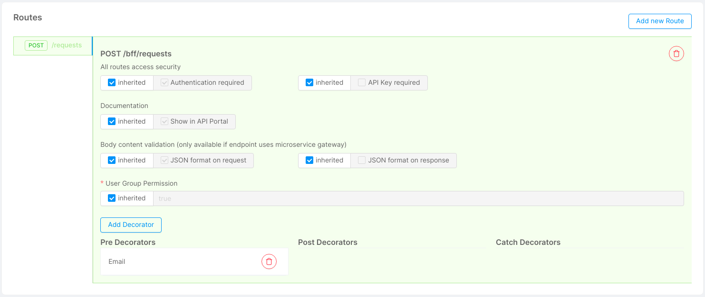

Among its functionalities, the Dev Portal offers the possibility to request permissions for a certain component exposed on the Marketplace section. Once a new request has been sent, it will appear on the backoffice section. 

Users managing requests may require to be automatically notified once a new request has been sent. 
From the design area of the console, you can apply specific configurations to integrate an **email notification service** that will implement this notification process. 

In this guide, we show how to configure the Dev Portal with **Amazon Simple Email Service (SES)**. 

For further details regarding the [Amazon Simple Email Service](https://aws.amazon.com/ses/), please visit the [official documentation](https://docs.aws.amazon.com/ses/). 

:::note
Even if we do not cover their configuration in this section, the marketplace of the console also offers SMTP and MailChimp solutions that can be used for the very same purpose of the SES email notification service.
:::

## Create the SES Mail Notification Service 

Go to the design area of the console and move to the `microservices` section. 

Create a new microservice from the marketplace by clicking `Create a Microservice`, searching for the **SES Mail Notification Service**, and selecting the respective card.



:::info
Make sure to name this service **ses-mail-notification-service**. This step will allow the service to have a correct integration with other configurations.
:::

### Configure Environment Variables

Now, open the microservice you just created and go to the environment variables section. 

:::caution
In order to complete this step, you need to have access to an Amazon SES account.
:::

Make sure these variables are compiled with proper values:

- **SES_KEY**: the access key Id obtained after creating an Amazon SES account;
- **SES_SECRET**: the secret access key obtained after creating an Amazon SES account.

:::note
If you already defined a variable with the desired value in the Envs or in the Public Variables sections, you can also use the interpolation format `{{VARIABLE_NAME}}`.
:::

The ses-mail-notification-service will be responsible for sending the emails once requested by another helper service, the **Function Service**.

To have further details regarding the **SES mail notification service configuration** please refer to the official [documentation](/runtime_suite/ses-mail-notification-service/configuration.md).

## Create the Function Service 
This service allows users to define custom functions directly from the console and expose them to a specific endpoint. 

:::note
In this case, we will create a mapping function that will be invoked after each time a new request is created and will adapt the request model to the one required by the mail notification service, adding further configuration details.
:::

Create a new microservice from the marketplace by clicking `Create a Microservice`, searching for **Function Service**, and selecting the respective card.



Name the newly created microservice **function-service**.

### Add a Configmap

In order to define a custom function, we need to enclose it inside a Function Service configuration. 

Move to the end of the microservice page and click `Add a configuration`. 

Create a new Configmap with the following fields:

- **Configuration Name**: Choose a suitable name for your project. Typically the first configuration of the function service is called **`functions`** as it will eventually include files with user-defined functions;
  
- **Runtime Mount Path**: This path should be named according to the function service env variable `FUNCTIONS_FOLDER`. By default, this variable is set to `/home/node/app/functions`. If you wish to use a custom functions folder, please make sure to update also the `FUNCTIONS_FOLDER` env value.

Once you have successfully created a new configmap, add a new file. In this example, we will name it **e-mail.js**. 

:::caution
Please make sure to include the .js extension in the file name for a correct function service execution.
:::

After you created the file, copy this content inside:
```javascript
'use strict'

const SENDER = 'noreply@mia-platform.eu'

// Recipients (Dev Portal Content Managers)
const RECIPIENTS = ['CHANGE_WITH_YOUR_EMAIL']
const CC = []

// HTML Message Sections
const SUBJECT = (componentName) => `Dev Portal - Request for "${componentName}"`
const TITLE = (componentName) => `New Request for "${componentName}"!`
const OVERVIEW = (name, email, organization, componentName) => `<b>${name}</b> (${email}) from <b>${organization}</b> organization created a new permission request for the "${componentName}" component.`
const DESCRIPTION = `You can handle this type of permission requests directly from the backoffice section of the Dev Portal.`

// Requests Management Redirection Link
const BUTTON_LABEL = `Visit the Backoffice Page`
const BUTTON_LINK = 'CHANGE_WITH_YOUR_REDIRECTION_LINK'

// with filters applied
const USE_FILTERS = true
const BUTTON_LINK_WITH_FILTERS = (id, email) => `${BUTTON_LINK}?pageNumber=1&pageSize=25&characteristic=0&filters=%5B%7B%22name%22%3A%22Requested+Component%22%2C%22operator%22%3A%22equal%22%2C%22property%22%3A%22requestedComponentId%22%2C%22value%22%3A%22${id}%22%7D%2C%7B%22name%22%3A%22Requesting+User%22%2C%22operator%22%3A%22equal%22%2C%22property%22%3A%22userEmail%22%2C%22value%22%3A%22${email}%22%7D%5D`

const schema = {
    body: {},
    response: {
        '200': {
            type: 'object',
            properties: {},
        },
    },
}

async function handler(request, response) {
    const mailService = request.getDirectServiceProxy('ses-mail-notification-service', { returnAs: 'BUFFER' })

    const { body: { requestedComponentId, requestedComponentName, requestorName, requestorEmail, requestorOrganization } } = request.body
    request.log.debug(request.body, 'REQUEST-BODY')

    await mailService.post('/send/split-recipients', {
        sender: SENDER,
        subject: SUBJECT(requestedComponentName),
        recipient: RECIPIENTS,
        cc: CC,
        htmlMessage: `<!DOCTYPE html>\n<html lang=\"en\" xmlns=\"http://www.w3.org/1999/xhtml\" xmlns:o=\"urn:schemas-microsoft-com:office:office\">\n\n<head>\n  <meta charset=\"utf-8\">\n  <meta name=\"viewport\" content=\"width=device-width,initial-scale=1\">\n  <meta name=\"x-apple-disable-message-reformatting\">\n  <title></title>\n  <style>\n    table,\n    td,\n    div,\n    h1,\n    p {\n      font-family: Arial, sans-serif;\n    }\n  </style>\n</head>\n\n<body style=\"margin:0;padding:0;word-spacing:normal;background-color:#f3f3f3;\">\n  <div role=\"article\" aria-roledescription=\"email\" lang=\"en\"\n    style=\"text-size-adjust:100%;-webkit-text-size-adjust:100%;-ms-text-size-adjust:100%;background-color:#f3f3f3;\">\n    <table role=\"presentation\" style=\"width:100%;border:none;border-spacing:0;\">\n      <tr>\n        <td align=\"center\" style=\"padding:30px;\">\n          <table role=\"presentation\"\n            style=\"width:94%;max-width:600px;border:none;border-spacing:0;text-align:left;font-family:Arial,sans-serif;font-size:16px;line-height:22px;color:#363636;\">\n            <tr>\n              <td style=\"padding:30px;background-color:#ffffff;\">\n                <h1\n                  style=\"margin-top:0;margin-bottom:16px;font-size:26px;line-height:32px;font-weight:bold;letter-spacing:-0.02em;\">\n                  ${TITLE(requestedComponentName)}</h1>\n                <p style=\"margin:0;\">${OVERVIEW(requestorName, requestorEmail, requestorOrganization, requestedComponentName)}</p>\n              </td>\n            </tr>\n            <tr>\n              <td\n                style=\"padding:10px 30px 10px 30px;font-size:0;background-color:#ffffff;border-bottom:1px solid #f0f0f5;border-color:rgba(201,201,207,.35);\">\n                <div\n                  style=\"display:inline-block;width:100%;max-width:395px;vertical-align:top;padding-bottom:20px;font-family:Arial,sans-serif;font-size:16px;line-height:22px;color:#363636;\">\n                  <p style=\"margin-top:0;margin-bottom:12px;\">${DESCRIPTION}</p>\n                  <p style=\"margin-top:0;margin-bottom:18px;\"></p>\n                  <p style=\"margin:0;\"><a href=\"${USE_FILTERS? BUTTON_LINK_WITH_FILTERS(requestedComponentId, requestorEmail) : BUTTON_LINK}\"\n                      style=\"background: #6c91bb; text-decoration: none; padding: 10px 25px; color: #ffffff; border-radius: 4px; display:inline-block; mso-padding-alt:0; text-underline-color:#6c91bb\"><span\n                        style=\"mso-text-raise:10pt;font-weight:bold;\">${BUTTON_LABEL}</span></a></p>\n                </div>\n              </td>\n            </tr>\n          </table>\n        </td>\n      </tr>\n    </table>\n  </div>\n</body>\n\n</html>\n`
    })

    response.send({ statusCode: 204 })
}

module.exports = {
    method: 'POST',
    path: '/e-mail',
    name: 'Email',
    handler,
    schema,
}
```

### Add Recipients and Edit Message Content

You can start from the previous configuration to create your personalized HTML email message, or change the way messages are sent.

However, we would like to focus the attention on a few configuration settings that should be more relevant for a general use case. In particular:

- **SENDER**: the email name that will be used to send notifications;

- **RECIPIENTS**: a list of emails to send notifications to (ES: `["marco.rossi@mia-platform.eu", "john.doe@mia-platform.eu"]`);

- **CC**: a list of emails to put in carbon copy;

- **SUBJECT**: the subject of the email message;
  
- **TITLE**: the main title of the email message;

- **OVERVIEW**: a brief description explaining the basic information about the requestor and the requested component;

- **DESCRIPTION**: a description explaining the request with more details and the aim of the redirection button;

- **BUTTON**: the copy that will appear on the redirection button;

- **BUTTON_LINK**: a link to the page where requests are handled. 
  
- **USE_FILTERS**: If you decide to use this link to redirect to the backoffice page, you can set this parameter to `true` to use a **BUTTON_LINK_WITH_FILTERS**. This will allow the recipients to land on the backoffice page with filters regarding the request already applied. You can also edit the content of BUTTON_LINK_WITH_FILTERS to apply your own filters.

You can have further details regarding the **function service configuration** at the official [documentation](/runtime_suite/function-service/configuration.md).

## Create the Decorator 
  
Once you successfully configured both the SES mail notification service and the function service, you can start creating the decorator that will intercept the request for creating new permission requests.

Move to the decorators section, open the PRE section and create a new decorator with the following fields:

- **Name**: Email;
- **Protocol**: http;
- **Microservice**: function-service;
- **Port**: 80;
- **Path**: /e-mail;
- **Require request body**: true.



### Add the Decorator to the Requests Endpoint

Finally, you need to link the decorator invoking the function-service to the Marketplace backend.

Move to the endpoints section and move to the **`/dev-portal-marketplace-bff`** endpoint.

First, makes sure the checkbox **`Forces the endpoint to pass through the Microservice Gateway`** is checked and the **`Manage response format`** is disabled: 



Then, move to the routes card and click `Add a new route`.

- select **POST** as the HTTP verb of the route;
- type **`/requests`** as the sub-endpoint of the route. 

:::info
Make sure the first body content validation checkbox is set to `inherited` or to `JSON format on request` to allow the request body to reach the function service.
:::

After creating the route, select `Add decorator`, choose PRE type, and the **Email** decorator.



The configuration is completed, you can try the mail notifications automation by sending a request from the detail page of a component in the marketplace section of the Dev Portal.
