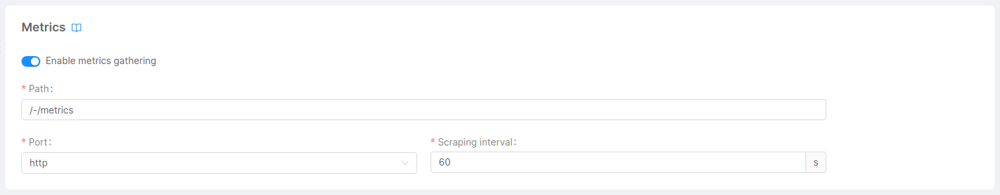

A great way of monitoring Fast Data is using Dashboards, which can give you immediate feedback on various aspects of system health. We provide some already configured [Grafana Dashboards](https://grafana.com/grafana/dashboards) to quickly set up a monitoring stack that grants both Dashboards and Alerts.

## Console Setup

The Grafana Dashboards make use of [Prometheus](https://prometheus.io/) metrics, which means that you should enable the monitoring of your project (for example, using [Prometheus Operator](https://github.com/prometheus-operator/prometheus-operator)) and export the metrics of interest.

If you are planning to use Prometheus Operator as a monitoring system for your project, you can automatically generate and configure the `servicemonitor.yml` files for all the monitoring services using their [Metrics card](/development_suite/api-console/api-design/microservice-monitoring.md).

## Metrics

Metrics are a set of categorized data generally exposed through a `/-/metrics` http GET route which reveals all the Prometheus metrics exposed by each service.

### Fast Data services metrics

Each Fast Data service comes with its set of metrics exposed through an http route. To expose them you only need to enable the `Enable metrics gathering` switch that you can find in each microservice's page in the console.



### MongoDB and Apache Kafka metrics

For the dashboards related to MongoDB and Apache Kafka metrics you will need to setup the [Kafka Exporter](https://github.com/danielqsj/kafka_exporter) and [MongoDB Query Exporter](https://github.com/raffis/mongodb-query-exporter) services. Conveniently, you can create them all at once by going to the Applications section of your console and creating a new `Fast Data Monitoring` Application.

#### MongoDB Query Exporter Configuration

The MongoDB Query Exporter service will expose all metrics we define in the `config.yml` config map. To use the Projection Changes Dashboard you need to make sure that for every Projection Changes collection you have in the console the respective metric is defined.

Here's an example with `fd-pc-library` and `fd-pc-restaurant` Projection Changes collections:

```yml title="config.yml"
...
- name: projection_changes_new_info
  type: counter #Can also be empty, the default is gauge
  servers: [main] #Can also be empty, if empty the metric will be used for every server defined
  help: 'Count the number of NEW projection changes'
  value: total
  labels: []
  mode: pull
  cache: 0
  constLabels:
      collection: fd-pc-library
  database: {{MONGODB_NAME}}
  collection: fd-pc-library
  pipeline: |
    [
      {
          "$match": {
              "changes.state": "NEW"
          }
      },
      {
          "$count": "total"
      },
      {
          "$facet": {
              "count": [
                  { "$project": { "total": 1, "_id": 0 }}
              ]
          }
      },
      {
          "$project": {
              "total": { "$cond": [ { "$gt": [{"$size": "$count"}, 0 ] }, { "$arrayElemAt": ["$count.total", 0]}, 0] }
          }
      }
    ]
- name: projection_changes_new_info
  type: counter #Can also be empty, the default is gauge
  servers: [main] #Can also be empty, if empty the metric will be used for every server defined
  help: 'Count the number of NEW projection changes'
  value: total
  labels: []
  mode: pull
  cache: 0
  constLabels:
      collection: fd-pc-restaurant
  database: {{MONGODB_NAME}}
  collection: fd-pc-restaurant
  pipeline: |
    [
      {
          "$match": {
              "changes.state": "NEW"
          }
      },
      {
          "$count": "total"
      },
      {
          "$facet": {
              "count": [
                  { "$project": { "total": 1, "_id": 0 }}
              ]
          }
      },
      {
          "$project": {
              "total": { "$cond": [ { "$gt": [{"$size": "$count"}, 0 ] }, { "$arrayElemAt": ["$count.total", 0]}, 0] }
          }
      }
    ]
...
```

Mind that the only thing that changes from one metric to another is the `collection` property and label, the rest should remain the same like in the example for the Projection Changes dashboard to properly work.

#### Kafka Exporter Configuration

Kafka exporter service configuration is quite easy, the only thing you need to do is make sure the variables in the `Microservice configuration - Args` section are properly defined.

Example of what the variables values could look like in the `Public variables` section:

```bash
KAFKA_BROKERS="my.broker.hostname:9093,my.second.broker.hostname:9093"
KAFKA_SASL_USERNAME="username"
KAFKA_SASL_PASSWORD="password"
KAFKA_SASL_MECHANISM="scram-sha256" # Mind there's no `-` between `sha` and `256`
KAFKA_EXPORTER_TOPIC_FILTER="my.topics.prefix.*"
KAFKA_EXPORTER_GROUP_FILTER="my.consumer.groups.prefix.*"
```

## Dashboards

You can create any custom dashboards using the metrics provided by the Fast Data services as well as the MongoDB Query Exporter and Kafka Exporter services. But if you're looking for a quicker start, we have a set of pre-configured dashboards designed to make the monitoring setup easier for you.

- [Bucket Storage Support Dashboard](/fast_data/monitoring/dashboards/bucket_storage_support.md)
- [Debezium CDC Dashboard](/fast_data/monitoring/dashboards/debezium_cdc.md)
- [Kafka Messages Dashboard](/fast_data/monitoring/dashboards/kafka_messages.md)
- [Projection Changes Dashboard](/fast_data/monitoring/dashboards/projection_changes.md)
- [Real Time Updater Dashboard](/fast_data/monitoring/dashboards/real_time_updater.md)
- [Single Views Dashboard](/fast_data/monitoring/dashboards/single_views.md)
- [Unmapped fields Dashboard](/fast_data/monitoring/dashboards/unmapped_fields.md)
