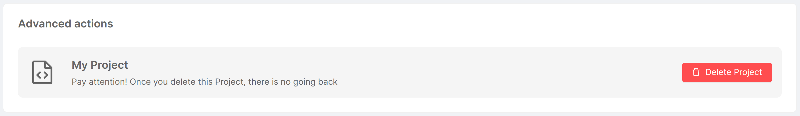
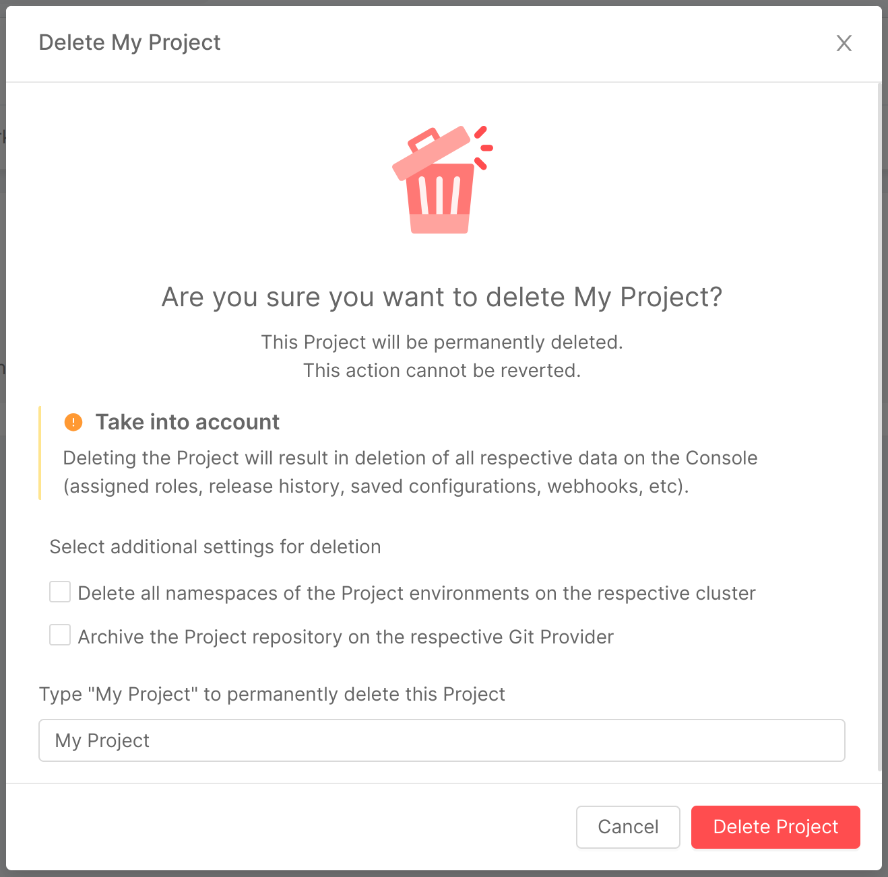

It is possible to delete a Project directly from the Console, via the "Project Settings" section in the "Overview" area. Here you will find the "Advanced" tab, which allows you to visualize advanced information and perform sensitive operations on the Project.

To delete a Project, simply click on the "Delete Project" button. Clicking on the button opens a modal, which warns the user of the consequences of deletion, as shown in the picture below.

  

  

:::info
Should some of the operations following deletion (e.g. removal of the deployment history) fail, the modal will return a success feedback to the user with specific warnings as to which operations were unsuccessful.
:::

The modal also gives the user the possibility to perform additional actions contextual to the deletion, namely the deletion of namespaces associated with project-related environments and the archiving of the repo on the related Git Provider. Entering the name of the Project in the input field will enable the delete button, upon clicking on which the Project will be deleted and the user will be redirected to the homepage.
