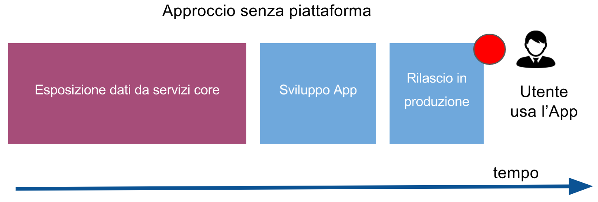

# API

[[TOC]]

## Introduzione
API è l'acronimo per *Application Programming Interface*. Negli ultimi anni le RESTful API sono diventate il metodo
principale per disaccoppiare la parte server dalla parte client di un software applicativo. Una RESTful utilizza i verbi
del protocollo HTTP (GET, PUT, POST, DELETE) per gestire un modello dati chiamato anche risorsa.

Nel dettaglio:
- GET: consente di leggere una risorsa o una lista di risorse
- POST: crea una risorsa
- PUT: aggiorna una risorsa

## Linee guida
Esitono delle buone pratiche per progettare delle API RESTFul. Le API evolvono nel tempo ed è importante che la loro
documentazione sia sempre aggiornata in modo da essere l'interfaccia stabile e chiara verso il mondo esterno (App, 
Siti Web, Wearable Devices, Machines ecc).

Seguono alcuni buoni consigli sulla progettazione delle API. Potete trovare ulteriori dettagli sulla [Guideline di 
Zalando](http://zalando.github.io/restful-api-guidelines).

### L'importanza di progettare le API
Progettare prima le API e poi implementarle non è contro i pricipi Agili.
Anzi consente di velocizzare lo sviluppo perchè disaccoppia il backend dal frontend e consente di parallelizzare gli
sviluppi e di conseguenza anche di rilasciare in modo incrementale le funzionalità, che inizialmente di solito saranno
interfacciate ad implementazioni delle API ancora in Draft. Questo approccio consentirà di raccogliere maggiori
riscontri durante le demo e adeguare le funzionalità in funzione di essi senza dover stravolgere la parte server.

Approccio senza progettare le API con una piattaforma

Approccio progettando le API con una piattaforma

Nei due schemi si può vedere come progettando una API e concordando quindi un contratto tra fronted e backend sia 
possibile procedere in parallelo fornendo dapprima dati mock all'interfaccia utente e poi, senza cambiare il contratto.

E' comunque auspicabile far evolvere le API man mano che l'interfaccia utente evolve. Il pattern di Backend-for-Frontend
è basilare per rendere facile la vita al frontend e consentire di avere API performanti e utili.

### Servizi o risorse?
La prima volta che si definisce un'API si tende a pensare all'azione che viene fatta come se fosse un servizio da 
chiamare. Facciamo un esempio, vogliamo fare un gioco su super eroi e la prima cose che vogliamo fare è gestire
il profilo di un super eroe, ci potrebbe venir voglia di scrivere le seguenti API:

2) API endpoint
Let’s write few APIs for Companies which has some Employees, to understand more.
/getAllEmployees is an API which will respond with the list of employees. Few more APIs around a Company will look like as follows:
/addNewEmployee
/updateEmployee
/deleteEmployee
/deleteAllEmployees
/promoteEmployee
/promoteAllEmployees
And there will be tons of other API endpoints like these for different operations. All of those will contain many redundant actions. Hence, all these API endpoints would be burdensome to maintain, when API count increases.
What is wrong?
The URL should only contain resources(nouns) not actions or verbs. The API path/addNewEmployee contains the action addNew along with the resource name Employee.
Then what is the correct way?
/companies endpoint is a good example, which contains no action. But the question is how do we tell the server about the actions to be performed on companies resource viz. whether to add, delete or update?
This is where the HTTP methods (GET, POST, DELETE, PUT), also called as verbs, play the role.
The resource should always be plural in the API endpoint and if we want to access one instance of the resource, we can always pass the id in the URL.
method GET path /companies should get the list of all companies
method GET path /companies/34 should get the detail of company 34
method DELETE path /companies/34 should delete company 34
In few other use cases, if we have resources under a resource, e.g Employees of a Company, then few of the sample API endpoints would be:
GET /companies/3/employees should get the list of all employees from company 3
GET /companies/3/employees/45 should get the details of employee 45, which belongs to company 3
DELETE /companies/3/employees/45 should delete employee 45, which belongs to company 3
POST /companies should create a new company and return the details of the new company created
Isn’t the APIs are now more precise and consistent? 😎
Conclusion: The paths should contain the plural form of resources and the HTTP method should define the kind of action to be performed on the resource.
3) HTTP methods (verbs)
HTTP has defined few sets of methods which indicates the type of action to be performed on the resources.
The URL is a sentence, where resources are nouns and HTTP methods are verbs.
The important HTTP methods are as follows:
GET method requests data from the resource and should not produce any side effect.
E.g /companies/3/employees returns list of all employees from company 3.
POST method requests the server to create a resource in the database, mostly when a web form is submitted.
E.g /companies/3/employees creates a new Employee of company 3. 
POST is non-idempotent which means multiple requests will have different effects.
PUT method requests the server to update resource or create the resource, if it doesn’t exist.
E.g. /companies/3/employees/john will request the server to update, or create if doesn’t exist, the john resource in employees collection under company 3.
PUT is idempotent which means multiple requests will have the same effects.
DELETE method requests that the resources, or its instance, should be removed from the database.
E.g /companies/3/employees/john/ will request the server to delete john resource from the employees collection under the company 3.
There are few other methods which we will discuss in another post.

The API describes resources, so the only place where actions should appear is in the HTTP methods. In URLs, use only nouns. Instead of thinking of actions (verbs), it’s often helpful to think about putting a message in a letter box: e.g., instead of having the verb cancel in the url, think of sending a message to cancel an order to the cancellations letter box on the server side.

7) Versioning
When your APIs are being consumed by the world, upgrading the APIs with some breaking change would also lead to breaking the existing products or services using your APIs.
http://api.yourservice.com/v1/companies/34/employees is a good example, which has the version number of the API in the path. If there is any major breaking update, we can name the new set of APIs as v2 or v1.x.x
These guidelines are compiled on my experience of development. I would love to know your views on the pointers mentioned above. Please leave a comment, and let me know!
If you liked this post, please share, comment and press the 💚 below 😊

## Creare una API

## Sicurezza di un'API

## Consumare una API

### Creare un

### Lista

### Filtro

### Aggiornare

### Cancellare

## Documentare una API

## Codici di risposta di un'API
When the client raises a request to the server through an API, the client should know the feedback, whether it failed, passed or the request was wrong. HTTP status codes are bunch of standardized codes which has various explanations in various scenarios. The server should always return the right status code.
The following are the important categorization of HTTP codes:
2xx (Success category)
These status codes represent that the requested action was received and successfully processed by the server.
200 Ok The standard HTTP response representing success for GET, PUT or POST.
201 Created This status code should be returned whenever the new instance is created. E.g on creating a new instance, using POST method, should always return 201 status code.
204 No Content represents the request is successfully processed, but has not returned any content.
DELETE can be a good example of this.
The API DELETE /companies/43/employees/2 will delete the employee 2 and in return we do not need any data in the response body of the API, as we explicitly asked the system to delete. If there is any error, like if employee 2 does not exist in the database, then the response code would be not be of 2xx Success Category but around 4xx Client Error category.
3xx (Redirection Category)
304 Not Modified indicates that the client has the response already in its cache. And hence there is no need to transfer the same data again.
4xx (Client Error Category)
These status codes represent that the client has raised a faulty request.
400 Bad Request indicates that the request by the client was not processed, as the server could not understand what the client is asking for.
401 Unauthorized indicates that the client is not allowed to access resources, and should re-request with the required credentials.
403 Forbidden indicates that the request is valid and the client is authenticated, but the client is not allowed access the page or resource for any reason. E.g sometimes the authorized client is not allowed to access the directory on the server.
404 Not Found indicates that the requested resource is not available now.
410 Gone indicates that the requested resource is no longer available which has been intentionally moved.
5xx (Server Error Category)
500 Internal Server Error indicates that the request is valid, but the server is totally confused and the server is asked to serve some unexpected condition.
503 Service Unavailable indicates that the server is down or unavailable to receive and process the request. Mostly if the server is undergoing maintenance.

## API con codice custom

## Eventi legati ad una API