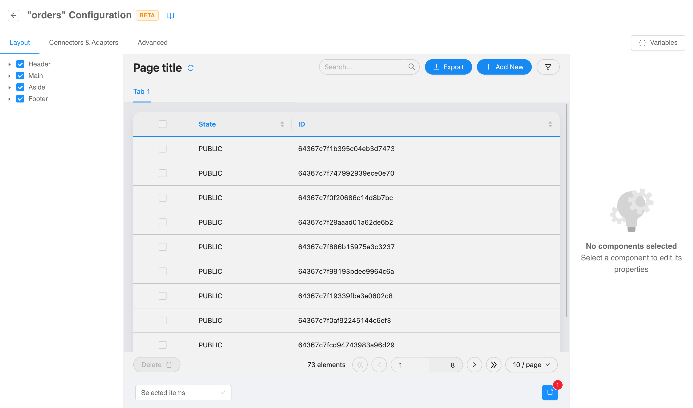
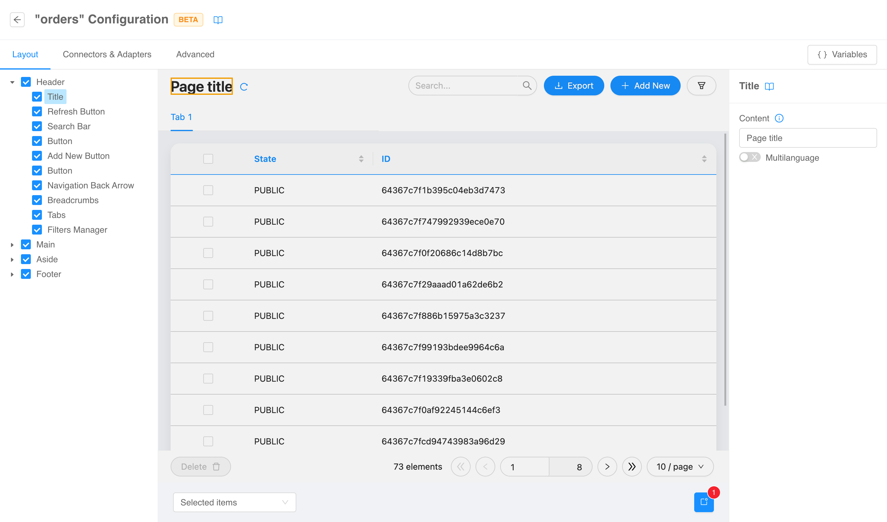
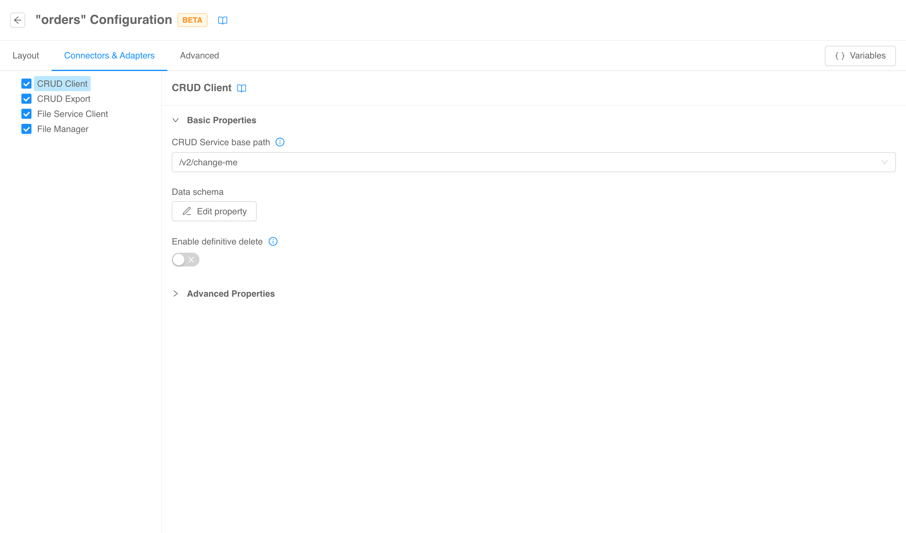
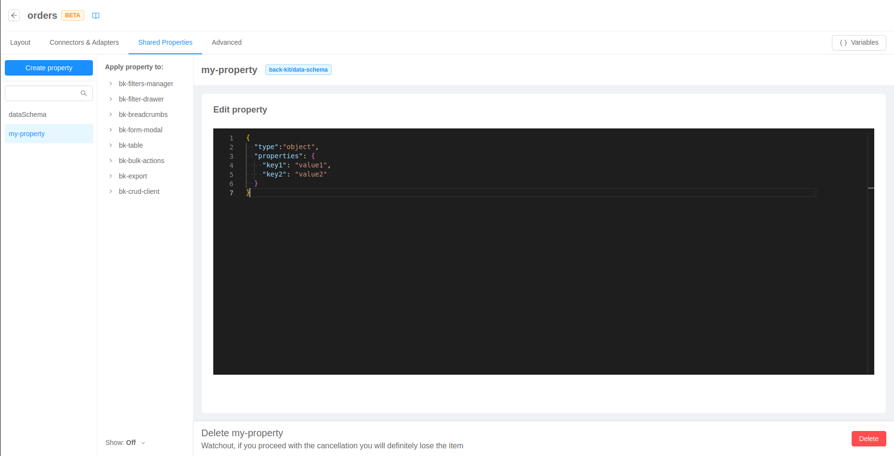
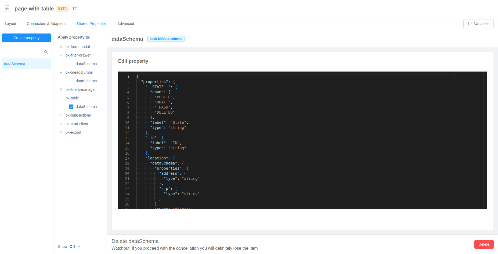
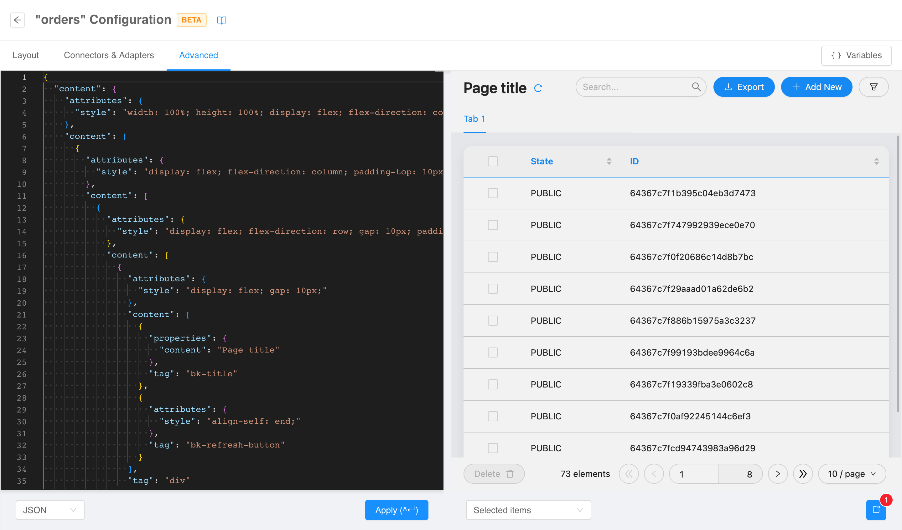

:::caution
This is a **BETA** feature and, as such, is currently under **active development**. Pay attention using this section.
:::

The pages of type [_compose_](./20_structure.md#page-type) can be configured in a **dedicated section**
accessible via _edit page_ option in pages [context menu](./20_structure.md#edit-page).

:::tip
You can refer the [micro-lc documentation](https://micro-lc.io/docs/guides/applications/compose) on how to properly
configure a compose page.
:::

## Layout

From the first tab you can configure in a no-code fashion the components that **renders something** on the page (
as opposed to the merely logical components configurable in the [connectors & adapters](#connectors--adapters) tab).

This section works just as the layout tab of Backoffice Configurator. The
**left menu** allows viewing, selecting, and hiding the custom components composing the page, the **live central preview** shows 
how the final page will look like, and from the **right menu** components properties can be consulted and edited.

For more technical insights, visit the [Layout section](./20_structure.md#layout) where all the behaviors are explained in deep.

## Connectors & Adapters

The second tab is equivalent to the first in terms of functionalities. However, it will show only **logical** components
(i.e., components that do not render anything). For this reason, no live preview will be shown.

## Shared Properties

The third tab allows the user to define custom reusable properties and assign their value to different properties of components on the page. This is
useful to centralize important values that can be shared across components and editing them in one place.

### Create and assign Shared Property

In order to create a new Shared Property, it is necessary to click on the "Create property" button and fill out the form by assigning a name and a type 
to the property (if no type is available in the dropdown, it means that no component in the page expects a shared property).

Once that the property has been created, it will be visible in the left side menu. It is possible to assign it to a property of a component 
in page by selecting it and flagging the checkbox of the relative property.

Alternatively, it is possible to assign a Shared Property to a component property directly in the [Component properties editor](./20_structure.md###components-properties-editor)

## Advanced

The fourth and last tab works like the advanced tab of the [structure section](./20_structure.md#advanced-configuration):
the **whole configuration** of the page can be edited from a code editor with a live preview on the right.

