The pages of type [_compose_](./20_structure.md#page-type) can be configured in a **dedicated section**
accessible via _edit page_ option in pages [context menu](./20_structure.md#edit-page).

:::tip
You can refer the [micro-lc documentation](https://micro-lc.io/docs/guides/applications/compose) on how to properly
configure a compose page.
:::

## Templates

Compose pages can be created starting from a template, which is a pre-defined configuration carring a set of components.

:::tip
To learn how to use your own custom templates, read the [dedicated documentation](./40_configurator_settings.md#template-sources).
::: 

### Page with table

A page built to display an array of data with a tabular view. It provides filtering, exporting, pagination, creation,
and editing functionalities.

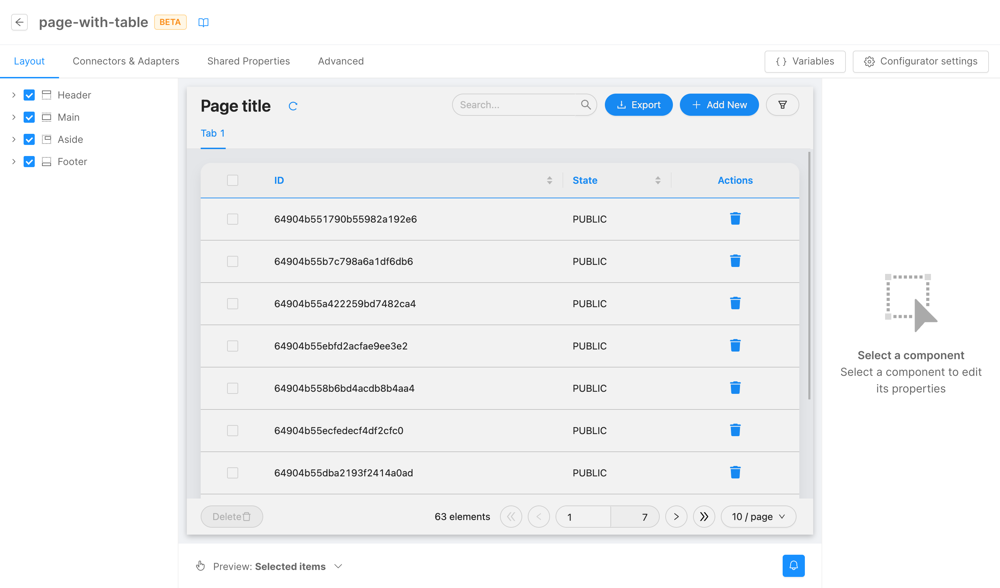

The template should be linked to a data source implementing a [CRUD service](../../runtime_suite/crud-service/overview_and_usage)-compatible
interface configuring the _base path_ property of _CURD client_ and _CRUD export_ components in _Connectors & Adapters_
section.

Data shape is defined by `dataSchema` shared property, that can be edited in a no-code fashion from the
[dedicated section](#shared-properties). 

### Table with file field

A page built to display an array of data carring file fields with a tabular view. Besides filtering, exporting,
pagination, creation, and editing functionalities, it provides a way to upload and download files.

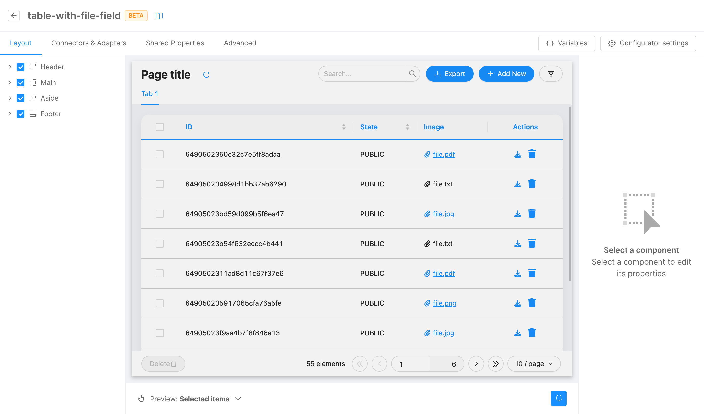

The template should be linked to a data source implementing a [CRUD service](../../runtime_suite/crud-service/overview_and_usage)-compatible
interface configuring the _base path_ property of _CURD client_ and _CRUD export_ components in _Connectors & Adapters_
section. Moreover, page should be linked to a [files service](../../runtime_suite/files-service/configuration)
instance thought the _base path_ property of _File service client_ component in _Connectors & Adapters_ section.

Data shape is defined by `dataSchema` shared property, that can be edited in a no-code fashion from the
[dedicated section](#shared-properties).

### Master table

A table page built to be connected with another page that provides further details on the data.

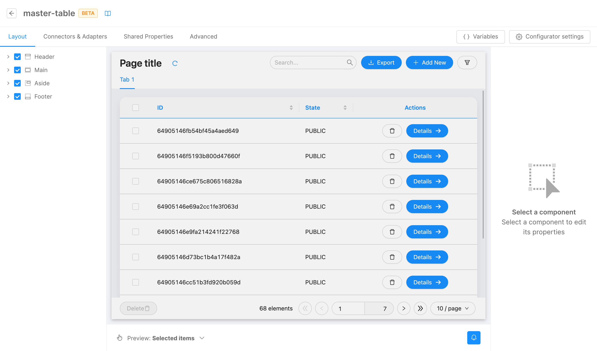

The page should be connected to a data source just like a [page with table](#page-with-table), and to the correct details
page configuring the table [`customActions` property](../../business_suite/backoffice/components/data_visualization#configuring-actions-via-customactions).

### Details page

A page built to display a detailed view of data (e.g., a single row of a table) through [card components](../../business_suite/backoffice/components/data_visualization#bk-card).

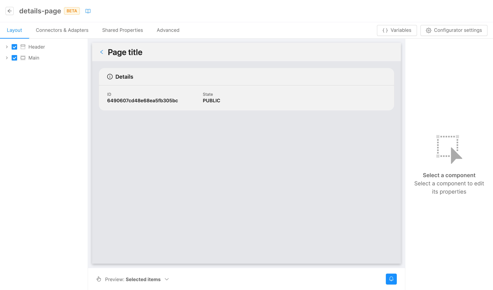

The template should be linked to a data source implementing a [CRUD service](../../runtime_suite/crud-service/overview_and_usage)-compatible
interface configuring the _base path_ property of _CURD client_ component in _Connectors & Adapters_
section. Moreover, _URL mask_ property of _URL parameters adapter_ component in _Connectors & Adapters_ should be
[properly configured](../../business_suite/backoffice/components/adapters#bk-url-parameters) to
query data correctly.

Data shape is defined by `dataSchema` shared property, that can be edited in a no-code fashion from the
[dedicated section](#shared-properties).

### Single view visualization

A page built to visualize a [Fast Data Single View](../../fast_data/the_basics#single-view-sv).
It offers a readonly interaction with the data and is equipped for nested data visualization.

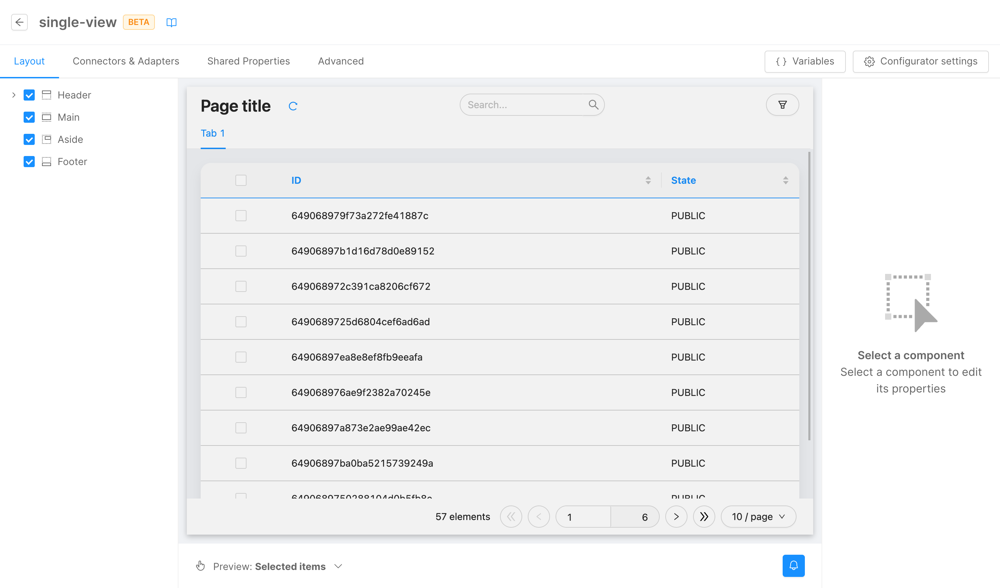

The template should be linked to an exposed Single View configuring the _base path_ property of _CURD client_ component in _Connectors & Adapters_
section.

Data shape is defined by `dataSchema` shared property, that can be edited in a no-code fashion from the
[dedicated section](#shared-properties).

### Calendar view

A page built to visualize data on a calendar. It provides filtering, exporting, pagination, creation, and editing functionalities.

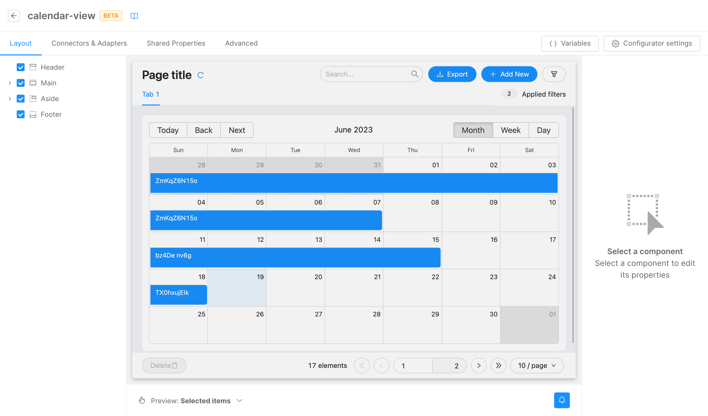

The template should be linked to a data source implementing a [CRUD service](../../runtime_suite/crud-service/overview_and_usage)-compatible
interface configuring the _base path_ property of _CURD client_ and _CRUD export_ components in _Connectors & Adapters_
section.

Data shape is defined by `dataSchema` shared property, that can be edited in a no-code fashion from the
[dedicated section](#shared-properties). Pre-configured schema already has the required fields by the
[calendar component](../../business_suite/backoffice/components/data_visualization#bk-calendar).

### Picture gallery

A page built to visualize image files through a gallery view. Besides filtering, exporting, pagination, creation, and
editing functionalities, it provides a way to upload and download files.

The template should be linked to a data source implementing a [CRUD service](../../runtime_suite/crud-service/overview_and_usage)-compatible
interface configuring the _base path_ property of _CURD client_ and _CRUD export_ components in _Connectors & Adapters_
section. Moreover, page should be linked to a [files service](../../runtime_suite/files-service/configuration)
instance thought the _base path_ property of _File service client_ component in _Connectors & Adapters_ section.

Data shape is defined by `dataSchema` shared property, that can be edited in a no-code fashion from the
[dedicated section](#shared-properties).

## Layout

From the first tab you can configure in a no-code fashion the components that **renders something** on the page (
as opposed to the merely logical components configurable in the [connectors & adapters](#connectors--adapters) tab).

This section works just as the layout tab of Backoffice Configurator. The
**left menu** allows viewing, selecting, and hiding the custom components composing the page, the **live central preview** shows 
how the final page will look like, and from the **right menu** components properties can be consulted and edited.

For more technical insights, visit the [Layout section](./20_structure.md#layout) where all the behaviors are explained in deep.

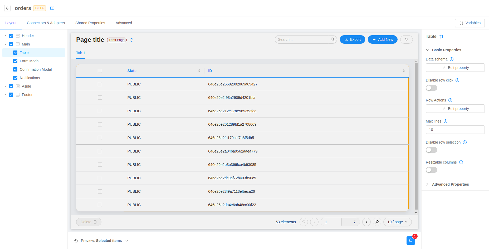

## Connectors & Adapters

The second tab is equivalent to the first in terms of functionalities. However, it will show only **logical** components
(i.e., components that do not render anything). For this reason, no live preview will be shown.

## Shared Properties

The third tab allows the user to define custom reusable properties and assign their value to different properties o
 components on the page. This is useful to centralize important values that can be shared across components and editing
 them in one place.

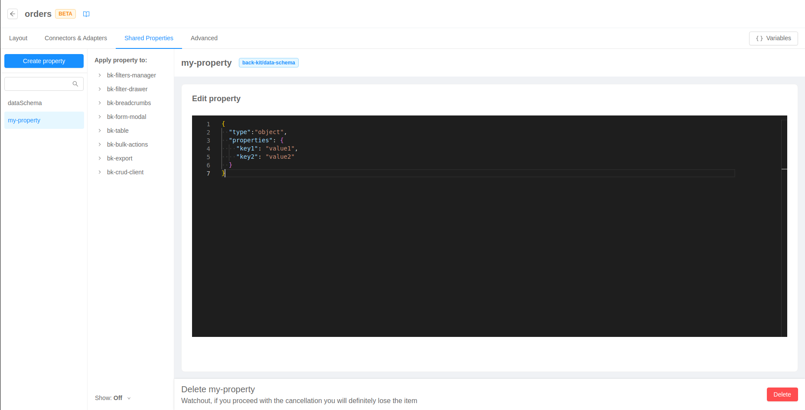

### Create and assign shared properties

In order to create a new Shared Property, it is necessary to click on the "Create property" button and fill out the form
by assigning a **name** and a **type**  to the property (if no type is available in the dropdown, it means that no component in
the page expects a shared property).

:::tip
When choosing the name of your new shared property, you can also select any definition that does not have a type assigned.
This may be useful for example if you create a definition from the Advanced section and later you want to start editing
it in a no-code fashion.
:::

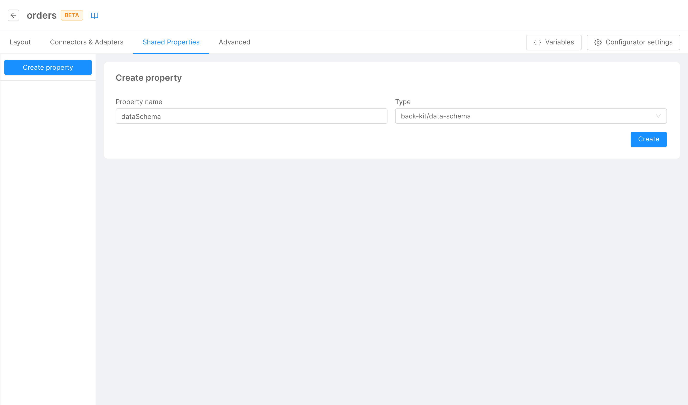

Once that the property has been created, it will be visible in the left side menu. It is possible to assign it to a property of a component 
in page by selecting it and flagging the checkbox of the relative property.

Alternatively, it is possible to assign a Shared Property to a component property directly in the [Component properties editor](./20_structure.md#components-properties-editor)

### Well-known shared properties

Some shared property types are well known by the Configurator, and a no-code editor is available for them.

#### Back Kit data schema

Properties of type `back-kit/data-schema` are a core concept of the
[back-kit web-components library](../../business_suite/backoffice/page_layout#data-schema)
and can be configured through a graphical interface.

You can add new fields to the schema, choose and edit their name, and set some relevant properties for each of them.

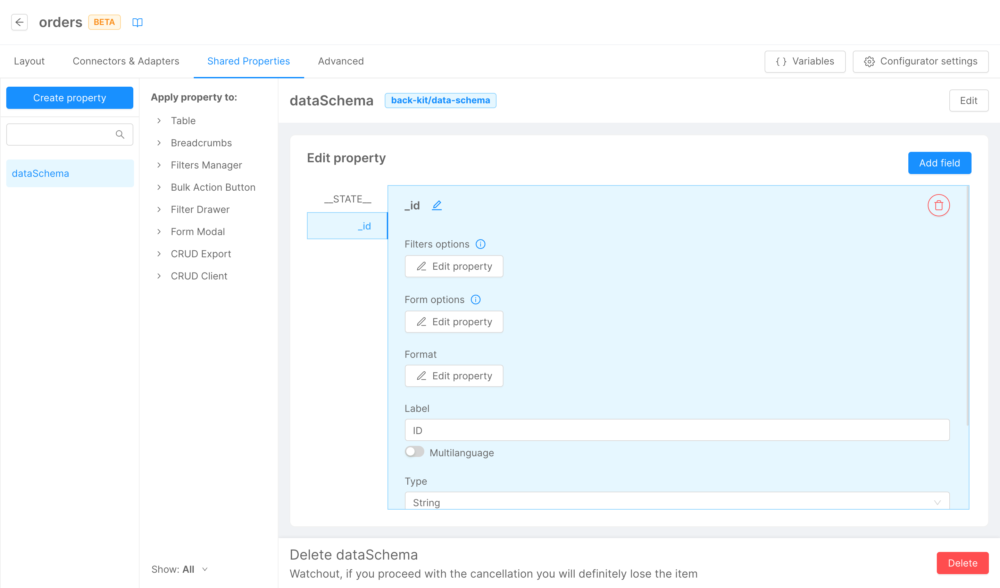

Moreover, data schemas can be **automatically generated** from CRUD collections. This can be done in specific components
that are responsible for CRUD communication
(e.g., [Curd Client](../../business_suite/backoffice/components/clients#bk-crud-client) component),
with the _Generate Schema_ button.

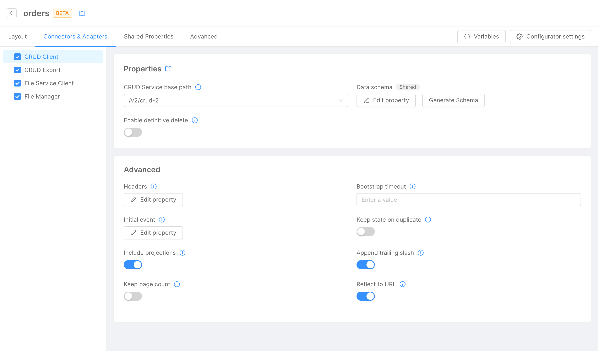

If the component does not have a value for its data schema property, the automatic generation process will create a 
**new shared property**, and will assign it to the component. If the component already references a shared property in
its data schema property, the shared will be updated.

:::warning
If the component already references a shared, the generation process will **completely overwrite** the value of the
shared property (this includes any additional field you may have added to the previous data schema).
:::

## Advanced

The fourth and last tab works like the advanced tab of the [structure section](./20_structure.md#advanced-configuration):
the **whole configuration** of the page can be edited from a code editor with a live preview on the right.

