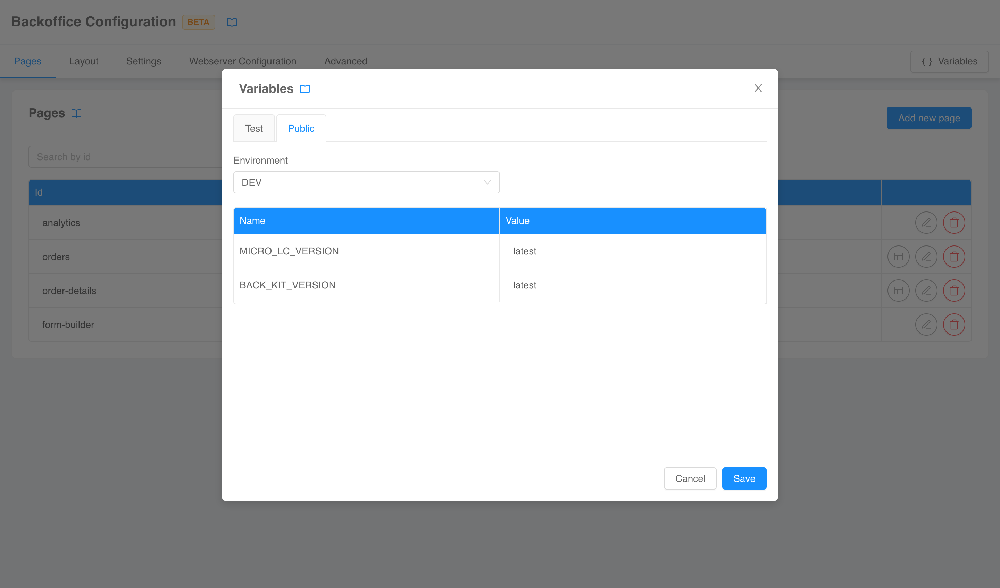

:::caution
This is a **BETA** feature and, as such, is currently under **active development**. Pay attention using this section.
:::

A common use-case when configuring a Backoffice instance is to use **interpolated variables** in configuration files 
(e.g., for the version of a web-components library). The configurator automatically pulls the unsecreted variables of
the project and uses them to correctly interpret configurations with interpolated sections.

To manage the variables used by the configurator, a dedicated modal can be opened with the *Variables* button on the top
right corner of both the [structure](./20_structure.md) and the [compose configuration](./30_compose-pages.md) pages.

The modal is divided into two section. The *Public* section lists the project unsecreted variables divided for environment
(the variables are **readonly**). The environment can be switched to try the configuration with the different variables
values.

The *Test* section can be used to define **volatile**, test-only variables in a key-value pair fashion. This can be
useful for example to simulate secreted variables or to temporarily override unsecreted variables, since the configurator
will use test variables over public variables when they have the same key.

:::tip
Variables defined in the *Test* section of the modal are shared between all sections of the configurator. However, if
you leave the page and return, your will lose your environment.
:::
