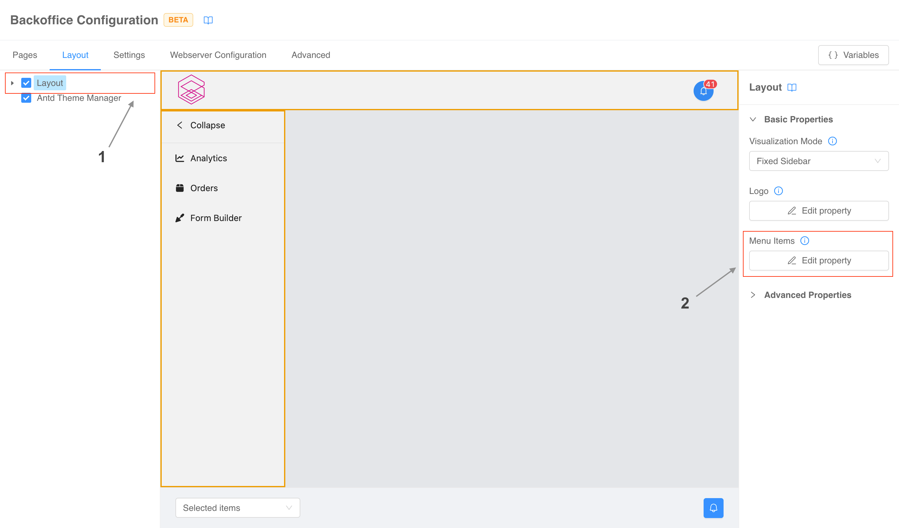
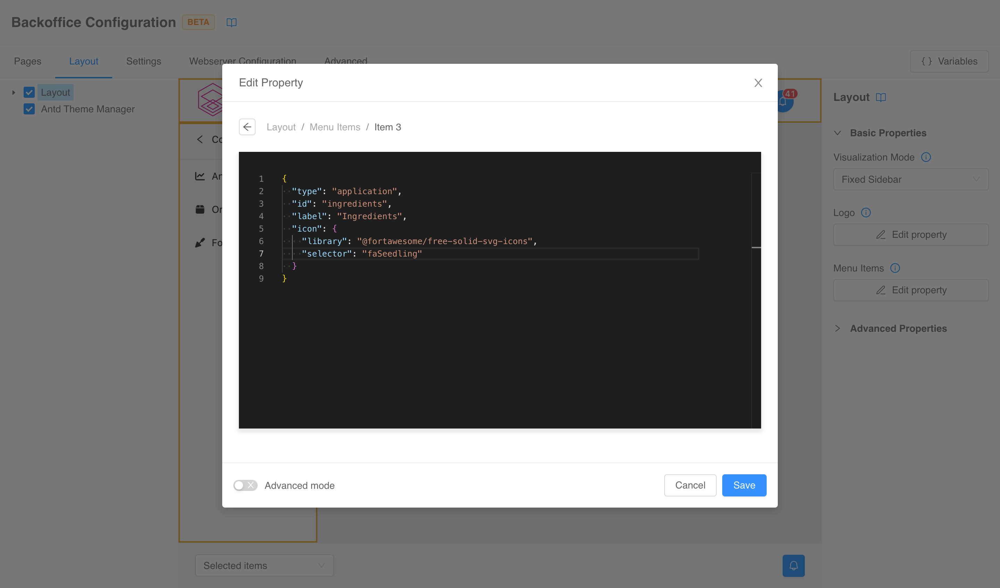

:::caution
This is a **BETA** feature and, as such, is currently under **active development**. Pay attention using this section.
:::

## Components

## How can I add a new page to and show it in the navigation menu?

:::caution
The information regarding the menu are valid only if you are using the
[`bk-layout`](../../business_suite/backoffice/components/misc#bk-layout) component.
:::

The first step to add a new page to your Backoffice is to [create](./20_structure.md#create-new-page) it the _Pages_
tab of the Configurator.

Once the page has been spawned, you can move to the _Layout_ tab to connect it to the navigation menu. In the left drawer
select the component named _Layout_, and in the right form locate the _Menu Items_ property.

Click the _Edit property_ button and in the modal that pops up click the _Add item_ button to insert a new voice in the
menu. The click will spawn a new _Edit item_ button.

One clicked, a code editor will appear in the modal for you to write the 
[item configuration](../../business_suite/backoffice/components/misc#application). Remember
that the _id_ must match the identifier of your newly created page.

Once you have done, click the _Save_ button. The modal will close, and the new item will appear in the menu.

### How can I add a new column to a table?

:::caution
This information are valid only if you are using the
[`bk-table`](../../business_suite/backoffice/components/data_visualization#bk-table) component.
:::

Columns of the table are defined by it's 
[`dataSchema` property](../../business_suite/backoffice/page_layout#data-schema). To edit
it you first need to open the configuration of the _compose page_ of your choice. Now you need to select the _Table_
component in the left menu (if you are starting from a template, it usually located under the _Main_ component) and click the _Edit property_ button of the _Data schema_ property in the right menu.

A modal will open with a code editor you can use to edit the property. Now you just need to add a new entry to the
`properties` object as explained in the 
[official documentation](../../business_suite/backoffice/page_layout#data-schema).

Once you have done, click the _Save_ button. The modal will close, and the table will display the new column.

## Infrastructure

### How can I change the route under which the Backoffice is exposed?

When starting from the application (whether it is the 
[classic one](../../runtime_suite/backoffice/overview) or the
[on prem one](../../runtime_suite/backoffice-on-prem/overview)), the Backoffice is exposed
under `/backoffice`. The steps to change this endpoint are the following.

1. Delete `/backoffice` endpoint and create the new one, which **must have** _Rewrite Base Path_ set to `/public`.
2. Open the Configurator, and navigate to the _Webserver Configuration_ tab.
   1. Under _Entry point_ section you need to modify `index.html` `<base>` tag setting the `href` attribute to the newly created endpoint. **Remember** to always put a trailing `/` (i.e., `/my-new-endpoint/`).
   2. Under _Headers_ section, change the `/backoffice/assets/style.css` link (and any other preload link you might have added) substituting `/backoffice` with your new endpoint.

### How can I change the route under which Backoffice configurations are exposed?

When starting from the application (whether it is the 
[classic one](../../runtime_suite/backoffice/overview) or the
[on prem one](../../runtime_suite/backoffice-on-prem/overview)), Backoffice configuration
files are exposed under `/micro-lc-configurations`. The steps to change this endpoint are the following.

1. Delete `/micro-lc-configurations` endpoint and create the new one, which **must have** _Rewrite Base Path_ set to `/configurations`.
2. Open the Configurator, and navigate to the _Webserver Configuration_ tab.
   1. Under _Entry point_ section you need to modify the value of `config-src` attribute of `micro-lc` web component substituting `/micro-lc-configurations` with your new endpoint.
   2. Under _Headers_ section, change the `/micro-lc-configurations/config.json` link (and any other preload link you might have added) substituting `/micro-lc-configurations` with your new endpoint.

### How can I serve a static file through the Backoffice webserver?

When starting from the application (whether it is the 
[classic one](../../runtime_suite/backoffice/overview) or the
[on prem one](../../runtime_suite/backoffice-on-prem/overview)), all the Backoffice related
resources are served by a single service, called `micro-lc`. 

This service comes with four config maps, three of which are readonly and editable only thought the Configurator. The
fourth one, `micro-lc-assets`, instead is open and it's content is exposed under `/backoffice/assets` (unless you
have [changed the endpoint](#how-can-i-change-the-route-under-which-the-backoffice-is-exposed)), which means the the
service **will serve any file** you mount in this directory.

Content types and response headers can be controlled in the _Webserver Configuration_ section of the Configurator (read
the [full documentation](https://micro-lc.io/add-ons/backend/middleware#service-configuration)).

### How can I improve Backoffice loading performance?

Backoffice loading performance can be improved (al least on [some browsers](https://caniuse.com/link-rel-preload)) setting
the right [`preload`](https://developer.mozilla.org/en-US/docs/Web/HTML/Attributes/rel/preload) and
[`modulepreload`](https://developer.mozilla.org/en-US/docs/Web/HTML/Attributes/rel/modulepreload) links in the headers
of the entrypoint.

This can be done in the _Headers_ section of the _Webserver Configuration_ tab of the Configurator (read
the [full documentation](https://micro-lc.io/add-ons/backend/middleware/#headers)). When starting from an application,
some useful links are already in place, but you can always add more to cover the specific static resources used by your
Backoffice implementation.
