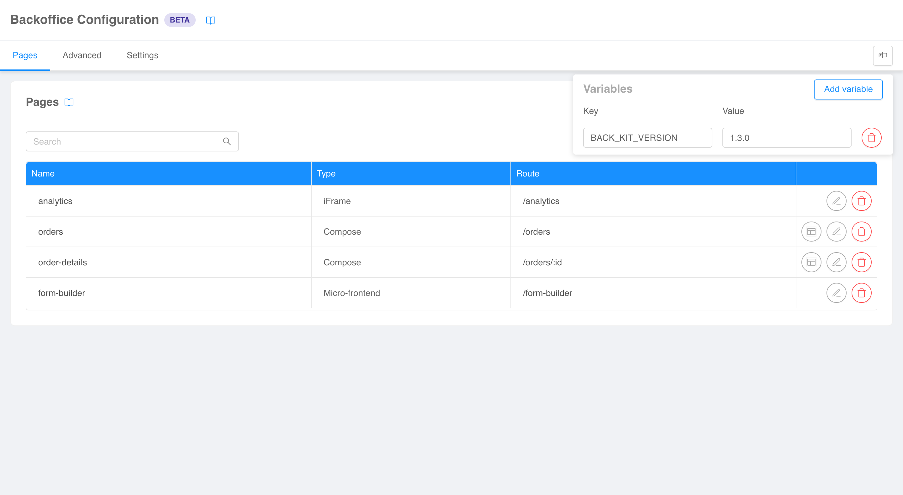

:::caution
This is a **BETA** feature and, as such, is currently under **active development**. Pay attention using this section.
:::

A common use-case when configuring a Backoffice instance is to use **interpolated variables** in configuration files 
(e.g., for the version of a web-components library). The problem is, the configurator does not have access to the value of 
these variables, therefore it cannot correctly interpret configurations with interpolated sections.

To overcome this issue, you can manually tell the configurator the value of your interpolated variables using the
**environment menu** accessible on the top right of both the [structure](./structure.md)
and the [compose configuration](./compose-pages.md) pages.

In the menu you are able to add variables in a key-value pair fashion, and the configurator will use them to interpret
your configurations. Variables can be modified at any time to test the Backoffice against different values.

:::tip
Variables defined in the environment menu are shared between all sections of the configurator. However, if you leave the
page and return, your will lose your environment.
:::
