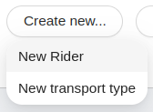

<!--
WARNING:
This file is automatically generated. Please edit the 'README' file of the corresponding component and run `yarn copy:docs`
-->


[localization]: ../40_core_concepts.md#localization-and-i18n
[actions]: ../50_actions.md#actions
[dynamic-actions]: ../50_actions.md#dynamic-configurations
[add-new]: ../70_events.md#add-new
[loading-data]: ../70_events.md#loading-data
[error]: ../70_events.md#error
[success]: ../70_events.md#success


```html
<bk-dropdown></bk-dropdown>
```

The Dropdown Button renders a button which opens a dropdown when hovered. Selection of any element of the dropdown menu triggers an action.



## How to configure

The items of the Dropdown Button can be configured through the `menuItems` property. For each item, a [localized][localization] label and a [Back-kit Action][actions] to be execute upon click can be specified.
Each action is injected with information on the currently logged user, retrievable with `currentUser` keyword, as [context][dynamic-actions].

## Examples

The Dropdon Button configured as follows provides two actions:

- first action can be triggered selecting the menu item with label "New Rider" (assuming the browser language to be english) and notifies the request to create a new item (emits an [add-new][add-new] event)
- second action is associated to menu item with label "New transport type", and causes to navigate to path "/transport-type"

```json
  {
    "tag": "bk-dropdown",
    "properties": {
      "label": {
        "en": "Create new...",
        "it": "Crea nuovo..."
      },
      "menuItems": [
        {
          "label": {
            "en": "New rider",
            "it": "Nuovo fattorino"
          },
          "action": {
            "type": "event",
            "config": {
              "events": "add-new"
            }
          }
        },
        {
          "label": "New transport type",
          "action": {
            "type": "push",
            "config": {
              "url": "/transport-type"
            }
          }
        }
      ]
    }
  }
```

## API

### Properties & Attributes

| property | attribute | type | default | description |
|----------|-----------|------|---------|-------------|
|`label`| - |[LocalizedText][localization]|{}|dropdown label |
|`iconId`|`icon-id`|string| - |defines which icon should be rendered in the dropdown, if this property is not defined or doesn't match any icon no icon will be rendered |
|`iconPlacement`| - |"default" \| "left" \| "right"|"default"|defines where icon should be rendered, either left or right defaulting on left |
|`listenToLoadingData`|`listen-to-loading-data`|boolean|false|configures the dropdown to be loading when trigger by a loading-data event |
|`shape`|`shape`|string|'round'|dropdown button shape property |
|`type`|`type`|string|'primary'|dropdown button type property |
|`menuItem`|-|[DropdownItem](#dropdownitem)[]|-|dropdown menu items configuration |


#### DropdownItem

```typescript
type DropdownItem = {
  label: LocalizedText,
  action: Action
}
```
where `Action` type refers to the [Back-kit Action interface][actions], and [`LocalizedText`][localization] is either a string or an object mapping language acronyms to strings.

### Listens to

| event | description |
|-------|-------------|
|[loading-data][loading-data]|notifies that loading state should be entered. Ignored if property `listenToLoadingData` is not set to true|

### Emits

| event | description |
|-------|-------------|
|configurable event|generic event configurable through the event type configuration|
|[error][error]|contains error messages for an http event|
|[success][success]|notifies a successful http request|
