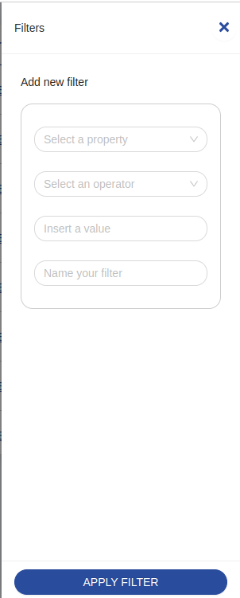

## Filter Drawer

This is the filter drawer


```html
<bk-filter-drawer></bk-filter-drawer>
```

### Properties & Attributes

| property | attribute | type | optional | required | default | description |
|----------|-----------|------|----------|----------|---------|-------------|
|`dataSchema`| - |ExtendedJSONSchema7Definition| - | - | - | - |
|`liveSearchItemsLimit`|`live-search-items-limit`|number| - | - |10|max items to fetch on regex live search|
|`liveSearchTimeout`|`live-search-timeout`|number| - | - |5000|live-search timeout|
|`width`|`width`|string| - | - | - |width occupied by the component|

### Listens to

| event | action | emits | on error |
|-------|--------|-------|----------|
|[using-form-container](../Events/Events#using-form-container)|toggles the drawer into `visible` mode only if the id payload property matches this drawer| - | - |
|[filter](../Events/Events#filter)|claims the drawer, closing concurrent ones, to enter a new filter|[using-form-container](../Events/Events#using-form-container)| - |
|[change-filter](../Events/Events#change-filter)|enters filter edit mode|[using-form-container](../Events/Events#using-form-container)| - |
|[lookup-data](../Events/Events#lookup-data)|receives lookup data| - | - |
|[loading-data](../Events/Events#loading-data)|sets the component to loading state| - | - |

### Emits

| event | description |
|-------|-------------|
|[using-form-container](../Events/Events#using-form-container)|notifies the drawer is used by this component|
|[add-filter](../Events/Events#add-filter)|when done filling the form, notices deployment of a new filter|

### Bootstrap

None

## Filters Manager

Manages the display, application, and modification of filters.

```html
<bk-filters-manager></bk-filters-manager>
```

### Properties & Attributes

| property | attribute | type | optional | required | default | description |
|----------|-----------|------|----------|----------|---------|-------------|
|`filters`| - |Filter[]| - | - |[]|List of currently applied [filters](../Core_concepts#filters)|

### Listens to

| event | action | emits | on error |
|-------|--------|-------|----------|
|[add-filter](../Events/Events#add-filter)|applies a new filter|[change-query](../Events/Events#change-query)| - |

### Emits

| event | description |
|-------|-------------|
|[change-query](../Events/Events#change-query)|requires data filtering|
|[change-filter](../Events/Events#change-filter)|triggers the modification of an existing filter|

### Bootstrap

- This component parses the URL for `filters` parameter.
- This component emits a `change-query` event if `filters` is found in the URL.

## Pagination

displays pagination navigation tools to query pages of a dataset.
It allows going back and forward and skip to first and last page. It shows the current page and total elements in a given
dataset while interacting with dynamic filters


```html
<bk-pagination></bk-pagination>
```

### Properties & Attributes

| property | attribute | type | optional | required | default | description |
|----------|-----------|------|----------|----------|---------|-------------|
|`pageSize`|`page-size`|number| - | - |DEFAULT_PAGE_SIZE|number of data items per page.|
|`pageSizeOptions`| - |number[]| - | - |DEFAULT_PAGE_OPTIONS|available page sizes|

### Listens to

| event | action | emits | on error |
|-------|--------|-------|----------|
|[loading-data](../Events/Events#loading-data)|sets internal loading state| - | - |
|[count-data](../Events/Events#count-data)|adjusts footer counter to currently viewed dataset| - | - |
|[nested-navigation-state/push](../Events/Events#nested-navigation-state---push)|updates internal representation of the current navigation path by adding one step. Emits nested-navigation-state/display with slice of data to display|[nested-navigation-state/display](../Events/Events#nested-navigation-state---display)| - |
|[nested-navigation-state/back](../Events/Events#nested-navigation-state---back)|updates internal representation of the current navigation path by removing the specified number of steps. Emits nested-navigation-state/display with slice of data to display|[nested-navigation-state/display](../Events/Events#nested-navigation-state---display)| - |

### Emits

| event | description |
|-------|-------------|
|[change-query](../Events/Events#change-query)|requires data filtered according with the current pagination|
|[nested-navigation-state/display](../Events/Events#nested-navigation-state---display)|emits nested-navigation-state/display with slice of data to display|

### Bootstrap

- This component parses `pageSize` and `pageNumber` URL parameters.
- This component emits a `change-query` event to notify current pagination.

## Tabs

provides a fixed set of filters rendered as tabs, possibly on top of a bk-table


```html
<bk-tabs></bk-tabs>
```

### Properties & Attributes

| property | attribute | type | optional | required | default | description |
|----------|-----------|------|----------|----------|---------|-------------|
|`tabs`| - |Tab[]| - | - |[]|array with tabs configuration|

- `Tab` is given by the following schema
>
> ```json
> {
>   "title": {
>     "type": ["string", "object"]
>   },
>   "filters": {
>     "type": "array",
>   }
> }
> ```

### Listens to

| event | action | emits | on error |
|-------|--------|-------|----------|
|[nested-navigation-state/push](../Events/Events#nested-navigation-state---push)|updates internal representation of the current navigation path by adding one step| - | - |
|[nested-navigation-state/back](../Events/Events#nested-navigation-state---back)|updates internal representation of the current navigation path by removing the specified number of steps| - | - |

### Emits

| event | description |
|-------|-------------|
|[change-query](../Events/Events#change-query)|requests filtering on dataset|

### Bootstrap

- This component parses `characteristic` URL parameter.
- This component emits a `change-query` event to notify current focused tab and filter.

## bk-search-bar

Allows data filtering by matching a text string

```html
<bk-search-bar></bk-search-bar>
```


Search bar allows to filter data against text using a regex. If `searchLookups` is `true`, lookups and multi-lookups that specify `excludeFromSearch` as `false` in the schema are also searched. The text value is compared against the `lookupFields` specified in the `lookupOptions` in the schema.
:::warning
Searching lookup fields could be computationally heavy. The number of searchable lookups should be kept to the needed minimum and search-bar properties such as `liveSearchItemsLimit` and `autoSearchMinInput` should be configured carefully.
:::

### Properties & Attributes

| property | attribute | type | default | description |
|----------|-----------|------|---------|-------------|
|`autoSearchMinInput`|`auto-search-min-input`|number|2|min length of input string before performing automatic search|
|`liveSearchItemsLimit`|`live-search-items-limit`|number|100|max items to fetch on regex live search|
|`placeholder`| - |LocalizedText|{}|placeholder of the search bar input |
|`searchDebounce`|`search-debounce`|number|0|time to wait before performing an automatic search. If 0, automatic search is disabled|
|`searchLookups`|`search-lookups`|boolean|false|whether or not to perform search on lookups. If true, `lookup-crud-client` (or any component listening to `search-lookups` and emitting `search-lookups-found`) should be included in the plugin|

### Listens to

| event | action | emits | on error |
|-------|--------|-------|----------|
|[loading-data](../Events/Events#loading-data)|sets internal loading state| - | - |
|[nested-navigation-state/back](../Events/Events#nested-navigation-state---back)|keeps track of navigation steps| - | - |
|[nested-navigation-state/push](../Events/Events#nested-navigation-state---push)|keeps track of navigation steps| - | - |
|[search-lookups-found](../Events/Events#search-lookups-found)|includes lookup values searched against text search|[change-query](../Events/Events#change-query)| - |

### Emits

| event | description |
|-------|-------------|
|[change-query](../Events/Events#change-query)|requires data filtered according with the typed input|
|[search-lookups](../Events/Events#search-lookups)| - |

### Bootstrap

None
