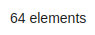

:::caution
`bk-form-modal` needs `bk-confirmation-modal` to work within an `element-composer` plugin configuration.

```json
{
  "type": "element",
  "tag": "bk-form-modal"
},
{
  "type": "element",
  "tag": "bk-confirmation-modal"
},
```

:::

## File Picker Drawer

drawer containing a drag-and-drop area to handle file uploads/downloads

```html
<bk-file-picker-drawer></bk-file-picker-drawer>
```

### Properties & Attributes

| property | attribute | type | optional | required | default | description |
|----------|-----------|------|----------|----------|---------|-------------|
|`mask`|`mask`|boolean| - | - | - |whether to mask or not the drawer|
|`visible`|`visible`|boolean| - | - |false|drawer open or closed state|
|`width`|`width`|number| - | - |500|width occupied by the component|

### Listens to

| event | action | emits | on error |
|-------|--------|-------|----------|
|[using-drawer](../events/events.md#using-drawer)|toggles the drawer into `visible` mode only if the id payload property matches this drawer| - | - |
|[loading-data](../events/events.md#loading-data)|allows disabling callToAction| - | - |
|[link-file-to-record](../events/events.md#link-file-to-record)|launches the upload of a file from selected ones| - | - |
|[change-query](../events/events.md#change-query)|filtering on pagination query changes, it closes the display to return to the table view| - | - |

### Emits

| event | description |
|-------|-------------|
|[using-drawer](../events/events.md#using-drawer)|notifies the drawer is used by this component|
|[update-data-with-file](../events/events.md#update-data-with-file)|updates data by uploading a new file and patching the dataset with its storage location metadata|
|[update-data](../events/events.md#update-data)|unlinks file on file delete|

### Bootstrap

This component does not use bootstrap.

## Footer

element counter set as page footer and callToActions buttons acting on a selected dataset subset

```html
<bk-footer></bk-footer>
```



### Properties & Attributes

| property | attribute | type | optional | required | default | description |
|----------|-----------|------|----------|----------|---------|-------------|
|`disableStateChange`|`disable-state-change`|boolean| - | - |false|toggles state change facilities|

### Listens to

| event | action | emits | on error |
|-------|--------|-------|----------|
|[loading-data](../events/events.md#loading-data)|sets internal loading state| - | - |
|[count-data](../events/events.md#count-data)|adjusts footer counter to currently viewed dataset| - | - |
|[selected-data-bulk](../events/events.md#selected-data-bulk)|prepares callToAction on a given dataset subset| - | - |
|[nested-navigation-state/push](../events/events.md#nested-navigation-state---push)|updates internal representation of the current navigation path by adding one step| - | - |
|[nested-navigation-state/back](../events/events.md#nested-navigation-state---back)|updates internal representation of the current navigation path by removing the specified number of steps| - | - |

### Emits

This component emits no event.

### Bootstrap

This component does not use bootstrap.

## Form Drawer

Drawer containing a Form to edit or create items described by the `dataSchema`, once data is submitted for creation or update, drawer is put in loading state

```html
<bk-form-drawer></bk-form-drawer>
```


### Properties & Attributes

| property | attribute | type | optional | required | default | description |
|----------|-----------|------|----------|----------|---------|-------------|
|`allowAutoDisableDeps`|`allow-auto-disable-deps`|boolean| - | - |false|if true, dependent lookup and multilookup select fields are automatically disabled in case of no options|
|`allowNavigation`|`allow-navigation`|boolean| - | - |true|when `true`, it is possible to navigate to nested objects and arrays if a dataSchema is specified|
|`customLabels`| - |BkFormDrawerLocale| - | - | - |custom localized texts shown as title and CTA button label|
|`customMessageOnAbsentLookup`| - |string \\| { [x: string]: string; }|true| - | - |override lookup value in case lookup is not resolved due to lack of data|
|`dataCustomActions`| - |DrawerDataActionConfig[]| - | - |[]|list of actions to render per row|
|`dataSchema`| - |DataSchema| - | - | - |[data schema](../layout.md#data-schema) describing the fields of the collection to filter|
|`enableSubmitOnFormUntouched`|`enable-submit-on-form-untouched`|boolean| - | - |false|boolean to enable footer call-to-action even if no field within the form has been touched|
|`headers`| - |{ [x: string]: string; }| - | - | - | - |
|`liveSearchItemsLimit`|`live-search-items-limit`|number| - | - |10|max items to fetch on regex live search|
|`liveSearchTimeout`|`live-search-timeout`|number| - | - |5000|live-search timeout|
|`readonlyOnView`|`readonly-on-view`|boolean| - | - |false|upon marking this prop as true, on selecting a record, the form will be displayed as readonly, with no possibility to edit|
|`requireConfirm`| - |boolean \\| ({ cancelText?: any; content?: any; okText?: any; onCancel?: () => void; onOk?: () => void; title?: any; })| - | - | - | - |
|`width`|`width`|number| - | - |500|with of the drawer in pixels|

- `BkFormDrawerLocale` is an object with the following shape
>
> ```json
>{
>  create: {
>     title: {it: '...', en: '...'},
>     ctaLabel: {it: '...', en: '...'}
>  },
>  update: {
>     title: {it: '...', en: '...'},
>     ctaLabel: {it: '...', en: '...'}
>  },
>  unsavedChangesContent: {
>    it: '...',
>    en: '...'
>  }
>}
> ```
>
> | property | type | values | description |
> |----------|------|---------|-------------|
> | `create` | `DrawerLabels` | any | set of `DrawerLabels to be applied when the drawer is opened by an add-new event` |
> | `update` | `DrawerLabels` | any |  set of `DrawerLabels to be applied when the drawer is opened by a selected-data event` |
> | `unsavedChangesContent` | [localizedText](../concepts.md#localization-and-i18n) | any |  Confirmation modal content |
>
> #### DrawerLabels
>
> is an object with the following representation
>
> ```json
>     title: {it: '...', en: '...'},
>     ctaLabel: {it: '...', en: '...'}
>```
>
> | property | type | values | description |
> |----------|------|---------|-------------|
> | `title` | [localizedText](../concepts.md#localization-and-i18n) | any | title label to be applied in the heading of the drawer |
> | `ctaLabel` | [localizedText](../concepts.md#localization-and-i18n) | any | call to action label to be applied at the `submit` button at the bottom of the drawer |

- `DataActions['actions']` is an array of
>
> ```json
> {
>  "kind": "event",
>  "content": "duplicate-data",
>  "label": "Duplicate Data",
>  "icon": "far fa copy",
>  "meta": {}
> }
> ```
>
> | property | type | values | description |
> |-----------------------|------|---------|-------------|
> | `kind` | `string` | `httpPost`, `event` | when `event` fires an event in the `eventBus`, otherwise performs a `POST` request with the content of the row as body |
> | `content` | `string` | any | when `event` it must be the label of a [registered event](../events/events.md), otherwise the `POST` request destination href |
> | `label` | `string`| any | a label to render with the row action button |
> | `icon` | `string` | any | [Fontawesome fas or far icon](https://fontawesome.com/v5.15/icons?d=gallery&p=2&s=regular,solid&m=free) |
> | `meta` | `object` | any | the event `meta` when `kind` is `event` |
> | `requireConfirm` | `object` or 'boolean' | any | The customizable properties of the modal that will be prompted or `true` for default Modal |
> | `hidden` | 'boolean' | `true` or `false` | Mark the action as hidden in the drawer |
> | `hiddenOnInsert` | 'boolean' | `true` or `false` | Mark the action as hidden in the create drawer |
> | `hiddenOnSelect` | 'boolean' | `true` or `false` | Mark the action as hidden in the update drawer |
> | `closeOnClick` | 'boolean' | `true` or `false` | Close the drawer after the action correctly executed, defaults to false |
>
> #### requireConfirm object
>
> | property | type | values | description |
> |----------|------|--------|-------------|
> | `cancelText` | [localizedText](../concepts.md#localization-and-i18n) | any | Cancel button label |
> | `content` | [localizedText](../concepts.md#localization-and-i18n) | any | Text content of the modal |
> | `okText` | [localizedText](../concepts.md#localization-and-i18n) | any | Confirm button label |
> | `title` | [localizedText](../concepts.md#localization-and-i18n) | any | Title of the modal |

### Listens to

| event | action | emits | on error |
|-------|--------|-------|----------|
|[using-form-container](../events/events.md#using-form-container)|toggles the drawer into `visible` mode only if the id payload property matches this drawer| - | - |
|[add-new](../events/events.md#add-new)|opens the drawer to create a new item, eventually applying default fields from data schema or data provided in the payload of the event|`using-form-container`, `create-data-with-file`, `create-data`| - |
|[selected-data](../events/events.md#selected-data)|opens the drawer to edit a selected item, applying filling in its fields from the data provided in the payload of the event|`using-form-container`, `update-data-with-file`, `update-data`| - |
|[display-data](../events/events.md#display-data)|trigger the drawer to start listening for `lookup-data` events| - | - |
|[lookup-data](../events/events.md#lookup-data)|if follows a `display-data` event, builds the options to display for lookups| - |[error](../events/events.md#error)|
|[change-query](../events/events.md#change-query)|filtering on pagination query changes, it closes the display to return to the table view| - | - |
|[nested-navigation-state/push](../events/events.md#nested-navigation-state---push)|updates internal representation of the current navigation path by adding one step| - | - |
|[nested-navigation-state/back](../events/events.md#nested-navigation-state---back)|updates internal representation of the current navigation path by removing the specified number of steps| - | - |

### Emits

| event | description |
|-------|-------------|
|[using-form-container](../events/events.md#using-form-container)|notifies the drawer is used by this component|
|[create-data](../events/events.md#create-data)|sends the inserted data, as well as default or hidden fields for creation to the client, meta includes a unique transactionId|
|[update-data](../events/events.md#update-data)|sends the edited fields of the item for update, always includes `_id` and `__STATE__` necessary for the CRUD operations, meta includes a unique transactionId|
|[update-data-with-file](../events/events.md#update-data-with-file)|notifies the file-manager that files have to be uploaded and the collection has to be patched with payload data|
|[create-data-with-file](../events/events.md#create-data-with-file)|notifies the file-manager that files have to be uploaded and a new item in the collection has to be created with payload data|
|[error](../events/events.md#error)|contains http error messages when something goes wrong|
|[nested-navigation-state/push](../events/events.md#nested-navigation-state---push)|notifies to add a step in the navigation path|

### Bootstrap

This component does not use bootstrap.

## Form Modal

Modal containing a Form to edit or create items described by the `dataSchema`, once data is submitted for creation or update, modal is put in loading state

```html
<bk-form-modal></bk-form-modal>
```


### Properties & Attributes

| property | attribute | type | optional | required | default | description |
|----------|-----------|------|----------|----------|---------|-------------|
|`allowAutoDisableDeps`|`allow-auto-disable-deps`|boolean| - | - |false|if true, dependent lookup and multilookup select fields are automatically disabled in case of no options|
|`allowNavigation`|`allow-navigation`|boolean| - | - |true|when `true`, it is possible to navigate to nested objects and arrays if a dataSchema is specified|
|`allowObjectAsTable`|`allow-object-as-table`|boolean| - | - |false|allows to visualize objects and arrays without
specific format in both a text-area and read-only table|
|`customLabels`| - |BkFormModalLocale| - | - | - |custom localized texts shown as title and CTA button label|
|`customMessageOnAbsentLookup`| - |string \\| { [x: string]: string; }|true| - | - |override lookup value in case lookup is not resolved due to lack of data|
|`dataSchema`| - |DataSchema| - | - | - |[data schema](../layout.md#data-schema) describing the fields of the collection to filter|
|`headers`| - |{ [x: string]: string; }| - | - | - | - |
|`height`|`height`|string| - | - |'60vh'|height of the modal|
|`liveSearchItemsLimit`|`live-search-items-limit`|number| - | - |10|max items to fetch on regex live search|
|`liveSearchTimeout`|`live-search-timeout`|number| - | - |5000|live-search timeout|
|`readonlyOnView`|`readonly-on-view`|boolean| - | - |false|upon marking this prop as true, on selecting a record, the form will be displayed as readonly, with no possibility to edit|
|`requireConfirm`| - |boolean \\| ({ cancelText?: any; content?: any; okText?: any; onCancel?: () => void; onOk?: () => void; title?: any; })| - | - | - | - |
|`width`|`width`|string| - | - |'90vw'|with of the modal|

- `BkFormDrawerLocale` is an object with the following shape
>
> ```json
>{
>  create: {
>     title: {it: '...', en: '...'},
>     ctaLabel: {it: '...', en: '...'}
>  },
>  update: {
>     title: {it: '...', en: '...'},
>     ctaLabel: {it: '...', en: '...'}
>  },
>  unsavedChangesContent: {
>    it: '...',
>    en: '...'
>  }
>}
> ```
>
> | property | type | values | description |
> |----------|------|---------|-------------|
> | `create` | `DrawerLabels` | any | set of `DrawerLabels to be applied when the modal is opened by an add-new event` |
> | `update` | `DrawerLabels` | any |  set of `DrawerLabels to be applied when the modal is opened by a selected-data event` |
> | `unsavedChangesContent` | [localizedText](../concepts.md#localization-and-i18n) | any |  Confirmation modal content |
>
> #### DrawerLabels
>
> is an object with the following representation
>
> ```json
>     title: {it: '...', en: '...'},
>     ctaLabel: {it: '...', en: '...'}
>```
>
> | property | type | values | description |
> |----------|------|---------|-------------|
> | `title` | [localizedText](../concepts.md#localization-and-i18n) | any | title label to be applied in the heading of the modal |
> | `ctaLabel` | [localizedText](../concepts.md#localization-and-i18n) | any | call to action label to be applied at the `submit` button at the bottom of the modal |

### Listens to

| event | action | emits | on error |
|-------|--------|-------|----------|
|[using-form-container](../events/events.md#using-form-container)|toggles the modal into `visible` mode only if the id payload property matches this modal| - | - |
|[add-new](../events/events.md#add-new)|opens the modal to create a new item, eventually applying default fields from data schema or data provided in the payload of the event|`using-form-container`, `create-data-with-file`, `create-data`| - |
|[selected-data](../events/events.md#selected-data)|opens the modal to edit a selected item, applying filling in its fields from the data provided in the payload of the event|`using-form-container`, `update-data-with-file`, `update-data`| - |
|[display-data](../events/events.md#display-data)|trigger the modal to start listening for `lookup-data` events| - | - |
|[lookup-data](../events/events.md#lookup-data)|if follows a `display-data` event, builds the options to display for lookups| - |[error](../events/events.md#error)|
|[nested-navigation-state/push](../events/events.md#nested-navigation-state---push)|updates internal representation of the current navigation path by adding one step| - | - |
|[nested-navigation-state/back](../events/events.md#nested-navigation-state---back)|updates internal representation of the current navigation path by removing the specified number of steps| - | - |

### Emits

| event | description |
|-------|-------------|
|[using-form-container](../events/events.md#using-form-container)|notifies the modal is used by this component|
|[create-data](../events/events.md#create-data)|sends the inserted data, as well as default or hidden fields for creation to the client, meta includes a unique transactionId|
|[update-data](../events/events.md#update-data)|sends the edited fields of the item for update, always includes `_id` and `__STATE__` necessary for the CRUD operations, meta includes a unique transactionId|
|[update-data-with-file](../events/events.md#update-data-with-file)|notifies the file-manager that files have to be uploaded and the collection has to be patched with payload data|
|[create-data-with-file](../events/events.md#create-data-with-file)|notifies the file-manager that files have to be uploaded and a new item in the collection has to be created with payload data|
|[error](../events/events.md#error)|contains http error messages when something goes wrong|
|[nested-navigation-state/push](../events/events.md#nested-navigation-state---push)|notifies to add a step in the navigation path|

### Bootstrap

This component does not use bootstrap.
