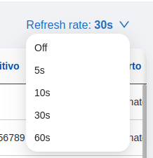

## bk-antd-theme-manager

Logical web component that can be included in applications layout to inject an [Ant Design](https://ant.design/) compatible theme.
This component is analogous to `mlc-antd-theme-manager` from [micro-lc](https://micro-lc.io/add-ons/components/mlc-antd-theme-manager).

## bk-auto-refresh

Allows refreshing some resources with the selected interval.
```html
<bk-auto-refresh></bk-auto-refresh>
```



It emits a [change-query](../events.md#change-query) event with an empty payload every interval so it needs [bk-crud-client](./clients.md#bk-crud-client) to properly work.

### Configuration

It is possible to customize the intervals and the default interval for refreshing the resources. Intervals are expressed in **seconds**.

Example:

```json
  ...
  {
    "type": "element",
    "tag": "bk-auto-refresh",
    "properties": {
      "intervals": [10, 30, 60, 120],
      "initialInterval": 10
    }
  }
  ...
```

### Properties & Attributes


| property | attribute | type | default | description |
|----------|-----------|------|---------|-------------|
|intervals| - |number[] \| undefined|[5, 10, 30, 60]|a list of intervals in seconds|
|initialInterval| - |number|0|initial interval value

### Listens to


| event | action | emits | on error |
|-------|--------|-------|----------|
|[loading-data](../events#loading-data)|sets internal loading state| - | - |

### Emits


| event | description |
|-------|-------------|
|[change-query](../events#change-query)|requires refresh without modifying current `CRUD` query by attaching an empty payload|

### Bootstrap

None


## bk-confirmation-modal

prompts the user for confirmation on certain actions
```html
<bk-confirmation-modal></bk-confirmation-modal>
```

#### Configure actions
It is possible to mount custom components as confirmation/cancel buttons in the modal.
For instance, the following example shows how to request for confirmation before the action of a button is performed.
#### Example
The following snippet of configuration shows an "Abort" button which performs a POST request to a given endpoint.
```json
{
  "tag": "bk-button",
  "properties": {
    "content": "Abort",
    "clickConfig": {
      "type": "http",
      "actionConfig": {
        "url": "lambdas/abort",
        "method": "POST",
        "config": {
          "headers": ...
        },
        "body": ...
      }
    }
  }
}
```
In order to require confirmation for this action, it is possible to:
- have the button spawn a Confirmation modal
- have the "confirm" button of this modal perform the POST request
as the following snippet shows:
```json
{
  "tag": "bk-button",
  "properties": {
    "content": "Abort",
    "clickConfig": {
      "type": "event",
      "actionConfig": {
        "label": "require-confirm",
        "payload": {
          "title": {
            "en": "Abort order?",
            "it": "Cancellare ordine?"
          },
          "content": {
            "en": "Are you sure you want to abort this order?",
            "it": "Sei sicuro di voler cancellare l'ordine?"
          },
          "configCancel": {
            "tag": "bk-button",
            "properties": {
              "content": "No",
              "type": "ghost"
            }
          },
          "configOk": {
            "tag": "bk-button",
            "properties": {
              "content": "Ok",
              "clickConfig": {
                "type": "http",
                "actionConfig": {
                  "url": "lambdas/abort",
                  "method": "POST",
                  "config": {
                    "headers": ...
                  },
                  "body": ...
                }
              }
            }
          }
        }
      }
    }
  }
}
```
The "Abort" button will now launch a `require-confirm` event. The Confirmation modal listens to it and becomes visible, using its payload to match its state as follows:
- 'title': the title of the modal
- 'content': the text content of the modal
- 'configCancel': a 'tag' / 'properties' pair for the cancel button
- 'configOk': a 'tag' / 'properties' pair for the confirmation button
In particlar, the 'configOk' field is used to build the confirmation button. In this case, we build a button that will perform the POST call that was performed directly by the button in the previous configuration.
Once one of the buttons is clicked, the confirmation modal automatically closes.
The cancel button does not perform any action: if clicked, the modal will simply close and the endpoint will not be called.

### Properties & Attributes

| property | attribute | type | default | description |
|----------|-----------|------|---------|-------------|
|`height`|`height`|string|'50px'|height of the modal |
|`width`|`width`|string|'520px'|width of the modal |


### Listens to

| event | action | emits | on error |
|-------|--------|-------|----------|
|[require-confirm](../events#require-confirm)|displays a `confirmationModal` with buttons for the user to confirm or cancel the triggering of certain actions| - | - |


### Emits

| event | description |
|-------|-------------|
|Configurable events|on confirm or on cancel, it can forward events that were specified in the payload as the callback for the relative button click|


### Bootstrap

None


## bk-drawer

Generic drawer container for custom content and custom footer
```html
<bk-drawer></bk-drawer>
```

### Properties & Attributes

| property | attribute | type | default | description |
|----------|-----------|------|---------|-------------|
|`content`| - |Taggable \| Taggable[]| - |configurable content of the drawer. Supports both object or array, as: {tag: string; properties?: Object; children?: string} |
|`dataCustomActions`| - |DataCustomAction[]| - |list of actions|
|`drawerId`|`drawer-id`|string| - |identifier associated to the drawer |
|`drawerTitle`| - |[LocalizedText](../core_concepts#localization-and-i18n)| - |title of the drawer |
|`footerCallToAction`| - |CallToAction| - |alternative way to specify the footer of the drawer. This property is to be set programmatically only |
|`footerComponent`| - |null \| Taggable \| Taggable[]| - |configurable footer of the drawer. Supports both object or array, as: {tag: string; properties?: Object; children?: string} |
|`loading`|`loading`|boolean|false|whether or not the drawer is loading |
|`mask`|`mask`|boolean|true|whether to mask or not the drawer|
|`requireConfirm`| - |boolean \| RequireConfirmOpts|false|whether or not the drawer requires confirmation to close with unsaved data |
|`rootElementSelector`|`root-element-selector`|string| - |root element to append the drawer to |
|`subTitle`| - |[LocalizedText](../core_concepts#localization-and-i18n)| - |sub-title of the drawer |
|`titleIcon`|`title-icon`|string| - |icon to place next to to the title |
|`width`| - |string \| number| - |width of the drawer |
|`zIndex`|`z-index`|number| - |zIndex of the drawer |


### Listens to

| event | action | emits | on error |
|-------|--------|-------|----------|
|[using-form-container](../events#using-form-container)|notifies a drawer is in use| - | - |


### Emits

This component emits no event.


### Bootstrap

None


## bk-layout

Displays a menu, analogous to the [micro-lc](https://github.com/micro-lc/micro-lc) (version 2.0.0+) menu, which allows to navigate amongst plugins.


```html
<bk-layout></bk-layout>
```

:::caution
`bk-layout` is not supported by [micro-lc](https://github.com/micro-lc/micro-lc) version <2.0.0. `micro-lc` version 2.0.0+ (or a custom rendering engine) should be used.
:::

`bk-layout` can be configured in a number of ways:

### Mode
Three modes are available:

```typescript
type Menu = 'fixedSideBar' | 'overlaySideBar' | 'topBar'
```

Controlling how the menu is rendered - either as a side-bar (overlay or fixed) or a top-bar.

### Logo

<!-- TODO: url supports {urlDarkImage: string, urlLightImage: string} type too, update once dark-mode is supported -->
```typescript
type Logo {
  /** Alternative text to display if the logo is not found  */
  altText?: string

  /** Link to navigate to when the logo is clicked */
  onClickHref?: string

  /** URL of the logo image */
  url?: string
}
```

### Help Menu

```typescript
type HelpMenu {
  /** Link to the help page */
  helpHref: string
}
```

### User Menu

```typescript
type UserMenu {
  /** Configuration needed to perform user logout */
  logout?: {
    /** Method used to perform the call to the URL specified in the 'url' property */
    method?: 'GET' | 'POST'

    /** URL to be redirected to after the logout */
    redirectUrl?: string

    /** URL called to log out the user. The method used is the one specified in the 'method' property */
    url?: string
  }

  /** URL called in GET to retrieve user data */
  userInfoUrl: string

  /** Mapping between the properties returned from the user info URL call and the ones expected by the component */
  userPropertiesMapping?: Record<string, 'name' | 'avatar' | string>
}
```

### Head

```typescript
type Head {
  /** Url of the fav icon */
  favIconUrl?: string

  /** Title of the tab */
  title?: string
}
```

### Custom locale

It is possible to override default labels.
<!-- TODO: `light` and `dark` are also available, update once dark-mode is supported -->
```typescript
type Locale = {
  collapse?: string
  logout?: string
}
```

### Menu Items

Items in the menu. These can be of two types, `href` or `application`. `href` menu items behave lie links, navigating to a configurable page upon click; while `application` pages navigate to a plugin.

Multiple menu items can be grouped into recursive structures, `categories` (collapsible) and `groups` (non-collapsible).

All types of menu item have internationalized labels [LocalizedText](../core_concepts#localization-and-i18n).

#### Href
```typescript
export interface HrefMenuItem {
  /** Link's destination */
  href: string

  /** Icon of the menu item */
  icon?: string

  /** Unique identifier of the href */
  id: string

  /** Label of the menu item */
  label?: LocalizedText

  /** Specifies where to open the linked document */
  target?: '_blank' | '_self' | '_parent' | '_top'

  /** Type of the item: hyperlink to another page */
  type: 'href'
}
```

### Application
```typescript
export interface ApplicationMenuItem {
  /** Icon to visualize */
  icon?: string

  /** Unique identifier of the corresponding micro-lc application  */
  id: string
  
  /** Label of the menu item */
  label?: LocalizedText
  
  /** Identifiers of micro-lc other applications that also correspond to the item */
  selectedAlsoOn?: string[]
  
  /** Type of the item: micro-lc application */
  type: 'application'
}
```

### Category
```typescript
export interface CategoryMenuItem {
  /** Menu items included in the category */
  children?: MenuItem[]

  /** Icon to visualize */
  icon?: string

  /** Unique identifier of the category */
  id: string

  /** Label of the menu item */
  label?: LocalizedText

  /** Type of the item: collapsible sub-menu */
  type: 'category'
}

```

### Group
```typescript
export interface GroupMenuItem {
  /** Menu items included in the group */
  children?: MenuItem[]

  /** Unique identifier of the group */
  id: string

  /** Label of the menu item */
  label?: LocalizedText

  /** Type of the item: non-collapsible group of items */
  type: 'group'
}
```

### Properties & Attributes
| property | attribute | type | default | description |
|----------|-----------|------|---------|-------------|
| mode | mode | Mode | overlaySideBar | controls how the menu is visualized |
| logo | - | Logo | - | logo to be visualized in the menu |
| menuItems | - | MenuItem[] | - | describes the items in the menu |
| helpMenu | - | HelpMenu  | - | controls the help button on the menu |
| userMenu | - | UserMenu  | - | controls the user information section of the menu |
| head | - | Head  | - | controls tab visualization options |
| locale | - | {[x: string]: string} | - | allows to override component labels |

### Listens to

This component listens to no event.


### Emits

This component emits no event.


### Bootstrap

None


## bk-layout-container

allows swapping layouts
```html
<bk-layout-container></bk-layout-container>
```
This component is meant to allow multiple configurations to live within the same plugin by:
1. re-using `back-kit` components without letting functionalities (mostly clients') to trump each other
2. render multiple layouts together like a page with table, then a card detail, then another table and so on
3. condensate plugins into a single one.
A simple instance would be a user which might want to explore multiple details connected with its user but
persisted on different entities.
Since a backend resource, like a database collection/table, is mostly mapped 1:1 on a `Backoffice` plugin using a single client, like the `bk-crud-client`, it is recommendable to use different plugins to render different collections.
For those cases falling outside the previous scope, for instance a customer which might want to check simultaneously both its purchases and its current shopping cart which, if the latter is persisted, are 
definitively stored on different places, a layout that can be switched might come in handy.
By reproducing an `element-composer`-compatible configuration, `bk-layout-container` provides a wrapper for different configurations wired to one or many `eventBus`.
Such configurations can be switched by using a single event on the default bus coming from the `element-composer`, or anyway injected in the `bk-layout-container` instance on the page.

### customer example
Let's then suppose we have a customer, a list of their previous purchases and a list of their 
current basket items.
We could use different plugins. For previous purchases it would look like:
```json
// previous-purchases.json
{
  "$ref": {
    "ppSchema": {
      "type": "object",
      "properties": {
        "_id": {"type": "string"},
        "items": {"type": "array"}
      }
    }
  },
  "content": {
    "type": "row",
    "content": [
      {
        "type": "element",
        "tag": "bk-table",
        "properties": {
          "dataSchema": {"$ref": "ppSchema"} 
        }
      },
      {
        "type": "element",
        "tag": "bk-crud-client",
        "properties": {
          "dataSchema": {"$ref": "ppSchema"} 
        }
      }
    ]
  }
}
```
while current basket would look like:
```json
// current-basket.json
{
  "$ref": {
    "cbSchema": {
      "type": "object",
      "properties": {
        "_id": {"type": "string"},
        "description": {"type": "string"},
        "price": {"type": "number"}
      }
    }
  },
  "content": {
    "type": "row",
    "content": [
      {
        "type": "element",
        "tag": "bk-table",
        "properties": {
          "dataSchema": {"$ref": "cbSchema"} 
        }
      },
      {
        "type": "element",
        "tag": "bk-crud-client",
        "properties": {
          "dataSchema": {"$ref": "cbSchema"} 
        }
      }
    ]
  }
}
```
If the UI should instead include two tables in a page that can be visually swapped by a set of buttons or tabs, 
by wrapping both configurations in the `bk-layout-container` does the job.
```json
// single-plugin.json
{
  "$ref": {
    "ppSchema": {
      "type": "object",
      "properties": {
        "_id": {"type": "string"},
        "items": {"type": "array"}
      }
    },
    "cbSchema": {
      "type": "object",
      "properties": {
        "_id": {"type": "string"},
        "description": {"type": "string"},
        "price": {"type": "number"}
      }
    }
  },
  "content": {
    "type": "element",
    "tag": "bk-layout-container",
    "properties": {
      "content": {
        "$default": {/* first plugin */},
        "currentBasket": {/* second plugin */}
      }
    }
  }
}
```
The `$default` key is not mandatory but is reserved and marks the layout to render on landing. The `bk-layout-container` has another property to avoid `$default` which is `currentLayout`. By setting `currentLayout` to `currentBasket`, the layout starts on the `currentBasket` config. 
Each layout has a dedicated `EventBus` instance which has the same name of the configuration key (
  in this case `$default` and `currentBasket`). `$default` is the `EventBus` currently injected in the 
  `bk-layout-container`.
To override this behavior there is the key `busDiscriminator` which defaults to `$inherit` and takes the
`EventBus` of its parent. Overriding means giving a new key to get a different bus, like `$default`. Any previously not existent key spawns a new `EventBus`.
To swap layout an event has been reserved with label: `layout/change` and payload
```typescript
type LayoutChangePayload = {
  layout: string
}
```
and layout must contain a valid `bk-layout-container` `content` prop key. A `bk-button` can be for instance used 
```json
{
  "type": "element",
  "tag": "bk-button",
  "properties": {
    "content": "View Orders",
    "clickConfig": {
      "type": "event",
      "actionConfig": {
        "label": "layout/change",
        "payload": {
          "layout": "orders"
        }
      }
    }
  }
}
```

### Disable shadow dom

Adding the attribute `disable-shadow-dom` allows to disable the shadow dom for this component, which can be useful when it has to embed children which bubble events up to the document root such as `bk-calendar`.

:::caution
`disable-shadow-dom` must be passed as attribute to `bk-layout-container`, and not as property. For instance:
```json
{
  "type": "element",
  "tag": "bk-layout-container",
  "attributes": {
    "disable-shadow-dom":""
  },
  "properties": {
    ...
  }
}
```
:::

### Properties & Attributes

| property | attribute | type | default | description |
|----------|-----------|------|---------|-------------|
|`content`| - | {[x: string]: LayoutNode} \| {[x: string]: LayoutNode} | - |layouts configuration |
|`disableShadowDom`| `disable-shadow-dom` \| boolean | false | disable the shadow dom as render root |
|`currentLayout`|`current-layout`|string| - |default layout to view on landing |


### Listens to

| event | action | emits | on error |
|-------|--------|-------|----------|
|[layout/change](../events#layout---change)|requires the connection of the layout which is referenced in the event payload| - | - |


### Emits

This component emits no event.


### Bootstrap

None


## bk-loading-animation

Web component to display a loading animation until one of its children has finished loading.
This component is analogous to `mlc-loading-animation` from [micro-lc](https://micro-lc.io/add-ons/components/mlc-loading-animation).

## bk-modal

Generic modal container for custom content and custom footer
```html
<bk-modal></bk-modal>
```

### Properties & Attributes

| property | attribute | type | default | description |
|----------|-----------|------|---------|-------------|
|`content`| - |Taggable \| Taggable[]| - |configurable content of the modal. Supports both object or array, as: {tag: string; properties?: Object; children?: string} |
|`footerCallToAction`| - |CallToAction| - |alternative way to specify the footer of the modal. This property is to be set programmatically only |
|`footerComponent`| - |null \| Taggable \| Taggable[] \| Object| - |configurable footer of the modal. Supports both object or array, as: {tag: string; properties?: Object; children?: string} |
|`height`|`height`|string| - |height of the modal |
|`loading`|`loading`|boolean|false|whether or not the modal is loading |
|`modalId`|`modal-id`|string| - |identifier associated to the modal |
|`modalTitle`| - |[LocalizedText](../core_concepts#localization-and-i18n)| - |title of the modal |
|`requireConfirm`| - |boolean \| RequireConfirmOpts|false|whether or not the modal requires confirmation to close with unsaved data |
|`rootElementSelector`|`root-element-selector`|string| - |root element to append the modal to |
|`subTitle`| - |[LocalizedText](../core_concepts#localization-and-i18n) \| Taggable \| Taggable[]| - |sub-title of the modal |
|`titleIcon`|`title-icon`|string| - |icon to place next to to the title |
|`width`|`width`|string| - |width of the modal |
|`zIndex`|`z-index`|number| - |zIndex of the modal |


### Listens to

| event | action | emits | on error |
|-------|--------|-------|----------|
|[open-modal](../events#open-modal)|opens the modal| - | - |
|[close-modal](../events#close-modal)|closes the modal| - | - |


### Emits

This component emits no event.


### Bootstrap

None


## bk-notification-center

allows to handle notifications. It works by dealing with a backend source with a simple REST API interface.


```html
<bk-notification-center></bk-notification-center>
```

### Notification object

The expected notification object is of type:

```typescript
type Notification = {
  _id: string
  creatorId: string
  createdAt: string
  title: string
  readState?: boolean
  content?: string
  onClickCallback?: CallbackHref
}
```
where
```typescript
type CallbackHref = {
  content: content: string | {url: string, data: any};
}
```

`onClickCallback` field in retrieved notifications allows to controls the navigation destination upon [clicking the notification](#click-strategies).

### Click strategies

Clicking on a notification within `bk-notification-center` may trigger a navigation event. Component property `clickStrategy` controls what navigation method should be executed, which will use as input arguments the value of the field [`onClickCallback`](#notification-object) of the clicked notification.

```typescript
enum ClickStrategies =
  'default' |
  'href' |
  'replace' |
  'push'
```

An on-click-strategy correspond to what happens when a notification is clicked. `default` and `href` create an invisible `anchor` and click it, `replace` triggers `window.location.replace`, `push` pushes onto `window.history` stack.

The value of `onClickCallback` field in a clicked notification is used as input arguments for the triggered navigation method. Consequently, for any value of `clickStrategy`, the type of `onClickCallback` can be a string.
Additionally, if `clickStrategy` is `push`, `onClickCallback` may also be an object with keys `url` and `data`, corresponding to the main arguments of the [`window.history.pushState`](https://developer.mozilla.org/en-US/docs/Web/API/History/pushState) method. The value of `data` will be injected into the state of the destination page through a key set by property `pushStateKey`.

:::info
When `clickConfig` is set to `push`, `bk-notification-center` may be used in conjunction with a component such as [bk-state-adapter](./adapters.md#bk-state-adapter), which consumes the page state to emit custom events.

For instance, given two plugins located at "/plugin-1" and "/plugin-2", with configurations:
  - /plugin-1
  ```json
  {
    ...
    {
      "tag": "bk-notification-center",
      "properties": {
        ...
        "clickConfig": "push",
        "pushStateKey": "notification-center-state"
      }
    }
    ...
  }
  ```
  - /plugin-2
  ```json
  {
    ...
    {
      "tag": "bk-state-adapter",
      "properties": {
        ...
        "configMap": {
          "notification-center-state": "add-filter"
        }
      }
    }
    ...
  }
  ```

clicking in plugin-1 on a notification like:
```json
{
  ...
  "onClickCallback": {
    "url": "/plugin-1",
    "data": {
      "property": "lastname",
      "operator": "equal",
      "value": "Smith"
    }
  }
}
```

triggers navigation to `/plugin-2`, and once there an event with label `add-filter` and payload
```json
{
  "property": "lastname",
  "operator": "equal",
  "value": "Smith"
}
```
is emitted by `bk-state-adapter`.
:::

Further control over the navigation behavior is provided by property `allowExternalHrefs`, controlling whether or not browsing to external external web pages and href is allwed when `clickStrategy` is `default`, `href` or `replace`.

### Partial translations

`PartialTranslations` enables the user to apply custom translations within the webcomponent, works by key. Keys are given by the type:

```typescript
type LanguageKeys =
  'title' |
  'loadingButton' |
  'dateFormat' |
  'errorMessage' |
  'noNotification' |
  'readAll' |
  'reload' |
  'backOnTop'
```

and to each key, one could attach either a string value (which will override any browser language settings) or a [localized string](../core_concepts.md#Localization-and-i18n) given by a key/value map such as

```javascript
{
  en: "English Translation",
  'en-AU': "English Translation",
  zh: "中文翻译",
  ...
}
```

#### Example

The following is a valid configuration, in the default title of `bk-notification-center` is overwritten. The other language keys will still have their default values:

```json
{
  "tag": "bk-notification-center",
  "properties": {
    ...
    "locales": {
      "title": {
        "en": "Notification center title",
        "it": "Titolo centro notifiche"
      }
    }
  }
}
```


### Resource fetching mode

```typescript
enum ClickStrategies =
  'polling' |
  'default' |
  'none'
```

Determines how the data is automatically fetched. If `polling`, the property `pollingFrequency` determines the fetching frequency (in milliseconds). If `default` or `none`, data is not fetched automatically.


### Backend communication

The notification center needs a backend service to retrieve and interact with notifications. It follows a description of the endpoints called by the component that should be exposed by the service.

Backend base endpoint can be configured using the `endpoint` property, defaults to `/api/v1/bk-notification-center`.

#### GET - `/own`

This endpoint should return the list of paged notifications that the currently logged-in user should visualize. The notifications
should be ordered by creation date descending.

##### Query Parameters

Query parameters `skip` and `limit` help querying the notification pagination. These can be configured using properties `limitQueryParam`, `skipQueryParam`, `limit`.

```json
{
  "type": "object",
  "properties": {
    "limit": {
      "description": "Limits the number of documents, max 200 elements, minimum 1",
      "type": "integer",
      "minimum": 1
    },
    "skip": {
      "description": "Skip the specified number of documents",
      "type": "integer",
      "minimum": 0
    }
  },
  "required": ["skip", "limit"]
}
```

##### Response

```json
{
  "type": "array",
  "items": {
    "type": "object",
    "properties": {
      "title": {
        "anyOf": [
          {"type": "string"},
          {"type": "object"}
        ]
      },
      "content": {
        "anyOf": [
          {"type": "string"},
          {"type": "object"}
        ]
      },
      "readState": {
        "type": "boolean"
      },
      "createdAt": {
        "type": "string"
      },
      "onClickCallback": {
        "kind": {
          "type": "string",
          "enum": [
            "href"
          ]
        },
        "content": {
          "type": "string"
        }
      }
    },
    "required": [
      "title",
      "createdAt"
    ]
  }
}
```

#### PATCH - `/read-state/:notificationId`

This endpoint should change the read state of a specific notification given its id.

##### Body

```json
{
  "type": "object",
  "properties": {
    "readState": {
      "type": "boolean"
    }
  }
}
```

#### PATCH - `/read-state/own`

This endpoint should change the read state of all the notifications that the currently logged-in user can retrieve.

```json
{
  "type": "object",
  "properties": {
    "readState": {
      "type": "boolean"
    }
  }
}
```

### Properties & Attributes

| property | attribute | type | default | description |
|----------|-----------|------|---------|-------------|
|`endpoint`|`endpoint`|string|`/api/v1/bk-notification-center`|API endpoint for HTTP calls|
|`headers`| - |{ [x: string]: string; }|{}|headers included in any HTTP request|
|`limit`|`limit`|number|10|controls pagination limit while fetching notifications|
|`locales`| - |[PartialTranslations](#partial-translations)|{}|key-value list to customize components default labels. Keys are paired to either a string, which overrides language support or to a key-value map that matches a language to a translation|
|`clickStrategy`|`click-strategy`|[ClickStrategies](#click-strategies)|'default'|enum taking values 'default', 'href', 'replace', 'push', which correspond to what happens when a notification is clicked|
|`limitQueryParam`|`limit-query-param`|string|'limit'|the query parameter which controls notification pagination page size while fetching data|
|`skipQueryParam`|`skip-query-param`|string|'skip'|the query parameter which controls notification pagination skip while fetching data|
|`pushStateKey`|`push-state-key`|string|'bk-notification-center'|the key used to scope the content callback context in window.history.state when clickStrategy is 'push'. Otherwise it is neglected|
|`allowExternalHrefs`|`allow-external-hrefs`|string|false|when true, notification links can browse to external web pages and href are not checked to ensure they are relative to self-website|
|`mode`|`mode`|[ResourceFetchingMode](#resource-fetching-mode)|'default'|strategy to implement for automatically fetching notifications|
|`pollingFrequency`|`pollingFrequency`|number|10000|frequency of notifications automatic fetching (in milliseconds), if mode is set to `polling`|

### Listens to

This component listens to no event.

### Emits

This component emits no event.

### Bootstrap

None

## bk-notifications

displays toast notifications about events happening on the EventBus according to the maps provided as props

```html
<bk-notifications></bk-notifications>
```

### NotificationsMap

```typescript
type NotificationsMap {
  [key: string]: {
    title?: LocalizedText
    content?: LocalizedText
    type?: "success" | "error"
  }
}
```

Properties `successEventMap` and `errorEventMap` map the `triggeredBy` field of [success](../events.md#success) and [error](../events.md#error) events to notification properties, while `customEventMap` allows to map notifications to the label of other events.

### Notification object

Each notification can be configured with the following properties:

| property | type | values | description |
|----------|------|--------|-------------|
| title   | [localizedText](../core_concepts.md#Localization-and-i18n) | any | localized text to be used as notification title |
| content | [localizedText](../core_concepts.md#Localization-and-i18n) | any | localized text to be used as notification content |
| type    | string | `success`, `error`, `info`, `warning` | enum of possible notification styling (i.e. icons, color...) |

#### Example

```json
{
  "successEventMap": {
    "create-data": {
      "title": {
        "en": "Data was created correctly!",
        "it": "Dato creato correttamente!"
      },
      "content": {
        "en": "The data has been created correctly",
        "it": "I dati sono stati creati correttamente"
      },
      "type": "success"
    },
    "update-data": {
      "title": {
        "en": "Data was updated correctly!",
        "it": "Dato aggiornato correttamente!"
      },
      "content": {
        "en": "The data has been updated correctly",
        "it": "I dati sono stati aggiornati correttamente"
      },
      "type": "success"
    },
    "delete-data": {
      "title": {
        "en": "Data was updated correctly!",
        "it": "Dato aggiornato correttamente!"
      },
      "content": {
        "en": "The data has been updated correctly",
        "it": "I dati sono stati aggiornati correttamente"
      },
      "type": "success"
    }
  }
}
```

### Triggering notifications from success and error events

Some components automatically emit `success` and `error` events to notify the result of a generic action, not needing to be configured to do so.
For instance, [bk-crud-client](./clients.md#bk-crud-client) reacts to events like [create-data](../events.md#create-data) and [update-data](../events.md#update-data) by performing REST calls against a configurable endpoint, then emitting a `success`/`error` event with the name of the triggering event as value of `meta.triggeredBy`.

#### Example

```json
{
  ...
  {
    "tag": "bk-notifications",
    "properties": {
      "successEventMap": {
        "create-data": {
          "title": "Data correctly created!",
          "content": "The data has been created correctly",
          "type": "success"
        }
      },
      "errorEventMap": {
        "create-data": {
          "title": "Data not created",
          "content": "An error occurred while creating data",
          "type": "error"
        }
      }
    }
  },
  {
    "tag": "bk-crud-client",
    "properties": {
      "dataSchema": ...,
      "basePath": "/some-endpoint"
    }
  }
}
```

With a configuration like the one in the example, when a `create-data` event is emitted:
  1) `bk-crud-client` performs a POST call
  2) assuming the call to be successful, `bk-crud-client` emits a `success` event with `meta`:
  ```json
  {
    ...
    "triggeredBy": "create-data"
  }
  ```
  3) `bk-notifications` emits a notification with properties:
  ```json
  {
    "title": "Data correctly created!",
    "content": "The data has been created correctly",
    "type": "success"
  }
  ```

### Triggering notifications from other events

`bk-notifications` can be configured to listen to specific events and display notifications when they are received, through the property `customEventMap`.

#### Example

The following configurations displays a notification everytime an event with label `add-filter` is emitted.

```json
{
  "tag": "bk-notifications",
  "properties": {
    "customEventMap": {
      "add-filter": {
        "title": "Filter applied!",
        "content": "The filter has been created applied",
        "type": "success"
      }
    }
  }
}
```

### Triggering notifications from Actions

Components that allow to configure [Actions](../actions.md), such as [`bk-button`](./buttons.md#bk-button) or [`bk-gallery`](./data_visualization.md#bk-gallery), may integrate with `bk-notifications`.

Some actions trigger a [success](../events.md#success) or [error](../events.md#error) event based on their result (for instance, actions of type [http](../actions.md#rest-calls)). In such cases, it is possible in the action configuration to specify the `triggeredBy` key that is injected into the meta field of such events, which is then matched by `bk-notifications` with its properties `successEventMap` and `errorEventMap`.
On the other hand, actions that emit events can be mapped to notifications leveraging property [customEventMap](#triggering-notifications-from-other-events).

#### Example

In the following configuration, `bk-button` component is configured to perform an HTTP call, and `bk-notifications` to emit a notification that alerts on whether or not the call was successful.

```json
{
  ...
  {
    "tag": "bk-notifications",
    "properties": {
      "successEventMap": {
        "data-fetch": {
          "title": "Data correctly fetched!",
          "content": "The data has been fetch correctly",
          "type": "success"
        }
      },
      "errorEventMap": {
        "data-fetch": {
          "title": "Data not fetched",
          "content": "An error occurred while fetching data",
          "type": "error"
        }
      }
    }
  },
  {
    "tag": "bk-button",
    "properties": {
      ...
      "action": {
        "type": "http",
        "config": {
          "url": "/some-endpoint",
          "method": "GET",
          "triggeredBy": "data-fetch"
        }
      }
    }
  }
}
```


### Properties & Attributes

| property | attribute | type | default | description |
|----------|-----------|------|---------|-------------|
|`customEventMap`| - |NotificationsMap|{}|map containing the labels of any event that should be notified and the related `notificationProps` |
|`duration`|`duration`|number| - |lingering time for the notification in seconds |
|`errorEventMap`| - |NotificationsMap|{}|map containing the labels of any event that triggered a `error` that should be notified with the related `notificationproperties` |
|`location`| - |"topRight" \| "topLeft" \| "bottomRight" \| "bottomLeft"|"topRight"|corner location where the notification should be displayed |
|`rootElementSelectors`|`root-element-selectors`|string| - |selector to specify where the notification should be appended |
|`successEventMap`| - |NotificationsMap|{}|map containing the labels of any event that triggered a `success` that should be notified with the related `notificationproperties` |


### Listens to

| event | action | emits | on error |
|-------|--------|-------|----------|
|[success](../events#success)|displays a notification if the `triggeredBy` field contained in the `meta` of the event has been mapped in the `successEventMap` property| - | - |
|[error](../events#error)|displays a notification if the `triggeredBy` field contained in the `meta` of the event has been mapped in the `errorEventMap` property| - | - |
|Configurable custom events|displays a notification on any event mapped in the `customEventMap` property| - | - |


### Emits

This component emits no event.


### Bootstrap

None
