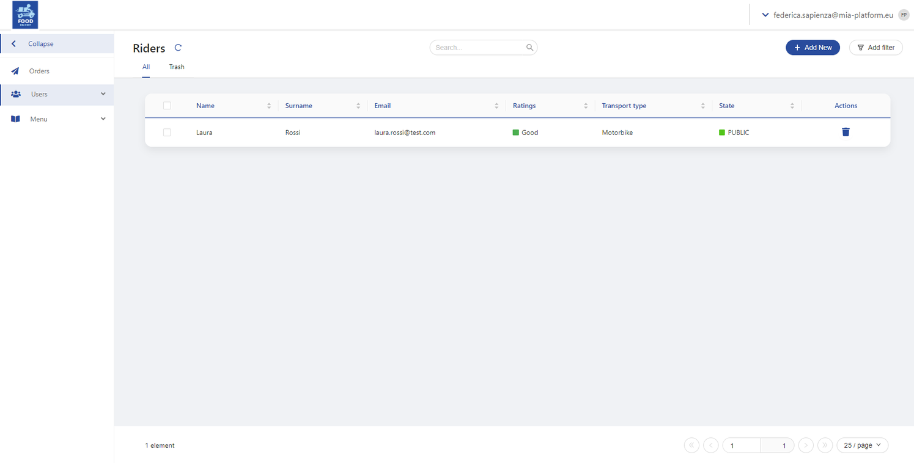
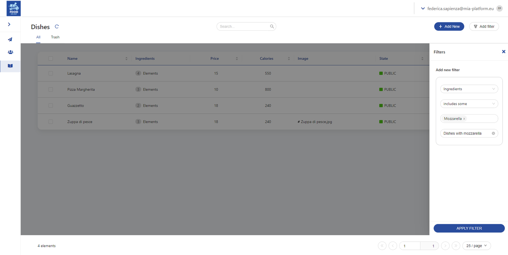
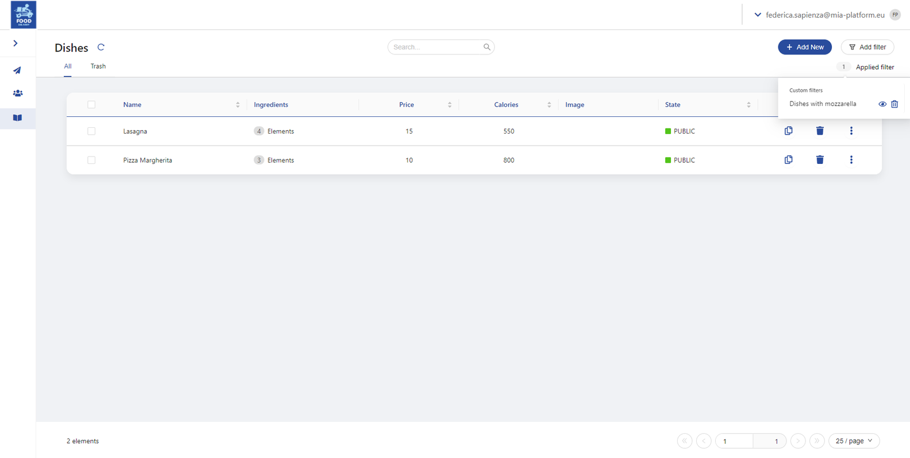
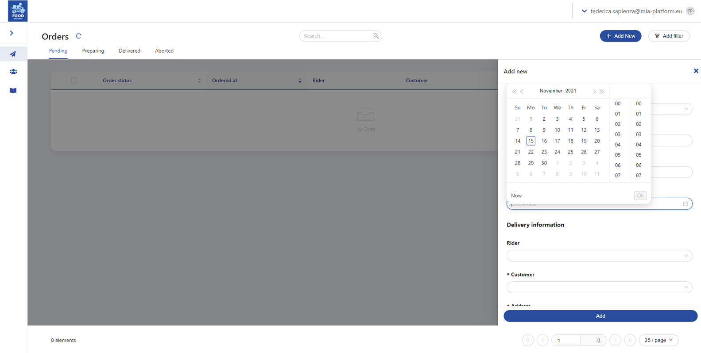
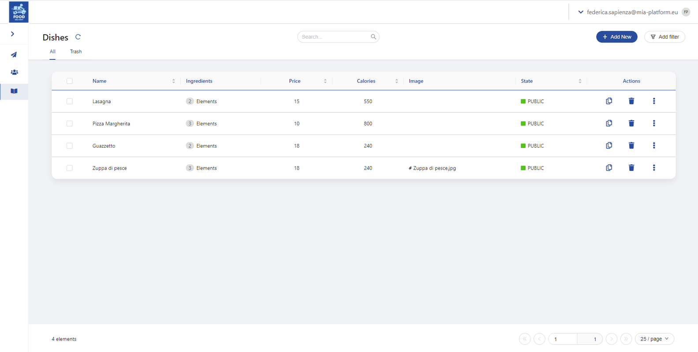
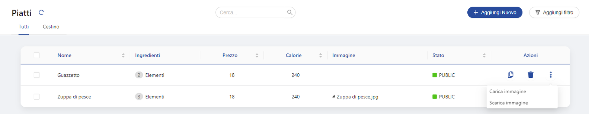
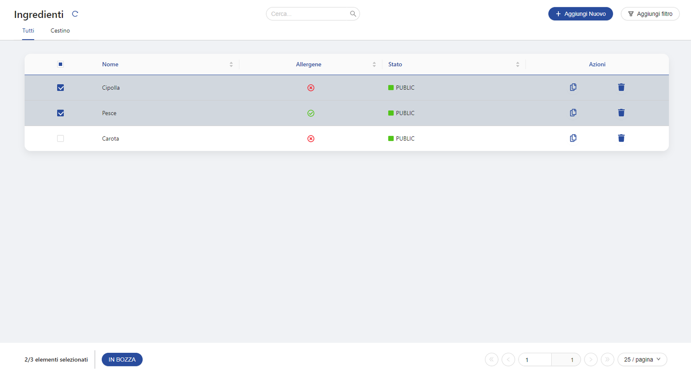

Mia-Platform Back Office combines the benefits of a Headless CMS with a flexible micro-frontend architecture. It is easier
to maintain, test and scale.

## Collections

In the side menu there is a list of collections organized into categories.

A collection is a set of data shared by some properties. A category is a set of collections and is only useful for the 
visual ordering of the back office.

To make the use of the back office more immediate, consider the following example: a back office for managing the contents
of a food delivery app.

The following diagram exemplifies the back office skeleton, composed of categories, collections and properties, applying
it to a hypothetical food delivery.

- _Category: Menu_
  - _Collection: dishes_
    - _property: name_
    - _property: ingredients_
    - _property: price_
    - _property: kcal_
    - _property: image_
  - _Collection: ingredients_
    - _property: name_
    - _property: allergene_
    - _property: state_

When logged in to the back office, the sidebar shows the list of manageable collections. The sidebar is collapsable. 

### Display the elements - pages and tables

The properties of a collection are shown in a table. They can be customized, so the user can choose which ones are visible
even without opening the drawer and which ones are hidden.

In addition, the order of the columns in the table can be customized.

Data in the table are shown by default in chronological order. However, it is possible to visualize data in alphabetical
order for each column, by clicking on the header of the desired column.

#### Personalized tabs

The elements in the table can be visualized in different tabs, visible at the top of the page.

It is possible to have the division in All, Published, Draft, Trash.

Also, these tabs can be **personalized** with filters depending on from elements' metadata, for example with tabs that divide 
between orders that are pending, being prepared, delivered or aborted.

#### Pagination of the elements

The total number of pages and the number of elements shown in the page are visible in the bottom right of the page.

It is possible choose the number of elements that must be displayed in one single page.

It is possible to advance of one page by clicking on the button with the single arrow, or to advance to the final page
by clicking on the button with the double arrow.

You can also go directly to the page you want by inserting its number.

#### Search an element

The search bar in the top of the page allows to search a specific elements in the collection.

#### Apply filters

By clicking on button "Add filter" at the top right, you can do an advanced search filtering all the elements according
to the desired properties. These filters are fully customizable, and it is possible to filter for every property of the
collection or choosing, by configuration, which ones can be filtered for.

The results of the research will appear in the table.

You can also add additional search filters that will be added to the one just made. The filters applied are visible at
the top right of the page, and they can be easily hidden or deleted permanently.

### New elements

To add a new element one must click on the “Add new” button on top right.

A lateral drawer will open, showing the fields that must be filled (properties).

- It is possible to set some of them as **required**, and they are highlighted by an asterisk. These are the mandatory fields which,
if not populated, prevent the element from being saved.
- The drawer supports tooltips: passing the mouse on the `i` icon reads the tooltip, that is the description of that field 
or the instructions on how to populate it.

It is possible to choose whether the new element must be in draft or must be published. Its state can be shown in the table
with a colored badge.

### The detail of an element and the possible actions 

All the properties of a collection can be viewed in the lateral drawer that appears on the right when the element is selected.

These properties can be edited or read-only.

The lateral drawer is opened at the click on the element, and it shows the details of the element. It can be divided in
sections and has customizable titles and subtitles. The button in the drawer is customizable too.

It supports the following fields

- Select and multiselect

- Text field

- Text area (WYSIWYG) 

- Date/time picker

- Links to other collections or external links

- File upload - also with drag and drop

The fields in the drawer can be editable or read-only. For example, orders cannot be edited.

If the user edit an element and then tries to close the drawer without saving the changes, a confirmation modal will 
appear to alert the user that his changes will be lost.

#### Delete an element

To delete an element, click on **the trash icon** in the table. In this way the line will not be permanently deleted: it
can be found in the tab `Trash`.

Any content deleted from the trash folder will no longer be recoverable. For this reason, this action can be protected 
with a confirmation message.

#### Duplicate an element

To duplicate an element, click on **the duplicate icon** in the table, under the column "actions". In this way, two 
identical elements will be shown in the table.

By configuration, a field can be unique. In that case, the element is copied but the drawer opens to let you insert 
that unique field - that thus can't be duplicated.

#### Custom actions

It is possible to show custom call-to-actions on rows, in addition to delete and the duplicate one.

For example, it is possible to upload or download a file for each element directly by the related row in the table, by
adding a custom button.

#### Massive selection of contents

It is possible to make bulk actions on data by selecting more than one element.

#### Protect some actions

By configuration, it is possible to choose which actions must be protected by a confirmation message (such as to delete).

### Lookups

Lookups are used to fill in the fields of a property by crossing information from the properties of other collections. 
They can be used to create drop-down menus that can be very useful to avoid errors in the compilation of the fields.

Here are the various use cases:

- _Pre-set menu_: the elements in the menu are defined at the beginning, and they are not editable.
- _Editable drop-down menu_: the elements in the menu are taken from other collections of the back office, thus they can 
be edited and added over time.

## Permissions by group of users

It is possible to add an ACL (access-control list) on the configuration of the single elements of the page and on the 
columns of the table. It means that, by configuration, it is possible to define rules of ACL on groups of users.

For example, even if all the users can access a collection, only a group of users will visualize the `Add new` button.

