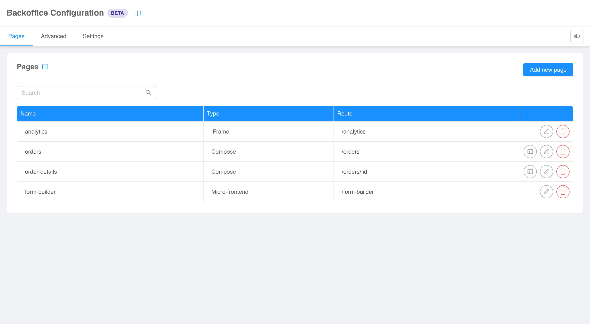
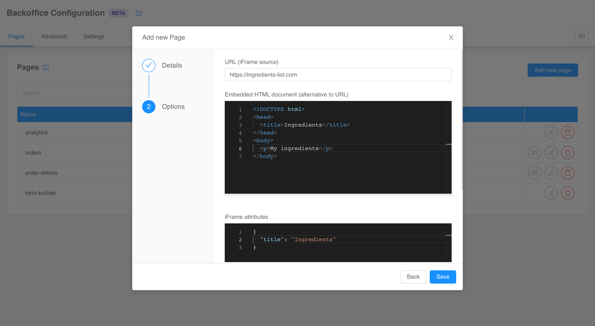

:::caution
This is a **BETA** feature and, as such, is currently under **active development**. Pay attention using this section.
:::

The first section of the configurator targets the general structure of Backoffice, namely its pages, layout, and global
settings.

## Pages

The first tab is _Pages_, it allows you to view, create, modify, and delete the pages
(i.e., [micro-lc applications](https://micro-lc.io/docs/guides/applications/)) composing your Backoffice.

### Create new page

Clicking on the _Add new page_ button will open the page creation wizard, which will lead you to the page setup, which is divided into 3 steps: [page type](#page-type), [page details](#page-details) and [page options](#page-options).

#### Page type

On the first step of the wizard you will be asked to choose the type of the new page.

Possible choices are:

- [compose](https://micro-lc.io/docs/guides/applications/compose): a dynamically composed page constructed with HTML5
  elements or web components following a provided configuration;
- [micro-frontend](https://micro-lc.io/docs/guides/applications/parcels): a framework-agnostic component directly managed
  by the orchestrator, which needs to be supplied with the assets entry point;
- [iFrame](https://micro-lc.io/docs/guides/applications/iframes): an HTML page embedded in an iframe tag with full
  strict encapsulation.

#### Page details

The second step allows you to specify some details regarding the page.

The requested fields are:

- _id_: the unique identifier of the page;
- _page rendering route_: the path on which the page will be rendered;
- _acl expression_: an optional [logical expression](https://micro-lc.io/add-ons/backend/middleware#acl-application)
  evaluated against user's groups and permissions to determine whether they can view the page.

#### Page options

The third and last step is a [type](#page-type)-specific form page options.

For **compose pages**, available fields are:

- _input mode_: whether the page configuration is saved inline (_inline_ option) or in a separate file (_external_
  option);
- _configuration source_ (only if input mode is _external_): name of the file containing the page configuration;
- _template_: a configuration template carrying a pre-defined, pre-arranged set of components.

For **micro-frontend pages**, available fields are:

- _entry_: a JSON object carrying information regarding the
  [entry points](https://micro-lc.io/docs/guides/applications/parcels#usage) of the micro-frontend;
- _properties_: a JSON object of [properties](https://micro-lc.io/docs/guides/applications/parcels#properties) to inject
  in the micro-frontend;
- _inject base_: a flag stating whether a `<base>` tag has to be
  [injected](https://micro-lc.io/docs/guides/applications/parcels#injectbase) in the micro-frontend.

:::tip
The editors will help you writing configurations hinting the correct properties JSON schemas.
:::

For **iFrame pages**, available fields are:

- _source_: the URL of the page to embed;
- _source document_: an inline HTML document to embed (overriding _source_);
- _attributes_: `<iframe>` HTML tag valid
  [attributes](https://developer.mozilla.org/en-US/docs/Web/HTML/Element/iframe#attributes) written in a JSON object fashion.

:::tip
The editors will help you writing configurations hinting the correct properties JSON schemas.
:::

### Edit page

The buttons placed in the last column of the page table allows you to interact with existing pages.

From left to right, available actions are:

- _edit page_ (only for compose pages): to open the section for
  [compose pages configuration](/business_suite/backoffice_configuration/compose-pages.md);
- _edit details_: to re-open the [page creation wizard](#create-new-page) in edit mode;
- _delete_: to delete the page.

## Advanced configuration

The _Advanced configuration_ tab is built to give the highest degree of configurability, providing access to the final
JSON configuration. In this visualization the page is divided in two section, a **code editor** on the left and a
**live preview** on the right.

The editor on the left is where the configuration can be viewed and edited. It supports both **JSON** and **YAML** with the
possibility to switch (and convert the content) using the selector in the bottom left corner.

:::tip
The editor will help you writing the configuration hinting the correct JSON schema and validating the content live.
:::

The updates made with the editor are not immediately reflected in the preview on the right: only after the **"Apply"
button** is clicked the modification are saved and the preview is refreshed and aligned with the configuration.

:::warning
Any modification made with the editor **will not be saved** unless the _"Apply"_ button is clicked.
:::

The preview has two modes, one where you can **interact with the page** as you would with the final Backoffice, and one where
an overlay is placed on top of the page allowing you to **select components** in page without triggering their normal
click behavior. You can switch between this two modes with the selector in the bottom left corner of the preview (or
with key keyboard shortcut `CTRL + Space`).

Since the preview is a real, functioning Backoffice, components may fire calls to backend or Web APIs (e.g., navigation
events or local storage accesses). To avoid disrupting the configuration flow, these events are caught and mocked. You
will receive **notifications** regarding them – alongside with any **error** that may occur in page – in the notification
center in the bottom right corner of the page.

## Settings

The _Settings_ tab collects several Backoffice global settings. The default configurations in most cases should be sufficient,
so it will probably not be necessary to use this section.

### URIs

The URIs section allow you to configure the default
[landing URL](https://micro-lc.io/api/micro-lc-web-component#defaulturl), and the URI of a
[custom composer](https://micro-lc.io/api/micro-lc-web-component#composeruri).

### Custom error pages

In this section you can configure personalized [error pages](https://micro-lc.io/docs/guides/applications/error-pages)
for 4xx and 5xx errors.

For each page you need to provide the status code and the
[configuration](https://micro-lc.io/docs/guides/applications/error-pages#custom-error-pages).

:::tip
The editors will help you writing configurations hinting the correct properties JSON schemas.
:::

### Mount point

This section is dedicated to the personalization of micro-lc [mount point](https://micro-lc.io/docs/guides/layout#mount-point),
both in terms of [selector](https://micro-lc.io/api/micro-lc-web-component#mountpointselector) and of
[configuration](https://micro-lc.io/api/micro-lc-web-component#mountpointselector).

:::tip
The editors will help you writing configurations hinting the correct properties JSON schemas.
:::

### Import map

Here you can specify a global [import map](https://micro-lc.io/api/micro-lc-web-component#importmap).

:::tip
The editors will help you writing configurations hinting the correct properties JSON schemas.
:::

### Shared properties

In this final section you can define global [shared properties](https://micro-lc.io/api/micro-lc-web-component#shared)
for Backoffice page.

:::tip
The editors will help you writing configurations hinting the correct properties JSON schemas.
:::

