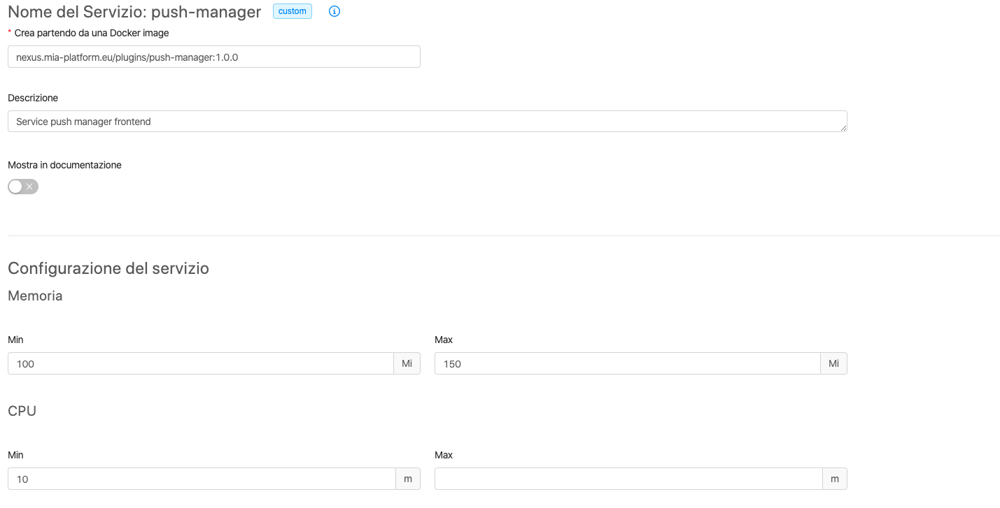
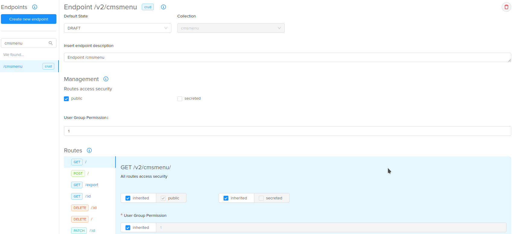
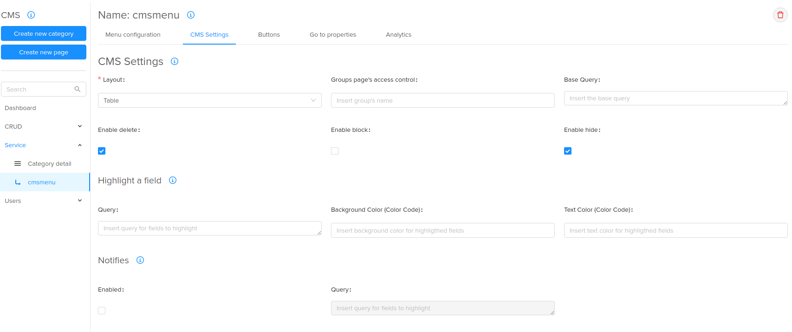

# Integrate custom frontends into the CMS
The CMS provides a way to dynamically integrate external custom frontends into a dedicated side menu' voice.

To integrate this functionality there are steps to follow, all through the API Console.

## Integration requirements
Following the requirements to integrate this  functionality:

 * access to the API Console into the desired project;
 * a custom frontend;
 * access to the mongodb server with the collections of the selected project;
 * basic knowledge about the API Console [backoffice proxy name](/development_suite/api-gateway-config-map/#how-to-proxy-a-request-through-a-service) and [backoffice proxy url](/development_suite/api-gateway-config-map/#how-to-forward-a-request-to-another-url) customizations.

## Integration steps
Following the steps to integrate this functionality into the desired CMS.

> All the steps to do are on the API Console

#### 1. CRUD - __cmsmenu__ creation
The CMS needs a specific collection to find the dynamic menu voices, called __cmsmenu__.
If not already created, the user has to create it to integrate the functionality in exam, or:

 1. Click on CRUD
 2. Click on __Create new CRUD__
 3. Create the CRUD with the following data:
    * **name**: cmsmenu
    * **description**: insert a custom description
    * **rows**:<br> 

#### 2. Service - create the custom service for your frontends
We also need to add the custom service of the frontends that we want to integrate into the CMS; to do this:

 1. Click on Services
 2. Click on __Create new service__
 3. Create the service with the following data:
    * **type**: __Existing Git service__ or __External service__
    * **description**: insert a custom description
    * **other field**: based on the type selection, insert the Git URL or the Existing service URL, the name and so on
    * the result will be something like this <br> 

#### 3. Endpoints - create the endpoints
Now we have the CRUD and the service up and ready to be used, but we need the endpoints to call, so we will implement it with the following steps:

 * **cmsmenu endpoint**:
    1. Click on endpoints
    2. Click on __Create new endpoint__
    3. Create the endpoint with the following data:
        * **base path**: cmsmenu
        * **type**: CRUD
        * **description**: insert a custom description
        * the result will be something like this <br> 

 * **custom service endpoint**:
    1. Click on endpoints
    2. Click on __Create new endpoint__
    3. Create the endpoint with the following data:
        * **base path**: /custom-service-path
        * **type**: Custom Microservices
        * **description**: insert a custom description
        * the result will be something like this <br> 


#### 4. CMS and Analytics - CMS configurations
This step is the creation of the CMS side menu' voice creation that will contain our custom services based on the data of the __cmsmenu__ collection.

Following the steps:

 1. Click on CMS and Analytics
 2. In the submenu, click on CMS
 3. Click on __Create new page__
 4. Create the page with the following data:
    * **name**: Service
    * **endpoint**: /cmsmenu
    * **category**: CRUD
    * **icon**: insert the name of a [Fontawesom Icon](https://fontawesome.com/), **without** the __fa__ prefix (e.g. __bell__ for the notification bell)
 5. Click on the __Next__ button
 6. Select the __table__ Layout
 7. Finish, the result will be like this 

#### 5. Collection __cmsmenu__ - insert data
All is configured, but the CMS will not found anything into the cmsmenu collection until we don't put the menu voices that we want.

To do this we have to put a custom JSON into the cmsmenu collection.

This is the JSON to put into the collection (example of the __Push Manager__ service):

```json
{
	"name": "Push Manager",
	"_order": 1,
	"icon": "bell",
	"link": "/v2/push-manager-fe/", /*link to the frontend base page*/
	"iframe": true                  /*set it to false to open the page in another tab*/
}
```

#### 6. Backoffice proxy - Customize the proxy configurations
The extensions to customize are:
 * __maps-proxyBackofficeName.before.map__ to map an endpoint to a service name ([read the dedicated guide](/development_suite/api-gateway-config-map/#how-to-proxy-a-request-through-a-service))
 * __maps-proxyBackofficeUrl.before.map__ to proxy an endpoint to another url ([read the dedicated guide](/development_suite/api-gateway-config-map/#how-to-forward-a-request-to-another-url))

To customize these files:
 1. Click on Advanced
 2. Click on api-gateway
 3. Search __maps-proxyBackoffice__
 4. Customize the configurations
 5. Save and commit<br> 

## Test the CMS
Now finally we can test the endpoint on the CMS<br> 