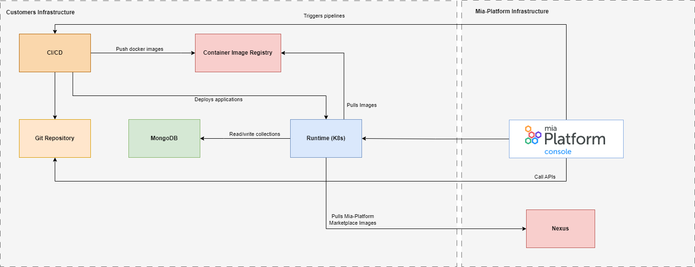

Bring Your Own Infrastructure (BYOI) allows customers to use their own runtime, CI/CD tools and Git Provider and to connect them into Mia-Platform managed Console. This approach let customers retain control over their infrastructure while benefiting from the services and capabilities offered by Mia-Platform. BYOI has gained popularity as a flexible and cost-efficient solution, enabling seamless integration with a wide range of services and applications.

The above schema, shows the typical infrastructure architecture and the main elements that are involved in the Mia-Platform BYOI configuration.

- **Mia-Platform Console**: Mia-Platform Console is completely managed by Mia-Platform. It is [connected to the Runtime](/development_suite/clusters-management/connect-and-manage-cluster.mdx#step-1-runtime-service) in order to retrieve information about the runtime status.
Mia-Platform is [integrated with CI/CD tool](/development_suite/set-up-infrastructure/configure-provider.mdx) to streamline the software development process, automate the build and deployment procedures.
Every change in the microservices architecture undergoes versioning and is subsequently released to the customer [Git Repository](/console/project-configuration/manage-runtime-environments/configure-a-new-environment.mdx#setup-git-provider).

- **Mia-Platform Nexus**: Mia-Platform Nexus is a docker registry services where all the Mia-Platform marketplace services images are stored. It is a necessary dependency in order to utilize the images supported by Mia-Platform and published on the Mia-Platform Marketplace.
  
- **CI/CD**: The customers can use any [supported tool](/development_suite/set-up-infrastructure/configure-provider.mdx#edit-cicd-tool) by Mia-Platform Console.
  
- **Container image registry**: You can [configure](/development_suite/company/configuration.mdx#example-configuration-3) any container registry.
  
- **Runtime**: A k8s [runtime](/development_suite/clusters-management/overview.md).
  
- **MongoDB**: It is a necessary dependency for [Fast Data](/fast_data/what_is_fast_data.md) and [CRUD service](/development_suite/api-console/api-design/crud_advanced.md#what-is-a-crud).
  
- **Git Repository**: One of the Git repository provided by  GitLab, GitHub, Bitbucket, Azure Repos. [Click here](/console/project-configuration/manage-runtime-environments/configure-a-new-environment.mdx#setup-git-provider) to see how to configure it.

## Mia-Platform BYOI key features

- **Flexibility and Customization**: Mia-Platform BYOI is the choice to suit specific business needs and requirements. Users have greater control over their resources, allowing them to tailor configurations according to their preferences.

- **Standardization**: Mia-Platform BYOI enables customers to establish standardized approaches and practices across their infrastructure, ensuring a coherent and harmonized operational environment. This alignment fosters enhanced efficiency, promotes uniformity, and diminishes the potential for discrepancies or inefficiencies that may arise from disparate infrastructure setups.

- **Updated Mia-Platform Console and tools**: Mia-Platform BYOI gives the customer the possibility to have [Mia-Platform Console](/development_suite/overview-dev-suite.md) always up to date and leveraging the new features provided by Mia-Platform R&D team.

- **24/7 Incident Support**: Mia-Platform BYOI provide 24/7 incident support on Mia-Platform Console.

## Mia-Platform BYOI prerequisites

There are few prerequisites to accomplish in order to connect Mia-Platform console to your infrastructure:

- K8s, Git Providers and CI/CD tools must be reachable directly from Mia-Platform Console (Console’s NAT is `34.76.112.223/32`)
- If the customer has pre-existent network policies, these must not impact namespaces managed by Mia-Platform Console.
