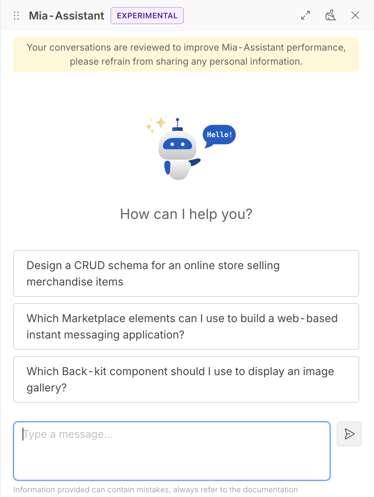

The **Mia Assistant** is a powerful tool that can help you with various tasks related to your projects. It can assist you in generating code, debugging, and providing suggestions based on your input.

It can also help you with documentation, searching for information, and answering questions related to your projects.

## Commands

:::info
Commands can be enabled by Company settings, see [Company Settings](console/company-configuration/settings.md) for more information.
:::

The supported commands are the following. If no command is specified, the assistant will search in the documentation to provide you with the best answer.

### Debug

This command allows you to help debugging your runtime. It fetches the runtime logs and provides you a response to the query you provided.
It is possible to filter by service name and request id to get more specific information.

#### Examples

Some examples in the usage of the command are:

- Are there any errors in api-gateway service?
- Trace the request with id 1234567890 in the api-gateway and crud-service services
