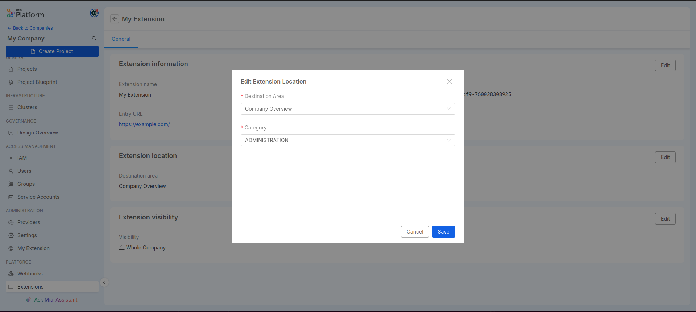

Extensions allow expanding Console capabilities by adding custom pages to the sidebar navigation. This allows you to provide users with new pages tailored to your Company's needs or integrate external tools with a seamless experience within the product.

## Extension Manager

Extensions can be managed through a dedicated section called **Extensibility** placed in the Company Overview page.

:::info
Only **Company Owners** have the necessary permissions to see and use this section.
Moreover, extensions are **only accessible within the Company** they are registered into.
:::

There are different extension types supported:

- iframe: allows you to embed web pages in Console using an `<iframe>` tag
- External link: these extensions will be shown as menu items in the sidebar but opened in a new window on click

:::tip
Embedding a web app as an *iframe* extension may require additional configurations,
such as making sure `x-frame-options` header or the `frame-ancestors` Content Security Policy are properly configured
:::

## Add new Extension

You can add a new extension to your Company at any moment; creating an extension requires the following configurations to be set:

- **Extension name** (*required*): the name for your extension
- **Entry URL** (*required*): the URL of the web page that will be displayed when accessing your extension (This will be embedded inside an iframe or opened in a new window depending on the extension type)
- **Destination Area** (*required*): the destination where your extension menu item will be placed
- **Category** (*required*): the menu category that will contain the extension menu item
- **Visibility**: You might want to make your extension visible on the whole Company, or maybe just on a few Projects. This field lets you set the contexts in which you want to make your extension visible. If nothing is checked, the extension will be inactive.

:::info
The **Category** options are based on the selected destination area.

The **Visibility** can be applied only on the *Whole Company* context when the *Company Overview* destination area is selected.
:::

After creating the extension as shown in the example above, you can refresh the page and verify that the extension has been added to the sidebar and is accessible.

## Extensions Table

If there is at least one extension, you can view a table with all the existing extensions for the Company.

On this page, you can:

- [Add new extensions](#add-new-extension)
- [Access the detail page](#extension-detail) of an extension by clicking on its name
- Delete an extension

## Extension Detail

The extension detail page allows you to view the main information that characterizes the registered extension, which can also be modified through the corresponding *Edit* buttons.

### Extension Info

The *Extension Info* card contains the identifying information for the extension, where only the name and entry URL can be edited.

### Extension Location

The *Extension Location* card contains the information related to the positioning of the extension menu item within the Console; these details are fully editable.

### Extension Visibility

The *Extension Visibility* card shows in which contexts the extension is active and visible.

:::info
Just as during creation, Visibility is tied to the Destination Area set for the extension.
For example, if the Destination Area is set to *Company Overview*, then visibility can only be applied to the *Whole Company* option.
:::
