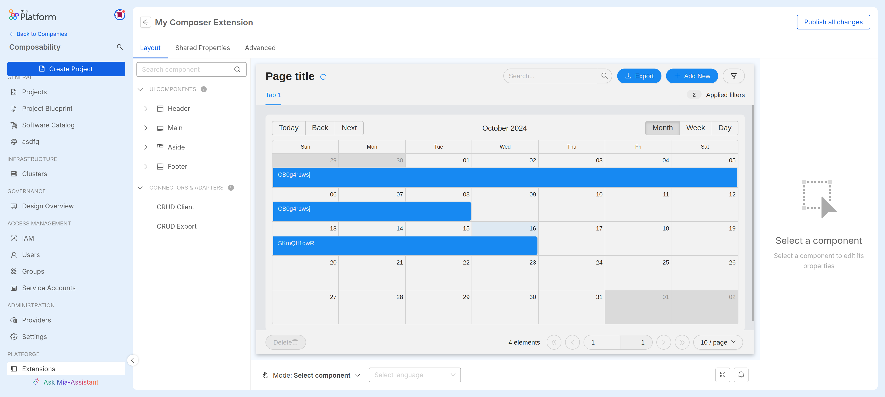

Extensions allow expanding Console capabilities by adding custom pages to the sidebar navigation.
This allows you to provide users with new pages tailored to your Company's needs or integrate external tools with a seamless experience within the product.

## Extension Manager

Extensions can be managed through a dedicated section called **Extensibility** placed in the Company Overview page.

:::info
Only **Company Owners** have the necessary permissions to see and use this section.
Moreover, extensions are **only accessible within the Company** they are registered into.
:::

There are different extension types supported:

- _iframe_: allows you to embed web pages in Console using an `<iframe>` tag
- _External link_: these extensions will be shown as menu items in the sidebar but opened in a new window on click
- _Create with Composer_: allows you to compose a web page by means of a [`micro-lc`](https://micro-lc.io/) configuration

:::tip
Embedding a web app as an _iframe_ extension may require additional configurations,
such as making sure `x-frame-options` header or the `frame-ancestors` Content Security Policy are properly configured
:::

## Add new Extension

You can add a new extension to your Company at any moment; creating an extension requires the following configurations to be set:

- **Extension name** (_required_): the name for your extension
- **Destination Area** (_required_): the area in Console where your extension menu item will be placed
- **Category** (_required_): the menu category that will contain the extension menu item

:::info
The available **Category** options depend on the selected **Destination Area**.
:::

- **Entry URL** (_required for iframe and External link extensions only_): the URL of the web page that will be displayed when accessing your extension (This will be embedded inside an iframe or opened in a new window depending on the extension type)
- **Template** (_required for Composer extensions only_): A `micro-lc` configuration you might want to initialize your extension with.
- **Visibility**: You might want to make your extension visible on the whole Company, or maybe just on a few Projects. This field lets you set the contexts in which you want to make your extension visible. If nothing is checked, the extension will be inactive.

:::info
When the _Company Overview_ destination area is selected, the only available **Visibility** option will be the _Whole Company_.
:::

After clicking on _Add extension_, the extension will be automatically created and activated and it can be accessible right away: 
if it has been configured to be visible on the Company page, it will be automatically shown in the sidebar. A click on the link will open the extension page.

## Extensions Table

If there is at least one extension, you can view a table with all the existing extensions for the Company.

On this page, you can:

- [Add new extensions](#add-new-extension)
- [Access the detail page](#extension-detail) of an extension by clicking on its name
- Delete an extension

## Extension Detail

The extension detail page allows you to view the main information that characterizes the registered extension, which can also be modified through the corresponding _Edit_ buttons.

It includes several cards to provide information about the extension, such as:

- **Extension Info**: contains the identifying information for the extension, such as name and entry URL
- **Extension Location**: contains the information related to the positioning of the extension menu item within the Console;
- **Extension Visibility**: contains the information related to the visibility of the extension menu item within the Console;

In each card, you can also find the _Edit_ button, which allows you to modify the information contained in the card.

:::info
Just as during creation, Visibility is tied to the Destination Area set for the extension.
For example, if the Destination Area is set to _Company Overview_, the only available visibility option will be _Whole Company_.
:::

### Extension Configuration

If the current extension is of type Composer page, the badge will display the _Edit page with Composer_ button which brings the user to a page where it can edit the extension's `micro-lc` configuration.

## Extension Communication with APIs

:::info
This section is only available for extensions of type _Composer_.
:::

<!-- TODO: Do we have here a link with a comprehensible list of these APIs? -->
It is also possible to configure the extension to communicate with other external APIs, as well with the Mia-Platform supported APIs.
This could be useful for use cases such as retrieving data from an external backend to be shown in a UI created with the Composer.

This configuration is possible in the detail page of the extension that, for _Composer_ extensions only, will include two tabs over the _General_ tab:
the _Outbound calls_ tab and the _Internal calls_ tab.

### Outbound calls

This tab allows you to configure the extension to communicate with other external APIs, by allowing to define a base URL to be called.
It is also possible to define how to authenticate to the URL by including endpoint and the needed information for authentication.

:::info
While it is possible to call multiple endpoints with the same base URL, it is possible to configure one outbound call for each extension.

If you need to call multiple endpoints with different urls, you can create multiple extensions.
:::

When accessing to the _Outbound calls_ tab, if it has not been configured yet, an empty page with the button _Setup outbound calls_ will be shown.
Clicking this button will open a modal where you can configure the outbound call.

The _Destination URL_ field is required and it is the base URL to be called.
If you need to authenticate to this URL, keep the _Authentication required_ switch activated, then fill the _Authentication endpoint_ field with the endpoint to be called for authentication.

The _Authentication type_ field will allow to select the type of authentication to be used. Currently supported are:

- _Client credentials_ with Client ID and Client Secret
- _Basic_ with Username and Password

Once one of the available options is selected, below there will be the fields to fill in order to complete the authentication configuration, before to finally save with the _Save Changes_ button.

After the creation, the outbound call configured will be shown in the page.
Details will include the name of the URL to call and the authentication type used with some useful information.
On the right side of the page there are menus to either update or delete the base URL, and change the credentials of the authentication.

In the configuration page there will also be an URL next to the _Base URL to contact your APIs_ label. This URL is the one to be used to access the APIs from your endpoint.
<!-- TODO: Are security reasons? Should I be more specific? -->
In fact, for security reasons, the URL to be called is not the destination URL itself, but a different one that is the one that will be used to access the APIs
through the Mia-Platform [HTTP Proxy Manager](/runtime_suite/http-proxy-manager/10_overview.md) that is already configured to handle the communication with the APIs.

### Internal calls

The _Internal calls_ tab allows you to configure the extension to communicate with the Mia-Platform APIs,
using [Service Accounts](/development_suite/identity-and-access-management/manage-service-accounts.md) to leverage machine-to-machine communication.

:::info
Similarly to the Outbound calls, it is possible to configure only one service account for each extension.
:::

You can create the Service Account associated to this extension in the _Internal calls_ tab of the extension detail page, clicking the _Create service account_.

The _Service account name_ field is required and it is the name of the service account to be created. It is used to identify the service account in the page,
as well in the [Service Account page](/development_suite/identity-and-access-management/manage-service-accounts.md#managing-company-service-accounts)
and the [Identities (IAM) page](/development_suite/identity-and-access-management/manage-identities.md#managing-company-identities).

The _Authentication method_ field is required and could be either:

- via _Client Secret_, by including Client ID and Client Secret in the Authorization header of the request
- via _JWT_, by including the JWT token in the authentication request

:::info
You can read more about authentication methods of Service Accounts in the [dedicated page](/development_suite/identity-and-access-management/manage-service-accounts.md#service-account-authentication)
:::

As usual when creating a Service Account, the Client ID and the Client Secret will be shown in the modal as a feedback of successful creation.
You will need to store them in a secure place, as they will be needed to authenticate the requests to the APIs.

When the Service Account is created, it will be shown in the _Internal calls_ tab of the extension detail page.
A menu on the right side of the page will allow to remove the link between the Service Account and the extension, in case communication with the APIS is not needed anymore.

:::info
When removing the Service Account from the extension page, you can also delete the Service Account itself, in case it is not needed anymore,
by ensuring that the _Also delete the service account_ flag is activated.
:::
