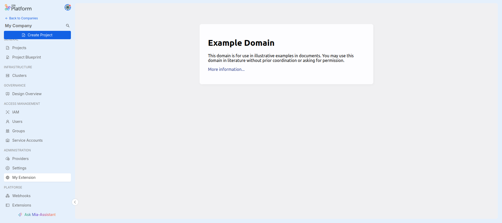
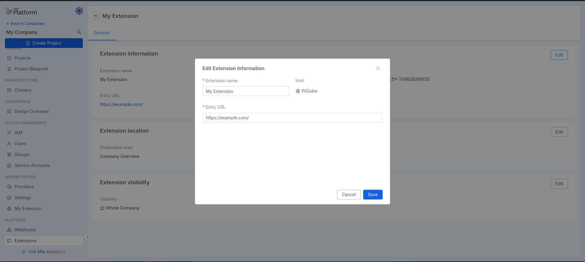
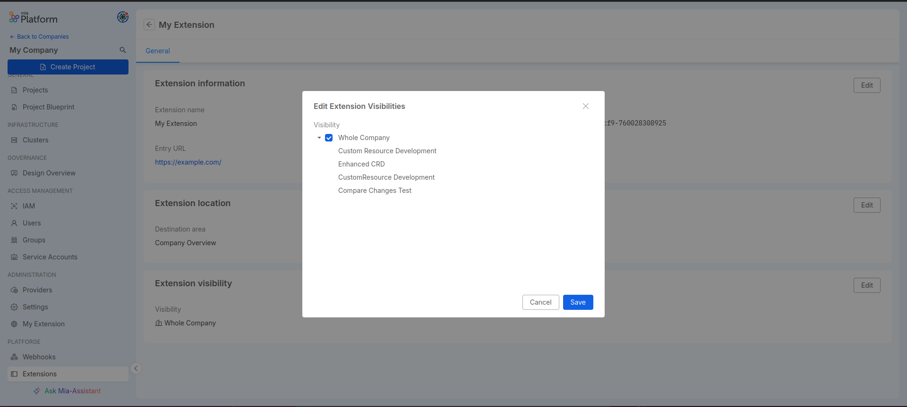

Extensions allow expanding the Console sidebar with new sections that are usable exclusively in the Company where they are registered and are useful for integrating external tools that can be embedded inside an iframe.

## Extension Manager

Extensions can be managed through a dedicated management section called `Extensibility` placed in the Company Overview page and **only Company Owners have permission to see and use it**.

## Create Extension

When accessing this section for the first time or from the extensions table, you can create new extensions by clicking the `Create Extension` button. This will open a modal with the following fields to fill:

- `Extension name` (_required_): Choose a name for your extension
- `Entry URL` (_required_): Enter the URL of the web page that will load when accessing your extension menu item and be embedded inside an iframe
- `Destination Area` (_required_): Select the destination where your extension menu item will be placed
- `Category` (_required_): Select one of the menu groups that will contain your extension menu item
- `Visibility`: Check the contexts in which you want to make your extension visible. If no boxes are checked, the extension will be inactive.

:::info
The `Category` options are based on the selected destination area.
:::

:::info
The `Visibility` can be applied only on the `Whole Company` context when the `Company Overview` destination area is selected.
:::

After creating the extension as shown in the example above, you can refresh the page and verify that the extension has been added to the sidebar and is accessible.

## Extensions Table

If there is at least one extension in the `Extensibility` section, you can view a table with all the existing extensions for the Company.

On this page, you can:
- Create new extensions using the `Create Extension` button at the top right
- Delete an extension from the table by clicking on the trash icon
- Access the detail page of an extension by clicking on its name

## Extension Detail

The extension detail page allows you to view the main information that characterizes the registered extension, which can also be modified through the corresponding `Edit` buttons.

### Extension Info

The `Extension Info` card contains the identifying information of the extension, where only the name and entry URL can be edited.

### Extension Location

The `Extension Location` card contains the information related to the positioning of the extension's menu item within the Console. These details are fully editable through the corresponding edit modal.

### Extension Visibility

The `Extension Visibility` card shows in which contexts the extension is active and visible. This information can be modified at any time through the corresponding edit modal.

:::info
Just as during creation, Visibility is tied to the Destination Area set for the extension. For example, if the Destination Area is set to `Company Overview`, then visibility can only be applied to the `Whole Company` option.
:::

