Through the "Project Blueprint" section at the Company level, it is possible to set some common properties for all Projects that will be created in that Company.
The settings are grouped by subject area through dedicated tabs, as explained below.

## Project Templates

A Project template is a repository that includes specific information and a default structure to use as a starting point for new Projects, allowing to pre-populate them with resources and have a common starting configuration. In essence, it provides a foundation on which to build your Project.

:::info
The fields set by the template can be changed after the Project creation.
:::

There are 2 cards in this section: the first displays the default template for the blueprint, and the second displays a table with all the configured templates.

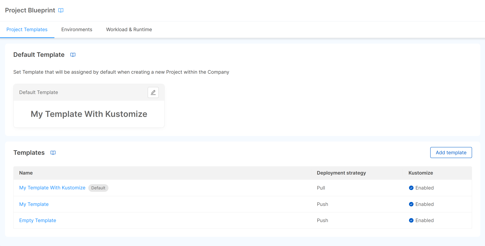

### Create a Template

You can create a new template using the "Add template" button of the card. A modal will open requiring the following information:

- **Name** (*required*): the name of the template;
- **Archive URL** (*required*): URL to a zip/gzip of the base Project configuration folder. All contents of this folder will be copied into the target configuration, and correctly interpolated. If you want to create a custom template, click [here](#how-to-create-a-project-archive) to see how to do it;
- **Enable Kustomize as Project structure**: whether the Project uses Kustomize as a configuration management tool for Project microservices (more info on Kustomize can be found [here](/console/project-configuration/kustomize-your-configurations/index.md));
- **Deployment strategy**: it could be either push mode (pipeline-based) or pull mode (GitOps-based);
- **Pipeline runner** (*required*): choose MLP if the Project uses it as command line deployment tool. It is required to have the [Smart Deploy](/development_suite/deploy/overview.md#smart-deploy) feature enabled;
- **Description**: the description of the template.

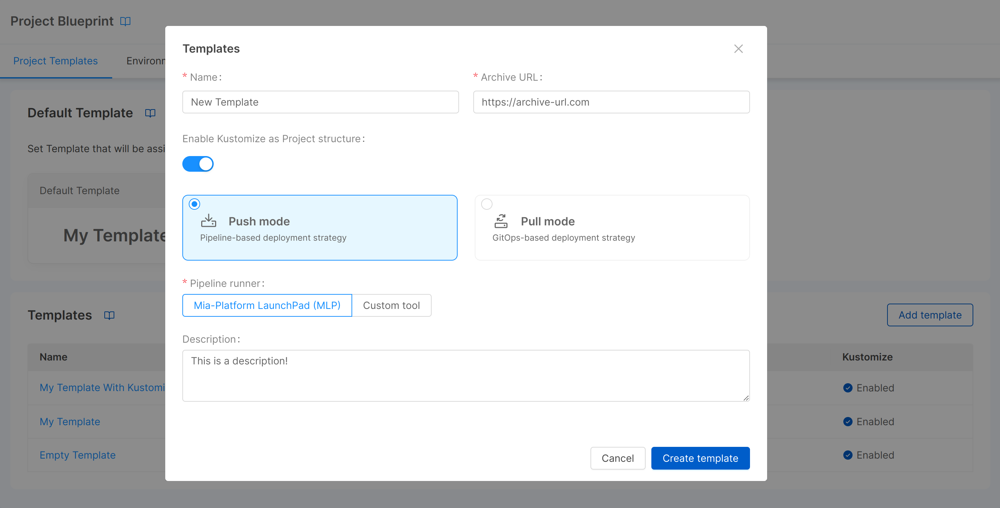

:::caution
If you enable Kustomize as Project structure, your Project configuration for newly created Projects [needs to be changed accordingly](/console/project-configuration/kustomize-your-configurations/migrate-to-kustomize.md).
:::

After entering the required information, a click on the "Create template" button will be sufficient to generate the new template that will be added to the table (in which the information of name, deployment strategy, Kustomize usage, and archive URL will be displayed). When the creation is complete, it will also be possible to directly access the template detail page via the "Go to template" button. Alternatively, to access the detail it will be sufficient to click on the name of the template in the table.

### Select Default Template

If at least one template is configured on the blueprint, you will also be able to set it as the default template with a click on the "Select default Template" button, which will open a modal with a dropdown from which you can choose the template you want to set as the default. Once a default template is set, a tag will be displayed next to the template name in the table and on the respective detail page.

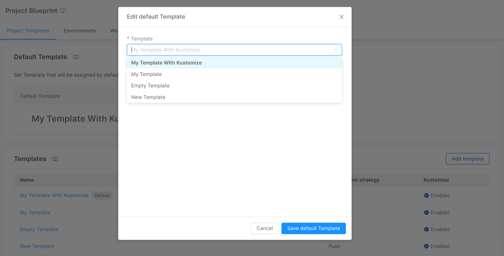

### Edit Template 

You can edit template information from its detail page, accessible by clicking on the template name in the table. Three cards are shown here:

- **General**: shows the general information of the template: name, archive URL and description. You can edit this information by clicking on the "Edit" button of the card;

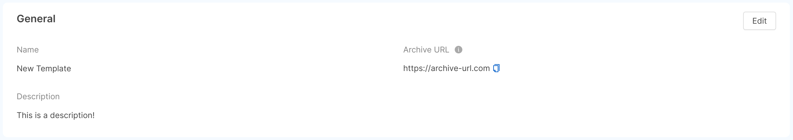

- **Deploy settings**: shows information inherent to the deployment: strategy (push or pull mode), pipeline runner, and Project structure (whether the Project uses Kustomize as a configuration management tool for Project microservices). You can edit this information by clicking on the "Edit" button of the card;

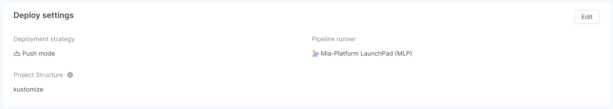

- **Dashboards**: through this card you can add, edit, and delete dashboards that will be configured on each Project environment once new Projects are created. Through the "Add Dashboard" button, a modal will be displayed requiring the following information:
  * **Name** (*required*): dashboard label, shown by the [monitoring section of the Console](/development_suite/monitoring/dashboard.md);
  * **URL** (*required*): dashboard URL;
  * **Category**: label that identifies a category to which the dashboard belongs;
  * **External dashboard**: whether it is possible to open the dashboard outside the Mia-Platform Console.

  Once a dashboard is created, this information can be edited using the appropriate button in the respective row of the table, while with the trash button it will be possible to delete the dashboard from the template.

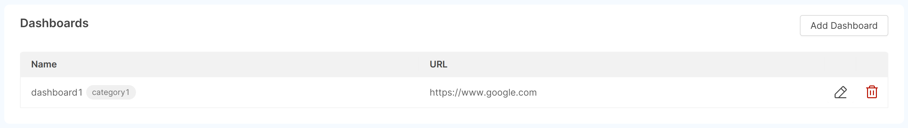

### Delete Template

Via the "Delete" button located in the footer of the detail page, you can delete a template. A confirmation modal will be displayed where you are asked to enter the template name to confirm the deletion. Once a template is deleted, you will be redirected to the templates table.

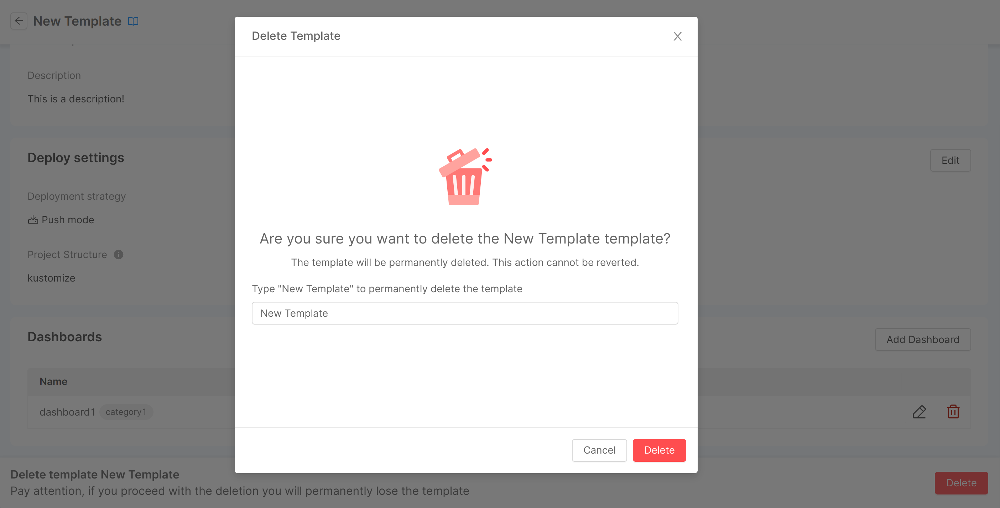


## Environments

Runtime environments are the set of computer systems, servers, networks, storage, etc. where the applications are released and executed. Nowadays, it is common to have multiple runtime environments with different connotations - for example, one dedicated to production and one for testing bugs or new features. The Console is built with this concept in mind, and thus provides support and tools to easily manage multiple environments.

In this section, you can have an overview of the runtime environments configured for the blueprint through a "Runtime Environments" card, which displays a table with a row for each environment, as shown in the picture below.

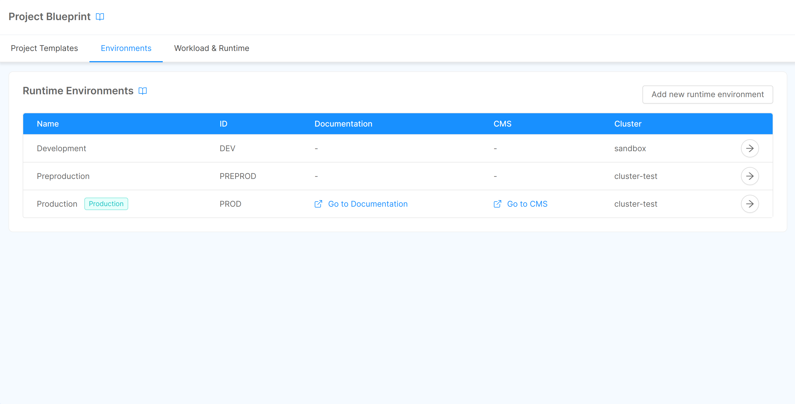

### Add an Environment

You can add a new environment by clicking on the "Add new runtime environment" button, located in the top right corner of the card. A modal will show up, and you will be asked to fill a form containing some information related to the environment:

* **Name** (*required*): a label given by the user to recognize the runtime environment;
* **Production environment**: a toggle that specifies whether or not the runtime environment is a production environment;
* **Environment ID** (*required*): the human-readable ID of the runtime environment;
* **Environment variables prefix** (*required*): a string used as a prefix for environment variables related to the runtime environment;
* **Cluster ID** (*required*): ID of the Kubernetes cluster on which the runtime environment runs (if you want to run the environment on a new cluster you need to [add the cluster](/console/company-configuration/clusters-management/connect-and-manage-cluster.mdx) first);
* **Cluster namespace**: the namespace of the Kubernetes cluster the runtime environment runs on (automatically generated from `%projectId%` and Environment ID);
* **Project URL**: the URL - consisting of protocol + host (final slash '/' optional) - on which newly created Projects will be exposed, together with API Portal and Dev Portal (e.g., [https://my-project-host.com](https://my-project-host.com));
* **CMS URL**: the URL - consisting of protocol + host (final slash '/' optional) - on which the CMS of newly created Projects will be exposed (e.g., [https://my-cms-host.com](https://my-cms-host.com));
* **Description**: a brief description of the runtime environment.

By clicking on "Create environment", the new runtime environment will be generated, and it will appear as a new entry in the table (in which the information of name, ID, documentation URL, CMS URL, application URL, and cluster ID will be displayed, together with a tag used to identify production environments). When the creation is complete, it will also be possible to directly access the environment detail page via the "Go to environment" button. Alternatively, to access the detail it will be sufficient to click on the icon to the right of the environment-related table entry.

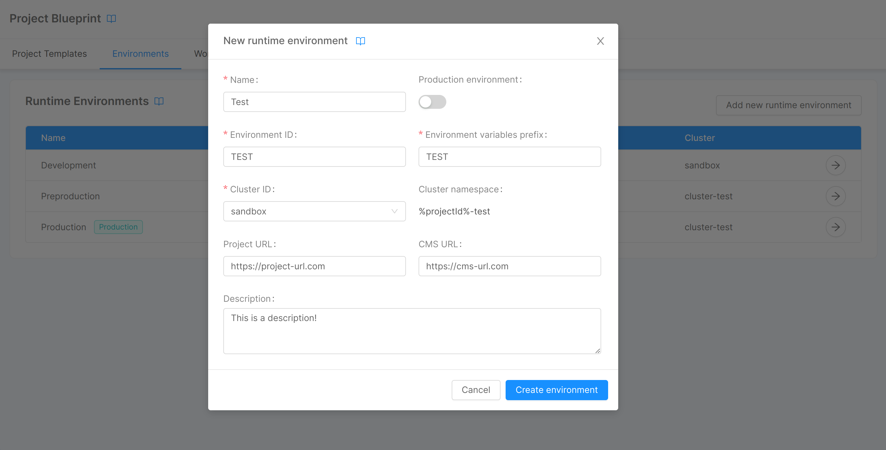

### Edit an Environment 

You can edit environment information from its detail page, accessible by clicking on the icon to the right of the environment-related table entry. Two cards are shown here:

- **Details**: shows the general information of the environment: name, ID, variables prefix, documentation URL, CMS URL, application URL, and description. You can edit this information (except for ID and variables prefix) by clicking on the "Edit" button of the card;

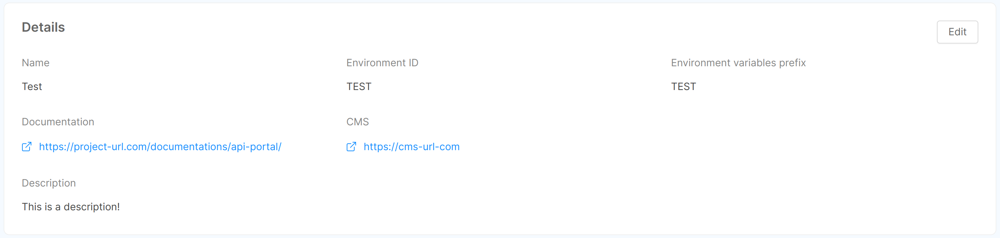

- **Cluster connection**: shows information inherent to the cluster to which the environment is connected: cluster ID, URL, and namespace. This information cannot be modified.

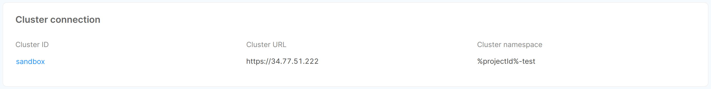

### Remove an Environment

In the bottom part of the page, there is a footer which allows to delete the runtime environment from the Console. By clicking on the "Delete" button, a modal will be displayed, asking for confirmation of the deletion.

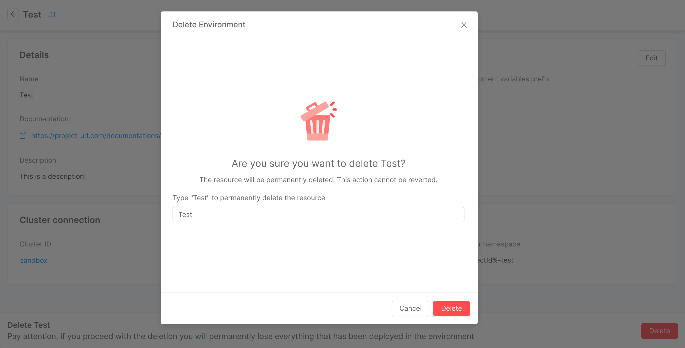

After entering the name in the input field and clicking "Delete," a loading and finally a feedback of successful removal will be shown. Closing the modal will then redirect you to the environments table. In case of errors, an informative feedback will be shown instead, and the "Close" button will not perform any redirection.

:::warning
As mentioned in the warning displayed in the deletion modal, the runtime environment deletion implies the deletion of the related cluster namespace and all resources configured within the environment.
:::


## Workload & Runtime

The "Workload & Runtime" tab shows information about the Project blueprint workload and runtime settings through 4 cards: "Microservices", "Image Pull Secrets", "Runtime", and "Security Features".

### Microservices

This card shows and gives the user the ability to change some settings related to the creation of microservices within newly created Project. Specifically:
- **Suggestion for Docker image**: defines the format of the Docker image name suggestion. It is one of `REPOSITORY`, `PROJECT_ID`, `CONSTANT_PREFIX` (the default is `PROJECT_ID`);
- **Prefix** (only if type is `CONSTANT_PREFIX`): defines the prefix that will appear in the suggestion for the Docker image name.

The above information can be edited by clicking on the "Edit" button, editing the fields in the modal that will open, and clicking on "Save changes."

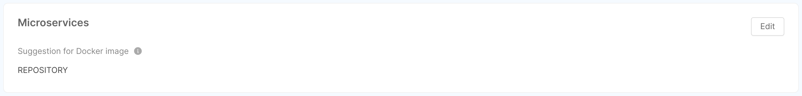

### Image Pull Secrets

:::note
An imagePullSecret is a Kubernetes entity used to authenticate and authorize access to private container image registries. 
:::

This card shows the user, in the form of a table, the list of names that will be used in deployment and cronjob files for pulling Docker images. The user has the option of adding new names through the "Add Image Pull Secret" button, which will open a simple modal asking for the secret name. Similarly, a secret can be edited and deleted using the appropriate icons at the respective row in the table.

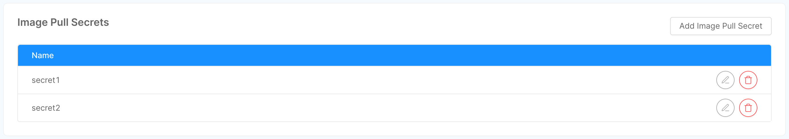

### Runtime

This card gives the user the ability to view and change some runtime settings. 

Specifically, the **Monitoring** tags allow you to choose between the different supported monitoring systems.

The above information can be edited by clicking on the "Edit" button, editing the fields in the modal that will open, and clicking on "Save changes."


### Security features

This card shows and gives the user the ability to change some security features, provided as pod annotations, pod specs and Security Context. Specifically:
- **Seccomp Profile**: if enabled, it enables the `seccompProfile` attribute of the `securityContext` object in order to restrict a Container's syscall. This feature is available as of Kubernetes v1.19 and you can learn more by taking a look at the [official Kubernetes documentation](https://kubernetes.io/docs/tutorials/security/seccomp/).
- **AppArmor**: it is a Linux Security Module that, if enabled, implements Mandatory Access Control since [Kubernetes v1.4](https://kubernetes.io/docs/tutorials/security/apparmor/). AppArmor annotations set up a profile used by containerd to harden containerized applications to contrain exploitation. The template for such profile is available [on GitHub](https://github.com/moby/moby/blob/master/profiles/apparmor/template.go).
- **Host Properties**: if enabled, it sets to `false` the following parameters, which could be used to allow access to shared information and elevate privileges:
  * `hostPID`: controls whether containers can share host process namespaces;
  * `hostIPC`: enables to read the shared memory between processes that communicate with IPC mechanisms;
  * `hostNetwork`: controls whether containers can use the host network and allows to bypass network policies.

  These fields are described in the [Pod Security Policies section of the official Kubernetes documentation](https://kubernetes.io/docs/concepts/security/pod-security-policy/).
- **Privileged Pod**: if enabled, it configures the following attributes in a `securityContext` object:
  * `allowPrivilegeEscalation`: controls whether a process can gain more privileges than its parent process, by default is set to true when the `CAP_SYS_ADMIN` capability is enabled or is run as privileged;
  * `privileged`: controls whether the Pod can run privileged containers.

  You can learn more about the `securityContext` object by taking a look at the [official Kubernetes documentation](https://kubernetes.io/docs/tasks/configure-pod-container/security-context/).

The above information can be edited by clicking on the "Edit" button, which will open a modal through which you can turn on/off the security features. Upon clicking "Save changes", the information will be updated.

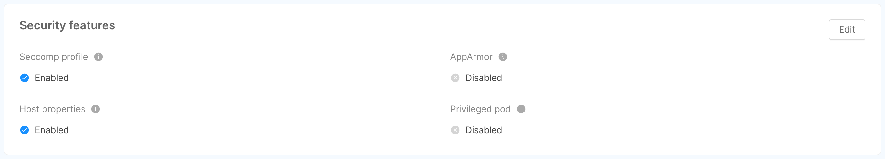


## How to create a Project Archive

The Project archive is interpolated using [mustache.js](https://github.com/janl/mustache.js) as template system, using `%` as tag symbol instead of the default `{{` or `}}`.

:::note
In order to use the `%` character inside your Project archive you can escape it by prefixing the character with an additional `%`. For example, the string `%%something` will be rendered as `%something` when the Project archive will be interpolated.
:::

*mustache.js* is a web template system, which allows you to generate custom templates by replacing all the general information in the web template with your product or organization information.

You could create a Project template to avoid copy/paste in every new Project having the same base configuration.

At Mia-Platform, for example, we create one template to configure a Project exposed through Traefik configuration and one to configure it without expose it. Therefore, for a company that uses this template, creating this type of Project will be a very simple process.

### Template interpolation variables

You can interpolate the template with some Project data. With *mustache.js*, you could iterate through an array, in order to have some configuration iterated for every environment.
The values you can use during template interpolation are:

For the Project (accessible using `project.${field}`):

* `projectId`;
* `name`;
* `configurationGitPath`;
* `environments`.

Inside environments, you can access to:

* `envId`;
* `envPrefix`;
* `cluster` (an object containing `namespace` and `clusterId` string, `kubeContextVariables` object). Here you can find the variable names for the specified environment where to set the cluster variable;
* `hosts` (an array of objects, with `host` and `isBackoffice` fields).

An example of template for the `.gitlab-ci.yml` file:

```yml
include:
  # job template
  - project: 'platform/pipelines-templates'
    file: '/deploy/deploy-job.yml'
    ref: 'master'
%#project.environments%

%envId%:
  stage: release
  extends: .deploy_job

  variables:
    KUBE_URL: "\${cluster.kubeContextVariables.KUBE_URL}"
    KUBE_TOKEN: "\${cluster.kubeContextVariables.KUBE_TOKEN}"
    KUBE_CA_PEM: "\${cluster.kubeContextVariables.KUBE_CA_PEM}"
    ENVIRONMENT_PREFIX: "%envPrefix%_"

  only:
    variables:
      - $ENVIRONMENT_TO_DEPLOY == "%envId%"
%/project.environments%
```

All sections between `%#project.environments%` and `%/project.environments%` will be written for `n` times, where `n` is the number of environments. So, inside the environment, you can use the environment specific fields.
For other possibilities, please check [mustache.js](https://github.com/janl/mustache.js) documentation.

You may want to write a file or a folder for every environment. To enable that, you can write the file name (or folder) in the template as `%envId%`, which will be interpolated for every environment.
The interpolation data in those files include the environments fields at the first level (as in `mustache.js` sections), with the Project as a key for every environment.

To see an example of Jenkins pipelines definition, take a look at [this](/development_suite/deploy/pipeline-based/configure-jenkins.md#how-to-automatically-create-jenkins-job-on-project-creation) page of our doc.

## Create default services

There are two ways to add services to a template:

* Using an `api-console-config`, which specifies the services that will be included in the Projects created with that template, together with other details (e.g. environment variables). This requires you to add an `api-console-config.json` file in the root directory of the Project, provided via the `archiveUrl` field;
* **Deprecated**: Using `enabledServices`, which only specifies whether a certain service is enabled or not, without the possibility to define any other detail.

:::caution
The `enabledServices` can only be used for core services (i.e. `cms-site`, `cms-backend`, `v1-adapter`, `export-service`, `auth0-client`, and `oauth-login-site`), while it does not work for services used from the Console that have been migrated to custom services (migrated services are now plugins, you can find them in the [marketplace](/marketplace/overview_marketplace.md)).
:::

The base structure of the `api-console-config.json` is the following:

```json
{
  "endpoints": {...},
  "decorators": {...},
  "services": {...},
  "configmaps": {...},
  "version": "...",
  "platformVersion": "..."
}
```

If you create the new `api-console-config.json` from an existing one, please remember to delete all fields that do not match the structure above, since they will be automatically generated by the Console after save and deploy actions (one of those, depending on the field).


## Container Registries

The container registries section allows you to manage the container registries you can use to store the Docker images of [Templates](/marketplace/templates/mia_templates.md) and [Examples](/marketplace/examples/mia_examples.md) created from the Marketplace.

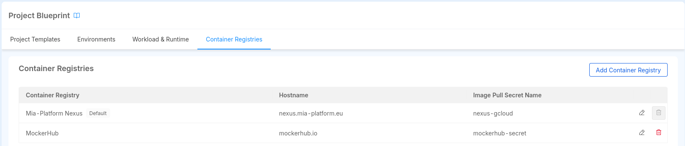

This section allows you to view, add, edit, and delete the container registries that will be added to the Projects of the Company upon creation.

You can add a new container registry by clicking on the "Add Container Registry" button. This will open a modal where you can insert the required information to add a new container registry:

- **Name**: the name of the container registry. You can choose any name you prefer. It is used to identify the container registry in the Console, therefore it is unique within the Project.
- **Registry Hostame**: the hostname of the container registry. It refers to the container registry URL, for example, `docker.io` for Docker Hub. Multiple container registries can have the same hostname, since they might have different credentials. It cannot be changed once the Container Registry is created.
- **Image Pull Secret Name**: the name of the Image Pull Secret that will be used by Kubernetes to pull images from the container registry. Notice that the Secret must be present in the Kubernetes cluster where the Project is deployed, the Console won't create it for you.
- **Default Registry**: if enabled, the container registry will be set as the default one for the Project, meaning it will be the default selected when creating a new service from a Template or Example. Notice that if the Project has only one container registry, it will be set as the default one automatically.

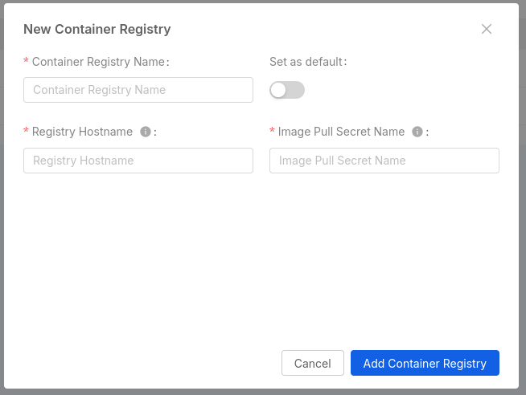

Through the dedicated buttons on the right of each row, you can edit or delete the container registry.

:::info

Adding, deleting or editing container registries will not affect the Projects already created in the Company, but only the new ones.

:::