import Tabs from '@theme/Tabs';
import TabItem from '@theme/TabItem';

Mia-Platform Console allows authorized users to manage providers. 

More specifically, authorized users can:

* Add a new connection to a Provider;
* Edit the connection to a Provider;
* Set a default provider for a Company.

The providers management can be done from the [Company Overview Area](/development_suite/company/configuration.mdx).

Once in the Company Overview Area, clicking on "Providers" you will be redirected to the related section, in which (assuming you already have some providers connected) you can see a table containing some information about the providers connected to the Console:

* **Name**: provider name, assigned by the user while connecting the provider to the Console;
* **Capabilities**: provider capabilities (Git Provider, Secret Manager, CI/CD Tool);
* **Service**: external reference service on which the provider relies to provide its capabilities (e.g. Azure, GitHub, Jenkins).

You can filter data based on provider name or service through the search bar at the top of the table, while the bar next to it allows you to filter by one or more capabilities.

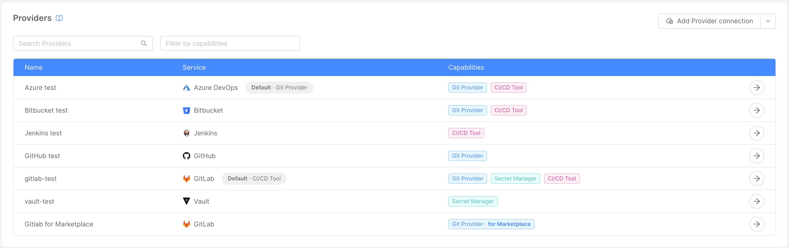

## Connect a Provider

You can connect a Provider by clicking on the "**Add Provider connection**" or "**Add Marketplace Provider connection**" button, located in the page's top right corner. 

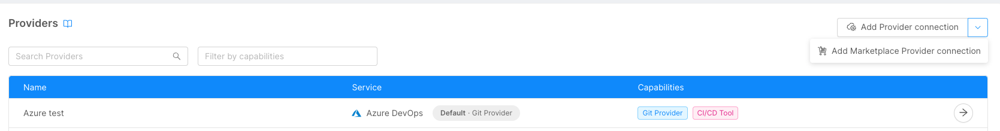

:::info

For more specific details on how to connect a Provider for Marketplace, please refer to the [dedicated guide](/console/company-configuration/providers/configure-marketplace-provider.mdx).

:::

After clicking the button a modal will show up, and, through a few steps, you will be asked to enter some information related to the Provider.

### Step 1: Provider Services

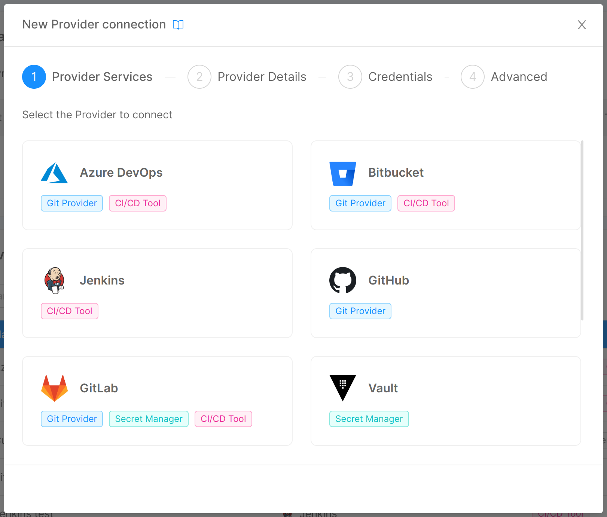

In this step, you are required to choose the specific provider you want to use among the ones supported by the Console and, for the chosen provider, the capabilities you want to use it for ("Git Provider", "Secret Manager", "CI/CD Tool").  

:::info
If the provider offers only one capability, clicking on it will lead directly to step 2 and the capability will be selected by default.
:::

### Step 2: Provider Details

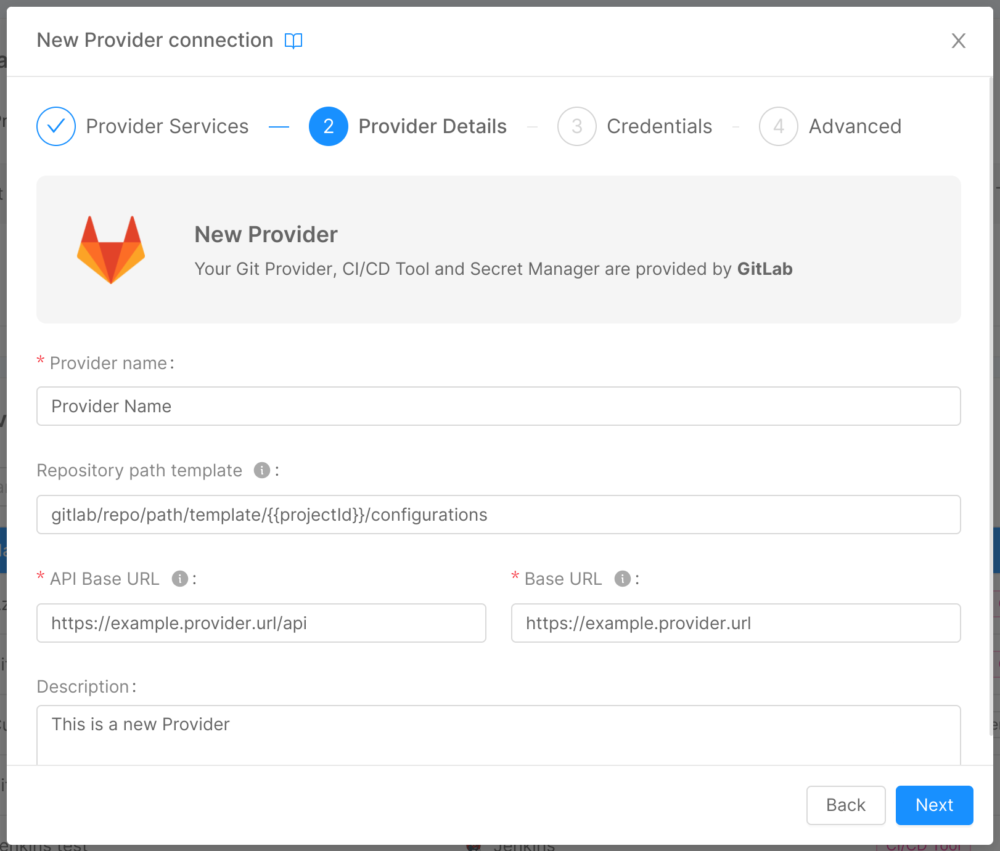

In this step, you can insert some general details about your provider:

* **Provider name** (*required*): a human-readable name for the provider;
* **API Base URL** (*required*): the reference endpoint URL for calls to the provider APIs;
* **Base URL** (*required*): the reference endpoint URL for the provider;
* **Description**: a brief description of the provider.

Below, some examples on the data to set for the supported provider types:

<Tabs groupId="providerType" queryString>
<TabItem value="github" label="GitHub" default>

* **API Base URL**: `https://api.github.com`
* **Base URL**: `https://github.com`

</TabItem>
<TabItem value="gitlab" label="GitLab">

* **API Base URL**: `https://gitlab-test.com/api`
* **Base URL**: `https://gitlab-test.com`

</TabItem>
<TabItem value="bitbucket-server" label="BitBucket Server">

* **API Base URL**: `https://bitbucket-test.com`
* **Base URL**: `https://bitbucket-test.com`

</TabItem>
<TabItem value="azure-devops" label="Azure DevOps">

* **API Base URL**: `https://dev.azure.com`
* **Base URL**: `https://dev.azure.com`

</TabItem>
<TabItem value="vault" label="Hashicorp Vault">

* **API Base URL**: `https://vault.example.com/`
* **Base URL**: `https://vault.example.com/`

</TabItem>
<TabItem value="jenkins" label="Jenkins OAuth 2.0">

* **API Base URL**: `https://jenkins.example.com/`
* **Base URL**: `https://jenkins.example.com/`

</TabItem>
</Tabs>

### Step 3: Credentials

In this step, you are required to insert information about the authentication method to the provider, so that the Console has the necessary permissions to perform all read/write operations on it:

* **Credentials type** (*required*): the type of credentials used to authenticate requests to the provider. It can be one of "Token," "M2M," and "OAuth2".

Depending on the credentials type, the other information to be entered will be:

<Tabs queryString="credentialType">
<TabItem value="token" label="Token" default>

For credentials of the type "Token":

* **Access token** (*required*): the token that allows the Console to authenticate against the APIs of the provider (temporary credentials).

</TabItem>
<TabItem value="m2m" label="M2M">

For credentials of the type "M2M":

* **Token** (*required*): the token that allows the Console to authenticate against the APIs of the provider (long-lived credentials);
* **Access token URL** (*required*): the reference authorization endpoint URL that, to requests that include the authentication token, responds by generating temporary credentials.

</TabItem>
<TabItem value="OAuth2" label="OAuth2">

For credentials of the type "OAuth2":

- **Access token URL** (*required*): the reference OAuth2 authorization endpoint URL that, to requests that include client ID and client secret, responds by generating temporary credentials;
- **Client ID** (*required*): OAuth2 public client identifier;
- **Client secret** (*required*): OAuth2 secret, known only to the client and the authorization server.

</TabItem>
<TabItem value="client-credentials" label="Client credentials">

For credentials of the type "Client credentials":

- **Access token URL** (*required*): the reference authorization endpoint URL that, to requests that include client ID and client secret, responds by generating temporary credentials;
- **Client ID** (*required*): public client identifier;
- **Client secret** (*required*): the shared secret, known only to the client and the authorization server.
- **Scope**: an optional scope to restrict the generated token permissions

</TabItem>
<TabItem value="client-credentials-certificate" label="Client credentials certificate">

For credentials of the type "Client credentials certificate":
- **Access token URL** (*required*): the reference authorization endpoint URL that, to requests that include client ID and client secret, responds by generating temporary credentials;
- **Client ID** (*required*): public client identifier;
- **Private key** (*required*): the PEM-encoded private key whose certificate has been registered against the authorization service;
- **Scope**: an optional scope to restrict the generated token permissions

</TabItem>
</Tabs>

:::info
All credentials data are stored in an encrypted MongoDB collection.
For more information about MongoDB encryption, take a look at the dedicated [documentation page](/runtime_suite/crud-service/30_encryption_configuration.md).
:::

:::caution
Credentials entered at this stage, for security reasons, will never again be shown to the user, who will be able to replace them with new ones but not visualize them again.
:::

#### Supported credential types

Depending on the provider selected in step 1, the types of credentials supported will change. The following table shows the credential types supported by each provider:

| Credentials Type               | Providers                                                                |
| ------------------------------ |:------------------------------------------------------------------------:|
| Token                          | GitLab, GitHub, Bitbucket, Azure DevOps, Vault, Jenkins, Azure Key Vault |
| M2M                            | Vault                                                                    |
| OAuth2                         | Jenkins                                                                  |
| Client Credentials             | Azure Key Vault                                                          |
| Client Credentials Certificate | Azure Key Vault                                                          |

:::caution Assign the right scope to your credentials
Make sure, when generating credentials on the respective provider sites, to assign them a scope so that they have the necessary permissions for all read and write operations performed through the Console.

For example, for the "Token" credentials type, the access token should have scope "api" in the case of GitLab, admin scopes for GitHub, "Project admin" and "Repository admin" in the case of Bitbucket, "Full access" for Azure DevOps.
:::

Below, for the M2M and OAuth2 providers, some example configurations:

<Tabs>
<TabItem value="vault" label="Hashicorp Vault m2m">

* **Access Token URL**: `https://vault.example.com/v1/auth/kubenetes/login`
* **Access Token**: the access token

With the correct host to the Hashicorp Vault instance.

</TabItem>
<TabItem value="jenkins" label="Jenkins OAuth 2.0">

* **Client ID**: OAuth2 client id
* **Client Secret**: OAuth2 client secret
* **Access Token URL**: "https://jenkins.example.com/oauth2/login"

With the correct host to the Jenkins instance.

</TabItem>
</Tabs>

### Step 4: Advanced

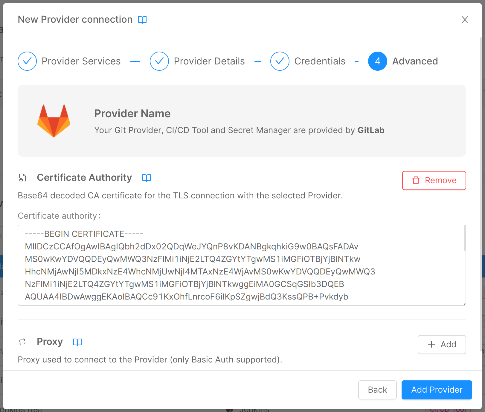
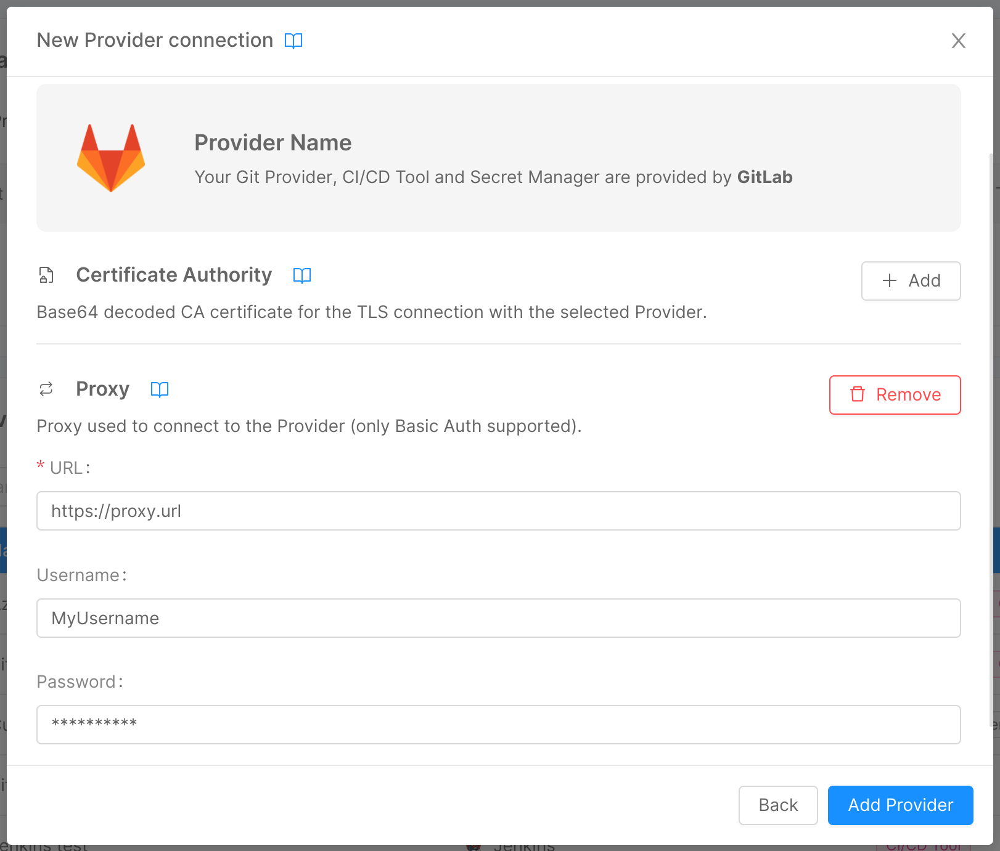

In this step, you can enter some optional advanced information through two expandable forms:

#### Certificate Authority

If you have set up verification of a CA for the connection to your provider, here you can enter it through the homonymous field:

* **Certificate authority**: base64 decoded CA certificate for the TLS connection with the provider.

#### Proxy

If the Console needs to use a proxy to forward calls to the provider, here you can enter the information needed for the connection:

* **URL**: the URL used to connect to the proxy, which indicates where the proxy is exposed;
* **Username**: the username used in connection requests to the proxy for basic authentication;
* **Password**: the password used in connection requests to the proxy for basic authentication. This property will be safely encrypted.

By clicking on "Add provider", the connection to the provider will be set, and it will appear as a new entry in the table.

## View Provider Information

By clicking on the arrow button located in the rightmost column of a provider entry in the table, a new page will show up, displaying information about the specific provider through 3 cards:

* **Details**: this card shows the information inserted by the user in step 2 of connecting the provider to the Console (and, in addition, the specific provider and selected capabilities), and allows to modify this information through the "Edit" button in the top right corner, as further explained [below](#edit-a-provider).

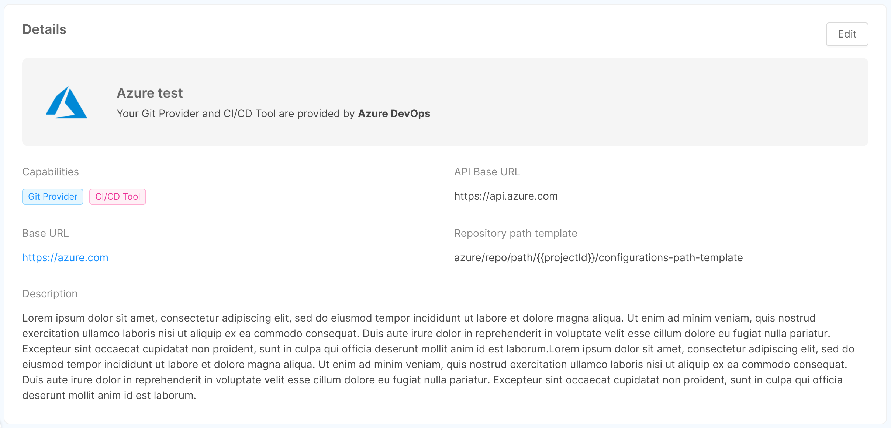

* **Credentials**: this card shows the credentials type chosen by the user in step 3 of connecting the provider to the Console, and allows to replace the credentials information through the "Change credentials" button in the top right corner, as further explained [below](#edit-a-provider).

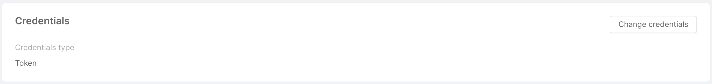

* **Advanced**: this card shows the optional information inserted by the user in step 4 of connecting the provider to the Console through 2 tabs - "Certificate Authority" and "Proxy" - and allows to modify (or eventually add) this information through the "Edit" button in the top right corner, as further explained [below](#edit-a-provider).

In case a base64 CA certificate has been entered, clicking on the "View certificate" button allows the user to visualize the certificate in both human-readable and plain versions in a two-tabs modal.

The "Expanded view" tab displays the human-readable version of the certificate, while the "Text view" tab shows its plain version and a copy button in the modal footer allows the user to quickly copy the plain base64 CA certificate.

## Edit a Provider

As mentioned in the previous section, through the button in the top right corner of the Details, Credentials, and Advanced cards, it is possible to modify the information inserted by the user while connecting the provider to the Console.

A click on the button will open a modal very similar to the one seen when connecting the provider, but only specific to the information you wish to edit. 

:::info
In the Details card, the modal will allow you also to change the capabilities used by the provider, selected in step 1.
:::

In the image below for example, the user clicked the "Edit" button on the "Details" card, opening a modal for editing the information entered during steps 1 and 2 of provider creation.
By clicking on "Edit provider", the information about the provider will be updated.

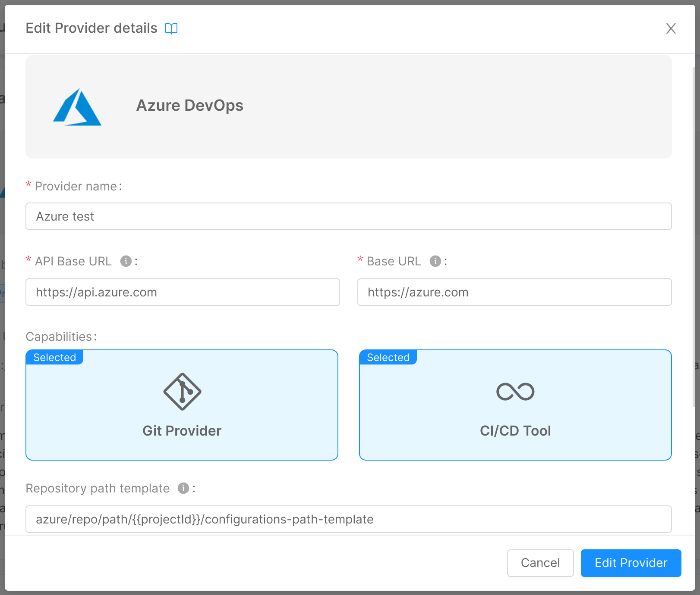

## Remove a Provider Connection

In the bottom part of a provider detail page, you will find a footer that allows you to remove the provider connection from the Console.  

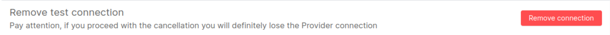

By clicking on the "Remove" button, a modal will be displayed, asking for confirmation of the removal.

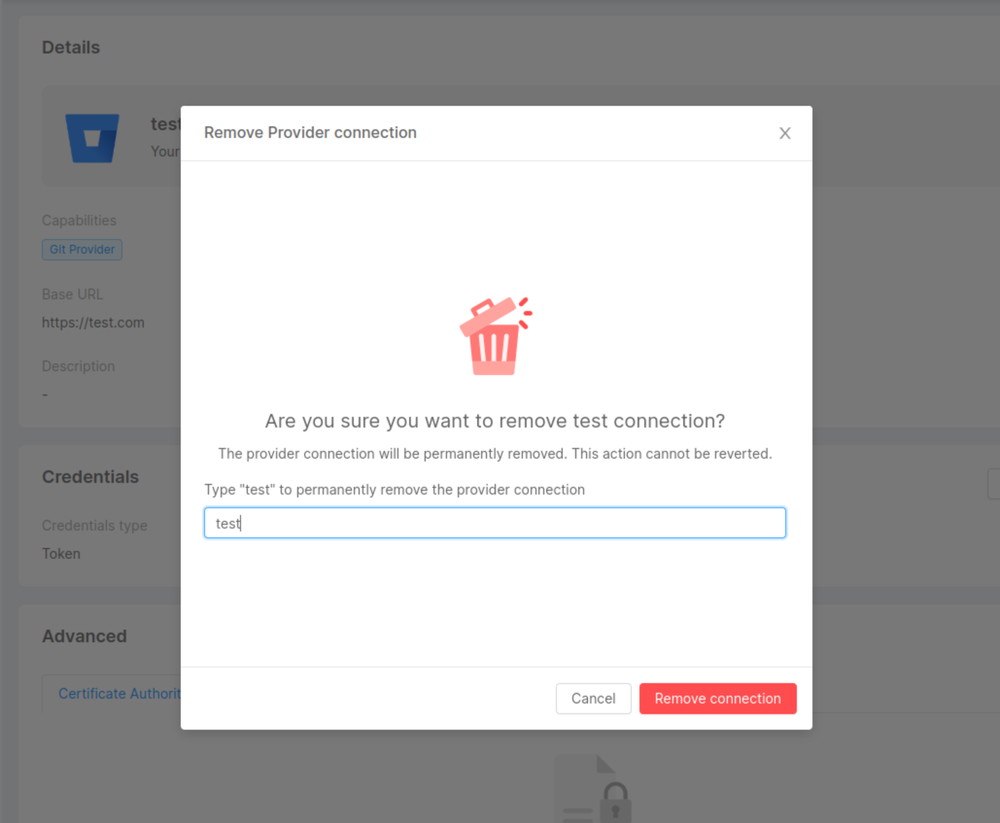

By entering the name in the input field and clicking `Remove`, a loading will appear. 

After the request has been completed, a feedback of successful removal will be shown, and closing the modal will then redirect you to the providers' table. In case of errors, an informative feedback will be shown instead, and the `Close` button will not perform a redirection.

:::caution
Removing a provider connection is only possible if the provider meets these two conditions:

* it has no usage in any of the Company Projects.
* it is not a default provider.

:::

In case you need to remove your provider from a Project, you can have a closer look at the [dedicated page](/console/company-configuration/providers/project-configuration.md) later on this page.

You can also find further details on how to set a different default provider in the [following section](#set-a-default-provider).

## Set a Default Provider

Once you create a provider connection, you will be able to set it as the default provider for a specific capability of that company.  

By using the dedicated cards at the top of the providers' section, you will be able to select one of the providers implementing that specific capability.  

As soon as the default provider has been set for a certain capability, the card will show the corresponding chosen provider.
If no provider has been set, a "Set default capability" button will appear instead.

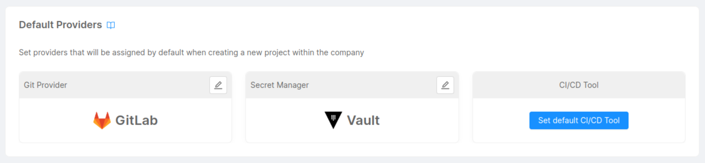

Setting a default provider for a company allows you to make that provider handle a specific capability for any Project that will be created within the company.

In this way, you will not need to manually specify a provider for your Projects.

:::info
Default Providers are automatically associated with newly created Projects inside the company.
:::

:::caution
Please make sure to have the right permissions to set or modify the default providers of a company. 

**Only Company Owners will be able to access this feature.**
:::

### Edit a Default Provider

You can change the default provider connection for a specific capability by clicking the edit button located in the upper right corner of the default providers' cards.

A modal will appear allowing you to select one of the providers implementing that specific capability:
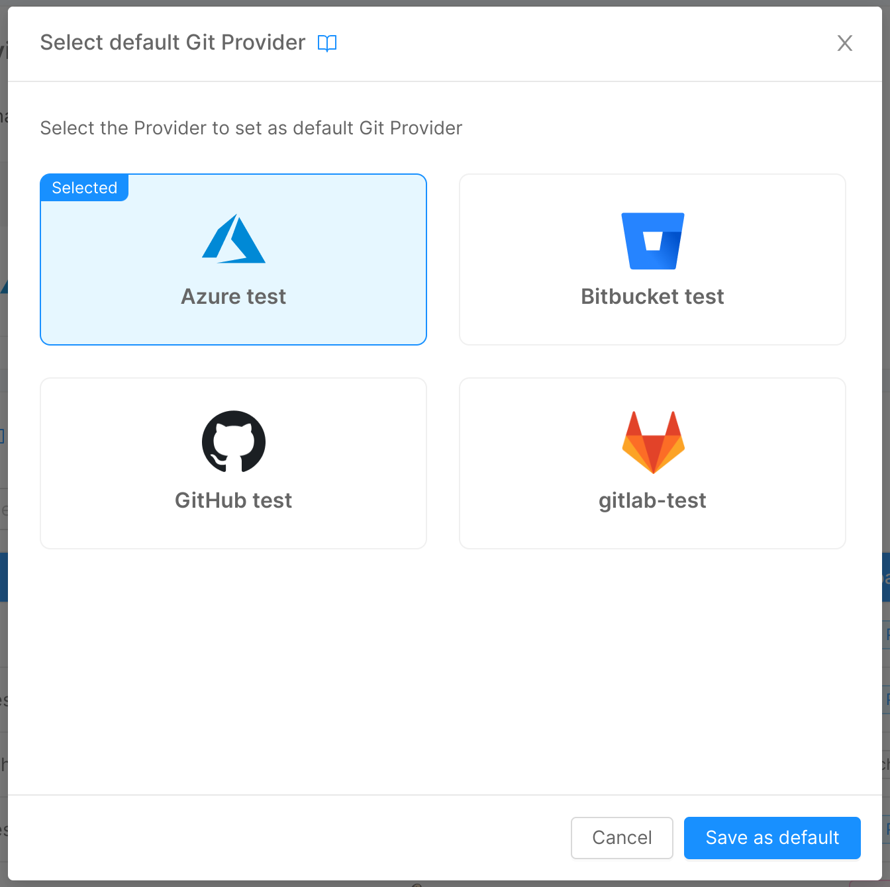

Once you edit the default provider, you will be able to see the card with the new provider set.
