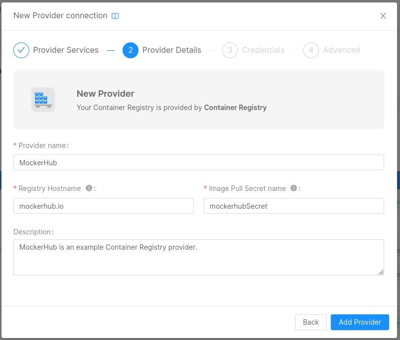

import { CenteredContent } from "../../../../src/components/CenteredContent"

Container Registry Providers can be setup to allow the users to choose among a predefined set of container registries when creating a microservice.

To setup a new container registry, create a new Provider selecting the **Container Registry** card.

<CenteredContent width={'650px'}>

</CenteredContent>

You'll need to insert the following **required** information:

- **Provider name**: the name of the provider, any value is accepted but we suggest a clear name that will help the users in the correct choice of the Provider;
- **Registry hostname**: the hostname of the Container Reigistry, it will be prepended to the image path;
- **Image pull Secret name**: the name of the Secret containing the credentials to access the provider;

:::info

The *Image pull Secret name* will be added to the [`imagePullSecrets` field](https://kubernetes.io/docs/concepts/containers/images/#specifying-imagepullsecrets-on-a-pod) 
of the Pods that will need to be pulled from this Provider.

Make sure the Secret is properly configured in your Kubernetes instance. 
In case of doubt, contact your systems administrator.

:::

Optionally, you can specify a **Description**.

<CenteredContent width={'650px'}>

</CenteredContent>

Once you are done with the configuration, click on **Add Provider** to proceed with the creation.

A provider with the only `container-registry` capability will be created.

:::info

The *Credentials* and *Advanced* steps are not applicable to this Provider, and therefore they won't be shown.

:::

Once the Provider has been successfully created, you can now consult its details page.

<CenteredContent width={'900px'}>

</CenteredContent>

