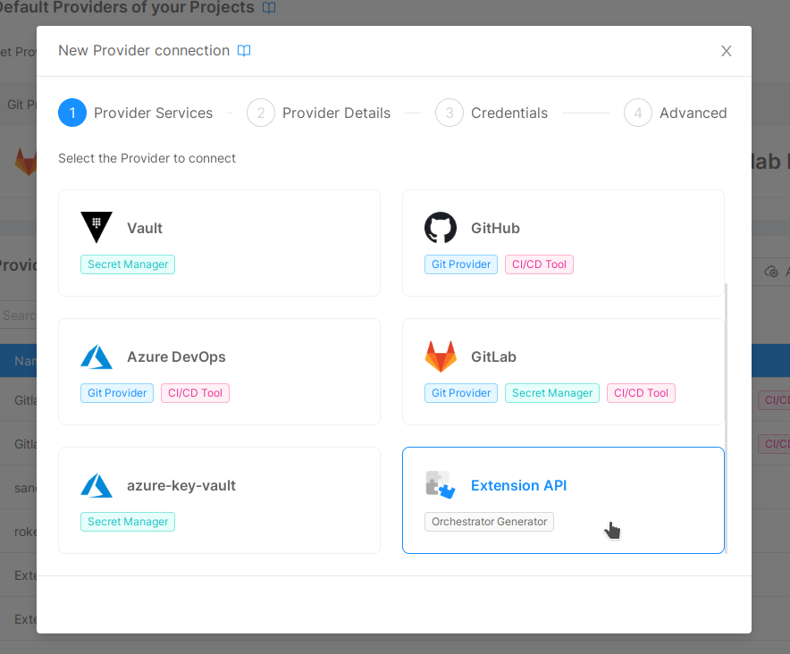

The Extension API Provider can extend or replace some Console features.
Extensions work by telling the Console to call a remote API to perform a specific task, that would, otherwise, be completed independently.

To enable an Extension, you should connect a Provider of type **Extension API** to the desired Company, following the steps described in the [Management page](/console/company-configuration/providers/configure-provider.mdx).

Depending on the Extension you would like to enable, select the corresponding **capability** from the ones featured by the Extension API Provider type.

## Extensions

The available Extensions are the following:

- [Orchestrator Generator](/console/company-configuration/providers/extensions/orchestrator-generator.md): allows to generate orchestrator's files externally.
