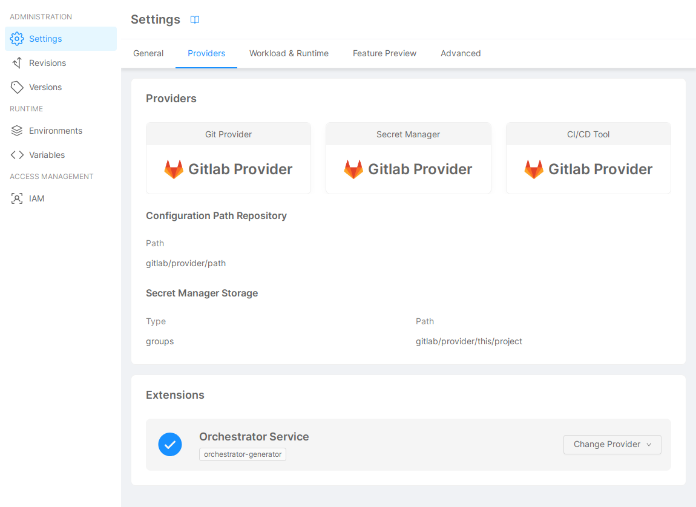

:::info

Extension Providers can only be used when the [Enhanced Project Workflow](/docs/development_suite/set-up-infrastructure/enhanced-project-workflow) is enabled.

:::

Some providers can extend or replace specific Console features.

The steps to enable a Project Extension, using an Extension Provider, are the following:

- check that the [Enhanced Project Workflow](/docs/development_suite/set-up-infrastructure/enhanced-project-workflow) is enabled for the project; 
- connect a _capable Provider_ (more details later) to its Company, as described in the [Management page](/docs/console/company-configuration/providers/configure-provider.mdx);
- navigate to [_Project Settings_](/docs/console/project-configuration/project-settings) and click on the _Providers_ tab;
- enable the desired Extension in the _Extensions_ section, selecting a suitable Provider.

An Extension is characterized by a Provider capability:

- **only one capability** is associatied to a specific Extension;
- every Provider featuring that capability can be selected for that Extension.

For example:

- The Providers _Provider 1_ and _Provider 2_, both having the _Extension Feature_ capability, are connected to the Company.
- The Extension _Extension Feature_ appears in the Project Settings, and allows you to select _Provider 1_ or _Provider 2_.

If no Provider with the capability associated to a specific Extension is connected to the Company, *the Extension will not appear in Project Settings*.

## Extensions

The available Extensions are the following:

- [Orchestrator Generator](extensions/orchestrator-generator.md)
