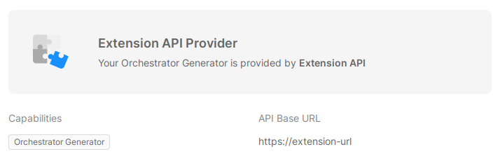
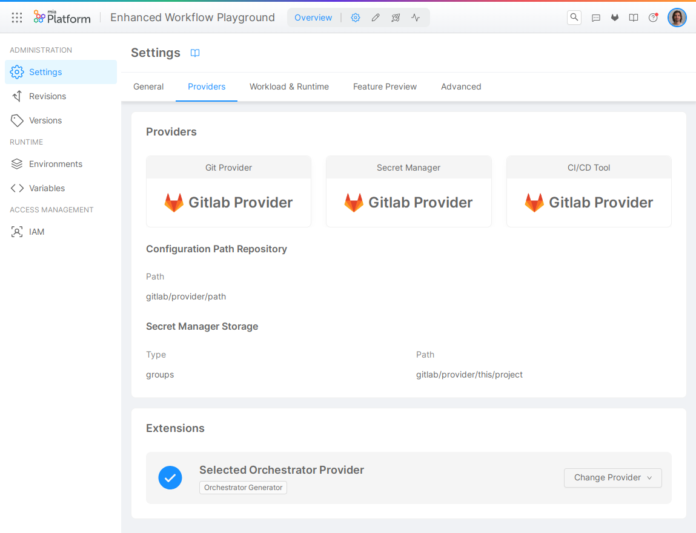
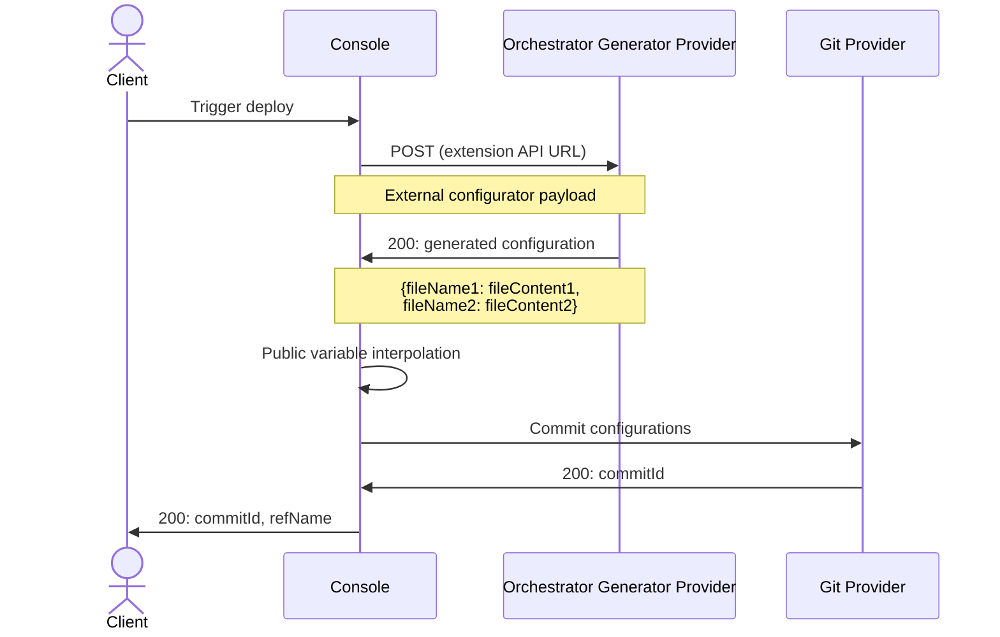

:::info

An Orchestrator Generator can only be used when the [Enhanced Project Workflow](/development_suite/set-up-infrastructure/enhanced-project-workflow.md) is enabled.

:::

One of the main features of Mia-Platform is the automatic generation of the **orchestrator files**, ready to **be deployed**; these files are saved in the **configuration repository**. For instance, the Console can generate Kubernetes files and deploy them on your runtime based on the [Design](/development_suite/api-console/api-design/overview.md) configuration you provided.

However, you may want to generate these files differently: in this case, you have to use an **Orchestrator Generator**.
When the Orchestrator Generator Extension is enabled, the Console sends a **POST request** to its Provider's API Base URL to generate the files to be deployed. The request body contains some information about the Project and the Configuration, and the Console expects to receive, in response, the files to be saved and deployed.

## Setup

To enable the Orchestrator Generator on a Project, follow these steps:

- check that the [Enhanced Project Workflow](/development_suite/set-up-infrastructure/enhanced-project-workflow.md) is enabled for the Project;
- connect a Provider of type Extension API Provider with the **Orchestrator Generator capability** to its Company, as described in the [Extension API Provider page](/console/company-configuration/providers/extension-providers.md);
- navigate to [Project Settings](/console/project-configuration/project-settings.md) and click on the _Providers_ tab;
- enable the Orchestrator Generator extension in the _Extensions_ section, selecting the Provider previously connected.



The Providers suitable for the Orchestrator Generator Extension are the ones featuring the **Orchestrator Generator** capability.
Every Provider with such capability can be selected to enable the Extension.

If no Provider with the _Orchestrator Generator_ capability is connected to the Company, **the Orchestrator Generator Extension will not appear in Project Settings**.

## Sequence diagram

This is a simplified schema of the Orchestrator Generator's operation.



## Request format

### Authentication

The Console will authenticate using the method specified while connecting the Provider, which can be **Bearer Token** or **Basic Auth**.

### Body

The payload sent to the Extension is shaped as follows:

```json
{
  "project": {
    "name": "<Project Name>",
    "id": "<MongoId>",
    "projectId": "<projectId>",
  },
  "tenant": {
    "name": "<Company Name>",
    "id": "<tenantId>"
  },
  "environment": {
    "id": "<envId>",
    "name": "<Env name>",
    "isProduction": true|false
  },
  "configuration": {
    "services": {
      "serviceName": {
        "name": "serviceName",
        ...all services configurations
      }
    },
    "configMaps": {
      "config1": {
        "name": "config1",
        "files": [{
          "name": "file1",
          "content": "file1 content"
        }]
      }
    }
  }
}
```

#### Service data model

| Field          | Type     | Description | optional |
|----------------|----------|-------------|----------|
| `name`         | String   | Name of the service |  |
| `description`  | String   | Description of the service set in UI | | 
| `tags`         | String[] | List of tags set in UI | | 
| `dockerImage`  | String   | Service docker image | |
| `advanced`     | Boolean  | Flag to distinguish the data model for advanced services (if `true` check the advanced services data model)| ✔️ |
| `replicas`     | Number   | Number of service static replicas | |
| `createdAt`    | String   | ISOString of the service creation date | |
| `environment`  | [Env Schema](#env-schema) | Environment variables | |
| `annotations`  | Object   | Service annotation, fields (`name`, `value`, `description`) | |
| `labels`       | Object   | Service labels, fields (`name`, `value`, `description`) | |
| `resources`    | [Resource Schema](#resources-schema)   | CPU and MEM configuration | |
| `probes`       | [Probes Schema](#probes-schema) | K8S probes configuration | |
| `containerPorts` | ContainerPort[] | List of ports exposed by the container (fields: `name`, `from`, `to`) | |
| `configMaps`   | [ConfigMount[]](#configmount-schema) | List of configurations to be mounted | |
| `terminationGracePeriodSeconds` | Number | Grace period time configuration | |
| `exclusiveServiceExposure` | Boolean | Use this field to understand which containers should be exposed in the k8s Service | ✔️ |
| `additionalContainers` | [Container[]](#container-schema) | Extra containers to be installed in the service | ✔️ |

#### Env Schema

| Field   | Type     | Description   |
|---------|----------|---------------|
| `name`  | String   | Env var name  |
| `value` | String   | Env var value |
| `valueType` | `plain`/`secret`  | Env var value (if `secret`, use `secretName` and `secretKey`) |
| `secretName` | String | Name of the secret holding the env value |
| `secretKey` | String | Name of the secret key (withint the Secret `secretName`) holding the value for the env |

#### Resource Schema

The `resources` field holds two properties `cpuLimits` and `memoryLimits`, each of them having the following schema:

| Field   | Type     | Description     | Optional |
|---------|----------|-----------------|----------|
| `max`   | String   | CPU/MEM limit   | ✔️ |
| `min`   | String   | CPU/MEM request | ✔️ |

#### Probes Schema

The `probes` field holds two properties `readiness` and `liveness`, each of them having the following schema:

| Field   | Type     | Description     | Optional |
|---------|----------|-----------------|----------|
| `path`  | String   | Path to configure the `httpGet` probe   | ✔️ |
| `port`  | String   | Name of the container port exposing the probe | ✔️ |
| `initialDelaySeconds` | Number | Value for the `initialDelaySeconds` k8s configuration  | ✔️ | 
| `periodSeconds` | Number | Value for the `periodSeconds` k8s configuration  | ✔️ | 
| `timeoutSeconds` | Number | Value for the `timeoutSeconds` k8s configuration  | ✔️ | 
| `successThreshold` | Number | Value for the `successThreshold` k8s configuration  | ✔️ | 
| `failureThreshold` | Number | Value for the `failureThreshold` k8s configuration  | ✔️ |

#### ConfigMount Schema

Each `configMaps` item holds information about how to mount a specific ConfigMap found in the top-level `configMaps` field.

Mount information is the following:

| Field   | Type     | Description     | Optional |
|---------|----------|-----------------|----------|
| `name` | String | Name of the ConfigMap to be mounted | |
| `mountPath` | String | Path where the configuration files should be mounted | |
| `subPaths` | String[] | List of specific files that needs to be picked from the ConfigMap and mounted | ✔️ |

#### Container schema

Each additional container has a similar shape of the main service, holding the following properties subset: `name`, `dockerImage`, `exclusiveServiceExposure`, `containerPorts`, `probes`, `environment`, `resources`, and `configMaps`.

#### Service data model example

<details>
<summary>JSON request body</summary>

```json
{
    "name": "my-service",
    "description": "Some description",
    "tags": ["custom"],
    "dockerImage": "ghcr.io/mia-platform/crud-service",
    "swaggerPath": "/documentation/json",
    "advanced": false,
    "replicas": 1,
    "createdAt": "2022-10-18T13:51:49.959Z",
    "environment": [
        {
            "name": "SOME_VAR",
            "value": "VALUE",
            "valueType": "plain"
        }
    ],
    "annotations": [
        {
            "name": "mia-platform.eu/version",
            "value": "v11.5.0",
            "description": "Version of Mia-Platform used by the project"
        }
    ],
    "labels": [
        {
            "name": "app",
            "value": "crud-service",
            "description": "Name of the microservice, in the service selector",
        }
    ],
    "resources": {
        "cpuLimits": { "max": "300m", "min": "150m" },
        "memoryLimits": { "max": "300Mi", "min": "150Mi" }
    },
    "probes": {
        "liveness": {
            "path": "/-/healthz",
            "port": "http",
            "initialDelaySeconds": 15,
            "periodSeconds": 20,
            "timeoutSeconds": 1,
            "failureThreshold": 3
        },
        "readiness": {
            "path": "/-/ready",
            "port": "http",
            "initialDelaySeconds": 5,
            "periodSeconds": 10,
            "timeoutSeconds": 1,
            "successThreshold": 1,
            "failureThreshold": 3
        }
    },
    "configMaps": [{
        "name": "crud-service-collections",
        "mountPath": "/home/node/app/collections"
    }],
    "containerPorts": [{
        "name": "http",
        "from": 80,
        "to": 3000
    }],
    "terminationGracePeriodSeconds": 30,
    "additionalContainers": [
        {
            "name": "rbac-service",
            "dockerImage": "ghcr.io/rond-authz/rond:main",
            "exclusiveServiceExposure": true,
            "containerPorts": [{"name": "rbac-service","from": 80,"to": 9876}],
            "probes": {
                "liveness": { "path": "/-/rbac-healthz", "port": "rbac-service" },
                "readiness": { "path": "/-/rbac-ready", "port": "rbac-service" }
            },
            "environment": [
                {
                    "name": "HTTP_PORT",
                    "value": "9876",
                    "valueType": "plain"
                }
            ],
            "resources": {
                "cpuLimits": { "min": "100m", "max": "100m" },
                "memoryLimits": { "min": "60Mi", "max": "430Mi" }
            },
            "configMaps": [{
                "name": "rbac-sidecar-svc-opa-policies-config",
                "mountPath": "/configurations/opa",
            }, {
                "name": "rbac-sidecar-svc-oas-permissions-config",
                "mountPath": "/configurations/oas",
                "subPaths": ["crud-service-permissions.json"]
            }]
        }
    ]
}
```

</details>

## Response format

The response, coming from the Extension and received by the Console, must be an object holding a *key/value* pair for each file that needs to be saved to the configuration repository. The key will be threated as the file name while the value as the file content. The **file content must be a string**.

### Example

```json
{
    "values.yaml": "the content of the values file...",
    "my-service.deployment.yml": "the content of the deployment file for my-service..."
}
```
