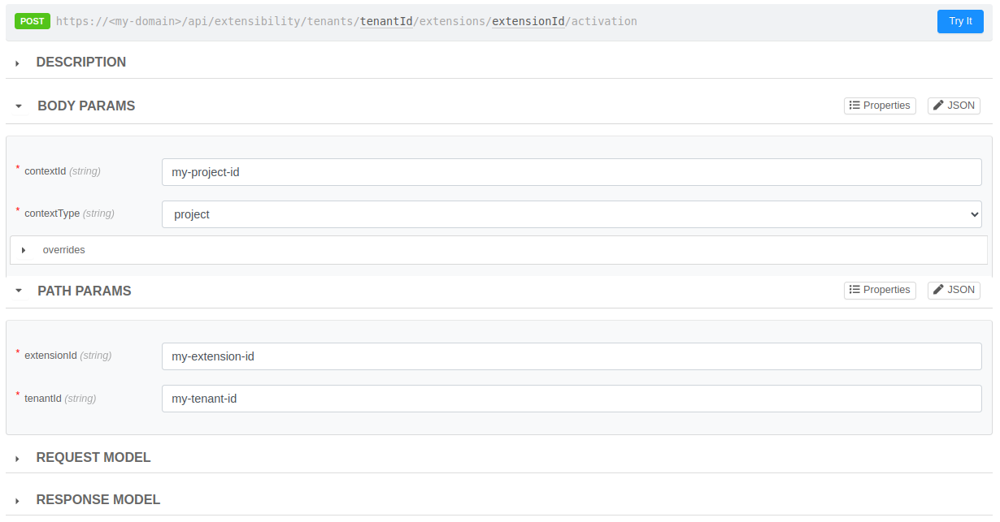
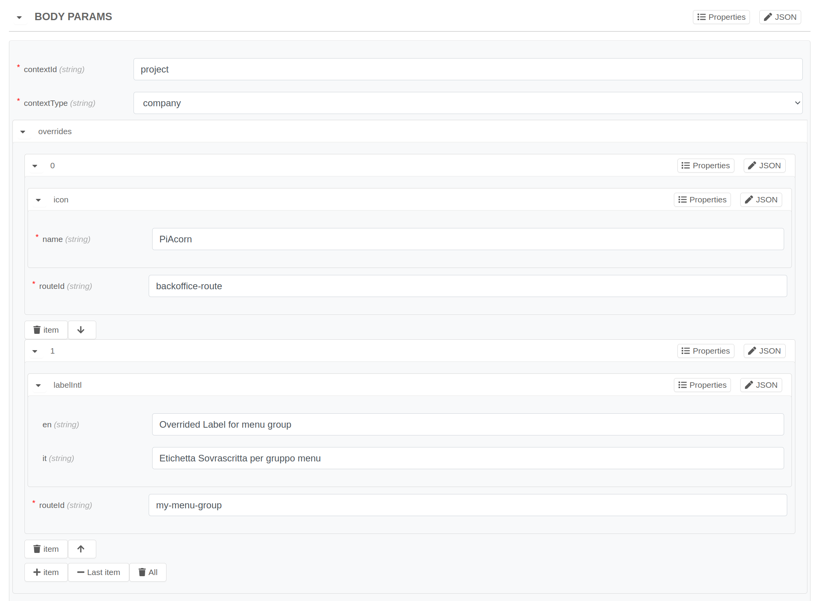
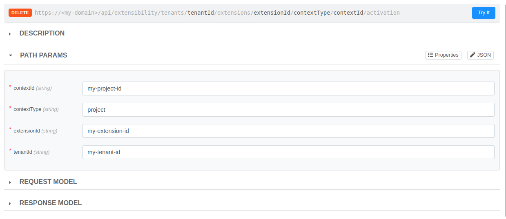

# Activate Extensions

An extension registered on a Company can be activated to be used in the Console. Activation can occur in contexts defined by the extension and can only be done if you have the role of Company Owner on the Company on which the extension is registered.

The activation can be done using the API `POST /api/extensibility/tenants/{tenantId}/extensions/{extensionId}/activation` that can be accessed via the API Portal under the tags `Companies` or `Extensibility`.



As shown in the image, to activate an extension, the API allows specifying these parameters:

**Path Params**
- `tenantId`: insert the tenant ID of the Company on which the extension to activate is registered
- `extensionId`: insert the extension ID of the extension to activate

**Body Params**
- `contextType`: you can specify one of the contexts `company` or `project` on which the extension allows the activation (see `contexts` on this [link](/console/console-extensibility/registration.md#how-to-register-my-extension))
- `contextId`: insert the ID of the Company or Project depending on the type of context specified
- `overrides`: array of routes registered on the extension that you want to modify only for this activation (see the [section](#overrides) below)

:::info
Activation at the Project level can only be done on a project within the same Company on which the extension is registered.
:::

### Activate Backoffice Extension Example

After registering the Backoffice extension as explained [here](/console/console-extensibility/registration.md#register-backoffice-extension-example), you can proceed with its activation on a project located within the Company identified by `my-tenant-id`:

**Path Params**
```json
{
  "tenantId": "my-tenant-id",
  "extensionId": "my-extension-id"
}
```

**Body Params**
```json
{
  "contextType": "my-project-id",
  "contextId": "project",
  "overrides": []
}
```

**Response on success**
```json
{
    "activationId": "my-activation-id"
}
```

## Overrides

Overrides allow you to edit the routes of a registered extension graphically applying these changes only for a specific activation. Activations without overrides show the extension's menu item as it was registered with [this API](/console/console-extensibility/registration.md#how-to-register-my-extension), while with overrides there could be graphical differences like a different icon or label.

:::info
With overrides, it is possible to edit one or more routes of the registered extension, including routes of type `category`. The override on a route will apply only the specified changes and leave the others unchanged, so except for the routeId the other properties are optional.
:::

**Override properties**
- `routeId`(_required_): specifies the id of the registered extension's route on which apply the changes
- `order`
- `icon`
- `labelIntl` 

The properties that can be modified by the override coincide with the properties of the routes registered with the extension already explained [here](/console/console-extensibility/registration.md#how-to-configure-correctly-the-extension-menu-item)

### Apply overrides on Backoffice Extension Example



With the following example, you can activate the Backoffice extension as done [above](#activate-backoffice-extension-example) applying overrides to change the label of the menu group and the icon of the extension route.

:::warning
Be careful to not activate the same extension multiple times on the same context if the extension has already been activated with the example above, so remember to change the project id on which to activate the extension again or delete the previous activation (see [here](#deactivate-an-extension)).
:::

**Path Params**
```json
{
  "tenantId": "my-tenant-id",
  "extensionId": "my-extension-id"
}
```

**Body Params**
```json
{
  "contextId": "project",
  "contextType": "company",
  "overrides": [
    {
      "routeId": "backoffice-route",
      "icon": {
        "name": "PiAcorn"
      }
    },
    {
      "routeId": "my-menu-group",
      "labelIntl": {
        "en": "Overrided Label for menu group",
        "it": "Etichetta Sovrascritta per gruppo menu"
      }
    }
  ]
}
```

**Response on success**
```json
{
    "activationId": "my-activation-id"
}
```

<!-- TODO: Explain that an override refers to the route registered with the extension using the routeId (Invite the user to remember the routeId or to use the GET activate extension api to retrieve the registered extension with its routes) -->


# Deactivate an extension

The activation of an extension can be canceled at any time with the API `DELETE /api/extensibility/tenants/{tenantId}/extensions/{extensionId}/{contextType}/{contextId}/activation` and can be accessed via the API Portal under the tags `Companies` or `Extensibility` and it is required the Company Owner role on the Company where the extension is activated.



**Path Params**
- `tenantId`: insert the tenant ID of the Company on which the extension to deactivate is registered
- `extensionId`: insert the extension ID of the extension to deactivate
- `contextType`: insert the type of context on which the extension is active
- `contextId`: insert the ID of the Company or the Project depending on the specified context type on which the extension is active

```json
{
  "tenantId": "my-tenant-id",
  "extensionId": "my-extension-id",
  "contextType": "project",
  "contextId": "my-project-id"
}
```

**Response on success**
```
204 No Content
```