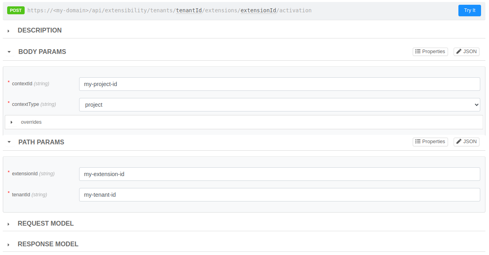
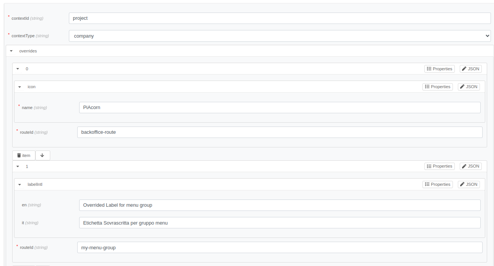
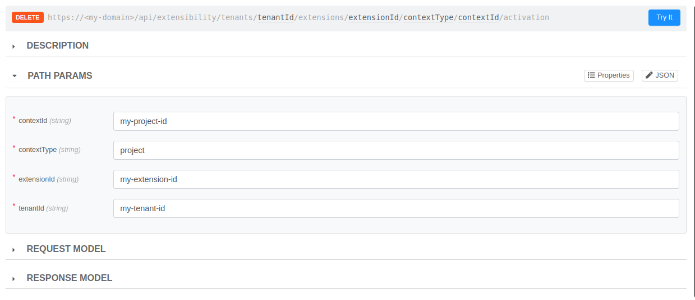

# Activate Extensions

Un estensione registrata su una Company può essere attivata per poterla utilizzare in Console. L'attivazione può avvenire in contesti censiti dall'estensione e può essere fatta solo se si ha il ruolo di Company Owner della Company su cui è registrata l'estensione.

L'attivazione viene fatta usando l'API `POST /api/extensibility/tenants/{tenantId}/extensions/{extensionId}/activation` e si può contattare tramite API Portal sotto le tag `Companies` o `Extensibility`. 



Come mostrato dall'immagine, per attivare un estensione l'API permette di specificare questi parametri:

**Path Params**
- `tenantId`: inserire il tenant ID della Company su cui è registrata l'estensione da attivare
- `extensionId`: inserire l'extension ID dell'estensione da attivare

**Body Params**
- `contextType`: si possono specificare uno dei contesti `company` o `project` su cui l'estensione permette di essere attivata (vedi `contexts` su questo [link](./registration.md#how-to-register-my-extension))
- `contextId`: inserire l'ID della Company o del Project a seconda del tipo di contesto specificato
- `overrides`: array di rotte registrate sull'estensione che si vogliono modificare solo per questa attivazione (vedi il [paragrafo](#overrides) seguente)

:::info
L'attivazione a livello di Progetto può essere fatta solo su un progetto all'interno della stessa Company su cui è registrata l'estensione
:::

### Activate Backoffice Extension Example

Dopo aver registrato l'estensione del backoffice come spiegato [qui](./registration.md#register-backoffice-extension-example), si può procedere con la sua attivazione su un progetto che si trova all'interno della Company identificata da `my-tenant-id`:

**Path Params**
```json
{
  "tenantId": "my-tenant-id",
  "extensionId": "my-extension-id"
}
```

**Body Params**
```json
{
  "contextType": "my-project-id",
  "contextId": "project",
  "overrides": []
}
```

**Response**
```json
{
    "activationId": "my-activation-id"
}
```

## Overrides

Gli overrides ci permettono di effettuare di modificare alcune caratteristiche grafiche delle rotte di un'estensione registrata che si applicano solo per una specifica attivazione. Le attivazioni che non specificano overrides permetteranno di vedere il menu item dell'estensione così come è stata registrata con [questa api](./registration.md#how-to-register-my-extension), mentre se si utilizzano gli overrides possiamo vedere delle differenze grafiche come un'icona o una label differente.

:::info
Con gli overrides è possibile modificare una o più rotte dell'estensione registrata comprese anche le rotte di tipo `category`. L'override su una rotta applicherà solo le modifiche specificate e lascierà invariate le altre, quindi ad eccezione del routeId le altre proprietà sono opzionali.    
:::

**Override properties**
- `routeId`(_required_): specifica l'id della rotta dell'estensione registrata su cui applicare le modifiche
- `order`
- `icon`
- `labelIntl` 

Le proprietà modificabili dall'override coincidono con le proprietà delle rotte registrate con l'estensione già spiegate [qui](./registration.md#how-to-configure-correctly-the-extension-menu-item)

### Apply overrides on Backoffice Extension Example



Con il seguente esempio si può attivare l'estensione del Backoffice come fatto [sopra](#activate-backoffice-extension-example) applicando gli overrides per modificare la label del menu group e l'icona della rotta dell'estensione.

:::warn
Attenzione a non attivare più volte la stessa estensione sullo stesso contesto se l'estensione è già stata attivata con l'esempio sopra, quindi ricordarsi di modificare il project id su cui attivare nuovamente l'estensione oppure eliminare l'attivazione precedente (vedi [qui](#deactivate-an-extension)).
:::

**Path Params**
```json
{
  "tenantId": "my-tenant-id",
  "extensionId": "my-extension-id"
}
```

**Body Params**
```json
{
  "contextId": "project",
  "contextType": "company",
  "overrides": [
    {
      "routeId": "backoffice-route",
      "icon": {
        "name": "PiAcorn"
      }
    },
    {
      "routeId": "my-menu-group",
      "labelIntl": {
        "en": "Overrided Label for menu group",
        "it": "Etichetta Sovrascritta per gruppo menu"
      }
    }
  ]
}
```

**Response**
```json
{
    "activationId": "my-activation-id"
}
```

<!-- TODO: Explain that an override refers to the route registered with the extension using the routeId (Invite the user to remember the routeId or to use the GET activate extension api to retrieve the registered extension with its routes) -->
<!-- TODO: Add an image on Console with the added extension showing the overrides  -->


# Deactivate an extension

`DELETE /api/extensibility/tenants/{tenantId}/extensions/{extensionId}/{contextType}/{contextId}/activation`

