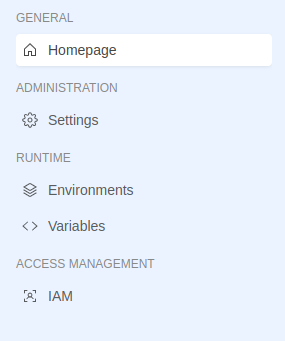

# Extensible Locations

The Console allows to embed extensions at specific locations that already have menu items and groups that can also be used by our extensions. These locations are:

- **Tenant** with locationId `tenant`
- **Project** with locationId `project`
- **Runtime** with locationId `runtime`

## Tenant

  
 

  
  

This location is found on sections related to the Company on the URLs with prefix `/tenants/:tenantId` that represent the location path. As visible from the image, the sidebar already contains menu groups that can be used via parentId:

- **GENERAL GROUP** (parentId: `general`)
- **INFRASTRUCTURE GROUP** (parentId: `infrastructure`)
- **GOVERNANCE GROUP** (parentId: `governance`)
- **ACCESS MANAGEMENT GROUP** (parentId: `access-management`)
- **ADMINISTRATION GROUP** (parentId: `administration`)
- **EXTENSIBILITY GROUP** (parentId: `extensibility`)

## Project

  
 

  
  

This location is found on sections related to the Project overview on the URLs with prefix `/projects/:projectId` that represent the location path. As visible from the image, the sidebar already contains menu groups that can be used via parentId:

- GENERAL GROUP (parentId: `general`)
- ADMINISTRATION GROUP (parentId: `administration`)
- RUNTIME GROUP (parentId: `runtime`)
- ACCESS MANAGEMENT GROUP (parentId: `access-management`)

## Runtime

  
 

  
  

This location is found on the Runtime section of a Project on the URLs with prefix `/projects/:projectId/monitoring/environments/:envId` that represent the location path. As visible from the image, the sidebar already contains menu groups that can be used via parentId:

- WORKLOADS GROUP (parentId: `workloads`)

:::warning
Extensions routes placed in a specific location are visible only if the extension is activated in a context that includes that location. For this reason, an extension activated on the Project context cannot be seen if its routes are located on the `Tenant` location.
:::

<!-- TODO: Should be added some mentions about the order of menu items? -->
