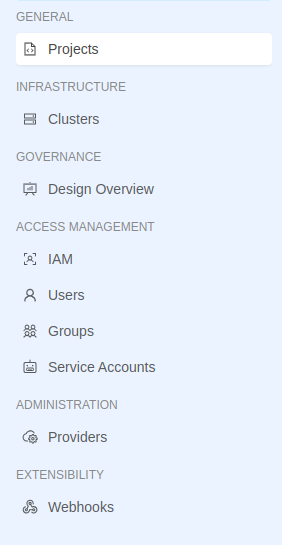
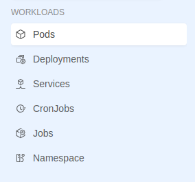

# Extensible Locations

La Console permette di incorporare estensioni in punti ben specifici che hanno già delle voci di menu e dei gruppi che possono essere utilizzati anche dalle nostre estensioni. Queste locations sono:

- `tenant`
- `project`
- `runtime`

## Tenant

  
 

  
  

Questa location si trova sulle sezioni riguardanti la Company caratterizzati dal prefisso nell'URL `/tenants/:tenantId`. Come visibile dall'immagine la sidebar contiene già i gruppi di menu utilizzabili tramite parentId: 

- **GENERAL GROUP** (parentId: `general`)
- **INFRASTRUCTURE GROUP** (parentId: `infrastructure`)
- **GOVERNANCE GROUP** (parentId: `governance`)
- **ACCESS MANAGEMENT GROUP** (parentId: `access-management`)
- **ADMINISTRATION GROUP** (parentId: `administration`)
- **EXTENSIBILITY GROUP** (parentId: `extensibility`)

## Project

  
 

  
  

Questa location si trova sulle sezioni riguardanti l'overview di Progetto caratterizzati dal prefisso nell'URL `/projects/:projectId`. Come visibile dall'immagine la sidebar contiene già i gruppi di menu utilizzabili tramite parentId: 

- GENERAL GROUP (parentId: `general`)
- ADMINISTRATION GROUP (parentId: `administration`)
- RUNTIME GROUP (parentId: `runtime`)
- ACCESS MANAGEMENT GROUP (parentId: `access-management`)

## Runtime

  
 

  
  

Questa location si trova sulle sezione Runtime di un Progetto caratterizzati dal prefisso nell'URL `/projects/:projectId/monitoring/environments/:envId`. Come visibile dall'immagine la sidebar contiene già i gruppi di menu utilizzabili tramite parentId: 

- WORKLOADS GROUP (parentId: `workloads`)

<!-- TODO: Should be added some mentions about the order of menu items? -->
