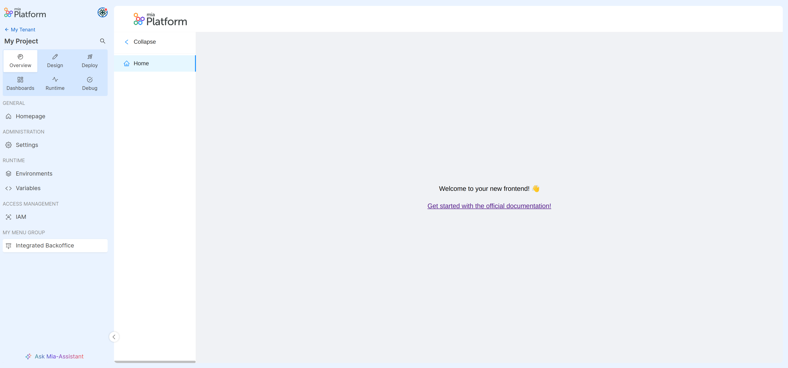

# Overview

The Extensibility feature can make your work easier and allow you to integrate your external tools via iframes. In this way the Console will be able to incorporate more features from other websites (or from the Console projects itself) and thus become a single access point making the user experience more comfortable.

A correctly active extension will appear as a new menu item on the sidebar and you can place it in different Console contexts such as within a Company or a specific Project. Furthermore, you can also specify restrictions using Console permissions so that the new menu item is visible only to a small group of users.

In the following pages you will be explained how to add the backoffice as extension within a project in order to consult it directly in the Console.

## How to see your extension on Console?

Activating completely a new extension in the Console involves 2 phases:

- [Registration](./registration.md)
- [Activation](./activation.md)

`Registration` allows you to add an extension for the first time and register all the main info required from extension to work such as the URL where fetching the iframe and the different locations where place the new menu items.
`Activation`, on the other hand, allows you to activate an extension already registered on a specific Console context and in this way the same extension can be active on multiple contexts at the same time, such as multiple projects for example.

## Advanced concepts: Security and Customization

The extension visibility could be based on IAM permissions and restricted only to specific users (see the security paragraph on the [registration page](./registration.md#how-to-restrict-the-extension-usage)) and the activation could override some registered extension settings and apply these overrides only to a specific activation context (see the [overrides](./activation.md#overrides) section for more information).   