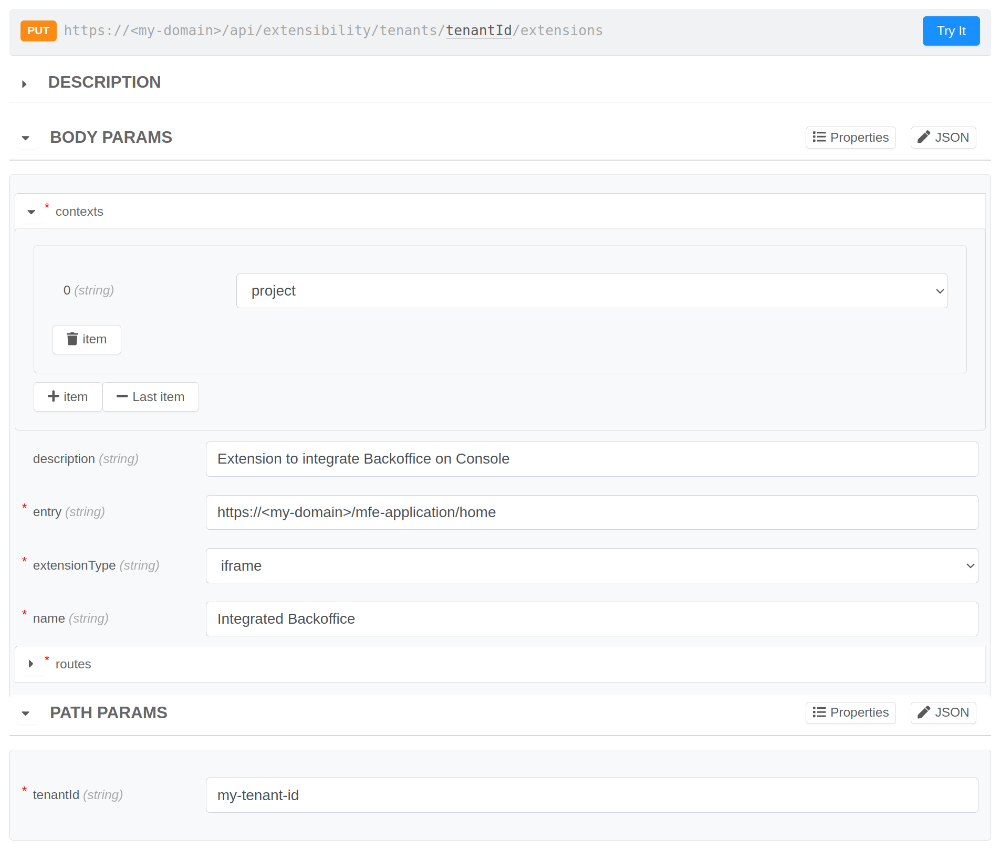
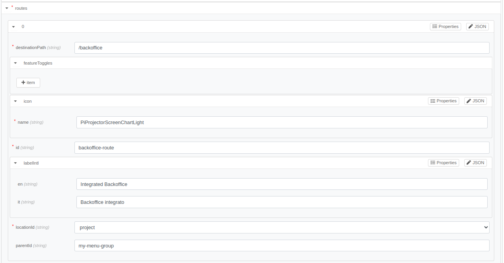
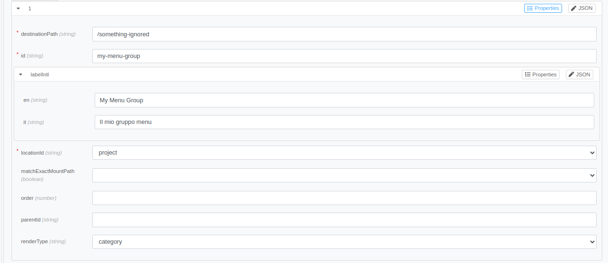
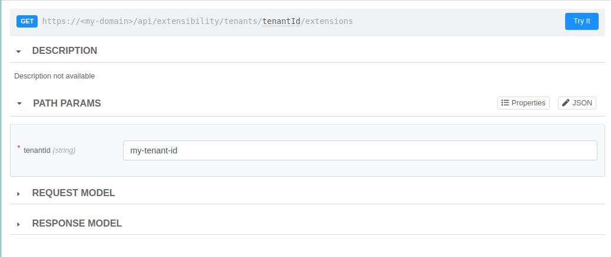
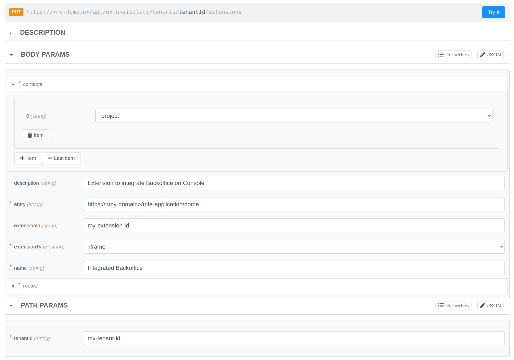
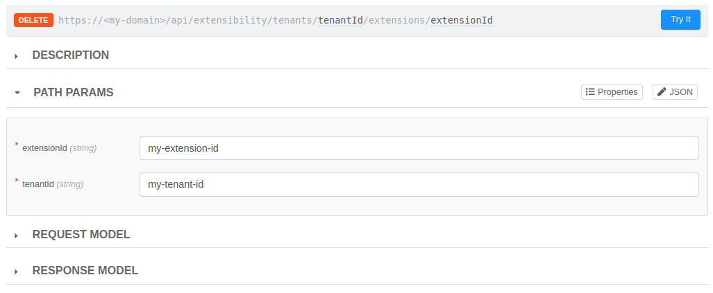

# Register Extensions

A new extension should always be registered on the Console before it can be activated. Registered extensions are owned by specific Companies, thus the registration and management operations on extensions can only be performed by a Company Owner.

## How to register my extension?

If you want to register a new extension, you will need to have already chosen the Company that will own it and ensure that you have the role of Company Owner on that Company. Once this is done, the registration can be done via API, and we recommend using the API Portal to forge requests.

The route to contact is `PUT /api/extensibility/tenants/{tenantId}/extensions`, which you can find under the tags `Companies` or `Extensibility`.



As can be seen from the example image, registering an extension requires providing some necessary information for proper rendering in the Console.

**Path Params**
- `tenantId`: insert the tenant ID of the Company that will own the new extension

**Body Params**
- `name` (_required_): provide the name of your extension
- `contexts` (_required_): declare in which contexts the extension can be activated. The selectable values are Company and Project.
- `description`: provide a brief description of the extension
- `entry` (_required_): indicate the URL where the iframe will be fetched
- `extensionType` (_required_): select the type of extension. For now, only the `iframe` type is supported
- `permissions`: indicate which permissions users will need to have to see the extension once activated (further details in the [next section](#how-to-restrict-the-extension-usage))
- `routes` (_required_): provide the menu items that should appear on the sidebar once the extension is activated

### How to restrict the extension usage?

A registered extension can specify an array of `permissions` that is used to check whether or not a user can see the extension in the Console, once activated. In particular, the user must have **at least one of the required permissions in the array**. You can find the list of allowed permissions to be registered on an extension in the dedicated table inside the [Identity and access management page](../../development_suite/identity-and-access-management/console-levels-and-permission-management.md#identity-capabilities-inside-console).

### How to configure correctly the extension menu item?





The routes should include the necessary information to render the extension menu item on the Console sidebar, which enables access to the extension. A route can be registered with the `renderType` left unset to appear as a simple menu item, or it can be a `category` route, creating a new custom menu group to which menu items can be attached.

:::info
Each extension should include at least one route that is not of type `category` to be meaningful. Additionally, it can optionally include at most one route of type `category` to add a custom group menu item.
:::

A route, therefore, requires to provide the following information:
- `id` (_required_): assign a unique identifier that can be used for applying overrides during activation or for attaching other menu items when the route's `renderType` is set to `category`.
- `locationId` (_required_): choose a location to place your route (see the [supported locations](/console/console-extensibility/locations.md))
- `renderType`: select `category` if you want to add a new menu group, otherwise leave it unset to add a simple menu item
- `parentId`: insert the route `id` of a menu group where you want to attach the menu item. It is possible to choose existing parentIds documented on the [supported locations page](/console/console-extensibility/locations.md) or add a route of type `category` and use its `id`. This value can be omitted for the `category` route.
- `destinationPath`: indicate the destination suffix to which you will be redirected when clicking the menu item and it will compose the URL where the iframe will be mounted; in fact, the resulting URL will be composed according to this pattern `<locationPath>/extensions/<extensionId><destinationPath>`. This value can be omitted for the `category` route.
- `icon`: select an icon for the new menu item and fill the `icon.name` field. You can find the icons at this [link](https://react-icons.github.io/react-icons/search/), but only Ant, Feather and Phosphor icons are supported. This value can be omitted for the `category` route.
- `labelIntl` (_required_): insert the label to be used on the menu item or menu group and fill this field providing an object JSON `{"en": string, "it": string}` so that the text is also internationalized.
<!-- TODO: Should be added some mentions about the order of menu items? -->

#### Register Backoffice Extension Example

The following example shows how to register the Backoffice as a Project extension. To reproduce it, you will need to configure the Backoffice and expose it in such a way that it can be used as an iframe.

Before proceeding make sure you have:

1. A project reachable externally, otherwise create one by referring to this [guide](/console/project-configuration/create-a-project.mdx).
2. The `Microfrontend Composer Toolkit` application created and exposed to view the Backoffice frontend. Follow this section of the [guide](/microfrontend-composer/tutorials/basics.mdx#setup-the-microservices) to do so.
3. The response from the Backoffice endpoint can be embedded within an iframe. See this [link](/development_suite/api-console/api-design/endpoints.md#manage-advanced-endpoint-parameters) for more information.

Once this is done, you can register the Backoffice as an extension:

**Path Params**
```json
{
  "tenantId": "my-tenant-id"
}
```

**Body Params**
```json
{
  "contexts": ["project"],
  "description": "Extension to integrate Backoffice on Console",
  "entry": "https://<my-domain>/mfe-application/home",
  "extensionType": "iframe",
  "name": "Integrated Backoffice",
  "routes": [
    {
      "destinationPath": "/backoffice",
      "icon": {
        "name": "PiProjectorScreenChartLight"
      },
      "id": "backoffice-route",
      "labelIntl": {
        "en": "Integrated Backoffice",
        "it": "Backoffice integrato"
      },
      "locationId": "project",
      "parentId": "my-menu-group"
    },
    {
      "id": "my-menu-group",
      "labelIntl": {
        "en": "My Menu Group",
        "it": "Il mio gruppo menu"
      },
      "locationId": "project",
      "renderType": "category"
    }
  ]
}
```

**Response on success**
```json
{
    "extensionId":"my-extension-id"
}
```

The extension ID will be necessary for working with the extension through the remaining APIs and can be retrieved using a specific API listed below.

## Get registered Extensions

The route `GET /api/extensibility/tenants/{tenantId}/extensions` allows you to retrieve all registered extensions under a specific Company. This functionality is readily accessible via the API Portal under the 'Companies' or 'Extensibility' tags, provided you have the Company Owner role for the selected Company.



### Get Registered Backoffice Extension Example

**Path Params**
```json
{
  "tenantId": "my-tenant-id"
}
```

**Response on success**
```json
[
  {
    "extensionId":"my-extension-id",
    "name":"Integrated Backoffice",
    "description":"Extension to integrate Backoffice on Console"
  }
]
```

## Edit registered Extension

The route `PUT /api/extensibility/tenants/{tenantId}/extensions` can be used to edit an already registered extension simply specifying the `extensionId` and providing all the information to apply, including those that should remain unchanged. This route can also be contacted with the API Portal under the tags `Companies` or `Extensibility`, ensuring you have the role of Company Owner on the requested Company.



#### Edit Backoffice Extension Example

In this example, the Backoffice extension registered [here](#register-backoffice-extension-example) is edited changing the label of its menu item:

**Path Params**
```json
{
  "tenantId": "my-tenant-id"
}
```

**Body Params**
```json
{
  "contexts": ["project"],
  "extensionId": "my-extension-id",
  "description": "Extension to integrate Backoffice on Console",
  "entry": "https://<my-domain>/mfe-application/home",
  "extensionType": "iframe",
  "name": "Integrated Backoffice",
  "routes": [
    {
      "destinationPath": "/backoffice",
      "icon": {
        "name": "PiProjectorScreenChartLight"
      },
      "id": "backoffice-route",
      "labelIntl": {
        "en": "Integrated Backoffice Edited",
        "it": "Backoffice integrato Modificato"
      },
      "locationId": "project",
      "parentId": "my-menu-group"
    },
    {
      "id": "my-menu-group",
      "labelIntl": {
        "en": "My Menu Group",
        "it": "Il mio gruppo menu"
      },
      "locationId": "project",
      "renderType": "category"
    },
  ]
}
```

**Response on success**: 
```
204 No Content
```

## Remove registered Extension

The route `DELETE /api/extensibility/tenants/{tenantId}/extensions/{extensionId}` can be used to remove an already registered extension. It can be contacted via API Portal under the tags `Companies` or `Extensibility` and it is required the Company Owner role on the requested Company.

:::info
Deleting an extension automatically deactivates it from all contexts where it was active.
:::



#### Remove Backoffice Extension Example

To remove the Backoffice extension registered [here](#register-backoffice-extension-example) specify the `tenantId` on which it was registered and its `extensionId`:

**Path Params**
```json
{
  "tenantId": "my-tenant-id",
  "extensionId": "my-extension-id"
}
```

**Response on success**: 
```
204 No Content
```