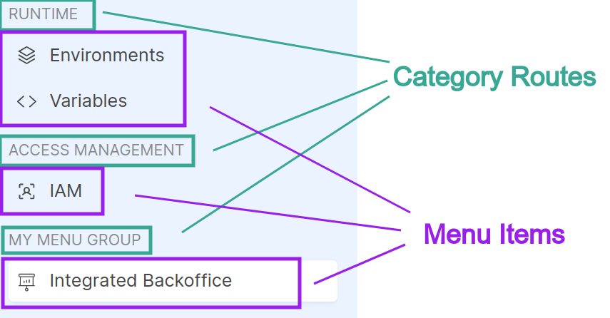

# Register Extensions

Before [activating an extension](/console/console-extensibility/activation.md), you must register it on Console. Registered extensions are owned by specific Companies, thus the registration and management operations on extensions can only be performed by a Company Owner.

## How to register your extension?

If you want to register a new extension, you will need to have already chosen the Company that will own it and ensure that you have the role of Company Owner on that Company. Once this is done, the registration can be done via API, and we recommend using the API Portal to forge requests.

The route to contact is `PUT /api/extensibility/tenants/{tenantId}/extensions`, which you can find under the tags `Companies` or `Extensibility`.

**Path Params**
- `tenantId`: insert the tenant ID of the Company that will own the new extension

**Body Params**
- `extensionId`: this field should be empty when creating an extension. It is required to edit a extension already registered (see [here](#edit-registered-extension) for more info)
- `name` (_required_): provide the name of your extension
- `contexts` (_required_): declare in which contexts the extension can be activated. The selectable values are Company and Project.
- `description`: provide a brief description of the extension
- `entry` (_required_): indicate the website URL that will be embedded on Console. This URL can be parametrized using special keywords that the Console is able to resolve (see the [relative section](/console/console-extensibility/locations.md#parametrized-iframe-entry))
- `extensionType` (_required_): select the type of extension. For now, only the `iframe` type is supported
- `permissions`: indicate which permissions users will need to have to see the extension once activated (further details in the [next section](#how-to-restrict-the-extension-usage))
- `routes` (_required_): provide the menu items that should appear on the sidebar once the extension is activated

**Response**
- `extensionId`: the extension identifies needed to manage the registered extension

:::tip
**[See the example in the tutorial page](/console/tutorials/create-extension.md#1-register-backoffice-extension)**
:::

:::info
Please note that `labelIntl` is required, the `icon` field instead is optional; if set it must contain the required `name` property, useful to specify the icon name to be used.
:::

### How to restrict the extension usage?

A registered extension can specify an array of `permissions` that is used to check whether or not a user can see the extension in the Console, once activated. In particular, the user must have **at least one of the required permissions in the array**. You can find the list of allowed permissions to be registered on an extension in the dedicated table inside the [Identity and access management page](/development_suite/identity-and-access-management/console-levels-and-permission-management.md#identity-capabilities-inside-console).

### How to configure correctly the extension menu item?

The routes should include the necessary information to render the extension menu item on the Console sidebar, which enables access to the extension. A route can be registered with the `renderType` left unset to appear as a simple menu item, or it can be a `category` route, creating a new custom menu group to which menu items can be attached.



:::info
Each extension should have always only one route that is not of type `category` to be meaningful and visible. Additionally, it is possible, to include another route of type `category` to add a custom group menu item and therefore include an extension under that group.
:::

A route, therefore, requires to provide the following information:
- `id` (_required_): assign a unique identifier that can be used for applying overrides during activation or for attaching other menu items when the route's `renderType` is set to `category`.
- `locationId` (_required_): choose a location to place your route (see the [supported locations](/console/console-extensibility/locations.md))
- `renderType`: select `category` if you want to add a new menu group, otherwise leave it unset to add a simple menu item (see in the image above the distinction among menu groups and menu items)
- `parentId`: insert the route `id` of a menu group where you want to attach the menu item. It is possible to choose existing parentIds documented on the [supported locations page](/console/console-extensibility/locations.md) or add a route of type `category` and use its `id`. This value can be omitted for the `category` route.
- `destinationPath`: indicate the destination suffix to which you will be redirected when clicking the menu item and it will compose the URL where the iframe will be mounted; in fact, the resulting URL will be composed according to this pattern `<locationPath>/extensions/<extensionId><destinationPath>`. This value can be omitted for the `category` route.
- `icon`: select an icon for the new menu item and fill the `icon.name` field. You can find the icons at this [link](https://react-icons.github.io/react-icons/search/), but only Ant, Feather and Phosphor icons are supported. After pick an icon, you can use the React component name represented in the code example (e.g. the Phosphor icon `<PiAirplaneTiltFill />` has `PiAirplaneTiltFill` as name). This value can be omitted for the `category` route.
- `labelIntl` (_required_): insert the label to be used on the menu item or menu group and fill this field providing an object JSON `{"en": string, "it": string}` so that the text is also internationalized.
- `order` (_required_): insert optionally this numeric value used to sort in ascending order the menu items on the sidebar. During the rendering, the `category` menu are sorted first and then the menu items attached on a specific `category` menu.

## Get registered Extensions

The route `GET /api/extensibility/tenants/{tenantId}/extensions` allows you to retrieve all registered extensions under a specific Company. This functionality is readily accessible via the API Portal under the 'Companies' or 'Extensibility' tags, provided you have the Company Owner role for the selected Company.

**Path Params**
- `tenantId`: insert the tenant ID of the Company which you want to retrieve the registered extensions of

**Response on success**
Array of registered extensions metadata:

- `extensionId`: extension identifier
- `name`: extension name
- `description`: extension description

:::tip
**[See the example in the tutorial page](/console/tutorials/create-extension.md#2-check-that-the-new-extension-is-registered)**
:::

## Edit registered Extension

The route `PUT /api/extensibility/tenants/{tenantId}/extensions` can be used to edit an already registered extension simply specifying the `extensionId` and providing all the information to apply, including those that should remain unchanged. This route can also be contacted with the API Portal under the tags `Companies` or `Extensibility`, ensuring you have the role of Company Owner on the requested Company.

**Path Params**
- `tenantId`: insert the tenant ID of the Company that will own the new extension

**Body Params**
- `extensionId` (_required to edit_): provide the ID of the extension to edit 
- `name` (_required_): provide the name of your extension
- `contexts` (_required_): declare in which contexts the extension can be activated. The selectable values are Company and Project.
- `description`: provide a brief description of the extension
- `entry` (_required_): indicate the website URL that will be embedded on Console. This URL can be parametrized using special keywords that the Console is able to resolve (see the [relative section](/console/console-extensibility/locations.md#parametrized-iframe-entry))
- `extensionType` (_required_): select the type of extension. For now, only the `iframe` type is supported
- `permissions`: indicate which permissions users will need to have to see the extension once activated (further details in the [section](#how-to-restrict-the-extension-usage))
- `routes` (_required_): provide the menu items that should appear on the sidebar once the extension is activated

**Response on success**: 
```
204 No Content
```

:::tip
**[See the example in the tutorial page](/console/tutorials/create-extension.md#edit-the-registered-extension)**
:::

:::info
Please note that `labelIntl` is required, the `icon` field instead is optional; if set it must contain the required `name` property, useful to specify the icon name to be used.
:::

## Remove registered Extension

The route `DELETE /api/extensibility/tenants/{tenantId}/extensions/{extensionId}` can be used to remove an already registered extension. It can be contacted via API Portal under the tags `Companies` or `Extensibility` and it is required the Company Owner role on the requested Company.

:::info
Deleting an extension automatically deactivates it from all contexts where it was active.
:::

**Path Params**
- `tenantId`: insert the tenant ID of the Company that own the extension to remove
- `extensionId`: insert the ID of the extension to remove

**Response on success**: 
```
204 No Content
```

:::tip
**[See the example in the tutorial page](/console/tutorials/create-extension.md#6-remove-definitely-the-backoffice-extension)**
:::