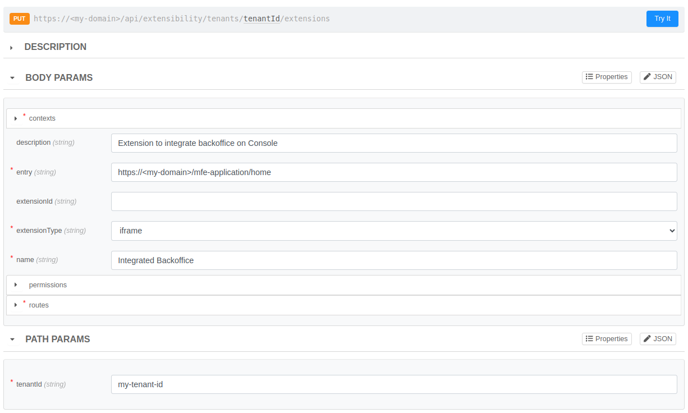

# Register Extensions

Una nuova estensione ha bisogno sempre di essere registrata sulla Console prima di poter essere attivata. Il processo avviene salvando l'estensione sotto il dominio della propria Company ed è per questo motivo che questa operazione può essere fatta solo dal Company Owner.

## How to register my extension?

Se vuoi registrare una nuova estensione, sarà necessario aver già scelto la Company che ne avrà possesso e assicurarsi di avere il ruolo di Company Owner su tale Company. Una volta fatto questo, la registrazione può essere fatta tramite API e consigliamo di utilizzare l'API Portal per forgiare le richieste.

La rotta da contattare è la `PUT /api/extensibility/tenants/{tenantId}/extensions` e la puoi trovare sotto il tag `Companies` o `Extensibility`. 



Come si può vedere dall'immagine di esempio, la registrazione di un estensione richiede di fornire alcune informazioni necessarie per la renderizzazione corretta in Console.

**Path Params**
- `tenantId`: inserire il tenant ID della Company che avrà ownership della nuova estension

**Body Params**
- `name`: riporta il nome della tua estensione
- `contexts`: dichiara in quali contesti potrà essere attivata l'estensione. I valori selezionabili al momento sono Company e Project.
- `description`: fornisci una descrizione breve dell'estensione 
- `entry`: indica l'url dove verrà fetchato l'iframe
- `extensionType`: seleziona il tipo di estensione. Per ora solo il tipo iframe è supportato
- `permissions`: indica quali permessi dovranno avere gli utenti per poter vedere l'estensione una volta attiva (maggiori approfondimenti nella [sezione](#how-to-restrict-the-extension-usage) successiva)
- `routes`: fornisci le voci di menu che dovranno comparire sulla sidebar una volta attivata l'estensione

### How to restrict the extension usage?

Le estensioni registrate possono anche conservare un array di `permissions` che serve per verificare se un utente può vedere l'estensione attiva in Console oppure no. In particolare l'utente dovrà avere **almeno uno dei permessi richiesti nell'array** e i permessi che si possono registrare su un estensione sono quelli della Console riportati in tabella dell'[Identity and access management page](../../development_suite/identity-and-access-management/console-levels-and-permission-management.md#identity-capabilities-inside-console)  

### How to configure correctly the extension menu item? 


Le rotte rappresentano le voci di menu che verranno aggiunte alla sidebar e che ci permettono di accedere all'estensione. Queste rotte devono specificare una location ben precisa e ad ogni location corrisponderanno anche dei menu groups a cui le rotte si possono agganciare. Inoltre su una location è anche possibile registrare delle rotte di tipo `category` che aggiungono nuovi menu groups e utilizzarli per agganciare i nuovi menu items.

Una rotta richede quindi di fornire le seguenti informazioni:
- `id`: assegnare un id univoco che potrà essere utilizzato per applicare degli override con l'attivazione oppure per agganciare dei menu items se il renderType della rotta è `category`
- `locationId`: scegli una location dove inserire la tua rotta (vedi le [location supportate](./locations.md))
- `renderType`: seleziona `category` se vuoi inserire un nuovo menu group altrimenti lascia un valore vuoto per aggiungere un menu item
- `parentId`: inserisci il route `id` di un menu group dove si vuole agganciare il menu item (trovi i parentId già esistenti corrispondenti alle [location supportate](./locations.md)) oppure aggiungi una route di tipo `category` e usa il suo `id`. Puoi omettere questa informazione se la rotta è di tipo `category`.
- `destinationPath`: indica il suffisso di destinazione a cui si verrà rimandati al click del menu item e comporrà l'URL dove verrà montato l'iframe, infatti l'URL finale sarà composta da 3 pezzi `<locationPath>/extensions/<extensionId><destinationPath>`. Puoi omettere questa informazione se la rotta è di tipo `category`.
- `icon`: seleziona un icona da utilizzare sul nuovo menu item e riportala dentro il campo `name`. Puoi trovare le icone su questo [link](https://react-icons.github.io/react-icons/search/) e sono supportate solo le icone di Ant, Feather e Phosphor. Puoi omettere questa informazione se la rotta è di tipo `category`.
- `labelIntl`: inserisci la label che verrà usata sul menu item o menu group e riportala in un oggetto {"en": string, "it": string} affinchè il testo venga anche internazionalizzato.
- `featureToggles`: TBD
<!-- TODO: Should be added some mentions about the order of menu items? -->
<!-- TODO: Explain that the parentId and locationid can be found on location page with redirect -->
<!-- TODO: Explain how add new menu item group where it is placed the registered extension and added an example -->
<!-- TODO: Explain that the route id is required and it is needed to advanced customization (redirect to overrides page) -->

### Complete example
<!-- TODO: Insert some links to backoffice tutorial and to the future doc page about how to expose a frontend on an endpoint and use it as iframe (using envoy)-->

Il seguente esempio mostra come registrare il Backoffice come estensione di Progetto. Per riprodurlo sarà necessario configurare il Backoffice ed esporlo in modo tale che sia possibile utilizzarlo come iframe. I passi preliminari da seguire sono quindi i seguenti:

1. Creare un progetto e configurare envoy con almeno un listener
<!-- TODO: è necessario configurare l'ingress route mi sa -->
2. Aggiungere l'application `Microfrontend Composer Toolkit` seguendo questa [guida](../../microfrontend-composer/tutorials/basics#setup-the-microservices), ma collegando l'api gateway envoy piuttosto che crearne uno nuovo.
3. Esporre i due nuovi endpoint creati dall'applicazione sul listener e impostare `Iframe embedding options` su `Any origin`(ricordarsi di salvare)
4. Deployare e verificare che il Backoffice è accessibile esternamente


**Path Params**
```json
{
  "tenantId": "my-tenant-id"
}
```

**Body Params**
```json
{
  "contexts": ["project"],
  "description": "Extension to integrate backoffice on Console",
  "entry": "https://<my-domain>/mfe-application/home",
  "extensionType": "iframe",
  "name": "Integrated Backoffice",
  "routes": [
    {
      "id": "my-menu-group",
      "labelIntl": {
        "en": "My Menu Group",
        "it": "Il mio gruppo menu"
      },
      "locationId": "project",
    },
    {
      "destinationPath": "/backoffice",
      "icon": {
        "name": "PiProjectorScreenChartLight"
      },
      "id": "backoffice-route",
      "labelIntl": {
        "en": "Integrated Backoffice",
        "it": "Backoffice integrato"
      },
      "locationId": "project",
      "parentId": "my-menu-group"
    }
  ]
}
```

**Response**
```json
{
    "extensionId":"<your-extension-id>"
}
```

L'estension ID sarà un dato richiesto per controllare l'estensione con le restanti API e potra essere recuperato con le

<!-- TODO: Added an image of an example on the API Portal with the complete payload and the response  -->

<!-- TODO: Explain that the id in the response is required to activate the registered extension -->

## Edit registered Extension

<!-- TODO: Explain that this action can be done only by the Company Owner and using the API Portal -->
<!-- TODO: Explain that the API is the same used to register a new extension but adding the extension id-->
<!-- TODO: Add an image as axample?-->
<!-- TODO: Remember that here the response is empty and the status is 201-->

<!-- INFO: If this section is too short, include it in the section above-->

## Remove registered Extension

<!-- TODO: Explain that this action can be done only by the Company Owner and using the API Portal -->
<!-- TODO: Added an image of an example on the API Portal with the query string and the response  -->
<!-- TODO: Explain that eventually activation will be deleted with the requested extension -->

