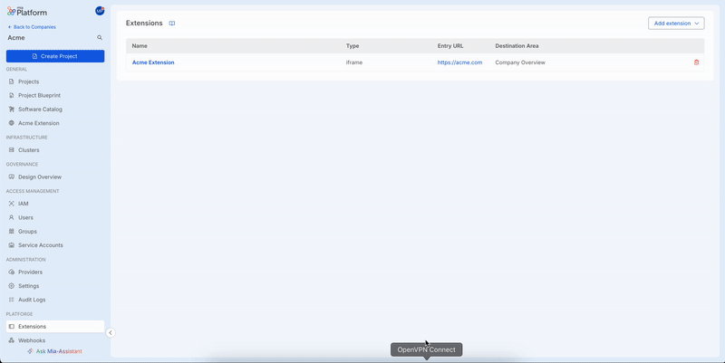

# Integrate Mia-Platform Console Single Sign-On (SSO) for extensions

Using Mia-Platform extensions, users can access custom data and perform custom actions. If this data is protected, or these actions may be restricted to a specific set of users only, you need a way to authenticate the user and validate its permissions.  

By using the *Mia-Platform Console SSO (SSO)* you empower your extensions with this exact capability, getting rid of multiple logins, while also delegating to Mia-Platform all of the heavy lifting and security concerns. In this way you can ony just on what really matters to your users.

Here below you can understand how this feature works and how you can enable it for your extensions.

## Prerequisites

Currently this feature is only available to `iframe` and `external link` extensions. For more information on extension types and features, see [Manage Extensions][docs-manage-extensions].

Your extension needs to define and expose:

- a frontend endpoint that starts the login flow towards the Mia-Platform Console
- a frontend endpoint that will be used by the Console as the [OAuth 2.0 Redirect Endpoint][ietf-redirection-endpoint] when performing the authentication flow
- a backend endpoint that acts as proxy towards the Console `/api/oauth/token` endpoint

These endpoints are described below as [Login Endpoint][extension-login-endpoint], [*Callback URL*][extension-callback-url] and [*Token Endpoint*][extension-token-endpoint].

## Enable Console SSO for extensions

From the extension detail configuration page, scroll down to the *Console SSO* card to enable the feature for your extension. Specify here the Callback URL exposed by the extension and save.

You should now see the *Console SSO* enabled for your extension.



## OAuth 2.0 Flow: Authorization Code Grant

*Console SSO* for an extension implements the OAuth 2.0 flow with *Authorization Code Grant*. This means that under the hood, the login flow follows the scheme below. Learn more about OAuth 2.0 and this specific flow on the [RFC-6749][ietf-oauth-2-auth-code-grant].

     +----------+
     | Resource |
     |   Owner  |
     |          |
     +----------+
          ^
          |
         (B)
     +----|-----+          Client Identifier      +---------------+
     |         -+----(A)-- & Redirection URI ---->|               |
     |  User-   |                                 | Authorization |
     |  Agent  -+----(B)-- User authenticates --->|     Server    |
     |          |                                 |               |
     |         -+----(C)-- Authorization Code ---<|               |
     +-|----|---+                                 +---------------+
       |    |                                         ^      v
      (A)  (C)                                        |      |
       |    |                                         |      |
       ^    v                                         |      |
     +---------+                                      |      |
     |         |>---(D)-- Authorization Code ---------'      |
     |  Client |          & Redirection URI                  |
     |         |                                             |
     |         |<---(E)----- Access Token -------------------'
     +---------+       (w/ Optional Refresh Token)

:::info
When accessing an extension from within the Mia-Platform Console, the user is already logged in the system thus, when starting a new OAuth 2.0 flow for an extension, the user grant is considered implicit and no further action is expected from the user.

This means that in the sequence above, the (B) part is done without requiring any user action. This behavior may however change in the future.
:::

## Extension Login Endpoint

The *Login Endpoint* is the endpoint exposed by the extension frontend and is needed to start an authorization flow.

When navigating to the *Login Endpoint*, the extension generates a new `state` that is used throughout all the login flow.

It does not matter whether this endpoint shows some UI elements to inform the user about the login or not. What matters is that - in order to perform the login - this page MUST redirect the *user-agent* (the browser in use) to the specific extension authorization endpoint of the Console, specifying the generated `state`.

The Console endpoint that handles extension authorization is the following one, preceded by the Console base URL:

`/tenants/{tenantId}/extension/{extensionId}/authz?state={state}`

Here an example:

```js
function performExtensionLogin() {
   const tenantId = 'acme'
   const extensionId = 'acme-extension-123'
   
   // Remember to store the state and validate it throughout the login flow
   const state = 'foo'
   
   window.location.replace(`https://console.cloud.mia-platform.eu/tenants/${tenantId}/extension/${extensionId}/authz?state=${state}`)
}
```

```html
<!-- When user clicks the button the login flow is started -->
<button onclick="performExtensionLogin()">Login with Mia-Platform</button>
```

:::info
How the extension generates and stores the `state` is not scope of this guide.
:::

## Extension Callback URL

As per [OAuth 2.0 specification][ietf-redirection-endpoint]: *"The redirection endpoint URI MUST be an absolute URI [...] The endpoint URI MAY include an "application/x-www-form-urlencoded" formatted query component which MUST be retained when adding additional query parameters. The endpoint URI MUST NOT include a fragment component"*

:::info
Currently, only valid *HTTPS* URLs can be configured as redirection endpoints.  
:::

In OAuth 2.0 with Authorization Code Grant, the *authorization server* redirects the *user-agent* back to the *client* (in this case the extension frontend) using the redirection URI configured earlier (the extension's *Callback URL*), providing an authorization `code` and the `state` provided by the client earlier.

Use both the authorization `code` and the `state` to requests an access token from the Console token endpoint `/api/oauth/token`.

:::info
For safety reasons, all modern browsers block Cross Origin requests, thus you need to implement a proxy endpoint in order to contact the Console token endpoint.
:::

## Extension Token Endpoint

This endpoint exposed by the extension backend is needed to exchange the *Authorization Code* received on the extension *Callback URL* with a valid access token.

This endpoint just acts as a proxy towards the following Console token endpoint, preceded by the Console base URL:

`/api/oauth/token`

Note that when authorizing a user on an extension, the access token is contained in the response body. 

:::info
How the extension access token is stored and communicated to the frontend is not scope of this guide.
:::

## Validate Access Token

An access token generated by the Mia-Platform SSO for your extension defines the following standard JWT claims:

- **iss**: the *issuer* of the token. In this case is the base URL of the Console instance that generated it
- **aud**: the list of *audiences* that the token was generated for. In this case it contains the base URL of your extension

To understand better these and other standard JWT claims, check out the [RFC-7519: JSON Web Token (JWT) - Claims][ietf-jwt-claims].

When using the *Console SSO* for your extension, remember to validate tokens when needed. To do this:

- use the Console `/jwks` endpoint to retrieve the [JSON Web Key][ietf-jwks] Set and validate the token against it
- ensure that the **aud** claim refers to your extension application

:::warning
If the audiences claim (**aud**) does not include your application URL, the token is not valid and you MUST reject that request!
:::

[ietf-redirection-endpoint]: https://datatracker.ietf.org/doc/html/rfc6749#section-3.1.2
[ietf-oauth-2-auth-code-grant]: https://datatracker.ietf.org/doc/html/rfc6749#section-4.1.2
[ietf-jwt-claims]: https://datatracker.ietf.org/doc/html/rfc7519#section-4.1
[ietf-jwks]: https://datatracker.ietf.org/doc/html/rfc7517

[docs-manage-extensions]: /console/company-configuration/extensions.md
[extension-login-endpoint]: #extension-login-endpoint
[extension-callback-url]: #extension-callback-url
[extension-token-endpoint]: #extension-token-endpoint