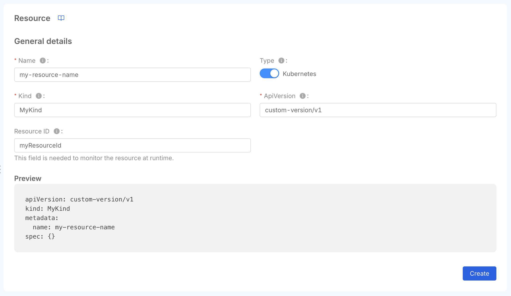
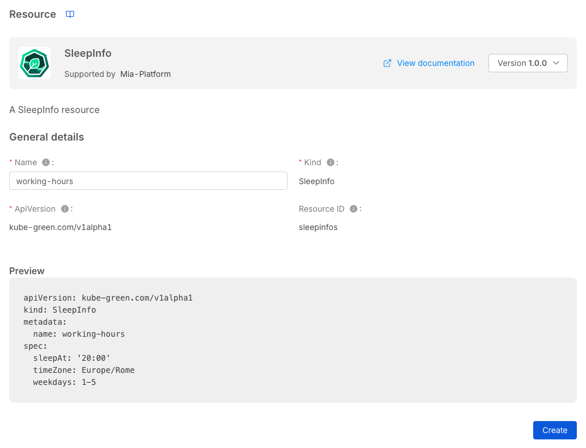
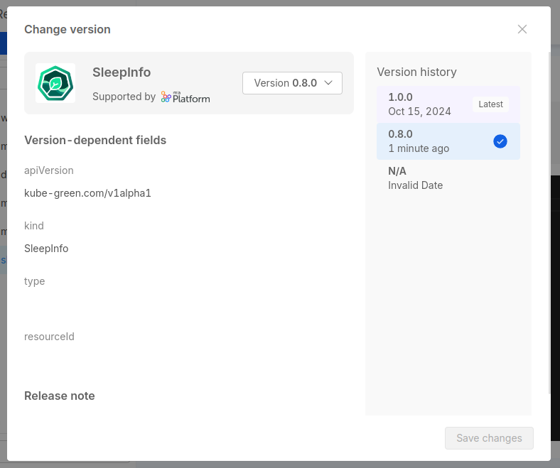

A Custom Resource allows you to define custom objects that are not part of the standard Console resources and can be used to extend the Console capabilities. It provides a way to write configurations that can be translated into different configuration-as-code elements.

## How to use the Custom Resource

With Custom Resources it is possible to:

- configure Kubernetes Custom Resources that are managed by the cluster (e.g. the Traefik `IngressRoute`)
- generate manifests for different runtimes using the [External Configuration Generator](/console/company-configuration/providers/extensions/orchestrator-generator/overview.mdx)
- configure resources for virtually any runtime using templates that are populated with custom values at deployment time

To learn more about possible use cases, you can go to the [dedicated section](/console/design-your-projects/custom-resources/use-cases.md)

## How to manage a Custom Resource in Console

It is possible to manage the Custom Resource from inside the Design section of the Console, in the dedicated area called *Custom Resources*.

### Create a Custom Resource

It is possible to create a new Custom Resource from Marketplace or from scratch.

#### Create a Custom Resource from Scratch

To create a resource from scratch, you need to provide the following information:

- **name**: the name of the Custom Resource. It will be used to generate the manifest, and cannot be changed during updates;
- **apiVersion**: the apiVersion of the Custom Resource, it can be any string. If you are creating a Kubernetes Custom Resource, it must be the apiVersion of the Custom Resource Definition;
- **kind**: the kind of the Custom Resource, it can be any string. If you are creating a Kubernetes Custom Resource, it must be the kind of the Custom Resource Definition.

In creation, you will see the preview of the generated manifest.

#### Create a Custom Resource from Marketplace

:::info
To allow users to add a Custom Resource to their project from marketplace, you need to apply it using `miactl` ([see here for details](/marketplace/add_to_marketplace/add_item_by_type/add_custom_resource.md)).
:::

To create a resource from Marketplace, you need to select the Custom Resource you want to create.

The Marketplace could contain *versioned* Custom Resources. In that case, when selecting the Custom Resource to create, you will see the available versions and you will be able to select the one you prefer.

In this case, you can only modify the *name* of the Custom Resource: the *kind* and the *apiVersion* fields are managed by the versioned marketplace item, so you cannot modify them manually, neither during the creation nor the update.

### Update a Custom Resource

Once you have created a Custom Resource, it will be possible to update it. Click on the Custom Resource you want to update in the sidebar, and you will see a YAML editor.

The Custom Resource has some supported fields, other fields will be ignored. The supported fields are:

- **apiVersion** (*required*): the apiVersion of the Custom Resource, it can be any string. If you are creating a Kubernetes Custom Resource, it must be the apiVersion of the Custom Resource Definition;
- **kind** (*required*): the kind of the Custom Resource, it can be any string. If you are creating a Kubernetes Custom Resource, it must be the kind of the Custom Resource Definition.
- **metadata** (*required*): the metadata of the Custom Resource, it can be any object;
  - **name** (*required*): the name of the Custom Resource. It will be used to generate the manifest, and cannot be changed during updates;
  - **labels**: the labels of the Custom Resource, it can be any key/value pair;
  - **annotations**: the annotations of the Custom Resource, it can be any key/value pair;
- **spec** (*required*): the spec of the Custom Resource, it can be any object.

Custom Resources created from Marketplace items can not have the `apiVersion` and the `kind` fields modified. Attempting to do so will result in an error badge shown in the UI, and the updates on the manifest will be ignored.

Each version of the Custom Resource defines specific values for these fields.
You can select a new version by clicking on the icon at the top right corner of the badge, near the version name, and selecting the *Change version* option from the pop-up menu.
A modal window will open, where you can see the available versions of the Custom Resource and select the one you want to use.

Inside the modal you can also see the `apiVersion` and the `kind` of the Custom Resource of the selected version, to give you a better idea of the configuration you are selecting.

In case you need to update the `apiVersion` and the `kind` fields manually, completely changing the configuration of the Custom Resource, you can do so by clicking the *Detach from Marketplace* button on the menu:this will detach the Custom Resource from the original Marketplace item, causing the resource to be fully editable.
However, you will not be able to use the Marketplace versioning feature anymore, and you will not be notified by any update made by the Marketplace creator of that item.

:::info
A version labelled with *N/A* refers to a Marketplace item that did not include a version when it was created.
This means that it has been created before the support of versioning in the Marketplace was implemented.

However, it does not mean that this version is not supported anymore, or that it is less secure: check out the available versions and choose the one that fits your needs. In case of further questions, please contact the Marketplace item creator.
:::

### Delete a Custom Resource

To delete a Custom Resource, you have to click on the delete button at the bottom of the page.

You need to insert the Custom Resource name and click on the delete button.

## How to manage a Custom Resource in the Marketplace

Users with appropriate permissions can manage the lifecycle of a Custom Resource on the Marketplace, being able to publish their own Custom Resources and update them.

Custom Resources are published to the Marketplace using the `custom-resource` type in the marketplace item schema. Versioning is supported, allowing users to make updates without overwriting previous versions of the Custom Resource.

To learn more on how to add a Custom Resource to the Marketplace, see the [Add Custom Resource to the Marketplace](/marketplace/add_to_marketplace/add_item_by_type/add_custom_resource.md) section.

### Template-based Custom Resource management

Certain Custom Resources available in the Marketplace are built using templates. The custom resource item in the Marketplace defines a `generator` field that specifies the template and base folder for generated files. Templates are stored as strings and interpolated at deployment time.

:::info
The `apiVersion` field must be set to `custom-generator.console.mia-platform.eu/v1` to dynamically generate the resource from the Marketplace.
:::

After creating the resource, the user can proceed with its deployment. The template outlines the configuration files that will be generated during deployment, when the template is populated with user-provided values, and the resulting files are stored in a dedicated folder as defined in the Marketplace item specification.

## Future Improvements

In the future, we plan to add more features to the Resources, such as:

- see the Custom Resources runtime inside the Runtime Section of the Console;
- manage Custom Resource with a specific dynamically generated UI.
