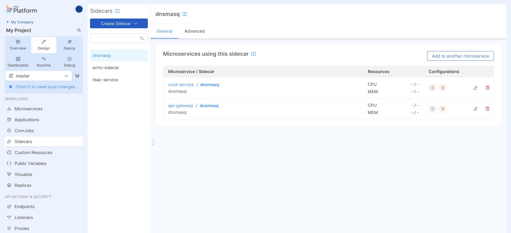
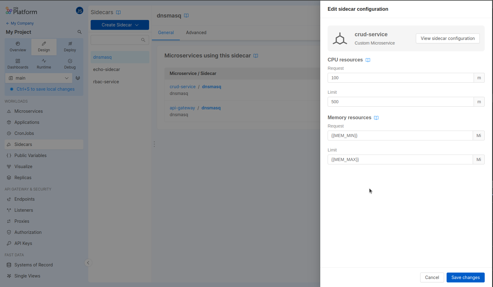
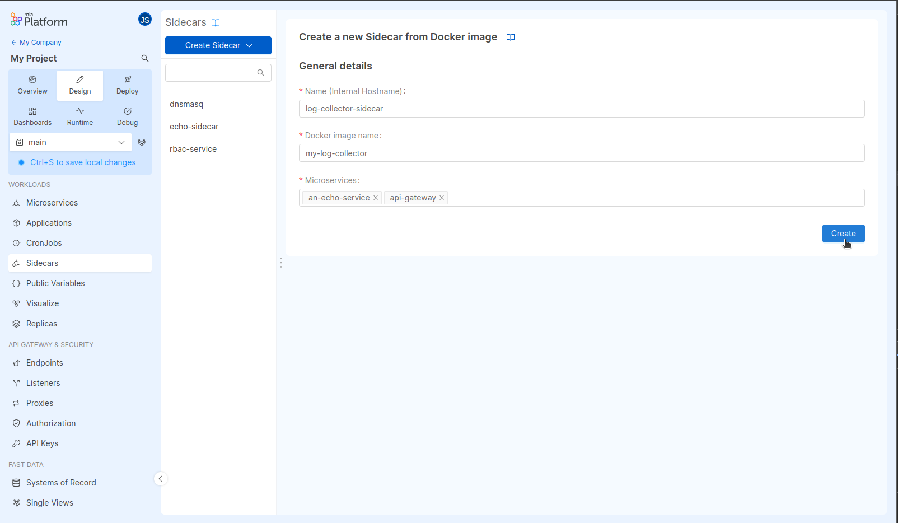
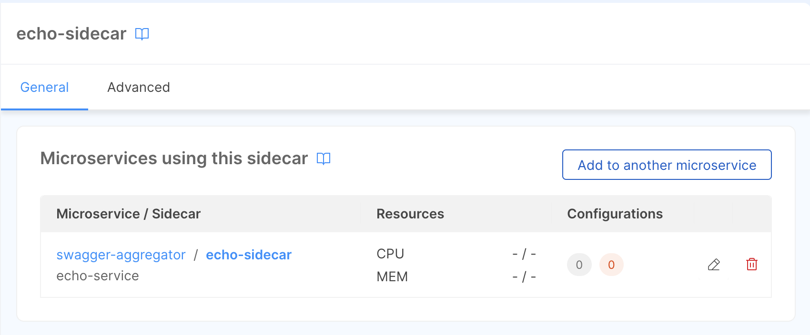
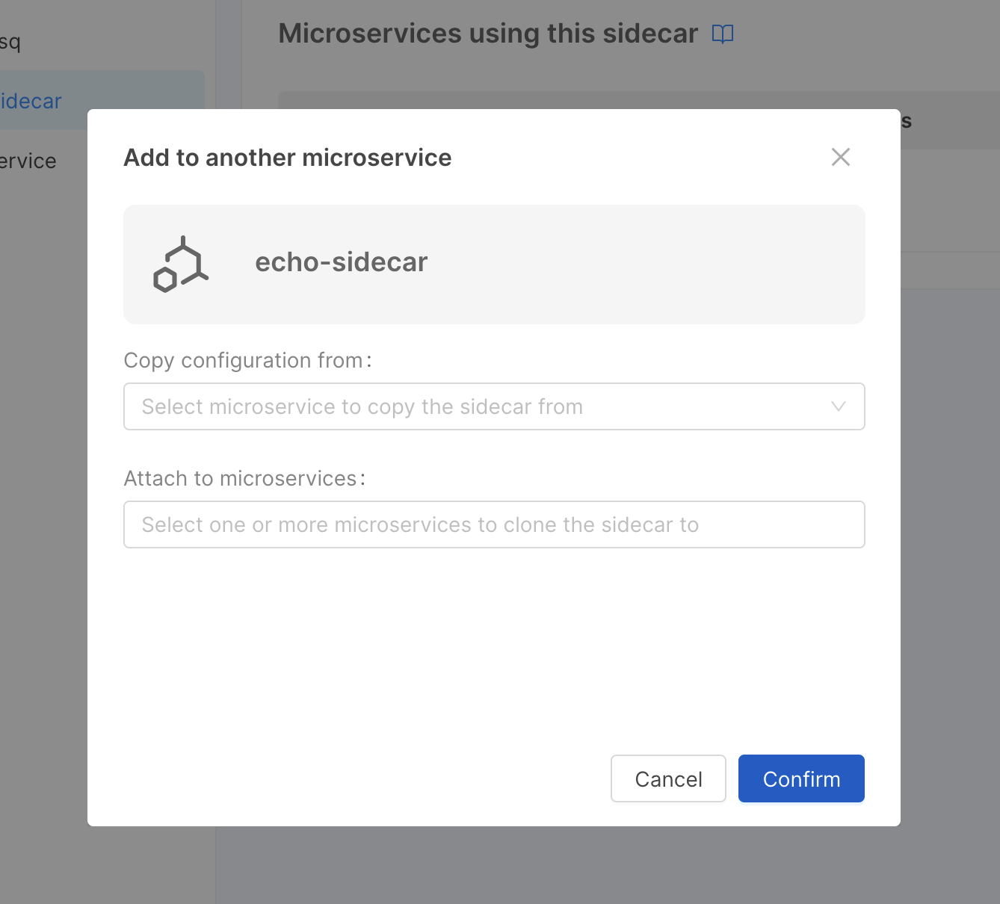
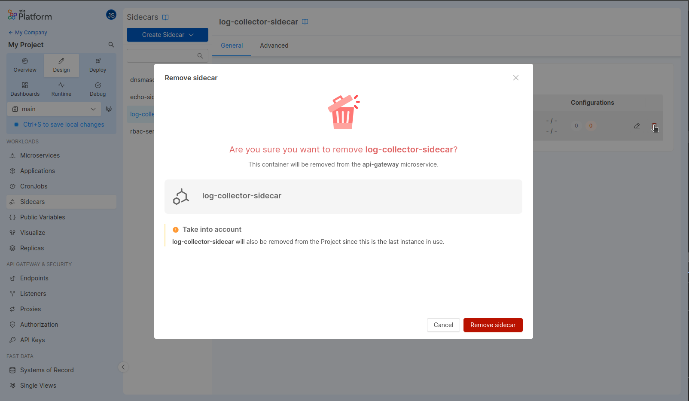
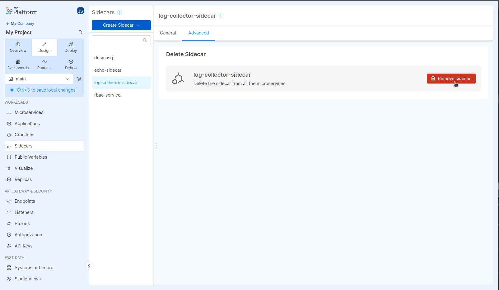
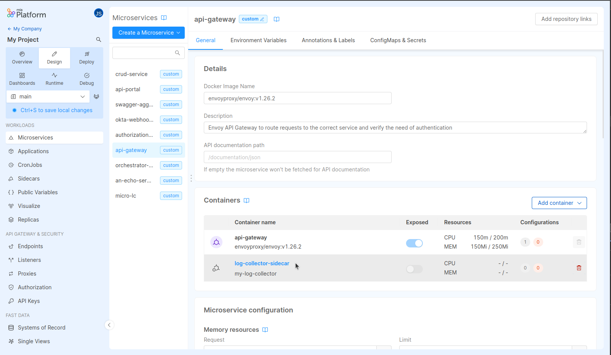

## What is a Sidecar

A sidecar is a secondary container that runs together with the [**main application container**](/development_suite/api-console/api-design/microservice-containers.md#main-container) inside a Pod.  
In your Console Projects, sidecars can be added to microservices to enhance or extend their functionality by providing additional features such as security, logging or data synchronization.

To better understand the difference between main and sidecar containers, check out [Microservice Containers](/development_suite/api-console/api-design/microservice-containers.md).

## Managing your Sidecars

From the Design area, you can manage all sidecars configurations for your microservices from the dedicated **Sidecars** section.
You can also configure them directly from the **Sidecar detail page** inside the microservice the sidecar is attached to.

### Sidecars overview section

To have an overview of all sidecars in your Project and the microservices they are attached to, head over to the **Sidecars section**.  

For each sidecar, you can see all microservices that use it, as well as some information about the sidecar itself, such as:

- Docker image
- CPU and Memory resources
- ConfigMaps and Secrets

By clicking on the Edit button inside the table, you can update the sidecar resources configuration for a specific microservice.

If you want to view the sidecar configuration in detail, use the **View sidecar configuration** button or click on the the sidecar
name in the table row to go to its [detail page](/development_suite/api-console/api-design/microservice-containers.md#sidecar-detail) inside the microservice it is attached to.

:::info
Some sidecar configurations cannot be directly modified in this page.
This is the case of [Special sidecars](/development_suite/api-console/api-design/microservice-containers.md#special-sidecars) that are managed by specific Console sections.
:::

#### Create sidecar

You can add a new sidecar to your services by choosing an already existing sidecar configuration from the Marketplace or by specifying a docker image.
To do this, select your best fitting solution from the **Create sidecar** dropdown.  
From the creation form you can select multiple services to which the sidecar will be added.

:::tip
If you want to create a new instance of a sidecar you are already using in some microservice you can always [clone it](#clone-a-sidecar)!
:::

:::tip
It is possible to define and publish sidecar resource definitions on the Marketplace.
Find out more in the [Publish your sidecar to the Marketplace](/software-catalog/manage-items/mia-ctl/create/create-item-by-type/create_sidecar.md) guide.
:::

#### Clone a sidecar

Sometimes you may need to **replicate a sidecar configuration** for new microservices you have created:
this is the scenario where you may need to **clone an existing sidecar** configuration into one or more existing microservices.

To do so you can use the **_Add to another microservice_** microservice button.

In the dialog, then select the microservices you wish to **copy the configuration from** and **one or more** microservices where the configuration
should be **cloned to**.

  

  

By doing so a **new copy** of the sidecar with all the configurations you previously set up will be created.

#### Delete a sidecar

You can remove a sidecar from a microservice by clicking on the Delete button inside the table row.  

:::caution
If the sidecar is used only by one microservice, removing it from the microservice will result in completely deleting the sidecar from the Project.

:::

Alternatively you can entirely remove the sidecar from the Project and from all microservices that are using it. This action can be done from the Advanced tab.

### Microservice sidecars

Another way to view and manage sidecars configurations is from the [microservice detail page](/development_suite/api-console/api-design/microservice-containers.md).  
From here you can find an overview of all the containers configured for the microservice (both main and sidecar containers) and configure the specific sidecar container configuration for your needs.

