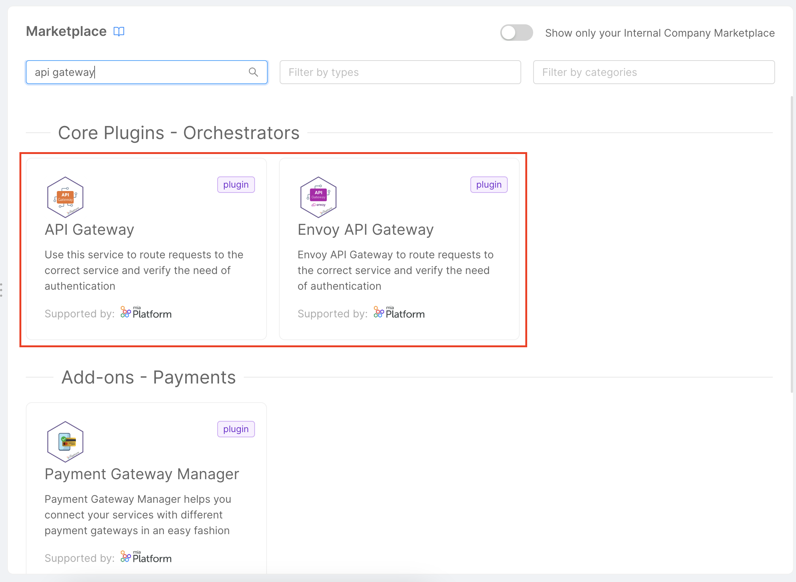
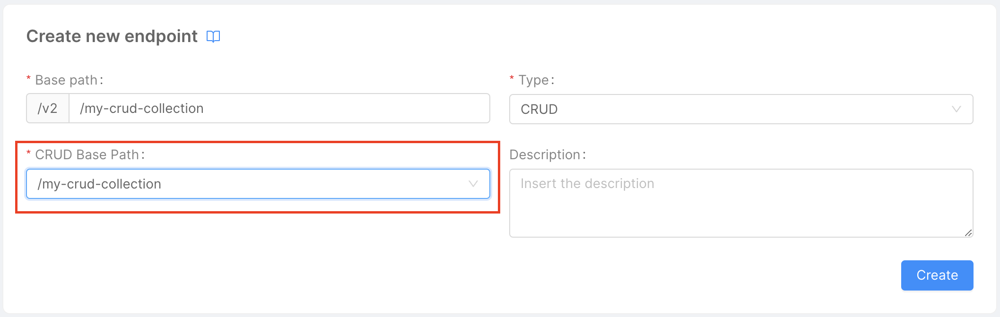
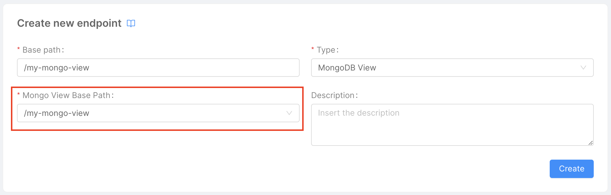
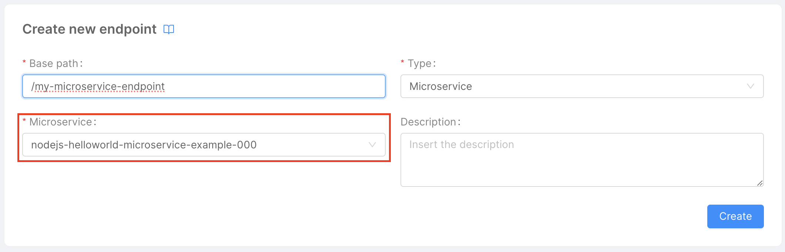
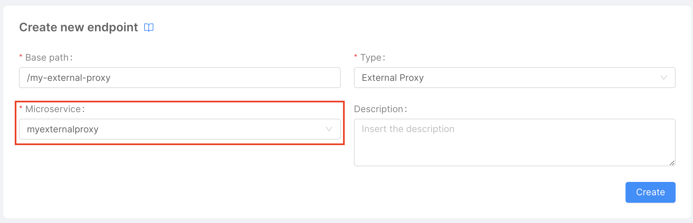
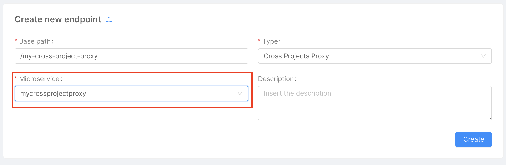
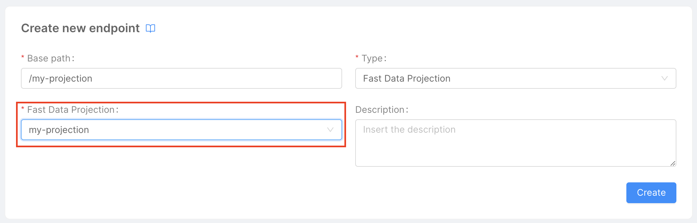
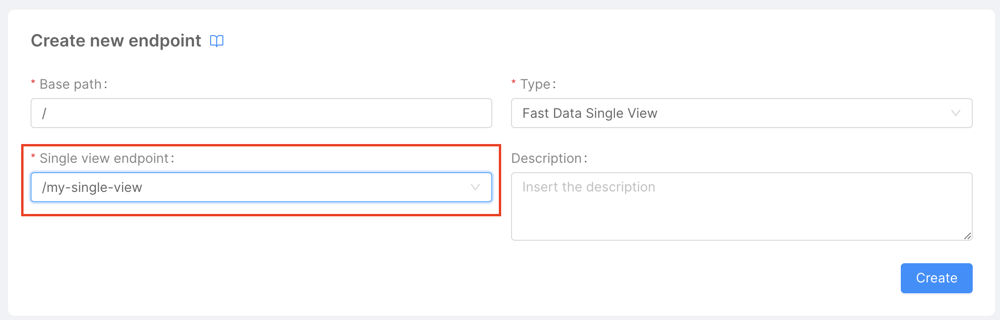

In this guide, we will see how to configure the various types of endpoints available in my platform console, including:
- [CRUD](#create-a-crud-endpoint)
- [MongoDB View](#create-a-mongodb-view-endpoint)
- [Microservice](#create-a-microservice-endpoint)
- [External Proxy](#create-an-external-proxy-endpoint)
- [Cross Project Proxy](#create-a-cross-project-proxy-endpoint)
- [Fast Data Projection](#create-a-fast-data-projection-endpoint)
- [Fast Data Single View](#create-a-fast-data-single-view-endpoint)

To good deeper visit the [Endpoint](/development_suite/api-console/api-design/endpoints.md) dedicated documentation page.

## Prerequisites

Before you begin creating endpoints, it is necessary to have an API Gateway service installed. 
To install it, simply create a new microservice from the marketplace and select "API Gateway" from the available service catalog.

To create a CRUD endpoint you have to move in the `Endpoint` section of the Mia-Platform Console, here you can create new endpoints.

All endpoint types have some basic fields, which are:
- **Base Path**: is the prefix of the route. 
    It can be set as the base address to which the API is served, relative to the host that supplies the endpoint.
- **Description**: an optional description for the endpoint.

:::caution
Please be careful when choosing the **Base Path**, as it cannot be modified after creating the endpoint.
:::

## Create a CRUD Endpoint

Creating an endpoint of type **CRUD** hooks your endpoint directly to one of your CRUDs collections defined in `Data Models/MongoDB CRUD` section in Mia-Platform Console.

:::caution 
To create a CRUD Collection it is necessary to have a CRUD Service installed, to do so you simply create a new Microservice from Marketplace choosing **CRUD Service** from the catalog.
:::

To create a CRUD endpoint you have to click the `Create new endpoint` button and then choose the type `CRUD`.
After that you have to choose the `Base Path` and choose between the available CRUD collection which one you want to expose selecting it in the `CRUD Base Path` fields. 
Optionally you can add a `Description` for the endpoint. 

## Create a MongoDB View Endpoint

Creating an endpoint of type **MongoDB Views** hooks your endpoint directly to one of your MongoDB Views defined in `Data Models/MongoDB Views` section in Mia-Platform Console.

:::caution 
To create a CRUD Collection it is necessary to have a CRUD Service installed, to do so you simply create a new Microservice from Marketplace choosing **CRUD Service** from the catalog.
:::

To create a MongoDB view endpoint have to click the `Create new endpoint` button and then choose the type `MongoDB View`.
After that you have to choose the `Base Path` and choose between the available MongoDB Views which one you want to expose selecting it in the `Mongo View Base Path` fields. 
Optionally you can add a `Description` for the endpoint. 

## Create a Microservice Endpoint

Creating an endpoint of type **MongoDB Views** hooks your endpoint directly to one of your microservice available in Mia-Platform Console. You can define endpoints both for microservices create by you and for microservices created starting from a marketplace item.

:::caution 
Pay attention to configure the `Container Ports` in the Microservice configuration, pay particular attention for microservices created starting from Docker Images.
:::

To create a microservice endpoint you have to click the `Create new endpoint` button and then choose the type `Microservice`.
After that you have to choose the `Base Path` and choose between the available microservices which one you want to expose selecting it in the `Microservice` fields. 
Optionally you can add a `Description` for the endpoint. 

## Create an External Proxy Endpoint

Creating an endpoint of type **External Proxy** hooks your endpoint directly to one of your external proxies available in Mia-Platform Console. 

To create an external proxy endpoint you have to click the `Create new endpoint` button and then choose the type `External Proxy`.
After that you have to choose the `Base Path` and choose between the available external proxies which one you want to expose selecting it in the `Microservice` fields. 
Optionally you can add a `Description` for the endpoint. 

## Create a Cross Project Proxy Endpoint

Creating an endpoint of type **Cross Project Proxy** hooks your endpoint directly to one of your cross project proxies available in Mia-Platform Console. 

To create a cross project endpoint you have to click the `Create new endpoint` button and then choose the type `External Proxy`.
After that you have to choose the `Base Path` and choose between the available cross project proxies which one you want to expose selecting it in the `Microservice` fields. 
Optionally you can add a `Description` for the endpoint. 

## Create a Fast Data Projection Endpoint

Creating an endpoint of type **Fast Data Projection** hooks your endpoint directly to one of your fast data projections available in Mia-Platform Console. 

To create a Fast Data projection endpoint you have to click the `Create new endpoint` button and then choose the type `Fast Data Projection`.
After that you have to choose the `Base Path` and choose between the available fast data projections which one you want to expose selecting it in the `Fast Data Projection` fields. 
Optionally you can add a `Description` for the endpoint. 

## Create a Fast Data Single View Endpoint

Creating an endpoint of type **Fast Data Single View** hooks your endpoint directly to one of your fast data single views available in Mia-Platform Console. 

To create a Fast Data single view endpoint you have to click the `Create new endpoint` button and then choose the type `Fast Data Projection`.
After that you have to choose the `Base Path` and choose between the available fast data single views which one you want to expose selecting it in the `Fast Data Single View` fields. 
Optionally you can add a `Description` for the endpoint. 

