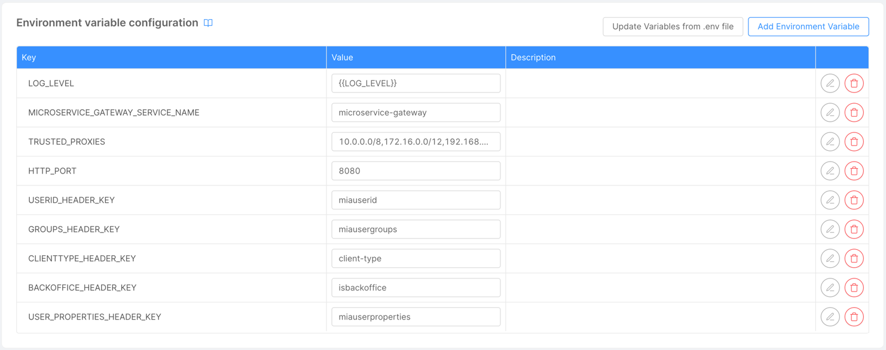
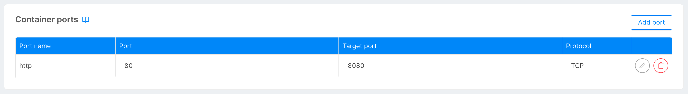

# Microservice Ports

## Understanding the Difference Between the Microservice Port and the Exposed Port

Before diving in, it's essential to grasp the distinction between the "microservice port" and the "port on which the microservice is exposed."

- **Microservice Port**: This is the port on which your microservice is set up to accept connections. It's the "internal" port the service listens on.
- **Exposed Port**: This is the "external" port through which other services or clients connect to communicate with your microservice. This port is often mapped to the microservice's internal port via configurations.

## Managing Ports with Mia-Platform Console

Mia-Platform Console provides capabilities to manage and modify the ports on which your microservice is exposed.

### Environment Variables
Imagine you have a microservice that accepts an environment variable for port configuration.  
In this scenario, we want our service to listen on port 8080.  
To do this, we pass 8080 as a value using the default variable `HTTP_PORT` within the [Environment Variables](/development_suite/api-console/api-design/services.md#environment-variable-configuration) section of the microservice page. 

Our microservice needs to accept this variable from the environment and use it to set up the port on which it listens.  
  
This variable is also utilized by the service to attempt connecting to health [probes](/development_suite/api-console/api-design/microservice-runtime-resources.md#liveness--readiness-probes)  
  

### Container Ports
Now, say externally, for convention or security reasons, we want to expose our microservice on the standard port 80 while maintaining internal communication on port 8080.  
How do we achieve this?

Using the configurations in Mia-Platform Console:

1. From the microservice page navigate to the [**Container Ports**](/development_suite/api-console/api-design/services.md#container-ports-configuration) section.
2. In this example we want to expose our service on External Port 80, so we set **Port** as 80.
3. Our microservice is set to listen on port 8080, so we set **Target Port** as 8080 - This indicates that the external port 80 should map to our microservice's internal port 8080.
4. You can choose the **Protocol** used for communication. You can choose between TCP and UDP. By default for HTTP services, TCP is used.

Once done, other microservices in the cluster can contact our service via port 80 using the appropriate hostname. This mapping ensures that while keeping external conventions, we can have custom and secure internal configurations for our services.

## Default Configuration with Mia-Platform Console

By default, the Mia-Platform Console operates on port 3000.  
This means that microservices using this port internally won't require the configuration steps mentioned earlier. If your service is set to run on port 3000 internally and you intend for it to be accessed externally on this same port, there’s no additional mapping required.  
This default setup ensures a streamlined configuration for developers and reduces the complexity of setting up services that operate on the Console's default port.

