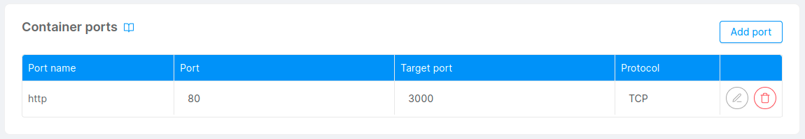
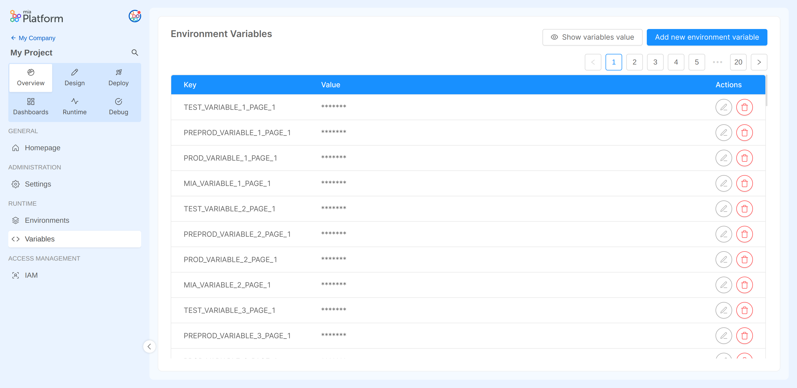
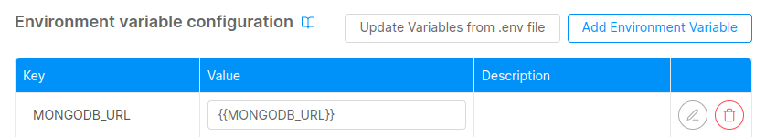

In this guide you will see how to configure:
- services inside the Mia-Platform Console
- development tools in order to use them in the Mia-Platform Console.

## Microservice communication intra-namespace

In this guide you will see how microservices can interact and communicate inside the same namespace.

If you want to call a microservice from within its namespace, you need to use:

-  as hostname, the target microservice's name;
-  as port, the "Port" of the container exposing the endpoint you want to call.

The value set for such port can be find the in the "Port" column of [Container ports](/development_suite/api-console/api-design/microservice-container-ports.md) section of the microservice detail .



Suppose you have two microservices in the same namespace; `service-a` that needs to call `service-b` on the `GET /my-api` endpoint.
To do so `service-a` has to make the following request:

```
GET /my-api HTTP/1.1
Host: service-b:80
```

- `service-b` is the hostname. It is the name of the microservice.
- `80` is the default port for http. Given the "Container Ports" overview it is the value in the `Port` column.
- `/my-api` is the endpoint exposed by `service-b`.

## MongoDB database

The Mia-Platform Console allows you to create, manage and delete the collections inside a mongoDB database.

If you have a MongoDB instance accessible via web this guide will help you connect a database to the Mia-Platform Console. In this guide the examples are made using MongoDB Atlas.

:::info
Here is how to [create a database](https://www.mongodb.com/basics/create-database) given a MongoDB Atlas account.
:::

### Requirements

- Mia-Platform Console
- MongoDB Atlas credentials account
- MongoDB Atlas database

### Configuration

This section explains how to create a new environment variable with the MongoDB connection string  in order to integrate the database with the Mia-Platform Console.

:::info
Here you can find an introduction about [environment variables](/console/project-configuration/manage-environment-variables/index.md).
:::

To perform this action you must be in the _Project Overview_ area of the Console:

1. On the left-side column select the _Variables_ tab to access the **Environment Variable** section.



2. Click on the _Add new environment variable_ button to see the creation modal.


- **Key** set the value `<PREFIX>MONGODB_URL`. In the example the prefix is `PROD_`.
- **Value** set the connection string to the mongo database.

:::info
Here is how to [get the connection string](https://www.mongodb.com/docs/guides/atlas/connection-string/) on MongoDB Atlas.
:::

The connection string must be of this format:

```
mongodb+srv://<username>:<password>@<hostname>/<databaseName>?retryWrites=true&w=majority
```

Then click on the **Save** button.

3. If not setup in the project, **create** the CRUD Service.
You can follow [this guide](/console/tutorials/configure-marketplace-components/rest-api-for-crud-on-data.mdx#create-crud-service) to create the service.

In the **Environment variable configuration** of the service you can reference the newly created environment variable using this notation `{{MONGODB_URL}}`.




4. Now you are ready to work with your CRUDs.

:::warning
- Currently, if the database is already populated, all records in all collections must be decorated with the `__STATE__` field set to `'PUBLIC'` in order to access the data.
All records that do not have the `__STATE__` field are not returned by the crud-service.
In addition, all collections must be defined in the Mia-Platform Console.
- Indices not defined in the Mia-Platform Console are all deleted from the crud-service if they are not named with the prefix `preserve_`.
:::
