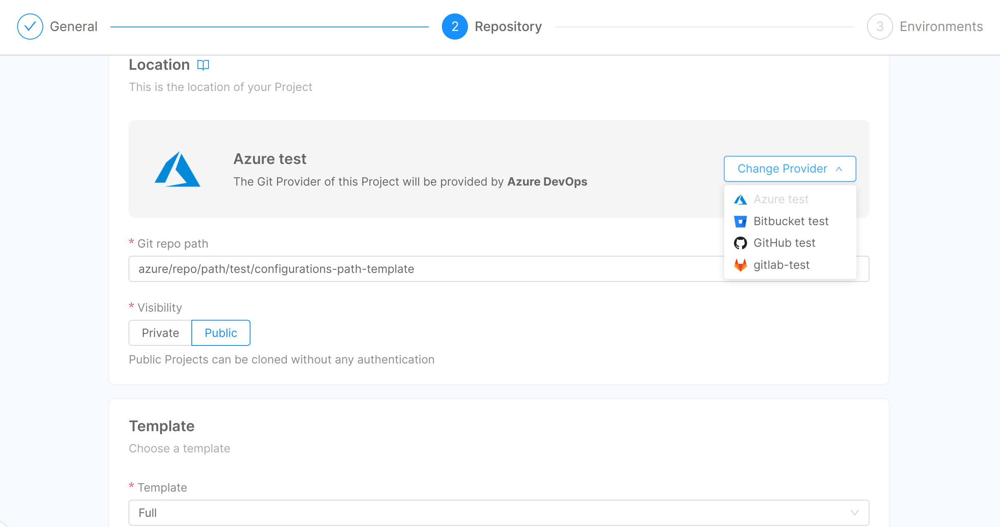
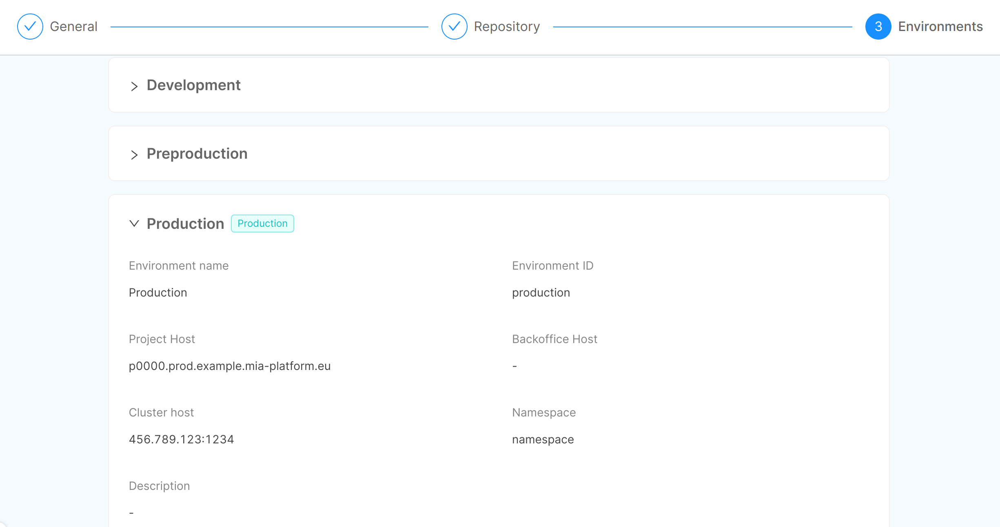

Mia-Platform Console allows you to create and manage multiple projects, each one with its own set of APIs, microservices, and applications.  
There are a different set of permissions based on whether you want to create or edit a project, make sure you have the ones you need.

:::warning
To create a new project you must have the permission `console.company.project.create` and you need to have already set up provider, company, and template.
More detail about the **prerequisites can be found in [Project Management](/console/project-configuration/create-a-project.mdx#Prerequisites)**.
:::

## Project creation

To create the project, use the `Create project` button in the Home area of the Console.

The project creation is divided in three different steps.

### Step 1: **General**

In this step, you are required to insert the general information about your new project:

- **Company** (_required_): you are required to select, from a list of pre-configured companies, your company, which enables you to keep the same configuration for different projects;
- **Project name** (_required_): the name of your project, which will be shown in the project card in the Home section of the Console;
- **Description**: the description of your project, which will be shown in the project card in the Home section of the Console.

### Step 2: **Repository**

In this step, it is indicated the location of your new project and you have to choose its template.  
By default, the project is saved on the default Git provider, but you can choose to save it to a different one by clicking on the `Change Git provider` button.  
The Git provider can be changed only if the company has been configured with more than one Git provider.

- **Git Provider**: this field represents the provider ID used by your chosen company (e.g. _gitlab_, _github_, _azure-devops_, _bitbucket_);
- **Git repo path**: this is the path, calculated from project name and company, where the configuration will be saved on the Git provider. It specifies the location of your project on the Git provider website;
- **Visibility**: the visibility states the status of your project once it will be saved on the Git provider. If it is `internal`, all the internal users of the Git provider instance can see the project. If it is `private`, only who has access to the repository can see the project;
- **Template** (_required_): you have to select, from a list of pre-configured templates, your template, which enables you to use pre-filled configurations for your project.

:::tip
If you are using the PaaS Mia-Platform Console, two main templates are available: one with all the core services, and the other which is similar, but without CMS. More information about how to use them at [Create Project](/console/project-configuration/create-a-project.mdx#setup-paas-templates).
:::

### Step 3: **Environments**

In this step, an overview of the configuration of your project environments is presented. This section is entirely read-only, since the information displayed are retrieved from the selected company and, therefore, they are already configured and not editable:

- **Environment name**: the name given to your environment;
- **Environment ID**: the human-readable ID set to your environment;
- **Host**: the host which exposes documentation and APIs;
- **Backoffice Host**: the host which exposes CMS and backoffice APIs;
- **Cluster Host**: the IP of the Kubernetes cluster where the project will be deployed;
- **Namespace**: the namespace taken from Kubernetes;
- **Description**: the description of your environment.

Moreover, a label **Production** is displayed next to the title of the dropdown card in case the corresponding environment is labeled as a production environment.

For security reasons, and since after this step the project will be effectively created, when trying to proceed further a confirmation modal is displayed. By clicking on _Create_, the project will be irreversibly generated.

At the end of the process, your project will be visible in the Home section of your Console.
