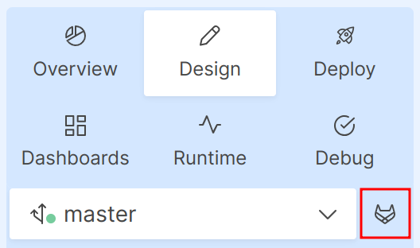
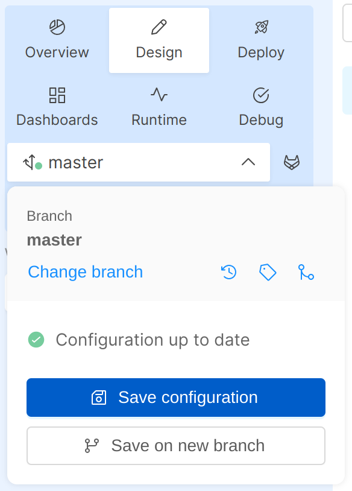
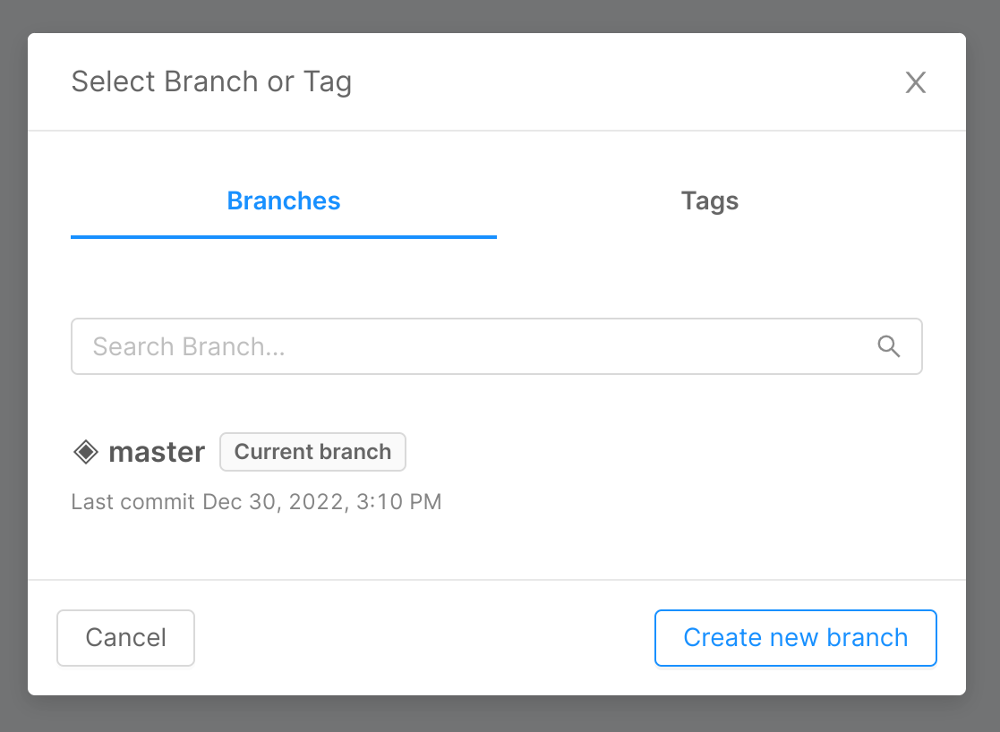
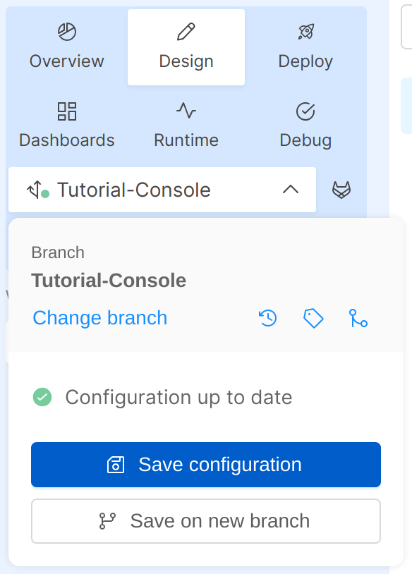
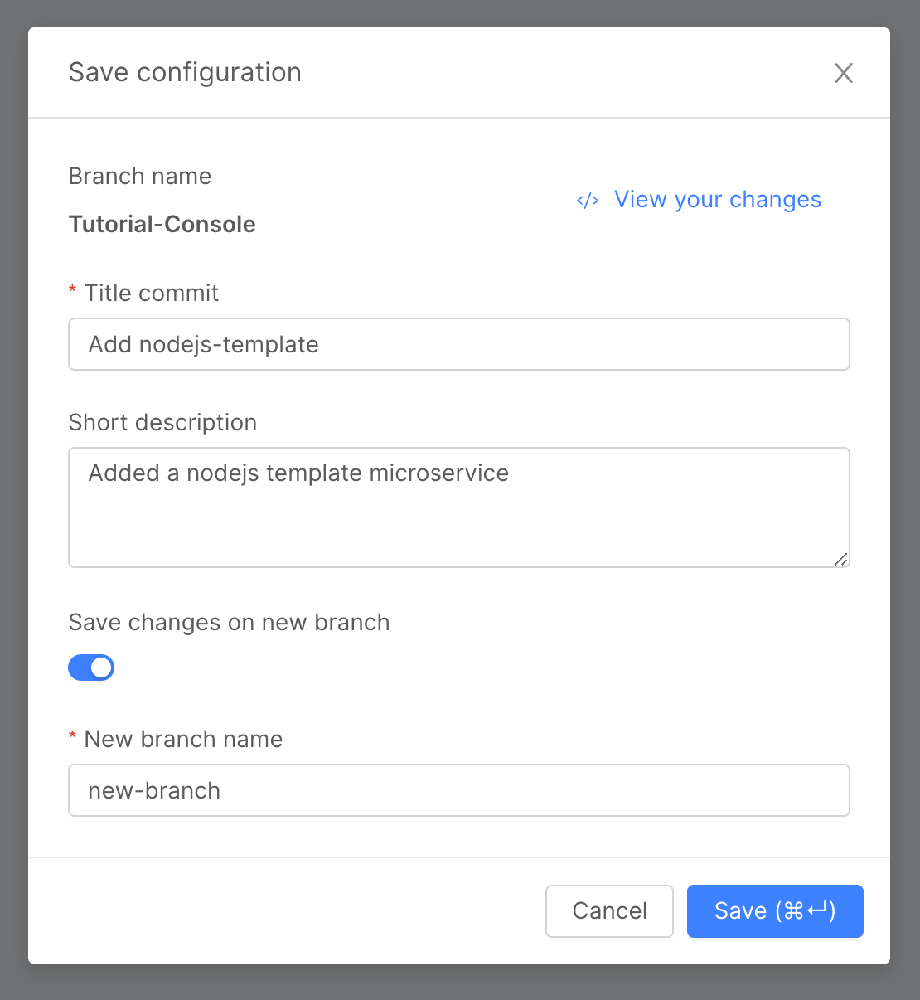
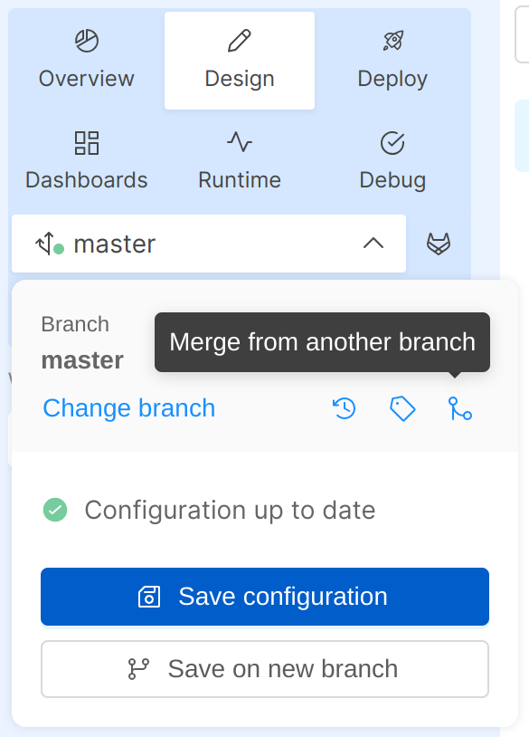
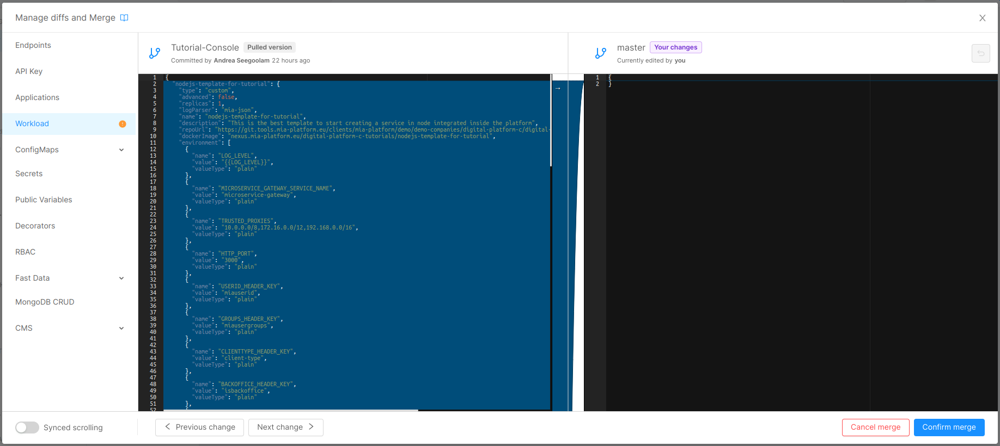
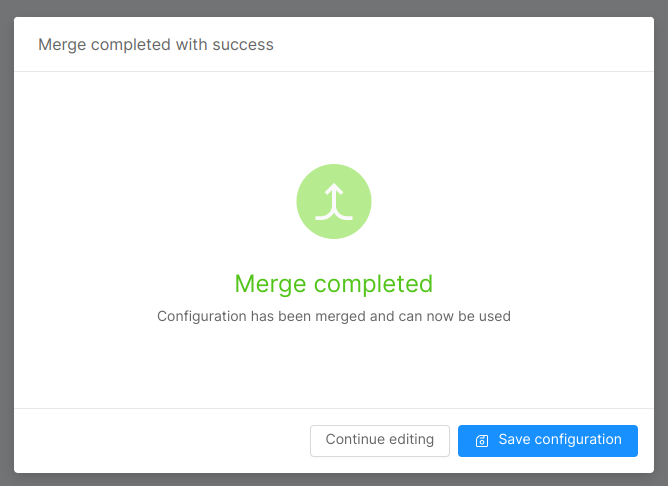
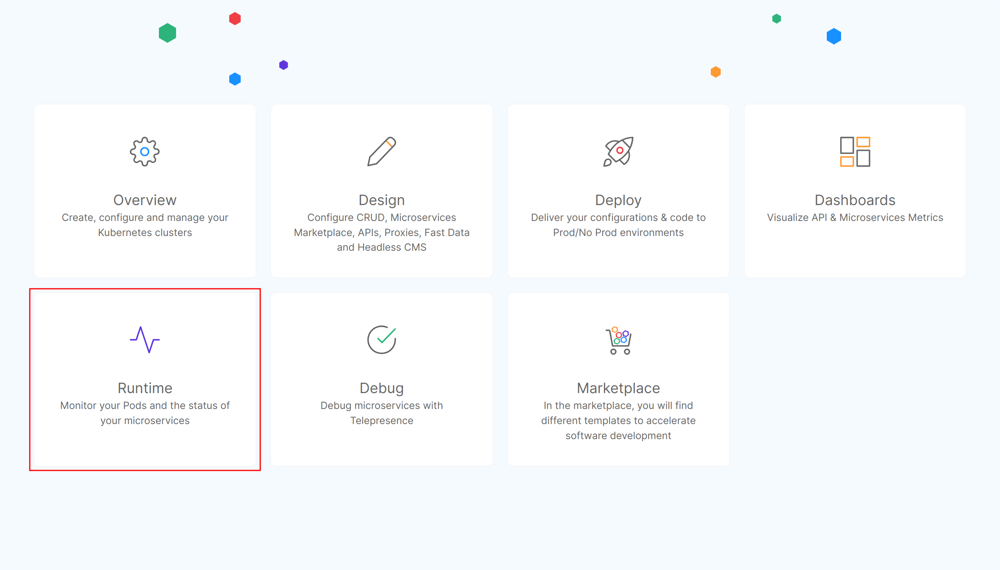
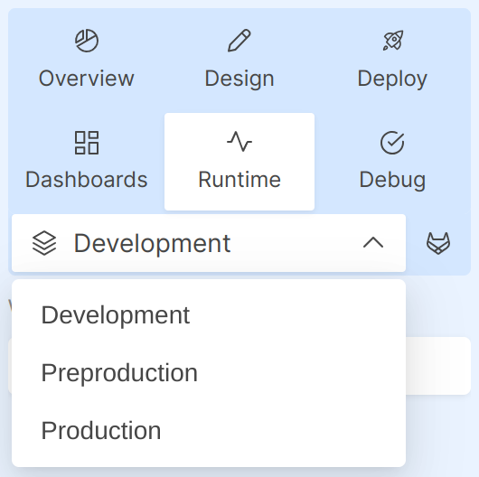

The **Mia-Platform Console** is a powerful **Internal Developer Portal** that let you govern all projects in one place and helps you industrialize and automate DevOps, avoid organizational bottlenecks, self-serve developers, solve cloud complexity and enhance accountability & reliability.

On the Console you can build complex [projects](/development_suite/api-console/api-design/overview.md) and use an ever-growing list of [plugins](/plugins/mia-platform-plugins.md) but there are some common actions that you will do everyday.

In this page we will see the most frequently performed actions on the Mia-Platform Console.

For a general overview of the Console please see the [dedicated](/development_suite/overview-dev-suite.md) page.

## View repository

Mia-Platform Console enables you to manage your project's configuration by leveraging the advantages of a GitOps approach.
The Console internally uses **git repositories** to persist configuration changes you make and supports many different git repository providers. You can find more information [here](/console/project-configuration/create-a-project.mdx#step-2-repository).

If you want to see directly the **code** of the configurations you made, you can check the _Configuration_ repository of your project.

To view the _Configurations_ repository of the project simply click on the Git provider icon (GitLab in the image below) on the top-right of the screen.

  
 

  
  

## Create a new branch

To start making changes on the Console you must be working on a **branch**. A default branch (usually `master`) is always present but you can create any number of branches to work on. As you would do in any git repository, you can use different branches for different features you want to create. Each branch is independent and can be used by different members of your team to work collaboratively.

This section explains **how to create a new branch** on the Console, which, under the hood, will create a new git branch on the _Configurations_ repository of the project.

You must be in the _Design_ section of the Console to perform this action.

1. Click on the branch selection menu on top of the screen.

  
 

  
  

2. Click on _Change branch_. The _Select Branch or Tag_ form will appear.

  
 

  
  

3. Click on _Create new branch_. The _Create new branch_ form will appear.

  
 

  
  

4. You can select the source branch from which to start from the drop-down list on top. If a branch is already set, it will be proposed by default.
5. You can enter the new branch name.

  
 

  
  

6. Click _Create new branch_. The new branch will be created.

  
 

  
  

You can also create a new branch while saving your changes. See the next section.

## Save changes

Configuration changes made on the Console must be **saved explicitly**. By doing so you save your work for later use or deploy, but you can also let other people see your changes if they have access to your project.

For example, you can create a microservice starting from a template in the [Marketplace](/marketplace/overview_marketplace.md) like explained [here](/development_suite/api-console/api-design/services.md#how-to-create-a-microservice-from-an-example-or-from-a-template).

This section explains how to save configuration changes you made on the Console, which, under the hood, will create a new **git commit** on the _Configurations_ repository of the project.

You must be in the _Design_ section of the Console to perform this action.

1. Click on the branch selection menu on top of the screen. If you made some changes, you will see that there are unsaved local changes reported.

  
 

  
  

2. Click on _Save configuration_. The _Save configuration_ form will appear.
3. In order to save your configuration:
    1. You must enter a **title** for the commit.
    2. [Optional] You can enter a commit description.
    3. [Optional] If you want to save your changes in a new branch by enabling the _Save changes on new branch_ option and enteriring the new branch name.

  
 

  
  

5. Click _Save_ to apply the changes.

:::warning
Always remember to save your changes in order to persist them. Unsaved versions are not visible to other users and you cannot deploy them. If you change branch without saving your current changes, they will be lost.
:::

## Merge changes

By working with **multiple branches** and collaboratively with your team, you can choose to follow your preferred **branching strategy** on the Console too. For example, you might use the _master_ branch as your main branch with **stable configurations** while using dedicated branches to build or test new features. Once a feature is complete you will want to merge it onto the _master_ branch, making the changes from the feature branch available also on the _master_ branch.

This section explains **how to merge a branch into another one** on the Console. Make sure you are positioned on your **target** branch before merging.

You must be in the _Design_ section of the Console to perform this action.

1. Click on the branch selection menu on top of the screen.

  
 

  
  

2. Click on the _Merge from another branch_ button. The _Merge branches_ from will appear.

  
 

  
  

3. Select the branch you want to merge from the drop-down list.

  
 

  
  

4. Click _Start merge_ button. The _Manage diffs and Merge_ screen will appear.

5. Select a configurations category on the sidebar of the modal in order to review the differences between the two branches. All the configurations are organized by category. If there are any differences in the configuration categories between the two branches, its entry is highlighted by an orange icon in the sidebar. For example, you can select _Workload_ to view only differences regarding microservices and workload configurations.
6. Once you've selected the configurations category you want to work on, you can apply changes to the target branch. Note that the changes are not applied automatically to the target branch. You must apply them manually on the right editor. To do so, you can:
    1. Use the arrow icon between the editor to copy a block of configuration from the left editor to the right one.
    2. Directly  edit the configurations on the right editor (typically you want to do it to resolve conflicts).

:::tip
You can use _Previous change_ and _Next change_ button in the lower part of the modal in order to easily move from a change to another.
:::
7. Click _Confirm merge_.
8. You will be asked for confirmation about the new configuration. Click _Confirm Merge_.

  
 

  
  

8. The configurations will be merged and the result will be displayed on screen.

  
 

  
  

9. Click _Continue editing_, if you want to make additional changes, otherwise _Save configuration_.
10. If you are saving configuration the saving configuration modal will appear. Follow the steps 3 and 4 of the guide about how to ["Save changes"](#save-changes) in order to apply the merge. Otherwise you can continue editing in the design area and apply all the changes at the same time by following the whole ["Save changes"](#save-changes) guide.

:::warning
Merge changes must be saved in order to be applied.
:::

For more information on merging branches please see the [dedicated](/development_suite/api-console/api-design/merge_collaboration.md) page.

## Deploy changes

The changes you made on the Console must be deployed in order for you to see them in action. Your project is linked to an infrastructure managed with **Kubernetes** on which you can deploy everything you configured from the Console without explicitly having to also configure a cluster. Linked with your project you can have multiple environments, such as Development and Production, that can run different configurations of applications or even entirely different applications. You can find more information about managing environments [here](/console/project-configuration/manage-environment-variables/index.md).

This section explains how to deploy any changes you made into an **environment**.

You must be in the _Deploy_ section of the Console to perform this action.

1. You can select the changes to deploy from the _Select branch or tag_ drop-down list.

2. [Optional] You can view the list of last 10 commits made on the selected branch.
3. You can choose to enable or disable the [_Smart deploy_](/development_suite/deploy/overview.md#smart-deploy) feature.
4. You can see the details of the deploy such as services name and versions, deploy outcome and other info in the table below.

5. Click _Smart Deploy_ or _Deploy All_ button (the name changes if you enable the _Smart deploy_ feature).

This action will take some time depending on the amount of changes to deploy.

For more information on deploying please see the [dedicated](/development_suite/deploy/overview.md) page.

## Monitor Runtime System

Once your changes have been deployed, you can **monitor your runtime system** and see information about the pods running them as well as **logs**.

This section explains how to monitor your deployed services and pods.

You must be in the _Runtime_ section of the Console to perform this action.

1. You can choose the environment to monitor from the drop-down list on top of the screen.

  
 

  
  

2. On the _Pods_ section you can see the list of pods currently deployed on the selected environment. You can see information such as pod status, name, application, etc.

3. You can click on a specific pod name to view additional details.
4. In the _Overview_ page you can see a summary of the selected pod with information such as CPU and Memory usage, number of Containers Ready, Pods restarts, etc.

5. Click on the container name (e.g. _nodejs-template-for-tutorial_). From this page you can see the latest logs generated by the container.

6. Click on _Describe_. From this page you can see a JSON description of the pod.

7. Click on _Events_. From this page you can see a list of events occurred in the pod.

For more information on monitoring the infrastructure please see the [dedicated](/development_suite/monitoring/introduction.md) page.

For more information about monitoring CPU and memory using Grafana please see the _Set Requests and Limits of a Microservice_ [tutorial](/console/tutorials/set-requests-limits-of-a-microservice.mdx#monitoring-cpu-and-memory-usage).

You can also set the Console homepage to show environment metrics by using the [Metrics homepage](/development_suite/overview-dev-suite.md#metrics-homepage).

For information on how to directly interact with the Kubernetes infrastructure please see [here](console/company-configuration/clusters-management/connect-and-manage-cluster.mdx).

