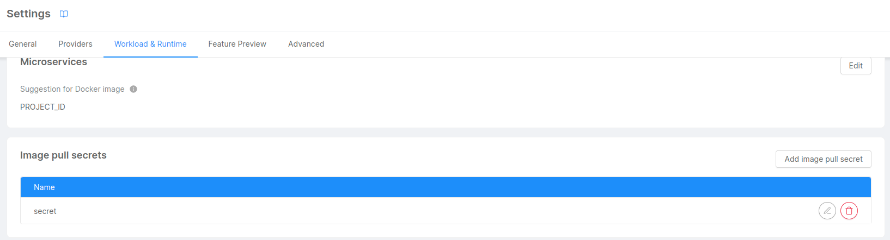
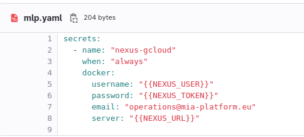
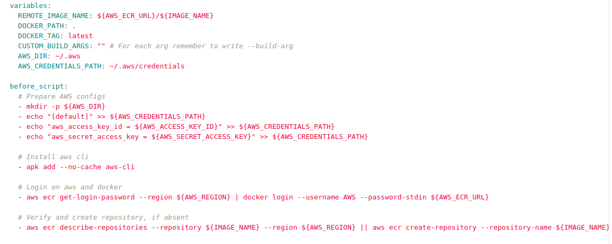

A Docker Registry is a service that stores and manages Docker container images, allowing developers to distribute, share, and download these images across different machines or development environments.
In order to pull and push images and use them in different pipelines it is necessary to configure it properly.
A Kubernetes cluster uses secrets to authenticate with a container registry to pull a private image, therefore it is necessary to create and configure your secrets.

### Step 1
Go in the setting interface of the console, on the Workload & Runtime section it is possible to add and modify a secret.
Add your secret that will be used to pull images from your docker registry.

:::caution
Only a user with project admin permission can access this section of the console
:::

### Step 2
Once you have added the secret in the console, it has to be configured in order to be authenticated to the docker registry.
In the project repository you will find a `mlp.yaml` file which generates Kubernetes secrets using the mlp tool. For more information about the tool follow the link: [Mlp Tool](/runtime_suite_tools/mlp/10_overview.md)

Example of a mlp.yaml file:

- `name`: is the name of the secret created from the console
- `username` and `password`: are the credentials of the secret used to authenticate to the docker registry
- `server`: is the url of the server of the private docker registry

### Step 3
The last step is to setup a pipeline. 
For detailed information follow this link [Pipeline setup](/development_suite/deploy/pipeline-configuration.md)

For building and pushing images to a private registry it can be created a docker job.

This is an example using aws docker registry:

- `variable section`: in this section you will write the docker image name, its tag version and the docker registry path.
- `before script section`: in this section you will prepare the configuration of the docker registry with its access keys and secret, login to the docker registry and then verify or create a repository in case it is absent.
