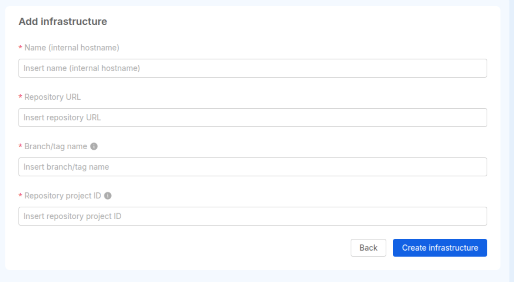

import Tabs from '@theme/Tabs';
import TabItem from '@theme/TabItem';

**Infrastructure Projects** are a dedicated Project type in Console specifically dedicated to the provisioning and management of infrastructure, following the *Infrastructure as Code* paradigm.

They are designed primarily for **Operations teams**, who can use them to define, version,
and deploy infrastructure resources while ensuring consistency, transparency, and control over infrastructure changes.

These Projects are distinct from traditional [Application Projects](/console/project-configuration/application-project.md) as they are specifically designed to manage infrastructure resources,
enabling better control, automation, and governance in the context of Infrastructure as Code.

:::info
Infrastructure Projects are currently a [**BETA** feature](/info/version_policy.md#feature-preview-and-beta), as such they are under development as we are adding new features and improvements.

At this time they only support **GitLab** repositories with a specific pipeline configuration, the support for other providers will come with the next Console releases.
You can find out more in the [technical limitations](#technical-limitations) section below.

If you want to share your feedback you can head to the [Community discussion post](https://github.com/mia-platform/community/discussions/612).
:::

## Creating an Infrastructure Project

When creating a new Project in your Company, you can select the **Infrastructure** type.  
This option unlocks a dedicated setup flow and enables the creation of a Project tailored to infrastructure workflows.

## Managing Infrastructure Components

Each Infrastructure Project includes a specific section for managing **infrastructure components**.

You can currently create an infrastructure component only from scratch.

To create a new infrastructure component from scratch, you need to provide the following information:

- **Name**: The name of the component.  
- **Repository URL**: The URL of the Git repository where the component's code is hosted. This is used to provide a reference to the user.
- **Branch/tag Name**: The Git branch, tag, or commit that the deployment pipeline will run on.  
- **Repository Project ID**: The project ID associated with the Git repository. This is actually used to interact with the Git Provider.

<Tabs>
<TabItem value="GitLab-Example" label="GitLab" default>

- **Repository URL**: `https://my.gitlab.host/some/repo`
- **Branch/tag name**: `main`
- **Repository Project ID**: `some/repo` (or the numeric ID that can be copied from the GitLab UI)

</TabItem>
</Tabs>

## Deploying your Infrastructure

From within your Project, you can manage the deployment flow of your infrastructure components by:

- Running a **plan** to preview proposed infrastructure changes  
- Executing an **apply** to confirm and release your infrastructure changes

This enables control and consistency in your infrastructure.

### Deploy History

The **Deploy History** page is useful to better understand which actions have been executed for each infrastructure component of your Project.  
In particular this view traces which component has been deployed, togheter with some additional information.

#### Pipeline Webhook

In order to correctly fill up the Deploy History view, an Infrastructure Component must have a webhook associated to its repository on the git Provider.

The webhook is automatically created upon the Infrastructure Component creation. However, in case the webhook creation fails, a warning message will inform to manually retry the webhook creation from the Infrastructure Components Overview page.

If an Infrastructure Component is missing the related webhook on the git Provider, the Component will show highlighted to inform of this issue. On the right side of the Component row, a dedicated action appears to manually retry the webhook creation.

## Runtime Visibility

After the deployment of your infrastructure components, runtime data retrieval can be integrated in the Console by leveraging the [Infrastructure Component Runtime Software Catalog item type](/software-catalog/items-manifest/infrastructure-component-runtime.md).

:::tip
You can later access the data via API or by creating a custom extension using the [Composer extensions](/console/company-configuration/extensions.md#add-new-extension)
:::

## Access and Permissions

Currently, all members of a Company can view Infrastructure Projects.  
However, only users with the role of **Project Administrator** or **Company Owner** are allowed to perform changes within them.

## Technical limitations

As mentioned above, there are still some technical limitations that repositories must conform to in order for Infrastructure Projects to work.

:::note
All of the following limitations will be soon resolved
:::

- the repository must be on GitLab and use GitLab CI
- the repository must hold a [Terraform](https://www.hashicorp.com/en/products/terraform)/[OpenTofu](https://opentofu.org/) project
- the GitLab CI pipeline must be composed of two separate jobs named `plan` and `apply`
- creation from Marketplace is not supported yet, so you need to create your repository beforehand
