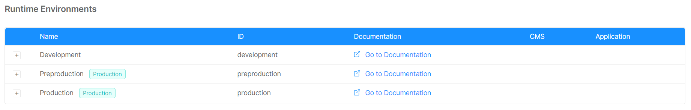
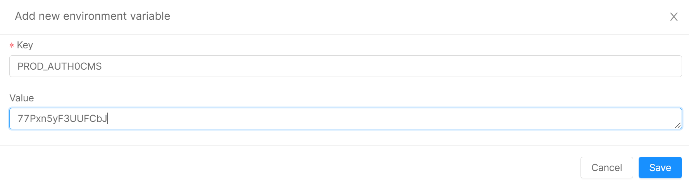
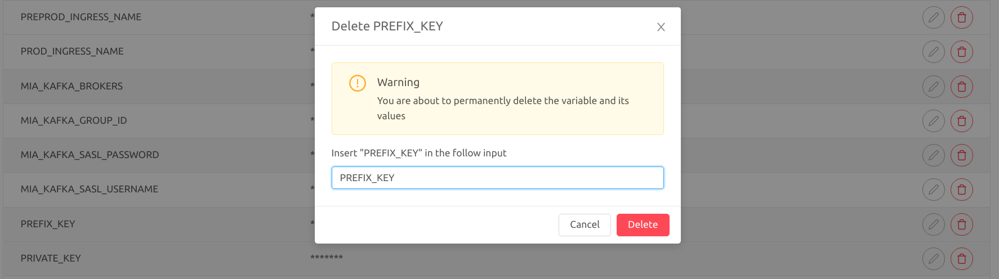

Thanks to our Console in the Overview area it is possible to manage your Environment Variables.

## How to differentiate your variable from one environment to another

Mia-Platform uses the **prefix** concept to manage the differentiation between variables.

Each variable can be associated with a prefix indicating the environment in which the variable is to be interpolated.

How do prefixes work?

Prefixes can be of two types:

* **Global prefix**: Mia Platform uses `​​MIA_` as global prefix. However, it is possible to avoid the prefix and by default, the environment variable will be treated as global.

* **Differentiated**: according to the environment

When a project is created it is associated to a specific Company.
As described in the [Company section](/console/project-configuration/create-a-project.mdx#create-a-company) a project associated to a specific company will inherit the environment information. For this reason, a differentiated environment variable must have the prefix associated to the `ID` of the specific environment. 
It is possible to find it in the table of the Envs area.

:::info
You can also define a global variable to be used as a default and define a specific variable for only one environment.  
In this case only the specified environment will use its value, and the others will use the default value.

When there are both a global variable and a specific one for an environment, the longest matching variable will be selected.

E.g.  
You have three environments: `TEST`, `PREPROD` and `PROD`.  
You define these two variables: `MY_VAR = foo` and `PROD_MY_VAR = bar`  
This is what the envs will receive:  
- TEST: `foo`
- PREPROD: `foo`
- PROD: `bar`
:::

:::warning
Remember! It is fundamental to define a prefix if you want to associate a variable to a particular environment, otherwise the variable will be considered global.
:::

## Create a Variable

When you start a new project you will find variables already configured.
To add a new variable press the **"Add new environment variable"** button at the top-right of the table and fill in the form:

* the **key** is mandatory and identifies your variable. Remember **to use the prefix** to manage the differentiation between environment;
* the **value** is the value you want to attribute to your variable, the one that will be interpolated.

:::info
When a **value** contains some `$` characters it is required to escape it by adding another `$` just before the original ones, otherwise the variable will be truncated just before the dollar sign.

#### Example

* **Desired value** to interpolate: `var$var$var`;

* **Actual value** to write: `var$$var$$var`.
:::

## Edit a Variable

Changing the value of an existing variable is very simple. Click on the **edit** button in the same row as the variable you want to edit.
Once you press the vsi button a modal will open.
The key is an unchangeable value.
Once the value has been changed, you just have to press the save button.

## Delete a Variable

To delete a variable, press the **delete** button corresponding to the desired variable. A modal will open.
To cancel the variable you will be asked to enter the name of the key. The **name of the key must be identical** otherwise you will not be able to delete it.

