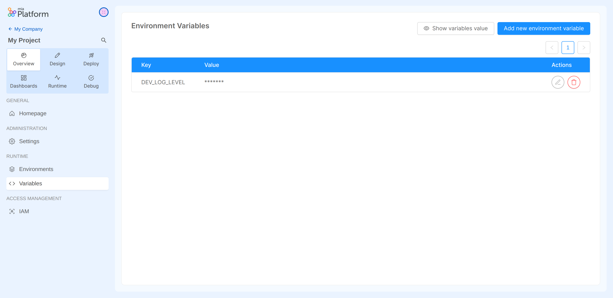
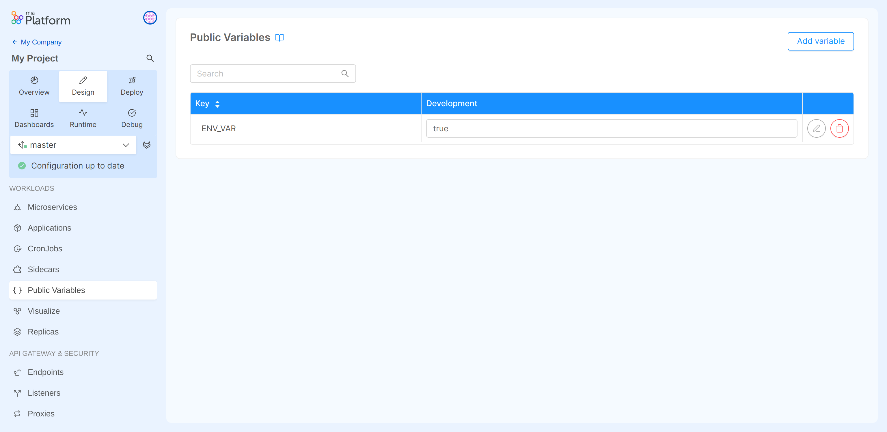

import Tabs from '@theme/Tabs';
import TabItem from '@theme/TabItem';

After you have followed the [steps needed to add a new environment](/console/project-configuration/manage-runtime-environments/index.md#add-an-environment)
to your Console project, you must properly configure your project on your Git provider to allow the Console to successfully run the deploy task.

## Enable the Pipeline

To enable deployment on the newly created environment, you will need to manually edit the project CI file to be able to deploy.
The manual operations described in this guide are to be repeated in **each** branch for which you want to enable deployment to the new environment.
To do this, you can replicate the same commit on all the branches for which you want to enable deployment
(working on one branch and then cherry-picking the commit on the others), or rebase from the main branch.

Since each environment is associated with a Kubernetes cluster, the following information needs to be added to the CI file:
- *cluster URL*, in order to allow the environment to connect to the cluster;
- *cluster Service Account Token*, needed for authentication of the namespace created by the Console;
- *cluster CA*, in order to verify the identity of the cluster;
- *environment variables prefix*, in order to be able to configure the secreted environment variables needed to use the microservices.

A couple of example snippets to be added to the CI file are shown below:

<Tabs>
  <TabItem value="gitlab-mia" label="GitLab CI (using Mia-Platform template)" default>

```yaml
include:
  # job template
  - project: "platform/pipelines-templates"
    file: "/deploy/deploy-job.yml"
    ref: "master"

<environment-id>:
  stage: release
  extends: .deploy_job

  variables:
    KUBE_URL: "${KUBE_CLUSTER_URL}"
    KUBE_TOKEN: "${KUBE_CLUSTER_TOKEN}"
    KUBE_CA_PEM: "${KUBE_CLUSTER_CA_PEM}"
    ENVIRONMENT_PREFIX: "<environment-variables-prefix>"

  only:
    variables:
      - $ENVIRONMENT_TO_DEPLOY == "<environment-id>"
```

In this example, the reference CI tool is GitLab and therefore the file to edit is `.gitlab-ci.yml`.

The user has added as `KUBE_CLUSTER_*` variables the required information about the target cluster and used their value to set up the standard
`KUBE_URL`, `KUBE_TOKEN`, and `KUBE_CA_PEM` that our scripts use by default.
The `only` clause is used to specify that the Console will call the pipeline and run the pipeline jobs only when the `ENVIRONMENT_TO_DEPLOY`
environment variable is set to the chosen `environment-id`. This may differ in your pipeline.

The deployment instructions are here inherited from the `deploy-job.yml` template file, which is defined in the `include` section and whose commands are extended,
and applied to the specific environment, in the release stage.

  </TabItem>
  <TabItem value="gitlab" label="GitLab CI">

```yaml
<environment-id>:
  variables:
    KUBE_URL: "${KUBE_CLUSTER_URL}"
    KUBE_TOKEN: "${KUBE_CLUSTER_TOKEN}"
    KUBE_CA_PEM: "${KUBE_CLUSTER_CA_PEM}"
    ENVIRONMENT_PREFIX: "<environment-variables-prefix>"

  scripts:
    - your script to deploy to the Kubernetes cluster

  only:
    variables:
      - $ENVIRONMENT_TO_DEPLOY == "<environment-id>"
```

In this example, the reference CI tool is GitLab and therefore the file to edit is `.gitlab-ci.yml`.

The user has added as `KUBE_CLUSTER_*` variables the required information about the target cluster and used their value to set up the standard
`KUBE_URL`, `KUBE_TOKEN`, and `KUBE_CA_PEM` that tools like `kubectl` use by default.
The `only` clause is used to specify that the Console will call the pipeline and run the pipeline jobs only when the `ENVIRONMENT_TO_DEPLOY`
environment variable is set to the chosen `environment-id`. This may differ in your pipeline.

The deployment instructions are here **not** inherited from any template file, and the user must enter them manually within the `script` section.
Further information about the variables used by the pipeline and how to configure it can be found [here](/development_suite/deploy/pipeline-configuration.md).

  </TabItem>
</Tabs>

## Setup Git Provider

As well as enabling the pipeline, Git provider setup must also be performed manually on **each** branch for which you want to enable deployment on the newly created environment.
Git provider configuration varies by project type: *Plain* or *Kustomize*.

:::info What type is my project?
If you are unsure of the type of your project, you can verify this information through the CMS.
Another clue might be the presence of the `overlays` folder within the project repository, which typically indicates a Kustomize project.
:::

### Plain Project

If your Console project has resources not managed by the Console in the form of yaml files within subfolders of the `Configurations` folder of the repository,
and if you want these resources to be used by the newly created environment, you will need to create a new subfolder (within `Configurations`) that has your environment ID as name,
and add those custom files inside it.

For setting up a starting point for public environment variables, you can also create a new file inside the `variables` folder named `<environment-id>.env`,
and then copy/paste the contents from one of the other env files within the folder, appropriately changing the variables or their values to fit the new environment.

### Kustomize Project

If your project is of the Kustomize type, you need to create a new subfolder that has your environment ID as name within the `overlays` folder.
In case of, for example, an environment whose ID is "DEV", the subfolder will then be `overlays/DEV/`.

In this folder you have to create at least two files:
- `variables.env`, which will be filled with the **public** environment variables of the project through the "Public Variables" section in the Design area.
For setting up a starting point for public environment variables, you can also create the `variables.env` file and then copy/paste the contents from one of the other
`variables.env` files contained in a subfolder of `overlays` related to another environment, appropriately changing the variables or their values to fit the new environment;
- `kustomization.yaml`, which is used to patch, via Kustomize, the specified resources. The file **must** contain at least the following snippet:

```yaml
apiVersion: kustomize.config.k8s.io/v1beta1
kind: Kustomization
resources:
- ../../configuration
```

:::note
Within the `kustomization.yaml` file you can declare paths to granularly patch specific files via Kustomize. More information about Kustomize can be found [here](/console/project-configuration/kustomize-your-configurations/index.md).
:::

:::info Configure Ingress Route
If you are a PaaS client or use Traefik, you will need to configure a third file called `default.ingressroute.yml`, which is needed to expose the project endpoint.
Below is an example of a `default.ingressroute.yml` configuration file:

```yaml
apiVersion: traefik.containo.us/v1alpha1
kind: IngressRoute
metadata:
  name: default-ingress
  labels:
    app.kubernetes.io/instance: "ingress-controller"
spec:
  entryPoints:
    - websecure
  routes:
    - match: Host(`<host-1>`)
      middlewares:
        - name: "ingress-controller-hsts-headers"
          namespace: mia-platform
      kind: Rule
      services:
        - name: api-gateway
          port: 8080
    - match: Host(`<host-2>`)
      middlewares:
        - name: "ingress-controller-hsts-headers"
          namespace: mia-platform
      kind: Rule
      services:
        - name: api-gateway
          port: 8081
```

The project exposes the services listed in the `services` section via the hosts specified in the `match` clause (hosts are usually composed - for PaaS clients -
of `projectId` and a suffix given by Mia-Platform). In the above example, the `api-gateway` service will be exposed on two hosts.

:::

In addition to these files (`variables.env`, `kustomization.yaml`, and eventually `default.ingressroute.yml`), if you have custom files that are not handled by the Console,
you will also need to add these within the `overlays/<environment-id>/` folder.

## Setup Environment Variables & Commit

The last step necessary to enable the release on the new environment is the setup of the environment variables.

Regarding *secreted environment variables*, you can set them at the project level in the "Variables" section of the "Overview" area.
To access the "Variables" section and add environment variables, make sure you have the permissions needed to manage secreted environment variables from the Console.



:::caution Reminder
Remember to include the environment variables prefix in the secreted variable key to enable it for the new environment.
:::

:::info
More information about secreted environment variables and how to add them can be found [here](/console/project-configuration/manage-environment-variables/index.md).
:::

Regarding *public environment variables*, you can set them for the specific environment in the "Public Variables" section of the "Design" area.
When saving the configuration, these variables will populate the `variables.env` file on the project repo.
As well as for pipeline enablement and Git provider setup, this operation is to be repeated for **each** branch on which you want to enable deployment on the new environment.



:::info
More information about public environment variables and how to add them can be found [here](/development_suite/api-console/api-design/public_variables.md).
:::

Once you have finished setting the environment variables, remember to save your configuration (thus generating a commit on the project repo).
Now you are finally able to deploy to your new environment!
