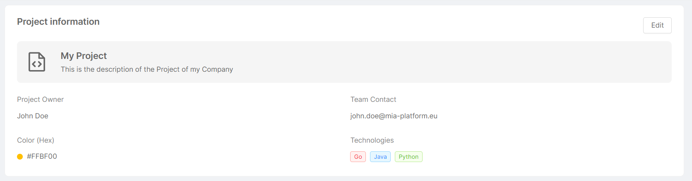
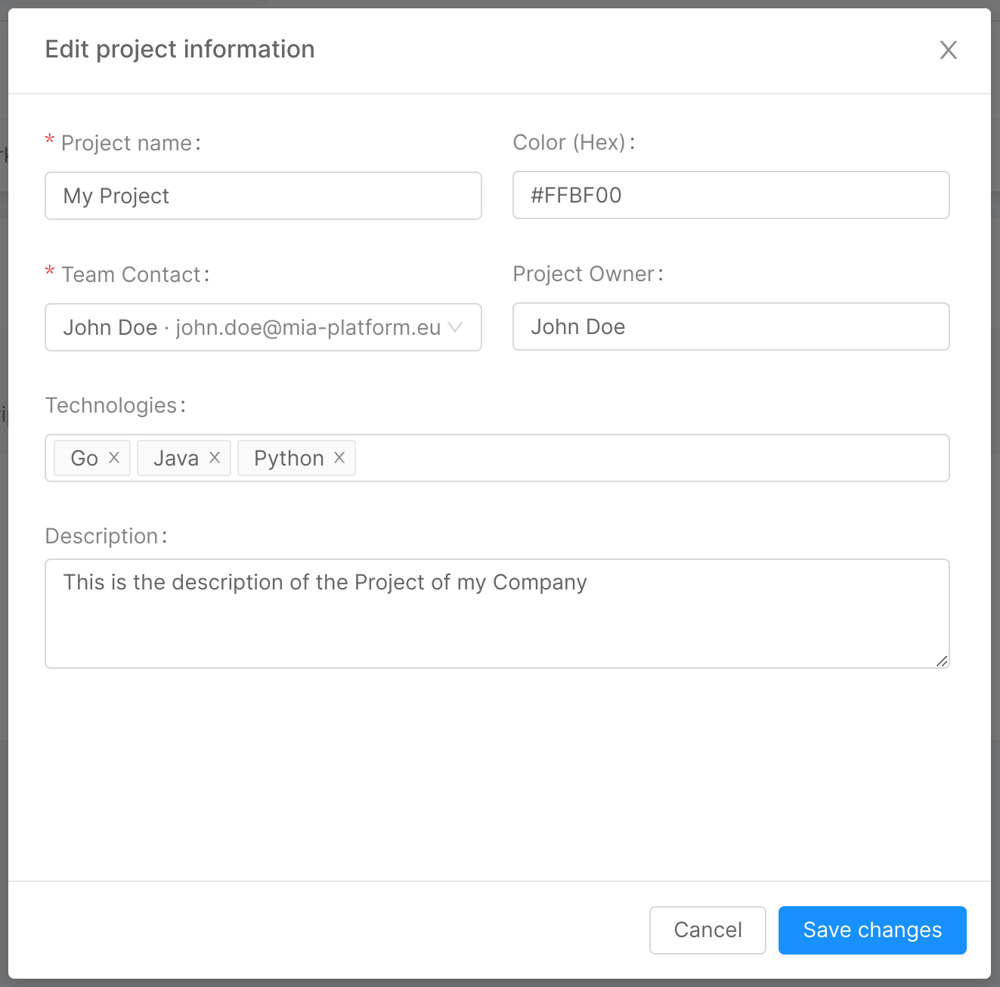
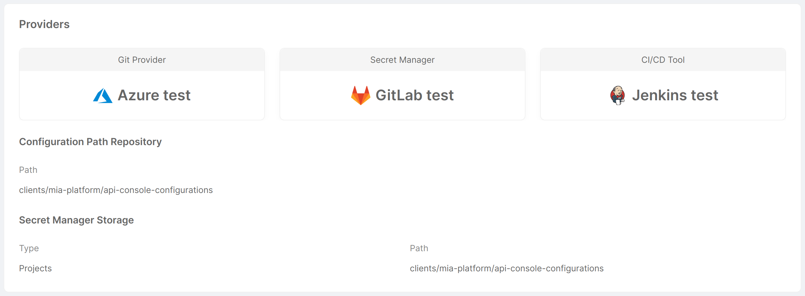
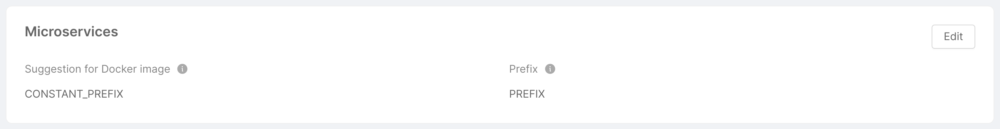
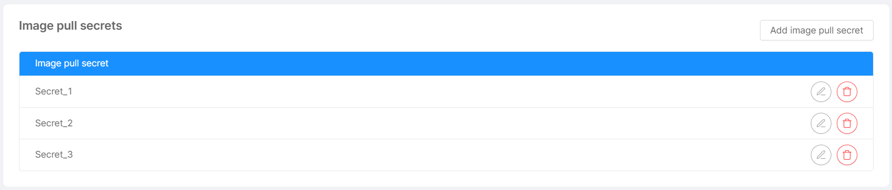
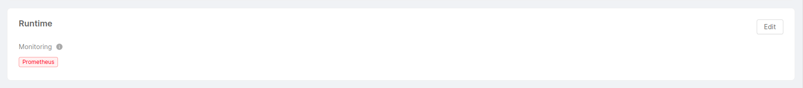
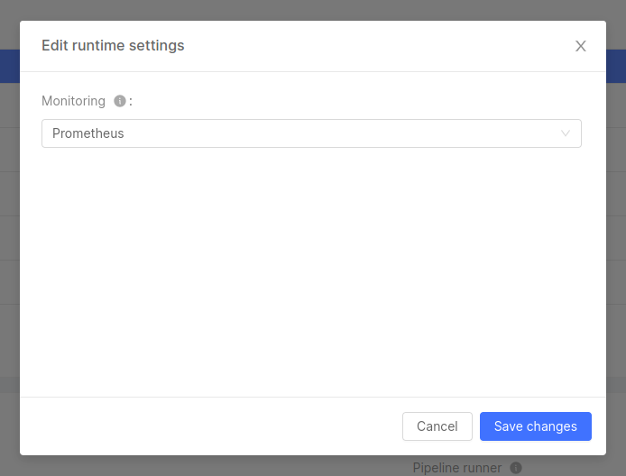
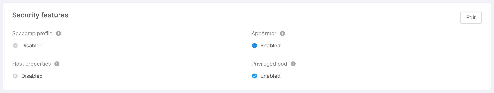
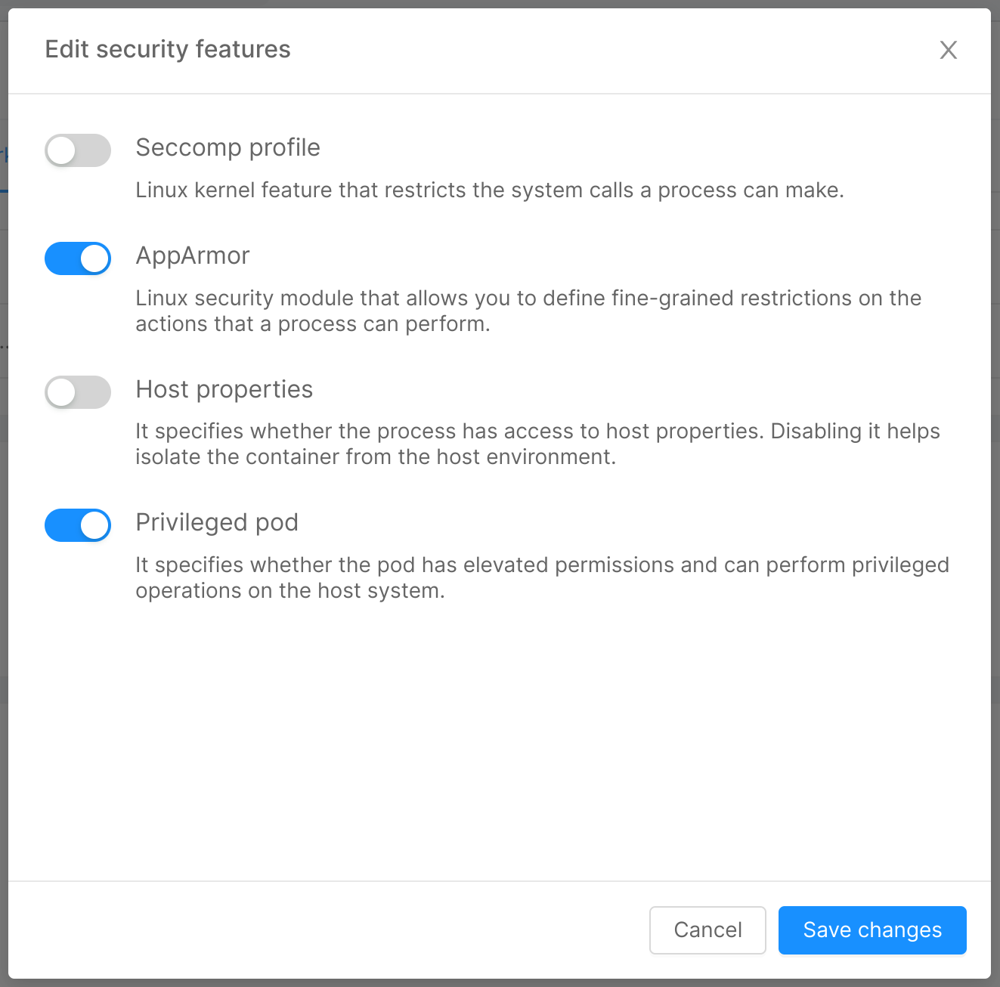
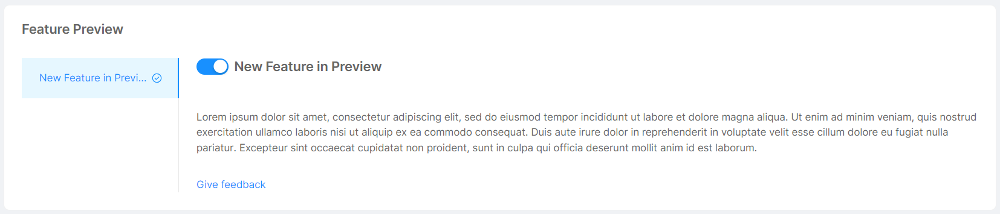

Once you have created your Project, you can visualize and change its settings through the "Settings" section of the Console, within the "Project Overview" area.
The settings are grouped by subject area through a few tabs: "General", "Providers", "Workload & Runtime", "Feature Preview", and "Advanced".

## General

The "General" tab shows some general information about the Project, through a single card called "Project information".

### Project information

This card presents a summary in which the **name** and **description** given to the Project are displayed, along with the following information:
- **Project Owner**: Project owner information (typically, name and surname);
- **Team Contact**: contact information associated with the Project (typically, the Project owner's email);
- **Color (Hex)**: color of the top bar of the Project-related card on the homepage (in hexadecimal format);
- **Technologies**: tags specifying the different technologies and programming languages used within the Project.

The above information can be edited by clicking on the "Edit" button, which will open the modal below. It will then be sufficient to edit the fields to be updated and click the "Save changes" button to implement the change.

  

  

## Providers

The "Providers" tab shows information pertaining to the providers (Git Provider, Secret Manager, and CI/CD Tool) configured for the Project, through a single homonymous card.

This card presents an overview of which Git Provider, Secret Manager, and CI/CD Tool are configured for the Project, displaying their icon and name. The following information is also displayed:
- *Configuration Path Repository*
  * **Path**: path to the repository containing the Console configuration information.
- *Secret Manager Storage* (only if the Secret Manager is GitLab)
  * **Type**: type of Secret Manager, used to define where to find environment variables;
  * **Path**: path to the repository containing the Secret Manager configuration information.

## Workload & Runtime

The "Workload & Runtime" tab shows information about the Project workload and runtime through 5 cards: "Microservices", "Image Pull Secret", "Deployment options", "Runtime", and "Security Features".

### Microservices

This card shows and gives the user the ability to change some settings related to the creation of microservices within the Project. Specifically:
- **Suggestion for Docker image**: defines the format of the Docker image name suggestion. It is one of `REPOSITORY`, `PROJECT_ID`, `CONSTANT_PREFIX` (the default is `PROJECT_ID`);
- **Prefix** (only if type is `CONSTANT_PREFIX`): defines the prefix that will appear in the suggestion for the Docker image name.

The above information can be edited by clicking on the "Edit" button, which will open a modal very similar to that seen for Project information. Upon clicking "Save changes", the information will be updated.

### Image pull secrets

:::note
An imagePullSecret is a Kubernetes entity used to authenticate and authorize access to private container image registries. 
:::

This card shows the user, in the form of a table, the list of names that will be used in deployment and cronjob files for pulling Docker images. The user has the option of adding new names through the "Add image pull secret" button, which will open a simple modal asking for the secret name. Similarly, a secret can be edited and deleted using the appropriate icons at the respective row in the table.

### Deployment options

This card allows users to manage some options regarding the Project deployment. In particular: 

- **Deployment strategy**: specifies whether the Project deployment follows a [GitOps-based approach](/development_suite/deploy/gitops-based/index.md) or a [pipeline-based approach](/development_suite/deploy/pipeline-based/index.md).
    - **Pull mode** implies the Project is connected with a GitOps tool, which "pulls" the updated configuration directly from the Project repository.
    :::info
    This strategy is only available on Projects with the [Enhanced Workflow](/development_suite/set-up-infrastructure/enhanced-project-workflow.md) enabled.
    :::
    - **Push mode** means that a CI/CD pipeline is run in order to push changes to the target environment.

- **Runner Tool**: specifies the command line deployment tool used by the Project. This option is not available for projects that adopt a "Pull" deployment strategy, where no pipeline runner is needed. The runner tool can either be [Mia-Platform LaunchPad (MLP)](https://github.com/mia-platform/mlp), or a custom tool. In order to use mlp, it is required to have the [Smart Deploy](/development_suite/deploy/overview.md#smart-deploy) feature enabled;

### Runtime

This card shows and gives the user the ability to change some runtime settings. Specifically:
- **Monitoring**: tags specifying the different supported monitoring systems.

The above information can be edited by clicking on the "Edit" button, which will open the modal below. It will then be sufficient to edit the fields to be updated and click the "Save changes" button to implement the change.

  

  

### Security features

This card shows and gives the user the ability to change some security features, provided as pod annotations, pod specs and Security Context. Specifically:
- **Seccomp Profile**: if enabled, it enables the `seccompProfile` attribute of the `securityContext` object in order to restrict a Container's syscall. This feature is available as of Kubernetes v1.19 and you can learn more by taking a look at the [official Kubernetes documentation](https://kubernetes.io/docs/tutorials/security/seccomp/).
- **AppArmor**: it is a Linux Security Module that, if enabled, implements Mandatory Access Control since [Kubernetes v1.4](https://kubernetes.io/docs/tutorials/security/apparmor/). AppArmor annotations set up a profile used by containerd to harden containerized applications to contrain exploitation. The template for such profile is available [on GitHub](https://github.com/moby/moby/blob/master/profiles/apparmor/template.go).
- **Host Properties**: if enabled, it sets to `false` the following parameters, which could be used to allow access to shared information and elevate privileges:
  * `hostPID`: controls whether containers can share host process namespaces;
  * `hostIPC`: enables to read the shared memory between processes that communicate with IPC mechanisms;
  * `hostNetwork`: controls whether containers can use the host network and allows to bypass network policies.

  These fields are described in the [Pod Security Policies section of the official Kubernetes documentation](https://kubernetes.io/docs/concepts/security/pod-security-policy/).
- **Privileged Pod**: if enabled, it configures the following attributes in a `securityContext` object:
  * `allowPrivilegeEscalation`: controls whether a process can gain more privileges than its parent process, by default is set to true when the `CAP_SYS_ADMIN` capability is enabled or is run as privileged;
  * `privileged`: controls whether the Pod can run privileged containers.

  You can learn more about the `securityContext` object by taking a look at the [official Kubernetes documentation](https://kubernetes.io/docs/tasks/configure-pod-container/security-context/).

The above information can be edited by clicking on the "Edit" button, which will open the modal below, through which you can turn on/off the security features. Upon clicking "Save changes", the information will be updated.

  

  

## Feature Preview

The "Feature Preview" tab allows the user to visualize and activate features in early access on the specific Project, through a single card called "Feature Preview for your Project".

This card presents an overview of the features in early access that can be activated for the Project. For each feature, an illustrative image and description are shown, and to turn it on/off it is sufficient to toggle the corresponding switch. Additional feature information can be accessed through the "View Documentation" button located at the bottom of the feature description.

## Advanced

The "Advanced" tab allows the user to visualize advanced information and perform sensitive operations, through a single card called "Advanced actions".

The only action that can be taken at the moment is to delete the Project itself. You can find a detailed description of the deletion flow [here](/console/project-configuration/delete-a-project.md).
